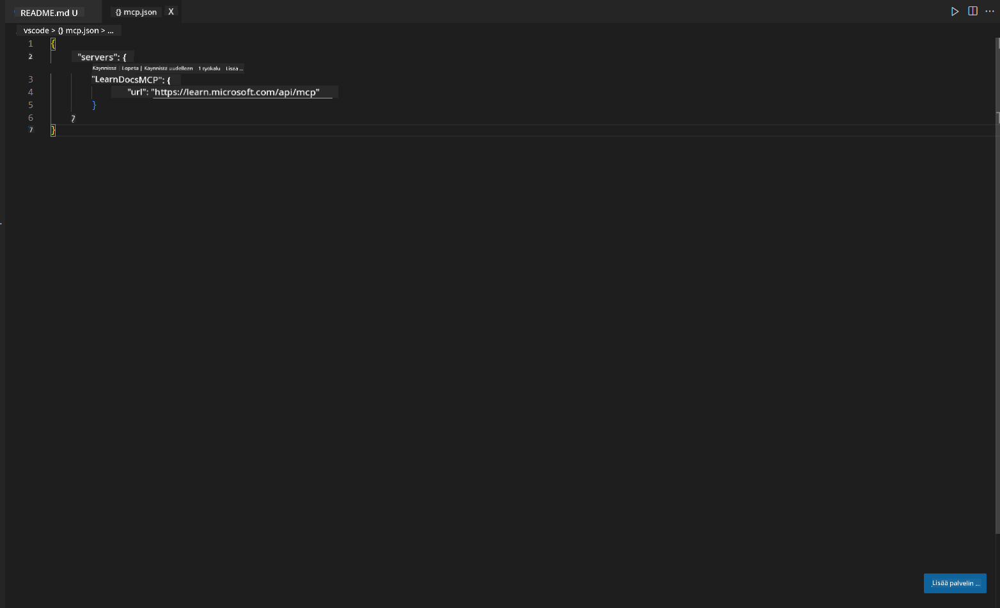
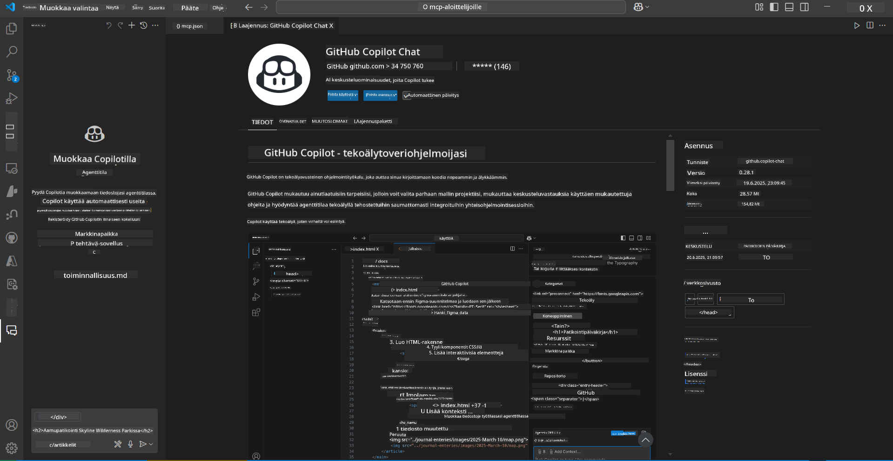
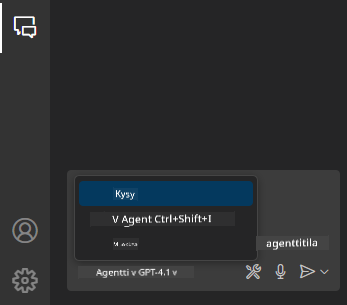
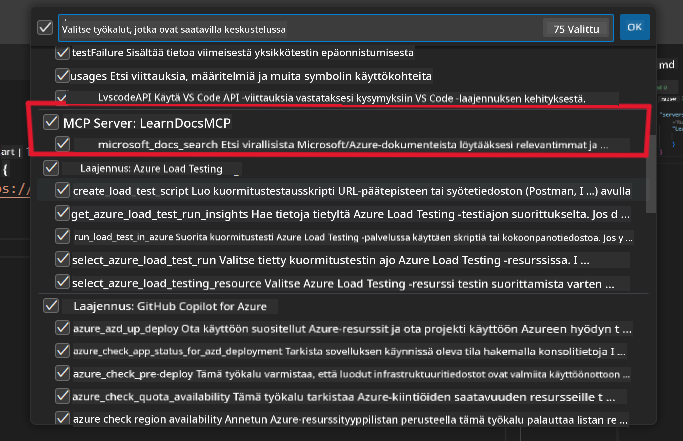
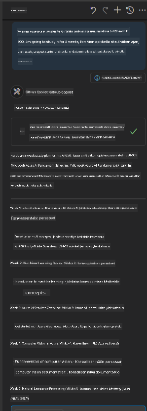
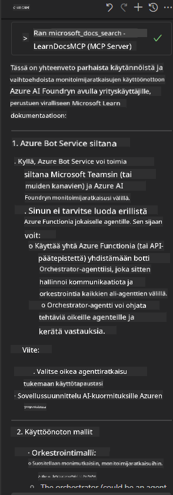

<!--
CO_OP_TRANSLATOR_METADATA:
{
  "original_hash": "db532b1ec386c9ce38c791653dc3c881",
  "translation_date": "2025-07-14T06:52:55+00:00",
  "source_file": "09-CaseStudy/docs-mcp/solution/scenario3/README.md",
  "language_code": "fi"
}
-->
# Tapaus 3: Sisäisen editorin dokumentaatio MCP-palvelimella VS Codessa

## Yleiskatsaus

Tässä tapauksessa opit, miten Microsoft Learn Docs -dokumentaatio tuodaan suoraan Visual Studio Code -ympäristöösi MCP-palvelimen avulla. Sen sijaan, että vaihtaisit jatkuvasti selaimen välilehtiä dokumentaation etsimiseksi, voit hakea, selata ja viitata virallisiin dokumentteihin suoraan editorissasi. Tämä tapa tehostaa työskentelyäsi, auttaa sinua pysymään keskittyneenä ja mahdollistaa saumattoman integraation esimerkiksi GitHub Copilotin kanssa.

- Hae ja lue dokumentaatiota VS Codessa ilman, että poistut koodausympäristöstäsi.
- Viittaa dokumentaatioon ja lisää linkkejä suoraan README- tai kurssitiedostoihisi.
- Käytä GitHub Copilotia ja MCP:tä yhdessä sujuvaan, tekoälyavusteiseen dokumentaatiotyöskentelyyn.

## Oppimistavoitteet

Tämän luvun lopussa osaat ottaa MCP-palvelimen käyttöön VS Codessa ja hyödyntää sitä dokumentaatio- ja kehitystyön tehostamiseksi. Osaat:

- Määrittää työtilasi käyttämään MCP-palvelinta dokumentaation hakemiseen.
- Etsiä ja lisätä dokumentaatiota suoraan VS Codesta.
- Yhdistää GitHub Copilotin ja MCP:n voimat tuottavampaan, tekoälyavusteiseen työskentelyyn.

Nämä taidot auttavat sinua pysymään keskittyneenä, parantamaan dokumentaation laatua ja lisäämään tuottavuuttasi kehittäjänä tai teknisenä kirjoittajana.

## Ratkaisu

Sisäisen editorin dokumentaatiokäytön saavuttamiseksi seuraat sarjaa vaiheita, jotka yhdistävät MCP-palvelimen VS Coden ja GitHub Copilotin kanssa. Tämä ratkaisu sopii erityisesti kurssien tekijöille, dokumentaation kirjoittajille ja kehittäjille, jotka haluavat pysyä keskittyneinä editorissa työskennellessään dokumentaation ja Copilotin kanssa.

- Lisää nopeasti viittauslinkkejä README-tiedostoon kurssia tai projektidokumentaatiota kirjoittaessasi.
- Käytä Copilotia koodin generointiin ja MCP:tä löytämään ja viittaamaan relevanttiin dokumentaatioon välittömästi.
- Pysy keskittyneenä editorissasi ja lisää tuottavuuttasi.

### Vaiheittainen ohje

Aloittaaksesi seuraa näitä ohjeita. Voit lisätä kuhunkin vaiheeseen kuvan assets-kansiosta havainnollistamaan prosessia.

1. **Lisää MCP-konfiguraatio:**
   Luo projektisi juureen `.vscode/mcp.json` -tiedosto ja lisää siihen seuraava konfiguraatio:
   ```json
   {
     "servers": {
       "LearnDocsMCP": {
         "url": "https://learn.microsoft.com/api/mcp"
       }
     }
   }
   ```
   Tämä konfiguraatio kertoo VS Codelle, miten se yhdistää [`Microsoft Learn Docs MCP -palvelimeen`](https://github.com/MicrosoftDocs/mcp).
   
   
    
2. **Avaa GitHub Copilot Chat -paneeli:**
   Jos sinulla ei vielä ole GitHub Copilot -laajennusta asennettuna, mene VS Coden Extensions-näkymään ja asenna se. Voit ladata sen suoraan [Visual Studio Code Marketplacesta](https://marketplace.visualstudio.com/items?itemName=GitHub.copilot-chat). Avaa sitten Copilot Chat -paneeli sivupalkista.

   

3. **Ota agenttitila käyttöön ja varmista työkalut:**
   Ota Copilot Chat -paneelissa agenttitila käyttöön.

   

   Agenttitilan aktivoimisen jälkeen varmista, että MCP-palvelin näkyy käytettävissä olevien työkalujen listassa. Tämä varmistaa, että Copilot-agentti pääsee käsiksi dokumentaatiopalvelimeen ja voi hakea relevanttia tietoa.
   
   
4. **Aloita uusi keskustelu ja esitä kysymys agentille:**
   Avaa uusi keskustelu Copilot Chat -paneelissa. Voit nyt esittää agentille dokumentaatiokysymyksiä. Agentti käyttää MCP-palvelinta hakeakseen ja näyttääksesi suoraan editorissasi relevanttia Microsoft Learn -dokumentaatiota.

   - *"Yritän laatia opintosuunnitelmaa aiheelle X. Aion opiskella sitä 8 viikkoa, ehdota jokaiselle viikolle sopivaa sisältöä."*

   

5. **Live-kysely:**

   > Otetaanpa live-kysely [#get-help](https://discord.gg/D6cRhjHWSC) -osiosta Azure AI Foundry Discordissa ([katso alkuperäinen viesti](https://discord.com/channels/1113626258182504448/1385498306720829572)):
   
   *"Etsin vastauksia siihen, miten ottaa käyttöön moniagenttiratkaisu, jossa AI-agentit on kehitetty Azure AI Foundryssa. Näen, ettei ole suoraa käyttöönottoa, kuten Copilot Studio -kanavia. Mitkä ovat eri tavat toteuttaa käyttöönotto yrityskäyttäjille, jotta he voivat olla vuorovaikutuksessa ja saada työn tehtyä?
Monia artikkeleita/blogeja on, joissa sanotaan, että Azure Bot -palvelua voi käyttää tämän työn tekemiseen, joka voi toimia siltana MS Teamsin ja Azure AI Foundryn agenttien välillä. Toimiiko tämä, jos perustan Azure-botin, joka yhdistyy Orchestrator-agenttiin Azure AI Foundryssa Azure Functionin kautta orkestrointia varten, vai pitääkö minun luoda Azure Function jokaiselle moniagenttiratkaisun AI-agentille orkestroinnin tekemiseksi Bot Frameworkissa? Kaikki muut ehdotukset ovat tervetulleita."*

   

   Agentti vastaa asiaankuuluvilla dokumentaatiolinkeillä ja yhteenvetoilla, jotka voit lisätä suoraan markdown-tiedostoihisi tai käyttää viitteinä koodissasi.
   
### Esimerkkikyselyt

Tässä muutamia esimerkkikyselyjä, joita voit kokeilla. Nämä kyselyt näyttävät, miten MCP-palvelin ja Copilot toimivat yhdessä tarjoten välitöntä, kontekstin mukaista dokumentaatiota ja viitteitä ilman, että sinun tarvitsee poistua VS Codesta:

- "Näytä, miten Azure Functions -laukaisijoita käytetään."
- "Lisää linkki viralliseen Azure Key Vault -dokumentaatioon."
- "Mitkä ovat parhaat käytännöt Azure-resurssien suojaamiseen?"
- "Etsi pikaopas Azure AI -palveluihin."

Nämä kyselyt havainnollistavat, miten MCP-palvelin ja Copilot voivat yhdessä tarjota välitöntä, kontekstin mukaista dokumentaatiota ja viitteitä ilman, että poistut VS Codesta.

---

**Vastuuvapauslauseke**:  
Tämä asiakirja on käännetty käyttämällä tekoälypohjaista käännöspalvelua [Co-op Translator](https://github.com/Azure/co-op-translator). Vaikka pyrimme tarkkuuteen, huomioithan, että automaattikäännöksissä saattaa esiintyä virheitä tai epätarkkuuksia. Alkuperäistä asiakirjaa sen alkuperäiskielellä tulee pitää virallisena lähteenä. Tärkeissä asioissa suositellaan ammattimaista ihmiskäännöstä. Emme ole vastuussa tämän käännöksen käytöstä aiheutuvista väärinymmärryksistä tai tulkinnoista.