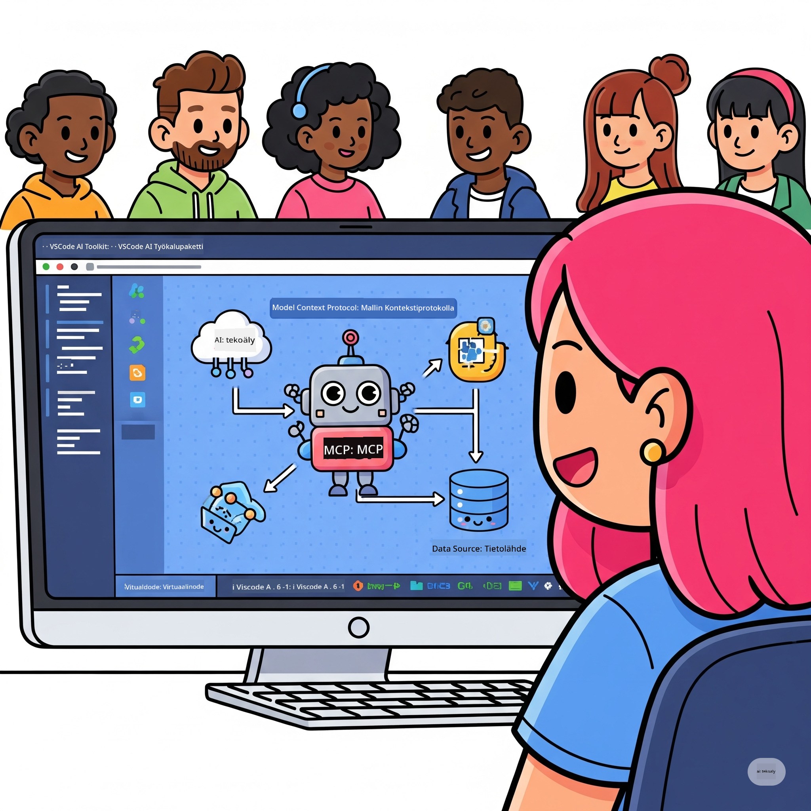
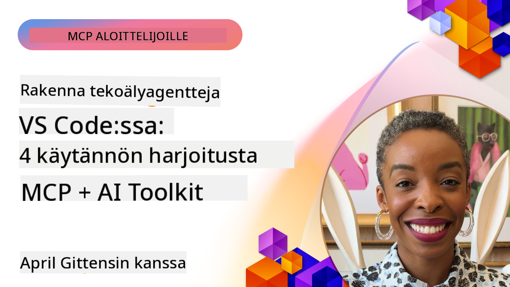

<!--
CO_OP_TRANSLATOR_METADATA:
{
  "original_hash": "1b000fd6e1b04c047578bfc5d07d54eb",
  "translation_date": "2025-08-18T16:20:55+00:00",
  "source_file": "10-StreamliningAIWorkflowsBuildingAnMCPServerWithAIToolkit/README.md",
  "language_code": "fi"
}
-->
# AI-työnkulkujen tehostaminen: MCP-palvelimen rakentaminen AI Toolkitilla

## 🎯 Yleiskatsaus

_(Klikkaa yllä olevaa kuvaa nähdäksesi tämän oppitunnin videon)_

Tervetuloa **Model Context Protocol (MCP) -työpajaan**! Tämä kattava käytännön työpaja yhdistää kaksi huipputeknologiaa mullistaakseen tekoälysovellusten kehittämisen:

- **🔗 Model Context Protocol (MCP)**: Avoin standardi tekoälytyökalujen saumattomaan integrointiin
- **🛠️ AI Toolkit for Visual Studio Code (AITK)**: Microsoftin tehokas tekoälykehityksen laajennus

### 🎓 Mitä opit

Työpajan lopussa hallitset älykkäiden sovellusten rakentamisen, jotka yhdistävät tekoälymallit tosielämän työkaluihin ja palveluihin. Automatisoidusta testauksesta räätälöityihin API-integraatioihin, saat käytännön taitoja ratkaista monimutkaisia liiketoimintaongelmia.

## 🏗️ Teknologiakokonaisuus

### 🔌 Model Context Protocol (MCP)

MCP on tekoälyn **"USB-C"** - universaali standardi, joka yhdistää tekoälymallit ulkoisiin työkaluihin ja tietolähteisiin.

**✨ Keskeiset ominaisuudet:**

- 🔄 **Standardoitu integrointi**: Universaali rajapinta tekoälytyökalujen yhdistämiseen
- 🏛️ **Joustava arkkitehtuuri**: Paikalliset ja etäpalvelimet stdio/SSE-siirron kautta
- 🧰 **Rikas ekosysteemi**: Työkalut, kehotteet ja resurssit yhdessä protokollassa
- 🔒 **Yrityskäyttöön valmis**: Sisäänrakennettu turvallisuus ja luotettavuus

**🎯 Miksi MCP on tärkeä:**
Aivan kuten USB-C poisti kaapelikaaoksen, MCP poistaa tekoälyintegraatioiden monimutkaisuuden. Yksi protokolla, rajattomat mahdollisuudet.

### 🤖 AI Toolkit for Visual Studio Code (AITK)

Microsoftin lippulaivalaajennus, joka muuttaa VS Coden tekoälykehityksen voimapesäksi.

**🚀 Keskeiset kyvyt:**

- 📦 **Mallikatalogi**: Pääsy malleihin Azure AI:sta, GitHubista, Hugging Facesta, Ollamasta
- ⚡ **Paikallinen päättely**: ONNX-optimoitu CPU/GPU/NPU-suoritus
- 🏗️ **Agent Builder**: Visuaalinen tekoälyagenttien kehitys MCP-integraatiolla
- 🎭 **Monimodaalinen tuki**: Teksti-, kuva- ja rakenteellinen ulostulo

**💡 Kehityksen hyödyt:**

- Mallien käyttöönotto ilman konfigurointia
- Visuaalinen kehotteiden suunnittelu
- Reaaliaikainen testausympäristö
- Saumaton MCP-palvelimen integrointi

## 📚 Oppimispolku

### [🚀 Moduuli 1: AI Toolkitin perusteet](./lab1/README.md)

**Kesto**: 15 minuuttia

- 🛠️ Asenna ja konfiguroi AI Toolkit VS Codeen
- 🗂️ Tutustu mallikatalogiin (yli 100 mallia GitHubista, ONNX:stä, OpenAI:sta, Anthropicsista, Googlesta)
- 🎮 Hallitse interaktiivinen testausympäristö reaaliaikaiseen mallien testaukseen
- 🤖 Rakenna ensimmäinen tekoälyagenttisi Agent Builderilla
- 📊 Arvioi mallien suorituskykyä sisäänrakennetuilla mittareilla (F1, relevanssi, samankaltaisuus, koherenssi)
- ⚡ Opi eräkäsittelyn ja monimodaalisen tuen ominaisuudet

**🎯 Oppimistulos**: Luo toimiva tekoälyagentti ja ymmärrä kattavasti AITK:n ominaisuudet

### [🌐 Moduuli 2: MCP ja AI Toolkitin perusteet](./lab2/README.md)

**Kesto**: 20 minuuttia

- 🧠 Hallitse Model Context Protocol (MCP) -arkkitehtuuri ja -konseptit
- 🌐 Tutustu Microsoftin MCP-palvelinekosysteemiin
- 🤖 Rakenna selaimen automaatioagentti Playwright MCP -palvelimella
- 🔧 Integroi MCP-palvelimet AI Toolkit Agent Builderiin
- 📊 Konfiguroi ja testaa MCP-työkaluja agenteissasi
- 🚀 Vie ja ota käyttöön MCP-pohjaisia agentteja tuotantokäyttöön

**🎯 Oppimistulos**: Ota käyttöön tekoälyagentti, joka on tehostettu ulkoisilla työkaluilla MCP:n avulla

### [🔧 Moduuli 3: Kehittynyt MCP-kehitys AI Toolkitilla](./lab3/README.md)

**Kesto**: 20 minuuttia

- 💻 Luo räätälöityjä MCP-palvelimia AI Toolkitilla
- 🐍 Konfiguroi ja käytä uusinta MCP Python SDK:ta (v1.9.3)
- 🔍 Ota käyttöön ja hyödynnä MCP Inspector -työkalua virheenkorjaukseen
- 🛠️ Rakenna Sää-MCP-palvelin ammattimaisilla virheenkorjaustyönkuluilla
- 🧪 Korjaa MCP-palvelimia sekä Agent Builder- että Inspector-ympäristöissä

**🎯 Oppimistulos**: Kehitä ja korjaa räätälöityjä MCP-palvelimia modernilla työkalustolla

### [🐙 Moduuli 4: Käytännön MCP-kehitys - Räätälöity GitHub Clone -palvelin](./lab4/README.md)

**Kesto**: 30 minuuttia

- 🏗️ Rakenna todellisen maailman GitHub Clone MCP -palvelin kehitystyönkulkuihin
- 🔄 Toteuta älykäs repositorion kloonaus validoinnilla ja virheenkäsittelyllä
- 📁 Luo älykäs hakemistohallinta ja VS Code -integraatio
- 🤖 Käytä GitHub Copilot Agent Modea räätälöityjen MCP-työkalujen kanssa
- 🛡️ Sovella tuotantovalmiita luotettavuus- ja monialustayhteensopivuusratkaisuja

**🎯 Oppimistulos**: Ota käyttöön tuotantovalmis MCP-palvelin, joka tehostaa kehitystyönkulkuja

## 💡 Käytännön sovellukset ja vaikutus

### 🏢 Yrityskäyttötapaukset

#### 🔄 DevOps-automaatio

Muunna kehitystyönkulut älykkäällä automaatiolla:

- **Älykäs repositorion hallinta**: Tekoälypohjainen koodin tarkistus ja yhdistämispäätökset
- **Älykäs CI/CD**: Automatisoitu putkiston optimointi koodimuutosten perusteella
- **Ongelman priorisointi**: Automaattinen bugien luokittelu ja jakaminen

#### 🧪 Laadunvarmistuksen vallankumous

Nosta testaus uudelle tasolle tekoälypohjaisella automaatiolla:

- **Älykäs testigenerointi**: Luo kattavat testisarjat automaattisesti
- **Visuaalinen regressiotestaus**: Tekoälypohjainen käyttöliittymän muutosten tunnistus
- **Suorituskyvyn seuranta**: Ennakoiva ongelmien tunnistus ja ratkaisu

#### 📊 Dataputkien älykkyys

Rakenna älykkäämpiä datankäsittelytyönkulkuja:

- **Mukautuvat ETL-prosessit**: Itseoptimoituvat datamuunnokset
- **Poikkeamien tunnistus**: Reaaliaikainen datan laadun seuranta
- **Älykäs reititys**: Älykäs datavirtojen hallinta

#### 🎧 Asiakaskokemuksen parantaminen

Luo poikkeuksellisia asiakasvuorovaikutuksia:

- **Kontekstia ymmärtävä tuki**: Tekoälyagentit, joilla on pääsy asiakashistoriaan
- **Ennakoiva ongelmanratkaisu**: Ennustava asiakaspalvelu
- **Monikanavaintegraatio**: Yhtenäinen tekoälykokemus eri alustoilla

## 🛠️ Esivaatimukset ja asennus

### 💻 Järjestelmävaatimukset

| Komponentti | Vaatimus | Huomautukset |
|-------------|----------|--------------|
| **Käyttöjärjestelmä** | Windows 10+, macOS 10.15+, Linux | Mikä tahansa moderni käyttöjärjestelmä |
| **Visual Studio Code** | Uusin vakaa versio | Vaaditaan AITK:lle |
| **Node.js** | v18.0+ ja npm | MCP-palvelimen kehitykseen |
| **Python** | 3.10+ | Valinnainen Python MCP -palvelimille |
| **Muisti** | Vähintään 8GB RAM | 16GB suositeltu paikallisille malleille |

### 🔧 Kehitysympäristö

#### Suositellut VS Code -laajennukset

- **AI Toolkit** (ms-windows-ai-studio.windows-ai-studio)
- **Python** (ms-python.python)
- **Python Debugger** (ms-python.debugpy)
- **GitHub Copilot** (GitHub.copilot) - Valinnainen mutta hyödyllinen

#### Valinnaiset työkalut

- **uv**: Moderni Python-pakettien hallinta
- **MCP Inspector**: Visuaalinen virheenkorjaustyökalu MCP-palvelimille
- **Playwright**: Verkkoselaimen automaation esimerkkeihin

## 🎖️ Oppimistulokset ja sertifiointipolku

### 🏆 Taitojen hallinnan tarkistuslista

Työpajan suorittamalla saavutat seuraavat taidot:

#### 🎯 Ydinosaamiset

- [ ] **MCP-protokollan hallinta**: Syvällinen ymmärrys arkkitehtuurista ja toteutusmalleista
- [ ] **AITK-osaaminen**: Asiantuntijatason käyttö AI Toolkitilla nopeaan kehitykseen
- [ ] **Räätälöity palvelinkehitys**: Rakenna, ota käyttöön ja ylläpidä tuotantovalmiita MCP-palvelimia
- [ ] **Työkalujen integroinnin hallinta**: Yhdistä tekoäly saumattomasti olemassa oleviin kehitystyönkulkuihin
- [ ] **Ongelmanratkaisun soveltaminen**: Käytä opittuja taitoja todellisiin liiketoimintaongelmiin

#### 🔧 Teknisiä taitoja

- [ ] Asenna ja konfiguroi AI Toolkit VS Codeen
- [ ] Suunnittele ja toteuta räätälöityjä MCP-palvelimia
- [ ] Integroi GitHub-mallit MCP-arkkitehtuuriin
- [ ] Rakenna automatisoituja testausprosesseja Playwrightilla
- [ ] Ota käyttöön tekoälyagentteja tuotantokäyttöön
- [ ] Korjaa ja optimoi MCP-palvelinten suorituskykyä

#### 🚀 Edistyneet kyvyt

- [ ] Suunnittele yritystason tekoälyintegraatioita
- [ ] Toteuta turvallisuuden parhaat käytännöt tekoälysovelluksille
- [ ] Suunnittele skaalautuvia MCP-palvelinarkkitehtuureja
- [ ] Luo räätälöityjä työkaluketjuja tiettyihin toimialoihin
- [ ] Mentoroi muita tekoälypohjaisessa kehityksessä

## 📖 Lisäresurssit

- [MCP-määrittely](https://modelcontextprotocol.io/docs)
- [AI Toolkit GitHub -repositorio](https://github.com/microsoft/vscode-ai-toolkit)
- [Esimerkkikokoelma MCP-palvelimista](https://github.com/modelcontextprotocol/servers)
- [Parhaiden käytäntöjen opas](https://modelcontextprotocol.io/docs/best-practices)

---

**🚀 Valmis mullistamaan tekoälykehityksesi työnkulut?**

Rakennetaan yhdessä tekoälyn tulevaisuus MCP:n ja AI Toolkitin avulla!

**Vastuuvapauslauseke**:  
Tämä asiakirja on käännetty käyttämällä tekoälypohjaista käännöspalvelua [Co-op Translator](https://github.com/Azure/co-op-translator). Vaikka pyrimme tarkkuuteen, huomioithan, että automaattiset käännökset voivat sisältää virheitä tai epätarkkuuksia. Alkuperäinen asiakirja sen alkuperäisellä kielellä tulisi pitää ensisijaisena lähteenä. Kriittisen tiedon osalta suositellaan ammattimaista ihmiskäännöstä. Emme ole vastuussa väärinkäsityksistä tai virhetulkinnoista, jotka johtuvat tämän käännöksen käytöstä.