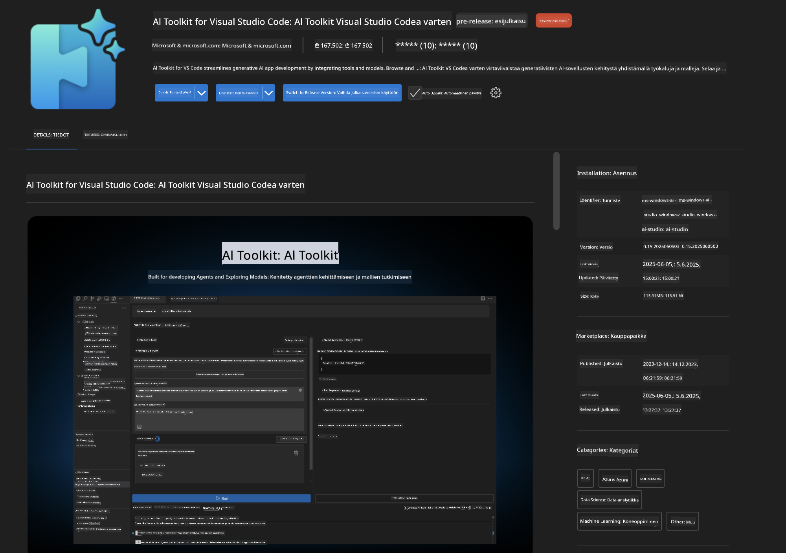
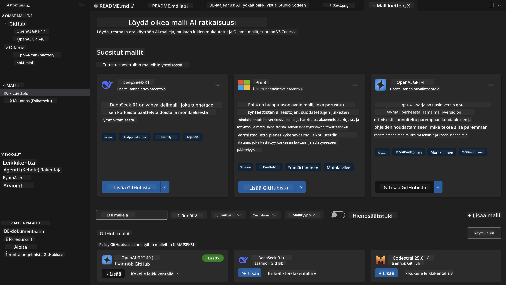
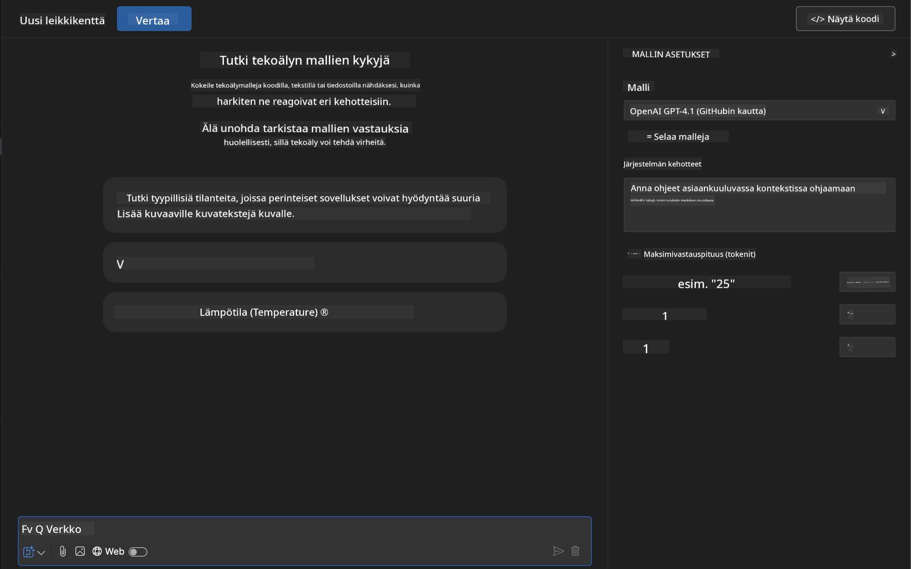
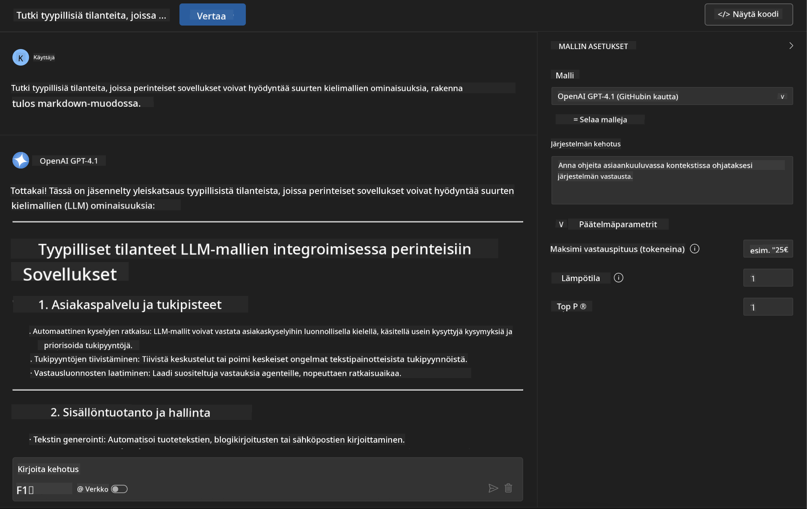
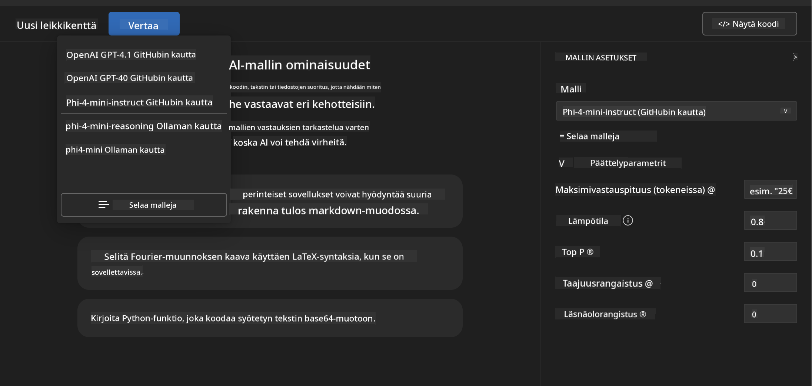
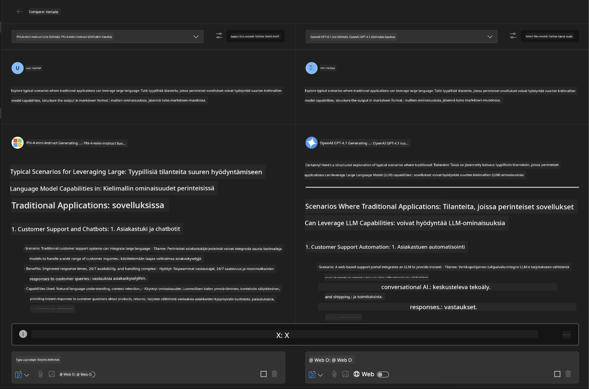
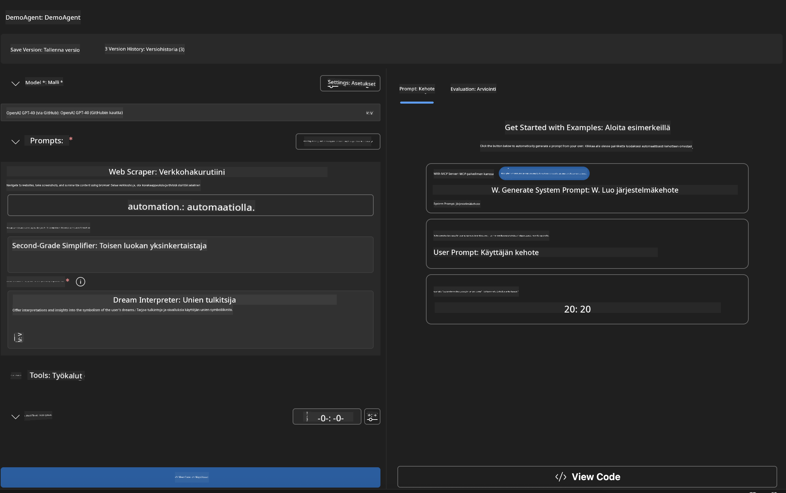
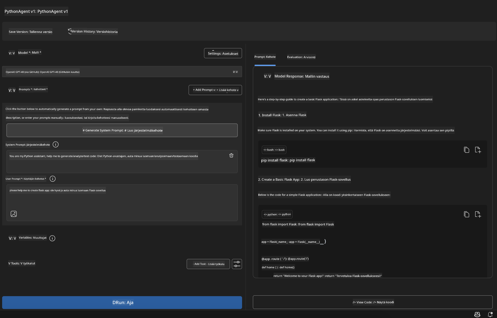

<!--
CO_OP_TRANSLATOR_METADATA:
{
  "original_hash": "2aa9dbc165e104764fa57e8a0d3f1c73",
  "translation_date": "2025-06-10T05:24:37+00:00",
  "source_file": "10-StreamliningAIWorkflowsBuildingAnMCPServerWithAIToolkit/lab1/README.md",
  "language_code": "fi"
}
-->
# 🚀 Moduuli 1: AI Toolkitin Perusteet

[]()
[]()
[]()

## 📋 Oppimistavoitteet

Tämän moduulin lopussa osaat:
- ✅ Asentaa ja konfiguroida AI Toolkitin Visual Studio Codeen
- ✅ Selailla Model Catalogia ja ymmärtää eri mallien lähteet
- ✅ Käyttää Playgroundia mallien testaamiseen ja kokeiluun
- ✅ Luoda omia AI-agentteja Agent Builderilla
- ✅ Verrata mallien suorituskykyä eri tarjoajien välillä
- ✅ Soveltaa parhaita käytäntöjä prompttien suunnittelussa

## 🧠 Johdanto AI Toolkitiin (AITK)

**AI Toolkit for Visual Studio Code** on Microsoftin lippulaiva-laajennus, joka muuttaa VS Coden kattavaksi tekoälyn kehitysympäristöksi. Se yhdistää tekoälytutkimuksen ja käytännön sovelluskehityksen, tehden generatiivisesta tekoälystä helposti lähestyttävän kehittäjille kaikilla taitotasoilla.

### 🌟 Keskeiset Ominaisuudet

| Ominaisuus | Kuvaus | Käyttötapaus |
|---------|-------------|----------|
| **🗂️ Model Catalog** | Yli 100 mallia GitHubista, ONNX:stä, OpenAI:sta, Anthropicista, Googlelta | Mallien löytäminen ja valinta |
| **🔌 BYOM Support** | Omien mallien integrointi (paikallinen/etä) | Räätälöityjen mallien käyttöönotto |
| **🎮 Interactive Playground** | Reaaliaikainen mallin testaus chat-käyttöliittymällä | Nopea prototypointi ja testaus |
| **📎 Multi-Modal Support** | Tekstin, kuvien ja liitteiden käsittely | Monimutkaiset tekoälysovellukset |
| **⚡ Batch Processing** | Useiden prompttien samanaikainen suoritus | Tehokkaat testausprosessit |
| **📊 Model Evaluation** | Sisäänrakennetut mittarit (F1, relevanssi, samankaltaisuus, johdonmukaisuus) | Suorituskyvyn arviointi |

### 🎯 Miksi AI Toolkit on tärkeä

- **🚀 Nopeutettu kehitys**: Ideasta prototyyppiin minuuteissa
- **🔄 Yhtenäinen työnkulku**: Yksi käyttöliittymä useille tekoälypalveluille
- **🧪 Helppo kokeilu**: Mallien vertailu ilman monimutkaista asennusta
- **📈 Tuotantovalmius**: Saumaton siirtymä prototyypistä käyttöönottoon

## 🛠️ Esivaatimukset ja asennus

### 📦 AI Toolkit -laajennuksen asennus

**Vaihe 1: Avaa Extensions Marketplace**
1. Avaa Visual Studio Code
2. Siirry Extensions-näkymään (`Ctrl+Shift+X` tai `Cmd+Shift+X`)
3. Etsi "AI Toolkit"

**Vaihe 2: Valitse versio**
- **🟢 Release**: Suositeltu tuotantokäyttöön
- **🔶 Pre-release**: Varhainen pääsy uusimpiin ominaisuuksiin

**Vaihe 3: Asenna ja ota käyttöön**



### ✅ Varmistuslista
- [ ] AI Toolkit -kuvake näkyy VS Coden sivupalkissa
- [ ] Laajennus on aktivoitu ja käytössä
- [ ] Asennuksessa ei ole virheilmoituksia output-paneelissa

## 🧪 Käytännön harjoitus 1: GitHub-mallien tutkiminen

**🎯 Tavoite**: Hallitse Model Catalog ja testaa ensimmäinen AI-mallisi

### 📊 Vaihe 1: Selaa Model Catalogia

Model Catalog on porttisi tekoälyekosysteemiin. Se kokoaa malleja useilta tarjoajilta, mikä helpottaa vaihtoehtojen löytämistä ja vertailua.

**🔍 Navigointiohje:**

Klikkaa AI Toolkitin sivupalkissa **MODELS - Catalog**



**💡 Vinkki**: Etsi malleja, joilla on juuri sinun käyttötarkoitukseesi sopivia ominaisuuksia (esim. koodin generointi, luova kirjoittaminen, analyysi).

**⚠️ Huom:** GitHubissa isännöidyt mallit (eli GitHub Models) ovat ilmaisia käyttää, mutta niihin liittyy pyyntö- ja token-rajoituksia. Jos haluat käyttää muita kuin GitHub-malleja (esim. Azure AI:n tai muiden päätepisteiden malleja), tarvitset asianmukaisen API-avaimen tai tunnistautumisen.

### 🚀 Vaihe 2: Lisää ja konfiguroi ensimmäinen mallisi

**Mallin valintastrategia:**
- **GPT-4.1**: Paras monimutkaiseen päättelyyn ja analyysiin
- **Phi-4-mini**: Kevyt, nopea vastauksissa yksinkertaisiin tehtäviin

**🔧 Konfigurointiprosessi:**
1. Valitse katalogista **OpenAI GPT-4.1**
2. Klikkaa **Add to My Models** - rekisteröi malli käyttöön
3. Valitse **Try in Playground** käynnistääksesi testausympäristön
4. Odota mallin käynnistymistä (ensiasennus voi kestää hetken)



**⚙️ Mallin parametrien ymmärtäminen:**
- **Temperature**: Ohjaa luovuutta (0 = deterministinen, 1 = luova)
- **Max Tokens**: Vastauksen enimmäispituus
- **Top-p**: Nucleus-sampling, monipuolisemmat vastaukset

### 🎯 Vaihe 3: Hallitse Playgroundin käyttöliittymä

Playground on tekoälykokeilulaboratoriosi. Näin hyödynnät sen mahdollisuudet parhaalla tavalla:

**🎨 Prompttien suunnittelun parhaat käytännöt:**
1. **Ole tarkka**: Selkeät ja yksityiskohtaiset ohjeet tuottavat parempia tuloksia
2. **Anna konteksti**: Sisällytä tarpeellinen taustatieto
3. **Käytä esimerkkejä**: Näytä mallille, mitä haluat esimerkkien avulla
4. **Iteroi**: Hio promptteja alkuperäisten tulosten perusteella

**🧪 Testaustilanteet:**
```markdown
# Example 1: Code Generation
"Write a Python function that calculates the factorial of a number using recursion. Include error handling and docstrings."

# Example 2: Creative Writing
"Write a professional email to a client explaining a project delay, maintaining a positive tone while being transparent about challenges."

# Example 3: Data Analysis
"Analyze this sales data and provide insights: [paste your data]. Focus on trends, anomalies, and actionable recommendations."
```



### 🏆 Haastetehtävä: Mallien suorituskyvyn vertailu

**🎯 Tavoite**: Vertaa eri malleja samoilla promptteilla ja ymmärrä niiden vahvuudet

**📋 Ohjeet:**
1. Lisää työtilaasi **Phi-4-mini**
2. Käytä samaa prompttia sekä GPT-4.1:lle että Phi-4-minille



3. Vertaa vastausten laatua, nopeutta ja tarkkuutta
4. Kirjaa havaintosi tulossektioon



**💡 Keskeiset oivallukset:**
- Milloin käyttää LLM:ää vs. SLM:ää
- Kustannusten ja suorituskyvyn kompromissit
- Mallien erityisosaamiset

## 🤖 Käytännön harjoitus 2: Räätälöityjen agenttien rakentaminen Agent Builderilla

**🎯 Tavoite**: Luo erikoistuneita AI-agentteja tiettyihin tehtäviin ja työnkulkuun

### 🏗️ Vaihe 1: Tutustu Agent Builderiin

Agent Builder on AI Toolkitin ydinominaisuus. Sen avulla luot tarkoitukseen räätälöityjä tekoälyavustajia, jotka yhdistävät suurten kielimallien voiman omiin ohjeisiin, parametreihin ja erityisosaamiseen.

**🧠 Agentin arkkitehtuurin osat:**
- **Core Model**: Perustana oleva LLM (GPT-4, Groks, Phi jne.)
- **System Prompt**: Määrittelee agentin persoonallisuuden ja käyttäytymisen
- **Parameters**: Hienosäädetyt asetukset optimaaliseen suorituskykyyn
- **Tools Integration**: Yhteydet ulkoisiin API:hin ja MCP-palveluihin
- **Memory**: Keskustelun konteksti ja istunnon pysyvyys



### ⚙️ Vaihe 2: Syväsukellus agentin konfigurointiin

**🎨 Tehokkaiden system prompttien luominen:**
```markdown
# Template Structure:
## Role Definition
You are a [specific role] with expertise in [domain].

## Capabilities
- List specific abilities
- Define scope of knowledge
- Clarify limitations

## Behavior Guidelines
- Response style (formal, casual, technical)
- Output format preferences
- Error handling approach

## Examples
Provide 2-3 examples of ideal interactions
```

*Voit myös käyttää Generate System Prompt -toimintoa, jolloin tekoäly auttaa sinua luomaan ja optimoimaan promptteja*

**🔧 Parametrien optimointi:**
| Parametri | Suositeltu alue | Käyttötapaus |
|-----------|------------------|--------------|
| **Temperature** | 0.1-0.3 | Tekninen/faktuaalinen vastaus |
| **Temperature** | 0.7-0.9 | Luovat/aivoriihi-tehtävät |
| **Max Tokens** | 500-1000 | Ytimekkäät vastaukset |
| **Max Tokens** | 2000-4000 | Yksityiskohtaiset selitykset |

### 🐍 Vaihe 3: Käytännön harjoitus – Python-ohjelmointiagentti

**🎯 Tehtävä**: Luo erikoistunut Python-koodausavustaja

**📋 Konfigurointivaiheet:**

1. **Mallin valinta**: Valitse **Claude 3.5 Sonnet** (erinomainen koodaukseen)

2. **System Promptin suunnittelu:**
```markdown
# Python Programming Expert Agent

## Role
You are a senior Python developer with 10+ years of experience. You excel at writing clean, efficient, and well-documented Python code.

## Capabilities
- Write production-ready Python code
- Debug complex issues
- Explain code concepts clearly
- Suggest best practices and optimizations
- Provide complete working examples

## Response Format
- Always include docstrings
- Add inline comments for complex logic
- Suggest testing approaches
- Mention relevant libraries when applicable

## Code Quality Standards
- Follow PEP 8 style guidelines
- Use type hints where appropriate
- Handle exceptions gracefully
- Write readable, maintainable code
```

3. **Parametrien asetus:**
   - Temperature: 0.2 (johdonmukainen ja luotettava koodi)
   - Max Tokens: 2000 (yksityiskohtaiset selitykset)
   - Top-p: 0.9 (tasapainoinen luovuus)



### 🧪 Vaihe 4: Testaa Python-agenttisi

**Testitilanteet:**
1. **Perustoiminto**: "Luo funktio alkulukujen löytämiseen"
2. **Monimutkainen algoritmi**: "Toteuta binäärinen hakupuu, jossa on lisää, poista ja hae -metodit"
3. **Todellisen maailman ongelma**: "Rakenna web-skräppäin, joka käsittelee pyyntöjen rajoitukset ja uudelleenyrittää"
4. **Virheiden korjaus**: "Korjaa tämä koodi [liitä virheellinen koodi]"

**🏆 Onnistumisen kriteerit:**
- ✅ Koodi toimii ilman virheitä
- ✅ Sisältää asianmukaisen dokumentaation
- ✅ Noudattaa Pythonin parhaita käytäntöjä
- ✅ Tarjoaa selkeitä selityksiä
- ✅ Ehdottaa parannuksia

## 🎓 Moduuli 1 Yhteenveto & Seuraavat askeleet

### 📊 Tietotesti

Testaa osaamisesi:
- [ ] Osaatko selittää katalogin mallien erot?
- [ ] Oletko onnistuneesti luonut ja testannut oman agentin?
- [ ] Ymmärrätkö, miten optimoida parametreja eri käyttötarkoituksiin?
- [ ] Osaatko suunnitella tehokkaita system promptteja?

### 📚 Lisäresurssit

- **AI Toolkit Dokumentaatio**: [Official Microsoft Docs](https://github.com/microsoft/vscode-ai-toolkit)
- **Prompt Engineering Guide**: [Best Practices](https://platform.openai.com/docs/guides/prompt-engineering)
- **Models in AI Toolkit**: [Models in Develpment](https://github.com/microsoft/vscode-ai-toolkit/blob/main/doc/models.md)

**🎉 Onnittelut!** Olet hallinnut AI Toolkitin perusteet ja olet valmis rakentamaan kehittyneempiä tekoälysovelluksia!

### 🔜 Jatka seuraavaan moduuliin

Valmiina oppimaan lisää? Siirry **[Moduuli 2: MCP with AI Toolkit Fundamentals](../lab2/README.md)** -osioon, jossa opit:
- Liittämään agenttisi ulkoisiin työkaluihin Model Context Protocolin (MCP) avulla
- Rakentamaan selainautomaatiota Playwrightilla
- Integroimaan MCP-palvelimet AI Toolkit -agenttiesi kanssa
- Tehostamaan agenttejasi ulkoisella datalla ja ominaisuuksilla

**Vastuuvapauslauseke**:  
Tämä asiakirja on käännetty käyttämällä tekoälypohjaista käännöspalvelua [Co-op Translator](https://github.com/Azure/co-op-translator). Vaikka pyrimme tarkkuuteen, huomioithan, että automaattikäännöksissä saattaa esiintyä virheitä tai epätarkkuuksia. Alkuperäistä asiakirjaa sen alkuperäiskielellä tulee pitää virallisena lähteenä. Tärkeissä asioissa suositellaan ammattimaista ihmiskäännöstä. Emme ole vastuussa tämän käännöksen käytöstä johtuvista väärinymmärryksistä tai tulkinnoista.