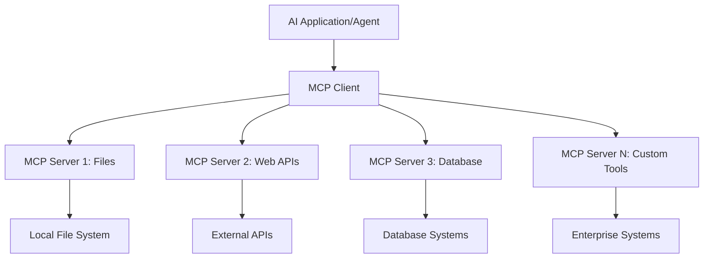
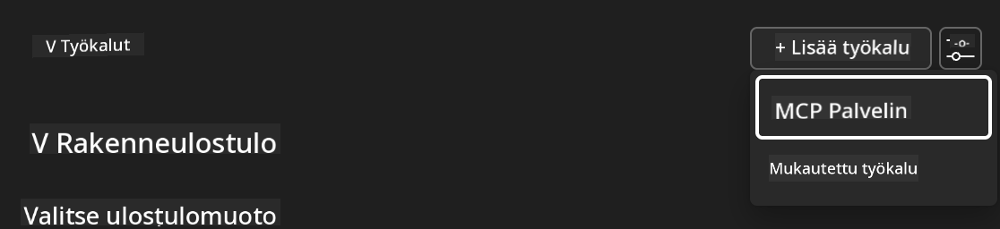
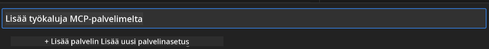
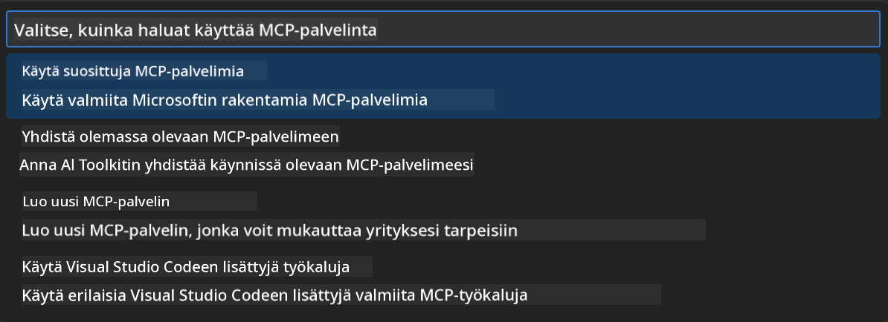
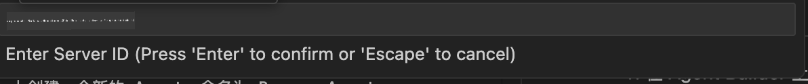
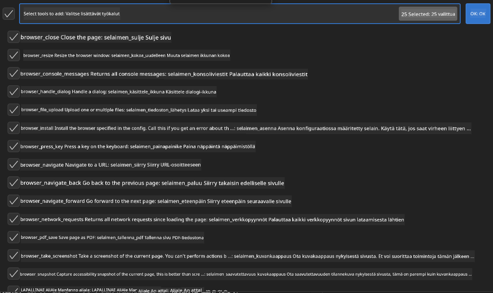
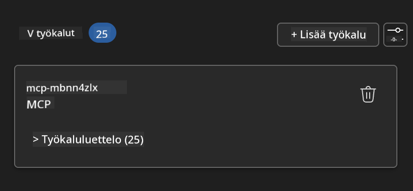
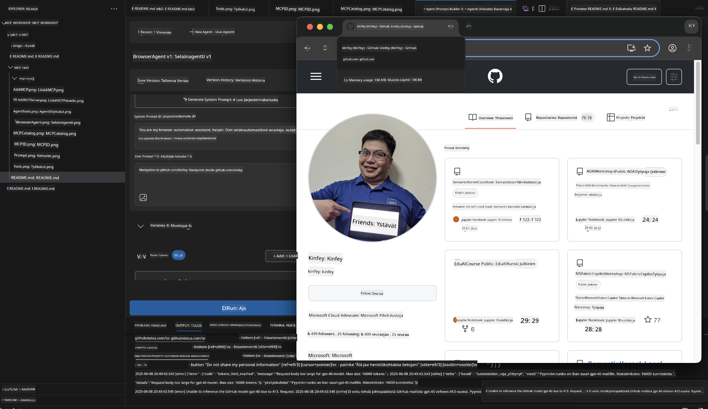
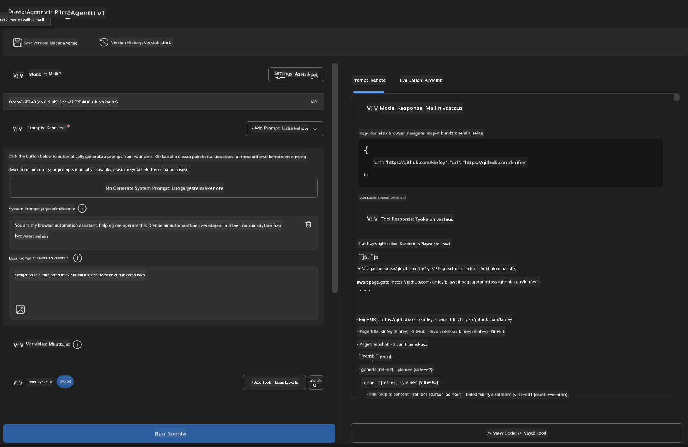
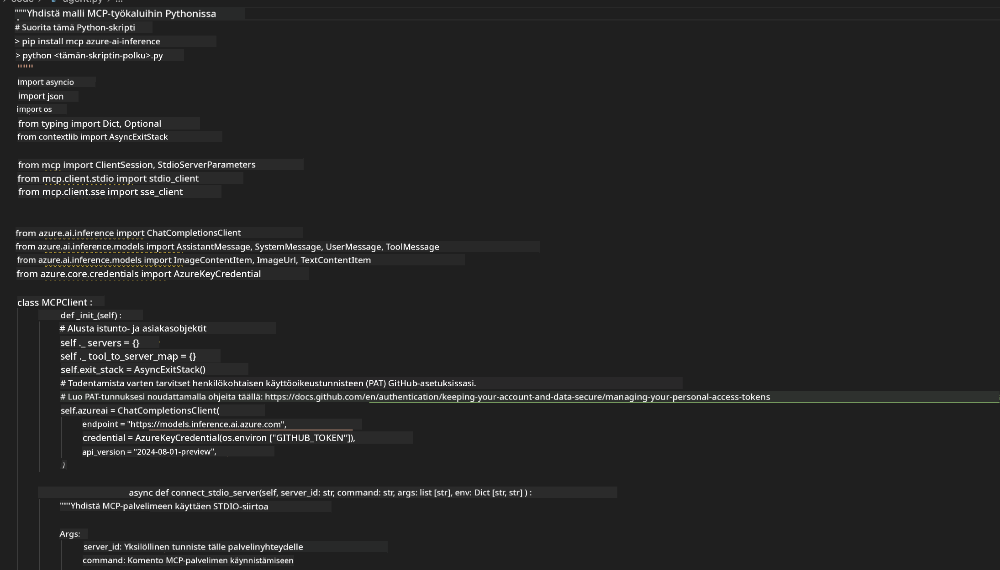

<!--
CO_OP_TRANSLATOR_METADATA:
{
  "original_hash": "a22b7dd11cd7690f99f9195877cafdc3",
  "translation_date": "2025-07-14T07:55:25+00:00",
  "source_file": "10-StreamliningAIWorkflowsBuildingAnMCPServerWithAIToolkit/lab2/README.md",
  "language_code": "fi"
}
-->
# 🌐 Moduuli 2: MCP ja AI Toolkit -perusteet

[]()
[]()
[]()

## 📋 Oppimistavoitteet

Tämän moduulin lopussa osaat:
- ✅ Ymmärtää Model Context Protocolin (MCP) arkkitehtuurin ja hyödyt
- ✅ Tutustua Microsoftin MCP-palvelin-ekosysteemiin
- ✅ Integroida MCP-palvelimet AI Toolkit Agent Builderiin
- ✅ Rakentaa toimiva selainautomaattinen agentti Playwright MCP:n avulla
- ✅ Määrittää ja testata MCP-työkaluja agenteissasi
- ✅ Viedä ja ottaa MCP-pohjaiset agentit tuotantokäyttöön

## 🎯 Rakentaminen moduulin 1 päälle

Moduulissa 1 hallitsimme AI Toolkitin perusteet ja loimme ensimmäisen Python-agenttimme. Nyt **tehostamme** agenttejasi yhdistämällä ne ulkoisiin työkaluihin ja palveluihin mullistavan **Model Context Protocolin (MCP)** avulla.

Ajattele tätä siirtymänä peruslaskimesta täysiveriseksi tietokoneeksi – AI-agenttisi saavat kyvyn:
- 🌐 Selailla ja olla vuorovaikutuksessa verkkosivustojen kanssa
- 📁 Käyttää ja käsitellä tiedostoja
- 🔧 Integroitua yritysjärjestelmiin
- 📊 Käsitellä reaaliaikaista dataa API:sta

## 🧠 Model Context Protocolin (MCP) ymmärtäminen

### 🔍 Mikä on MCP?

Model Context Protocol (MCP) on **"USB-C AI-sovelluksille"** – mullistava avoin standardi, joka yhdistää suurten kielimallien (LLM) ulkoisiin työkaluihin, tietolähteisiin ja palveluihin. Aivan kuten USB-C poisti kaosmaisen kaapelien sekamelskan tarjoamalla yhden universaalin liitännän, MCP poistaa AI-integraatioiden monimutkaisuuden yhdellä standardoidulla protokollalla.

### 🎯 MCP:n ratkaisema ongelma

**Ennen MCP:tä:**
- 🔧 Räätälöidyt integraatiot jokaista työkalua varten
- 🔄 Toimittajalukko omiin ratkaisuihin  
- 🔒 Turva-aukot ad-hoc-yhteyksissä
- ⏱️ Kuukausien kehitystyö perusintegraatioihin

**MCP:n kanssa:**
- ⚡ Plug-and-play-työkalujen integrointi
- 🔄 Toimittajariippumaton arkkitehtuuri
- 🛡️ Sisäänrakennetut turvallisuusparhaat käytännöt
- 🚀 Uusien ominaisuuksien lisääminen minuuteissa

### 🏗️ Syväsukellus MCP-arkkitehtuuriin

MCP perustuu **asiakas-palvelin-arkkitehtuuriin**, joka luo turvallisen ja skaalautuvan ekosysteemin:



**🔧 Keskeiset komponentit:**

| Komponentti | Rooli | Esimerkkejä |
|-------------|-------|-------------|
| **MCP Hosts** | Sovellukset, jotka käyttävät MCP-palveluita | Claude Desktop, VS Code, AI Toolkit |
| **MCP Clients** | Protokollan käsittelijät (1:1 palvelimien kanssa) | Sisäänrakennettu host-sovelluksiin |
| **MCP Servers** | Tarjoavat ominaisuuksia standardoidun protokollan kautta | Playwright, Files, Azure, GitHub |
| **Transport Layer** | Viestintämenetelmät | stdio, HTTP, WebSockets |

## 🏢 Microsoftin MCP-palvelin-ekosysteemi

Microsoft johtaa MCP-ekosysteemiä kattavalla yritystason palvelinvalikoimalla, jotka vastaavat todellisiin liiketoiminnan tarpeisiin.

### 🌟 Microsoftin MCP-palvelimet esittelyssä

#### 1. ☁️ Azure MCP Server
**🔗 Repositorio**: [azure/azure-mcp](https://github.com/azure/azure-mcp)  
**🎯 Tarkoitus**: Kattava Azure-resurssien hallinta AI-integraatiolla

**✨ Keskeiset ominaisuudet:**
- Deklaratiivinen infrastruktuurin provisiointi
- Reaaliaikainen resurssien seuranta
- Kustannusten optimointisuositukset
- Turvallisuusvaatimusten tarkistus

**🚀 Käyttötapaukset:**
- Infrastruktuuri koodina AI-avusteisesti
- Automaattinen resurssien skaalaus
- Pilvikustannusten optimointi
- DevOps-työnkulkujen automatisointi

#### 2. 📊 Microsoft Dataverse MCP
**📚 Dokumentaatio**: [Microsoft Dataverse Integration](https://go.microsoft.com/fwlink/?linkid=2320176)  
**🎯 Tarkoitus**: Luonnollisen kielen käyttöliittymä liiketoimintadataan

**✨ Keskeiset ominaisuudet:**
- Luonnollisen kielen tietokantakyselyt
- Liiketoimintakontekstin ymmärrys
- Räätälöidyt kehotemallit
- Yritystason datanhallinta

**🚀 Käyttötapaukset:**
- Liiketoimintatiedon raportointi
- Asiakasdatan analysointi
- Myyntiputken näkymät
- Säädöstenmukaisuuskyselyt

#### 3. 🌐 Playwright MCP Server
**🔗 Repositorio**: [microsoft/playwright-mcp](https://github.com/microsoft/playwright-mcp)  
**🎯 Tarkoitus**: Selainautomaation ja verkkovuorovaikutuksen mahdollistaminen

**✨ Keskeiset ominaisuudet:**
- Moniselainautomaatio (Chrome, Firefox, Safari)
- Älykäs elementtien tunnistus
- Kuvakaappaukset ja PDF-tuotanto
- Verkkoliikenteen seuranta

**🚀 Käyttötapaukset:**
- Automaattiset testausprosessit
- Verkkosivujen tietojen keruu ja analyysi
- Käyttöliittymän valvonta
- Kilpailija-analyysin automatisointi

#### 4. 📁 Files MCP Server
**🔗 Repositorio**: [microsoft/files-mcp-server](https://github.com/microsoft/files-mcp-server)  
**🎯 Tarkoitus**: Älykäs tiedostojärjestelmän hallinta

**✨ Keskeiset ominaisuudet:**
- Deklaratiivinen tiedostojen hallinta
- Sisällön synkronointi
- Versionhallinnan integrointi
- Metatietojen poiminta

**🚀 Käyttötapaukset:**
- Dokumentaation hallinta
- Koodivaraston organisointi
- Sisällön julkaisuprosessit
- Tiedostojen käsittely datan putkissa

#### 5. 📝 MarkItDown MCP Server
**🔗 Repositorio**: [microsoft/markitdown](https://github.com/microsoft/markitdown)  
**🎯 Tarkoitus**: Edistynyt Markdownin käsittely ja muokkaus

**✨ Keskeiset ominaisuudet:**
- Monipuolinen Markdownin jäsentäminen
- Muotojen muunnos (MD ↔ HTML ↔ PDF)
- Sisällön rakenteen analyysi
- Mallipohjien käsittely

**🚀 Käyttötapaukset:**
- Teknisen dokumentaation työnkulut
- Sisällönhallintajärjestelmät
- Raporttien generointi
- Tietopohjan automatisointi

#### 6. 📈 Clarity MCP Server
**📦 Paketti**: [@microsoft/clarity-mcp-server](https://www.npmjs.com/package/@microsoft/clarity-mcp-server)  
**🎯 Tarkoitus**: Verkkosivuanalytiikka ja käyttäjäkäyttäytymisen ymmärrys

**✨ Keskeiset ominaisuudet:**
- Heatmap-analyysi
- Käyttäjäistuntojen tallennukset
- Suorituskykymittarit
- Konversioputken analyysi

**🚀 Käyttötapaukset:**
- Verkkosivujen optimointi
- Käyttäjäkokemuksen tutkimus
- A/B-testauksen analyysi
- Liiketoimintatiedon dashboardit

### 🌍 Yhteisön ekosysteemi

Microsoftin palvelimien lisäksi MCP-ekosysteemiin kuuluu:
- **🐙 GitHub MCP**: Repositorioiden hallinta ja koodianalyysi
- **🗄️ TietokantamCP:t**: PostgreSQL, MySQL, MongoDB -integraatiot
- **☁️ Pilvipalveluntarjoajien MCP:t**: AWS, GCP, Digital Ocean -työkalut
- **📧 Viestintä MCP:t**: Slack, Teams, Sähköpostiin liittyvät integraatiot

## 🛠️ Käytännön harjoitus: Selainautomaattisen agentin rakentaminen

**🎯 Projektin tavoite**: Luo älykäs selainautomaattinen agentti Playwright MCP -palvelimen avulla, joka osaa navigoida verkkosivuilla, kerätä tietoa ja suorittaa monimutkaisia verkkovuorovaikutuksia.

### 🚀 Vaihe 1: Agentin perustaminen

#### Vaihe 1: Aloita agenttisi luominen
1. **Avaa AI Toolkit Agent Builder**
2. **Luo uusi agentti** seuraavilla asetuksilla:
   - **Nimi**: `BrowserAgent`
   - **Malli**: Valitse GPT-4o


### 🔧 Vaihe 2: MCP-integraation työkulku

#### Vaihe 3: Lisää MCP-palvelinintegraatio
1. **Siirry Agent Builderin Työkalut-osioon**
2. **Klikkaa "Add Tool"** avataksesi integraatiovalikon
3. **Valitse "MCP Server"** saatavilla olevista vaihtoehdoista



**🔍 Työkalutyyppien ymmärtäminen:**
- **Sisäänrakennetut työkalut**: AI Toolkitin valmiit toiminnot
- **MCP-palvelimet**: Ulkoiset palveluintegratiot
- **Omat API:t**: Omien palveluiden rajapinnat
- **Funktiokutsut**: Suora pääsy mallin toimintoihin

#### Vaihe 4: MCP-palvelimen valinta
1. **Valitse "MCP Server"** jatkaaksesi


2. **Selaa MCP-katalogia** tutustuaksesi saatavilla oleviin integraatioihin


### 🎮 Vaihe 3: Playwright MCP:n konfigurointi

#### Vaihe 5: Valitse ja määritä Playwright
1. **Klikkaa "Use Featured MCP Servers"** päästäksesi Microsoftin varmennettuihin palvelimiin
2. **Valitse "Playwright"** esitellyistä palvelimista
3. **Hyväksy oletus MCP ID** tai muokkaa ympäristöösi sopivaksi



#### Vaihe 6: Ota Playwrightin ominaisuudet käyttöön
**🔑 Tärkeä vaihe**: Valitse **KAIKKI** saatavilla olevat Playwright-metodit maksimaalisen toiminnallisuuden takaamiseksi



**🛠️ Keskeiset Playwright-työkalut:**
- **Navigointi**: `goto`, `goBack`, `goForward`, `reload`
- **Vuorovaikutus**: `click`, `fill`, `press`, `hover`, `drag`
- **Tietojen poiminta**: `textContent`, `innerHTML`, `getAttribute`
- **Varmistus**: `isVisible`, `isEnabled`, `waitForSelector`
- **Kaappaus**: `screenshot`, `pdf`, `video`
- **Verkko**: `setExtraHTTPHeaders`, `route`, `waitForResponse`

#### Vaihe 7: Varmista integraation onnistuminen
**✅ Onnistumisen merkit:**
- Kaikki työkalut näkyvät Agent Builderin käyttöliittymässä
- Integraatiopaneelissa ei ole virheilmoituksia
- Playwright-palvelimen tila näyttää "Connected"



**🔧 Yleiset ongelmat ja ratkaisut:**
- **Yhteys epäonnistui**: Tarkista internet-yhteys ja palomuuriasetukset
- **Työkaluja puuttuu**: Varmista, että kaikki ominaisuudet valittiin asennuksen aikana
- **Oikeusvirheet**: Tarkista, että VS Code:lla on tarvittavat järjestelmän oikeudet

### 🎯 Vaihe 4: Edistynyt kehotteiden suunnittelu

#### Vaihe 8: Suunnittele älykkäät järjestelmäkehotteet
Luo monipuolisia kehotteita, jotka hyödyntävät Playwrightin kaikkia ominaisuuksia:

```markdown
# Web Automation Expert System Prompt

## Core Identity
You are an advanced web automation specialist with deep expertise in browser automation, web scraping, and user experience analysis. You have access to Playwright tools for comprehensive browser control.

## Capabilities & Approach
### Navigation Strategy
- Always start with screenshots to understand page layout
- Use semantic selectors (text content, labels) when possible
- Implement wait strategies for dynamic content
- Handle single-page applications (SPAs) effectively

### Error Handling
- Retry failed operations with exponential backoff
- Provide clear error descriptions and solutions
- Suggest alternative approaches when primary methods fail
- Always capture diagnostic screenshots on errors

### Data Extraction
- Extract structured data in JSON format when possible
- Provide confidence scores for extracted information
- Validate data completeness and accuracy
- Handle pagination and infinite scroll scenarios

### Reporting
- Include step-by-step execution logs
- Provide before/after screenshots for verification
- Suggest optimizations and alternative approaches
- Document any limitations or edge cases encountered

## Ethical Guidelines
- Respect robots.txt and rate limiting
- Avoid overloading target servers
- Only extract publicly available information
- Follow website terms of service
```

#### Vaihe 9: Luo dynaamiset käyttäjäkehotteet
Suunnittele kehotteita, jotka demonstroivat erilaisia toimintoja:

**🌐 Verkkosivuanalyysin esimerkki:**
```markdown
Navigate to github.com/kinfey and provide a comprehensive analysis including:
1. Repository structure and organization
2. Recent activity and contribution patterns  
3. Documentation quality assessment
4. Technology stack identification
5. Community engagement metrics
6. Notable projects and their purposes

Include screenshots at key steps and provide actionable insights.
```


### 🚀 Vaihe 5: Suoritus ja testaus

#### Vaihe 10: Suorita ensimmäinen automaatiosi
1. **Klikkaa "Run"** käynnistääksesi automaatiosarjan
2. **Seuraa reaaliaikaista suoritusta**:
   - Chrome-selain avautuu automaattisesti
   - Agentti navigoi kohdesivustolle
   - Kuvakaappaukset tallentuvat jokaisesta merkittävästä vaiheesta
   - Analyysitulokset päivittyvät reaaliajassa



#### Vaihe 11: Analysoi tulokset ja havainnot
Tarkastele kattavaa analyysiä Agent Builderin käyttöliittymässä:



### 🌟 Vaihe 6: Edistyneet ominaisuudet ja käyttöönotto

#### Vaihe 12: Vie ja ota tuotantokäyttöön
Agent Builder tukee useita käyttöönotto vaihtoehtoja:



## 🎓 Moduuli 2 yhteenveto & seuraavat askeleet

### 🏆 Saavutus avattu: MCP-integraation mestari

**✅ Hallitut taidot:**
- [ ] MCP-arkkitehtuurin ja hyötyjen ymmärtäminen
- [ ] Microsoftin MCP-palvelin-ekosysteemin navigointi
- [ ] Playwright MCP:n integrointi AI Toolkitiin
- [ ] Kehittyneiden selainautomaattisten agenttien rakentaminen
- [ ] Edistynyt kehotteiden suunnittelu web-automaatioon

### 📚 Lisäresurssit

- **🔗 MCP-spesifikaatio**: [Virallinen protokolladokumentaatio](https://modelcontextprotocol.io/)
- **🛠️ Playwright API**: [Täydellinen metodiviite](https://playwright.dev/docs/api/class-playwright)
- **🏢 Microsoft MCP -palvelimet**: [Yritysintegrointiohje](https://github.com/microsoft/mcp-servers)
- **🌍 Yhteisön esimerkit**: [MCP-palvelin-galleria](https://github.com/modelcontextprotocol/servers)

**🎉 Onnittelut!** Olet onnistuneesti hallinnut MCP-integraation ja voit nyt rakentaa tuotantovalmiita AI-agentteja ulkoisilla työkalutoiminnoilla!

### 🔜 Jatka seuraavaan moduuliin

Valmis viemään MCP-taitosi seuraavalle tasolle? Siirry **[Moduuli 3: Edistynyt MCP-kehitys AI Toolkitin kanssa](../lab3/README.md)**, jossa opit:
- Luomaan omia räätälöityjä MCP-palvelimia
- Määrittämään ja käyttämään uusinta MCP Python SDK:ta
- Ottamaan MCP Inspectorin käyttöön virheenkorjaukseen
- Hallitsemaan ed
- Rakenna Weather MCP -palvelin alusta alkaen

**Vastuuvapauslauseke**:  
Tämä asiakirja on käännetty käyttämällä tekoälypohjaista käännöspalvelua [Co-op Translator](https://github.com/Azure/co-op-translator). Vaikka pyrimme tarkkuuteen, huomioithan, että automaattikäännöksissä saattaa esiintyä virheitä tai epätarkkuuksia. Alkuperäistä asiakirjaa sen alkuperäiskielellä tulee pitää virallisena lähteenä. Tärkeissä tiedoissa suositellaan ammattimaista ihmiskäännöstä. Emme ole vastuussa tämän käännöksen käytöstä aiheutuvista väärinymmärryksistä tai tulkinnoista.