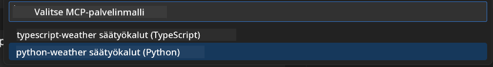
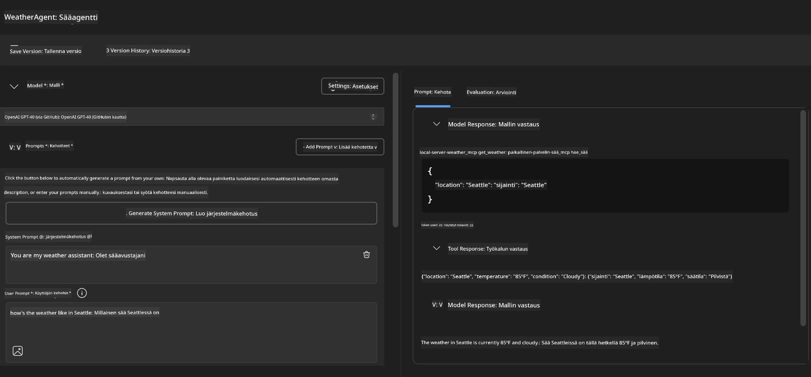
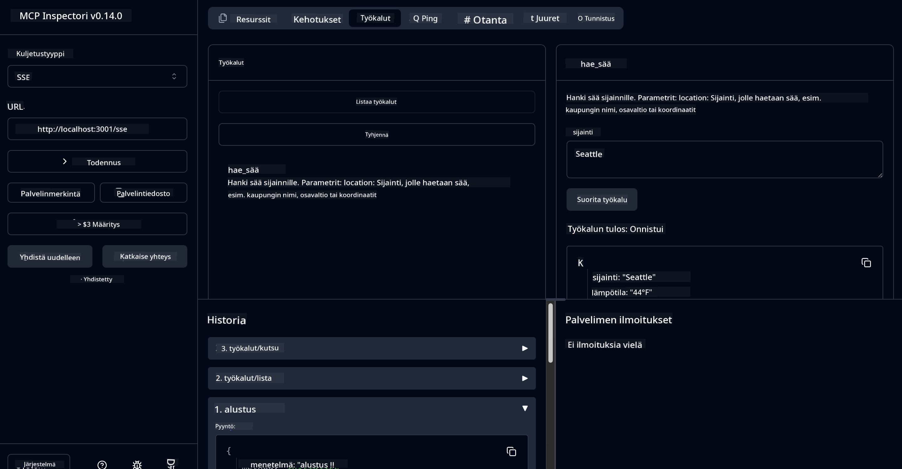

<!--
CO_OP_TRANSLATOR_METADATA:
{
  "original_hash": "dd8da3f75addcef453fe11f02a270217",
  "translation_date": "2025-07-14T08:15:36+00:00",
  "source_file": "10-StreamliningAIWorkflowsBuildingAnMCPServerWithAIToolkit/lab3/README.md",
  "language_code": "fi"
}
-->
# 🔧 Moduuli 3: Edistynyt MCP-kehitys AI Toolkitin avulla


## 🎯 Oppimistavoitteet

Tämän harjoituksen lopuksi osaat:

- ✅ Luoda räätälöityjä MCP-palvelimia AI Toolkitin avulla
- ✅ Määrittää ja käyttää uusinta MCP Python SDK:ta (v1.9.3)
- ✅ Asentaa ja hyödyntää MCP Inspectoria virheenkorjaukseen
- ✅ Virheenkorjata MCP-palvelimia sekä Agent Builderissa että Inspector-ympäristössä
- ✅ Ymmärtää edistyneet MCP-palvelinkehityksen työnkulut

## 📋 Esivaatimukset

- Lab 2 (MCP Fundamentals) suoritettuna
- VS Code, jossa AI Toolkit -laajennus asennettuna
- Python 3.10+ -ympäristö
- Node.js ja npm Inspectorin asennusta varten

## 🏗️ Mitä rakennat

Tässä harjoituksessa luot **Weather MCP Serverin**, joka havainnollistaa:
- Räätälöidyn MCP-palvelimen toteutusta
- Integraatiota AI Toolkit Agent Builderin kanssa
- Ammattimaisia virheenkorjaustyönkulkuja
- Modernin MCP SDK:n käyttöä

---

## 🔧 Keskeiset komponentit

### 🐍 MCP Python SDK
Model Context Protocolin Python SDK tarjoaa perustan räätälöityjen MCP-palvelimien rakentamiseen. Käytät versiota 1.9.3, jossa on parannetut virheenkorjausominaisuudet.

### 🔍 MCP Inspector
Tehokas virheenkorjaustyökalu, joka tarjoaa:
- Palvelimen reaaliaikaisen seurannan
- Työkalujen suorituksen visualisoinnin
- Verkkopyyntöjen ja -vastausten tarkastelun
- Interaktiivisen testausympäristön

---

## 📖 Vaiheittainen toteutus

### Vaihe 1: Luo WeatherAgent Agent Builderissa

1. **Käynnistä Agent Builder** VS Codessa AI Toolkit -laajennuksen kautta
2. **Luo uusi agentti** seuraavilla asetuksilla:
   - Agentin nimi: `WeatherAgent`


### Vaihe 2: Alusta MCP-palvelinprojekti

1. **Siirry Tools-valikkoon** → **Add Tool** Agent Builderissa
2. **Valitse "MCP Server"** tarjolla olevista vaihtoehdoista
3. **Valitse "Create A new MCP Server"**
4. **Valitse `python-weather` -mallipohja**
5. **Nimeä palvelimesi:** `weather_mcp`



### Vaihe 3: Avaa ja tutki projektia

1. **Avaa luotu projekti** VS Codessa
2. **Tarkastele projektin rakennetta:**
   ```
   weather_mcp/
   ├── src/
   │   ├── __init__.py
   │   └── server.py
   ├── inspector/
   │   ├── package.json
   │   └── package-lock.json
   ├── .vscode/
   │   ├── launch.json
   │   └── tasks.json
   ├── pyproject.toml
   └── README.md
   ```

### Vaihe 4: Päivitä uusimpaan MCP SDK:hon

> **🔍 Miksi päivittää?** Haluamme käyttää uusinta MCP SDK:ta (v1.9.3) ja Inspector-palvelua (0.14.0) parannettujen ominaisuuksien ja paremman virheenkorjauksen vuoksi.

#### 4a. Päivitä Python-riippuvuudet

**Muokkaa `pyproject.toml`:** päivitä [./code/weather_mcp/pyproject.toml](../../../../10-StreamliningAIWorkflowsBuildingAnMCPServerWithAIToolkit/lab3/code/weather_mcp/pyproject.toml)

#### 4b. Päivitä Inspectorin konfiguraatio

**Muokkaa `inspector/package.json`:** päivitä [./code/weather_mcp/inspector/package.json](../../../../10-StreamliningAIWorkflowsBuildingAnMCPServerWithAIToolkit/lab3/code/weather_mcp/inspector/package.json)

#### 4c. Päivitä Inspectorin riippuvuudet

**Muokkaa `inspector/package-lock.json`:** päivitä [./code/weather_mcp/inspector/package-lock.json](../../../../10-StreamliningAIWorkflowsBuildingAnMCPServerWithAIToolkit/lab3/code/weather_mcp/inspector/package-lock.json)

> **📝 Huom:** Tämä tiedosto sisältää laajat riippuvuuksien määrittelyt. Alla on olennaisin rakenne – koko sisältö varmistaa riippuvuuksien oikean ratkaisun.

> **⚡ Täysi Package Lock:** Koko package-lock.json sisältää noin 3000 riviä riippuvuuksien määrittelyjä. Yllä on avainrakenne – käytä toimitettua tiedostoa täydelliseen riippuvuuksien ratkaisuun.

### Vaihe 5: Määritä VS Code -virheenkorjaus

*Huom: Kopioi tiedosto määritettyyn polkuun korvaamaan vastaava paikallinen tiedosto*

#### 5a. Päivitä käynnistyskonfiguraatio

**Muokkaa `.vscode/launch.json`:**

```json
{
  "version": "0.2.0",
  "configurations": [
    {
      "name": "Attach to Local MCP",
      "type": "debugpy",
      "request": "attach",
      "connect": {
        "host": "localhost",
        "port": 5678
      },
      "presentation": {
        "hidden": true
      },
      "internalConsoleOptions": "neverOpen",
      "postDebugTask": "Terminate All Tasks"
    },
    {
      "name": "Launch Inspector (Edge)",
      "type": "msedge",
      "request": "launch",
      "url": "http://localhost:6274?timeout=60000&serverUrl=http://localhost:3001/sse#tools",
      "cascadeTerminateToConfigurations": [
        "Attach to Local MCP"
      ],
      "presentation": {
        "hidden": true
      },
      "internalConsoleOptions": "neverOpen"
    },
    {
      "name": "Launch Inspector (Chrome)",
      "type": "chrome",
      "request": "launch",
      "url": "http://localhost:6274?timeout=60000&serverUrl=http://localhost:3001/sse#tools",
      "cascadeTerminateToConfigurations": [
        "Attach to Local MCP"
      ],
      "presentation": {
        "hidden": true
      },
      "internalConsoleOptions": "neverOpen"
    }
  ],
  "compounds": [
    {
      "name": "Debug in Agent Builder",
      "configurations": [
        "Attach to Local MCP"
      ],
      "preLaunchTask": "Open Agent Builder",
    },
    {
      "name": "Debug in Inspector (Edge)",
      "configurations": [
        "Launch Inspector (Edge)",
        "Attach to Local MCP"
      ],
      "preLaunchTask": "Start MCP Inspector",
      "stopAll": true
    },
    {
      "name": "Debug in Inspector (Chrome)",
      "configurations": [
        "Launch Inspector (Chrome)",
        "Attach to Local MCP"
      ],
      "preLaunchTask": "Start MCP Inspector",
      "stopAll": true
    }
  ]
}
```

**Muokkaa `.vscode/tasks.json`:**

```
{
  "version": "2.0.0",
  "tasks": [
    {
      "label": "Start MCP Server",
      "type": "shell",
      "command": "python -m debugpy --listen 127.0.0.1:5678 src/__init__.py sse",
      "isBackground": true,
      "options": {
        "cwd": "${workspaceFolder}",
        "env": {
          "PORT": "3001"
        }
      },
      "problemMatcher": {
        "pattern": [
          {
            "regexp": "^.*$",
            "file": 0,
            "location": 1,
            "message": 2
          }
        ],
        "background": {
          "activeOnStart": true,
          "beginsPattern": ".*",
          "endsPattern": "Application startup complete|running"
        }
      }
    },
    {
      "label": "Start MCP Inspector",
      "type": "shell",
      "command": "npm run dev:inspector",
      "isBackground": true,
      "options": {
        "cwd": "${workspaceFolder}/inspector",
        "env": {
          "CLIENT_PORT": "6274",
          "SERVER_PORT": "6277",
        }
      },
      "problemMatcher": {
        "pattern": [
          {
            "regexp": "^.*$",
            "file": 0,
            "location": 1,
            "message": 2
          }
        ],
        "background": {
          "activeOnStart": true,
          "beginsPattern": "Starting MCP inspector",
          "endsPattern": "Proxy server listening on port"
        }
      },
      "dependsOn": [
        "Start MCP Server"
      ]
    },
    {
      "label": "Open Agent Builder",
      "type": "shell",
      "command": "echo ${input:openAgentBuilder}",
      "presentation": {
        "reveal": "never"
      },
      "dependsOn": [
        "Start MCP Server"
      ],
    },
    {
      "label": "Terminate All Tasks",
      "command": "echo ${input:terminate}",
      "type": "shell",
      "problemMatcher": []
    }
  ],
  "inputs": [
    {
      "id": "openAgentBuilder",
      "type": "command",
      "command": "ai-mlstudio.agentBuilder",
      "args": {
        "initialMCPs": [ "local-server-weather_mcp" ],
        "triggeredFrom": "vsc-tasks"
      }
    },
    {
      "id": "terminate",
      "type": "command",
      "command": "workbench.action.tasks.terminate",
      "args": "terminateAll"
    }
  ]
}
```

---

## 🚀 MCP-palvelimen käynnistys ja testaus

### Vaihe 6: Asenna riippuvuudet

Konfiguraatiomuutosten jälkeen suorita seuraavat komennot:

**Asenna Python-riippuvuudet:**
```bash
uv sync
```

**Asenna Inspectorin riippuvuudet:**
```bash
cd inspector
npm install
```

### Vaihe 7: Virheenkorjaus Agent Builderissa

1. **Paina F5** tai käytä **"Debug in Agent Builder"** -konfiguraatiota
2. **Valitse yhdistetty konfiguraatio** debug-paneelista
3. **Odota palvelimen käynnistymistä** ja Agent Builderin avautumista
4. **Testaa weather MCP -palvelinta** luonnollisilla kielikyselyillä

Syötä kehotteeksi esimerkiksi

SYSTEM_PROMPT

```
You are my weather assistant
```

USER_PROMPT

```
How's the weather like in Seattle
```



### Vaihe 8: Virheenkorjaus MCP Inspectorilla

1. **Käytä "Debug in Inspector"** -konfiguraatiota (Edge tai Chrome)
2. **Avaa Inspector-käyttöliittymä** osoitteessa `http://localhost:6274`
3. **Tutki interaktiivista testausympäristöä:**
   - Tarkastele käytettävissä olevia työkaluja
   - Testaa työkalujen suoritusta
   - Seuraa verkkopyyntöjä
   - Virheenkorjaa palvelimen vastauksia



---

## 🎯 Keskeiset oppimistulokset

Tämän harjoituksen suorittamalla olet:

- [x] **Luonut räätälöidyn MCP-palvelimen** AI Toolkitin mallipohjien avulla
- [x] **Päivittänyt uusimpaan MCP SDK:hon** (v1.9.3) parannetun toiminnallisuuden saamiseksi
- [x] **Määrittänyt ammattimaiset virheenkorjaustyönkulut** sekä Agent Builderille että Inspectorille
- [x] **Ottanut käyttöön MCP Inspectorin** interaktiiviseen palvelintestaukseen
- [x] **Hallinnut VS Code -virheenkorjausasetukset** MCP-kehitystä varten

## 🔧 Tutkitut edistyneet ominaisuudet

| Ominaisuus | Kuvaus | Käyttötapaus |
|------------|---------|--------------|
| **MCP Python SDK v1.9.3** | Uusin protokollan toteutus | Moderni palvelinkehitys |
| **MCP Inspector 0.14.0** | Interaktiivinen virheenkorjaustyökalu | Reaaliaikainen palvelintestaus |
| **VS Code Debugging** | Integroitu kehitysympäristö | Ammattimainen virheenkorjaus |
| **Agent Builder Integration** | Suora AI Toolkit -yhteys | Kokonaisvaltainen agenttitestaus |

## 📚 Lisäresurssit

- [MCP Python SDK Documentation](https://modelcontextprotocol.io/docs/sdk/python)
- [AI Toolkit Extension Guide](https://code.visualstudio.com/docs/ai/ai-toolkit)
- [VS Code Debugging Documentation](https://code.visualstudio.com/docs/editor/debugging)
- [Model Context Protocol Specification](https://modelcontextprotocol.io/docs/concepts/architecture)

---

**🎉 Onnittelut!** Olet suorittanut Lab 3:n onnistuneesti ja osaat nyt luoda, virheenkorjata ja ottaa käyttöön räätälöityjä MCP-palvelimia ammattimaisten kehitystyönkulkujen avulla.

### 🔜 Jatka seuraavaan moduuliin

Valmis soveltamaan MCP-taitojasi käytännön kehitystyönkulussa? Jatka kohtaan **[Moduuli 4: Käytännön MCP-kehitys – Räätälöity GitHub Clone Server](../lab4/README.md)**, jossa:
- Rakennat tuotantovalmiin MCP-palvelimen, joka automatisoi GitHub-repositorion hallinnan
- Toteutat GitHub-repositorion kloonaustoiminnallisuuden MCP:n kautta
- Integroi räätälöidyt MCP-palvelimet VS Codeen ja GitHub Copilot Agent Modeen
- Testaat ja otat käyttöön räätälöityjä MCP-palvelimia tuotantoympäristöissä
- Opit käytännön työnkulun automaatiota kehittäjille

**Vastuuvapauslauseke**:  
Tämä asiakirja on käännetty käyttämällä tekoälypohjaista käännöspalvelua [Co-op Translator](https://github.com/Azure/co-op-translator). Vaikka pyrimme tarkkuuteen, huomioithan, että automaattikäännöksissä saattaa esiintyä virheitä tai epätarkkuuksia. Alkuperäistä asiakirjaa sen alkuperäiskielellä tulee pitää virallisena lähteenä. Tärkeissä tiedoissa suositellaan ammattimaista ihmiskäännöstä. Emme ole vastuussa tämän käännöksen käytöstä aiheutuvista väärinymmärryksistä tai tulkinnoista.