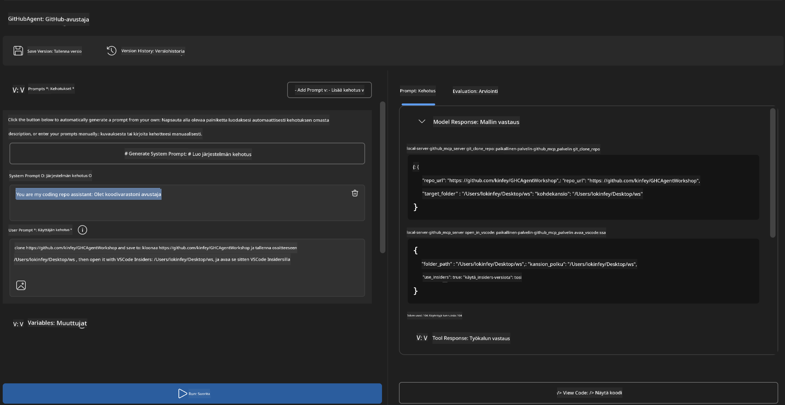
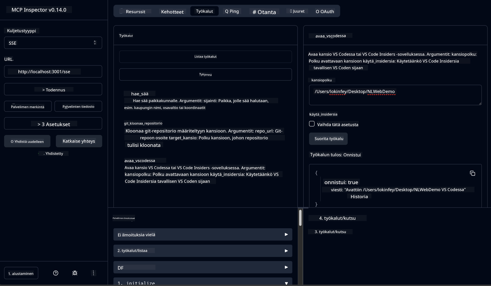

<!--
CO_OP_TRANSLATOR_METADATA:
{
  "original_hash": "f83bc722dc758efffd68667d6a1db470",
  "translation_date": "2025-06-10T06:52:04+00:00",
  "source_file": "10-StreamliningAIWorkflowsBuildingAnMCPServerWithAIToolkit/lab4/README.md",
  "language_code": "fi"
}
-->
# 🐙 Moduuli 4: Käytännön MCP-kehitys – Räätälöity GitHub-kloonauspalvelin


> **⚡ Pikakäynnistys:** Rakenna tuotantovalmiiksi MCP-palvelin, joka automatisoi GitHub-repositorion kloonauksen ja VS Coden integroinnin vain 30 minuutissa!

## 🎯 Oppimistavoitteet

Tämän labran jälkeen osaat:

- ✅ Luoda räätälöidyn MCP-palvelimen todellisiin kehitystyönkulkuun
- ✅ Toteuttaa GitHub-repositorion kloonausominaisuuden MCP:n kautta
- ✅ Integroida räätälöidyt MCP-palvelimet VS Coden ja Agent Builderin kanssa
- ✅ Käyttää GitHub Copilot Agent Modea räätälöityjen MCP-työkalujen kanssa
- ✅ Testata ja ottaa käyttöön räätälöityjä MCP-palvelimia tuotantoympäristöissä

## 📋 Esivaatimukset

- Labrojen 1–3 suorittaminen (MCP:n perusteet ja edistynyt kehitys)
- GitHub Copilot -tilaus ([ilmainen rekisteröityminen saatavilla](https://github.com/github-copilot/signup))
- VS Code, jossa AI Toolkit- ja GitHub Copilot -laajennukset
- Git CLI asennettuna ja konfiguroituna

## 🏗️ Projektin yleiskuvaus

### **Todellisen elämän kehityshaaste**
Kehittäjinä käytämme usein GitHubia kloonaamaan repositorioita ja avaamaan ne VS Codessa tai VS Code Insidersissa. Tämä manuaalinen prosessi sisältää:
1. Pääte- tai komentorivin avaamisen
2. Siirtymisen haluttuun hakemistoon
3. `git clone`-komennon suorittamisen
4. VS Coden avaamisen kloonatussa hakemistossa

**Ratkaisumme MCP:llä tiivistää tämän yhdeksi älykkääksi komennoksi!**

### **Mitä rakennat**
**GitHub Clone MCP Serverin** (`git_mcp_server`), joka tarjoaa:

| Ominaisuus | Kuvaus | Hyöty |
|------------|--------|-------|
| 🔄 **Älykäs repositorion kloonaus** | Kloonaa GitHub-repositoriot validoinnilla | Automaattinen virheiden tarkistus |
| 📁 **Älykäs hakemiston hallinta** | Tarkistaa ja luo hakemistot turvallisesti | Estää ylikirjoittamisen |
| 🚀 **Monialustainen VS Code -integraatio** | Avaa projektit VS Codessa/Insidersissa | Saumaton työnkulun siirtymä |
| 🛡️ **Vankka virheenkäsittely** | Käsittelee verkko-, käyttöoikeus- ja polkuongelmat | Tuotantovalmis luotettavuus |

---

## 📖 Vaiheittainen toteutus

### Vaihe 1: Luo GitHub-agentti Agent Builderissa

1. **Käynnistä Agent Builder** AI Toolkit -laajennuksen kautta
2. **Luo uusi agentti** seuraavilla asetuksilla:
   ```
   Agent Name: GitHubAgent
   ```

3. **Alusta räätälöity MCP-palvelin:**
   - Siirry kohtaan **Työkalut** → **Lisää työkalu** → **MCP Server**
   - Valitse **"Luo uusi MCP-palvelin"**
   - Valitse **Python-malli** joustavuuden maksimoimiseksi
   - **Palvelimen nimi:** `git_mcp_server`

### Vaihe 2: Määritä GitHub Copilot Agent Mode

1. **Avaa GitHub Copilot** VS Codessa (Ctrl/Cmd + Shift + P → "GitHub Copilot: Open")
2. **Valitse Agent-malli** Copilotin käyttöliittymässä
3. **Valitse Claude 3.7 -malli** parannetulla päättelykyvyllä
4. **Ota MCP-integraatio käyttöön** työkalujen käyttöä varten

> **💡 Vinkki:** Claude 3.7 tarjoaa erinomaisen ymmärryksen kehitystyönkulkujen ja virheenkäsittelymallien hallintaan.

### Vaihe 3: Toteuta MCP-palvelimen ydintoiminnallisuus

**Käytä seuraavaa yksityiskohtaista kehotetta GitHub Copilot Agent Modessa:**

```
Create two MCP tools with the following comprehensive requirements:

🔧 TOOL A: clone_repository
Requirements:
- Clone any GitHub repository to a specified local folder
- Return the absolute path of the successfully cloned project
- Implement comprehensive validation:
  ✓ Check if target directory already exists (return error if exists)
  ✓ Validate GitHub URL format (https://github.com/user/repo)
  ✓ Verify git command availability (prompt installation if missing)
  ✓ Handle network connectivity issues
  ✓ Provide clear error messages for all failure scenarios

🚀 TOOL B: open_in_vscode
Requirements:
- Open specified folder in VS Code or VS Code Insiders
- Cross-platform compatibility (Windows/Linux/macOS)
- Use direct application launch (not terminal commands)
- Auto-detect available VS Code installations
- Handle cases where VS Code is not installed
- Provide user-friendly error messages

Additional Requirements:
- Follow MCP 1.9.3 best practices
- Include proper type hints and documentation
- Implement logging for debugging purposes
- Add input validation for all parameters
- Include comprehensive error handling
```

### Vaihe 4: Testaa MCP-palvelimesi

#### 4a. Testaus Agent Builderissa

1. **Käynnistä debug-konfiguraatio** Agent Builderissa
2. **Määritä agenttisi tällä järjestelmäkehotteella:**

```
SYSTEM_PROMPT:
You are my intelligent coding repository assistant. You help developers efficiently clone GitHub repositories and set up their development environment. Always provide clear feedback about operations and handle errors gracefully.
```

3. **Testaa realistisilla käyttäjäskenaarioilla:**

```
USER_PROMPT EXAMPLES:

Scenario : Basic Clone and Open
"Clone {Your GitHub Repo link such as https://github.com/kinfey/GHCAgentWorkshop
 } and save to {The global path you specify}, then open it with VS Code Insiders"
```



**Odotetut tulokset:**
- ✅ Kloonaus onnistuu ja polku vahvistetaan
- ✅ VS Code käynnistyy automaattisesti
- ✅ Selkeät virheilmoitukset virhetilanteissa
- ✅ Reunatapauksien asianmukainen käsittely

#### 4b. Testaus MCP Inspectorissa



---

**🎉 Onnittelut!** Olet luonut käytännöllisen, tuotantovalmiin MCP-palvelimen, joka ratkaisee todellisia kehitystyönkulkujen haasteita. Räätälöity GitHub-kloonauspalvelimesi osoittaa MCP:n voiman automatisoida ja tehostaa kehittäjien tuottavuutta.

### 🏆 Saavutukset:
- ✅ **MCP-kehittäjä** – Luonut räätälöidyn MCP-palvelimen
- ✅ **Työnkulkujen automatisoija** – Tehostanut kehitysprosesseja  
- ✅ **Integraatioasiantuntija** – Yhdistänyt useita kehitystyökaluja
- ✅ **Tuotantovalmis** – Rakentanut käyttöön otettavia ratkaisuja

---

## 🎓 Työpajan suoritus: Matkasi Model Context Protocolin parissa

**Arvoisa työpajan osallistuja,**

Onnittelut, että olet suorittanut kaikki neljä moduulia Model Context Protocol -työpajassa! Olet edennyt perustason AI Toolkit -konsepteista aina tuotantovalmiiden MCP-palvelimien rakentamiseen, jotka ratkaisevat todellisia kehityshaasteita.

### 🚀 Oppimispolkusi yhteenveto:

**[Moduuli 1](../lab1/README.md)**: Aloitit tutustumalla AI Toolkitin perusteisiin, mallien testaamiseen ja ensimmäisen AI-agentin luomiseen.

**[Moduuli 2](../lab2/README.md)**: Opit MCP-arkkitehtuurista, integrointia Playwright MCP:n kanssa ja rakensit ensimmäisen selainautomaatiota hyödyntävän agentin.

**[Moduuli 3](../lab3/README.md)**: Edistyit räätälöityjen MCP-palvelinten kehitykseen Weather MCP -palvelimen avulla ja hallitsit debuggaustyökalut.

**[Moduuli 4](../lab4/README.md)**: Käytit kaikkea oppimaasi rakentaaksesi käytännöllisen GitHub-repositorion työnkulun automatisointityökalun.

### 🌟 Mitä hallitset nyt:

- ✅ **AI Toolkit -ekosysteemi**: Mallit, agentit ja integraatiomallit
- ✅ **MCP-arkkitehtuuri**: Asiakas-palvelin -rakenne, siirtoprotokollat ja turvallisuus
- ✅ **Kehitystyökalut**: Playgroundista Inspectorin kautta tuotantoon vientiin
- ✅ **Räätälöity kehitys**: Oman MCP-palvelimen rakentaminen, testaaminen ja käyttöönotto
- ✅ **Käytännön sovellukset**: Todellisten työnkulkuhaasteiden ratkaisu tekoälyn avulla

### 🔮 Seuraavat askeleesi:

1. **Rakenna oma MCP-palvelimesi**: Hyödynnä näitä taitoja automatisoidaksesi omat työnkulut
2. **Liity MCP-yhteisöön**: Jaa luomuksiasi ja opi muilta
3. **Tutki edistyneitä integraatioita**: Yhdistä MCP-palvelimet yritysjärjestelmiin
4. **Osallistu avoimen lähdekoodin kehitykseen**: Auta parantamaan MCP-työkaluja ja dokumentaatiota

Muista, että tämä työpaja on vasta alkua. Model Context Protocol -ekosysteemi kehittyy nopeasti, ja sinulla on nyt valmiudet olla AI-tehostettujen kehitystyökalujen kärjessä.

**Kiitos osallistumisestasi ja oppimiseen sitoutumisestasi!**

Toivomme, että tämä työpaja on herättänyt ideoita, jotka muuttavat tapaa, jolla rakennat ja käytät tekoälytyökaluja kehitysprojektissasi.

**Onnea koodaukseen!**

---

**Vastuuvapauslauseke**:  
Tämä asiakirja on käännetty käyttämällä tekoälypohjaista käännöspalvelua [Co-op Translator](https://github.com/Azure/co-op-translator). Pyrimme tarkkuuteen, mutta huomioithan, että automaattiset käännökset saattavat sisältää virheitä tai epätarkkuuksia. Alkuperäistä asiakirjaa sen alkuperäiskielellä tulee pitää auktoritatiivisena lähteenä. Tärkeissä asioissa suositellaan ammattimaista ihmiskäännöstä. Emme ole vastuussa tämän käännöksen käytöstä johtuvista väärinymmärryksistä tai tulkinnoista.