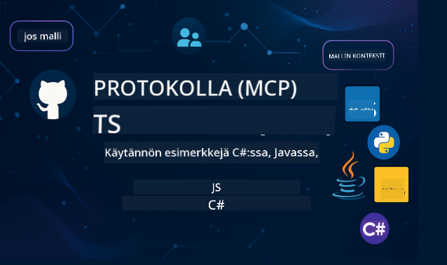

<!--
CO_OP_TRANSLATOR_METADATA:
{
  "original_hash": "2a21391378c12ecfef50f866329dfde0",
  "translation_date": "2025-05-17T05:28:25+00:00",
  "source_file": "README.md",
  "language_code": "fi"
}
-->

Seuraa näitä ohjeita aloittaaksesi näiden resurssien käytön:
1. **Haaroita tietovarasto**: Klikkaa 
2. **Kloonaa tietovarasto**: `git clone https://github.com/microsoft/mcp-for-beginners.git`
3. [**Liity Microsoft Azure AI Foundry Discordiin ja tapaa asiantuntijoita sekä muita kehittäjiä**](https://discord.com/invite/ByRwuEEgH4)

### 🌐 Monikielinen tuki

#### Tuettu GitHub Actionin kautta (Automatisoitu ja aina ajan tasalla)
[Ranska](../fr/README.md) | [Espanja](../es/README.md) | [Saksa](../de/README.md) | [Venäjä](../ru/README.md) | [Arabia](../ar/README.md) | [Persia (Farsi)](../fa/README.md) | [Urdu](../ur/README.md) | [Kiina (yksinkertaistettu)](../zh/README.md) | [Kiina (perinteinen, Macao)](../mo/README.md) | [Kiina (perinteinen, Hongkong)](../hk/README.md) | [Kiina (perinteinen, Taiwan)](../tw/README.md) | [Japani](../ja/README.md) | [Korea](../ko/README.md) | [Hindi](../hi/README.md) | [Bengali](../bn/README.md) | [Marathi](../mr/README.md) | [Nepali](../ne/README.md) | [Punjabi (Gurmukhi)](../pa/README.md) | [Portugali (Portugali)](../pt/README.md) | [Portugali (Brasilia)](../br/README.md) | [Italia](../it/README.md) | [Puola](../pl/README.md) | [Turkki](../tr/README.md) | [Kreikka](../el/README.md) | [Thai](../th/README.md) | [Ruotsi](../sv/README.md) | [Tanska](../da/README.md) | [Norja](../no/README.md) | [Suomi](./README.md) | [Hollanti](../nl/README.md) | [Heprea](../he/README.md) | [Vietnam](../vi/README.md) | [Indonesia](../id/README.md) | [Malaiji](../ms/README.md) | [Tagalog (Filipino)](../tl/README.md) | [Swahili](../sw/README.md) | [Unkari](../hu/README.md) | [Tšekki](../cs/README.md) | [Slovakki](../sk/README.md) | [Romania](../ro/README.md) | [Bulgaria](../bg/README.md) | [Serbia (kyrillinen)](../sr/README.md) | [Kroatia](../hr/README.md) | [Slovenia](../sl/README.md)
# 🚀 Ultimate Guide to the Model Context Protocol (MCP) -kurssin aloitteleville

## **Opi MCP käytännön koodiesimerkkien avulla C#:lla, Javalla, JavaScriptillä, Pythonilla ja TypeScriptillä**

## 🧠 Yleiskatsaus Model Context Protocol -kurssiin

**Model Context Protocol (MCP)** on huipputason kehys, joka on suunniteltu standardoimaan vuorovaikutukset tekoälymallien ja asiakassovellusten välillä. Tämä avoimen lähdekoodin kurssi tarjoaa jäsennellyn oppimispolun, joka sisältää käytännön koodiesimerkkejä ja tosielämän käyttötapauksia suosituilla ohjelmointikielillä, kuten C#, Java, JavaScript, TypeScript ja Python.

Olitpa tekoälykehittäjä, järjestelmäarkkitehti tai ohjelmistosuunnittelija, tämä opas on kattava resurssi MCP:n perusteiden ja toteutusstrategioiden hallitsemiseen.

## 🔗 Viralliset MCP-resurssit

- 📘 [MCP Documentation](https://modelcontextprotocol.io/) – Yksityiskohtaiset tutoriaalit ja käyttöoppaat  
- 📜 [MCP Specification](https://spec.modelcontextprotocol.io/) – Protokollan arkkitehtuuri ja tekniset viitteet  
- 🧑‍💻 [MCP GitHub Repository](https://github.com/modelcontextprotocol) – Avoimen lähdekoodin SDK:t, työkalut ja koodinäytteet  

## 🧭 Koko MCP-kurssin rakenne

### 📌 [Johdanto MCP:hen](./00-Introduction/README.md)

- Mikä on Model Context Protocol?
- Miksi standardointi on tärkeää tekoälyputkissa
- Käytännön käyttötapaukset ja MCP:n hyödyt

### 🧩 [Keskeisten käsitteiden selitys](./01-CoreConcepts/README.md)

- Asiakas-palvelin-arkkitehtuurin ymmärtäminen MCP:ssä
- Protokollan keskeiset osat: pyynnöt, vastaukset ja skeemat
- MCP-viestintä ja tiedonvaihtomallit

### 🔐 [Turvallisuus MCP:ssä](./02-Security/readme.md)

- Turvauhkausten tunnistaminen MCP-pohjaisissa järjestelmissä
- Tekniikat ja parhaat käytännöt toteutusten turvaamiseen

### 🚀 [MCP:n käytön aloittaminen](./03-GettingStarted/README.md)

- Ympäristön asennus ja konfigurointi
- Perus MCP-palvelimien ja -asiakkaiden luominen
- MCP:n integrointi olemassa oleviin sovelluksiin

#### 🧮 MCP-laskin esimerkkiprojektit:

  
<strong>Tutustu kooditoteutuksiin kielen mukaan</strong>

  - [C# MCP-palvelimen esimerkki](./03-GettingStarted/samples/csharp/README.md)
  - [Java MCP-laskin](./03-GettingStarted/samples/java/calculator/README.md)
  - [JavaScript MCP-demo](./03-GettingStarted/samples/javascript/README.md)
  - [Python MCP-palvelin](../../03-GettingStarted/samples/python/mcp_calculator_server.py)
  - [TypeScript MCP-esimerkki](./03-GettingStarted/samples/typescript/README.md)

### 🛠️ [Käytännön toteutus](./04-PracticalImplementation/README.md)

- SDK:iden käyttö eri kielillä
- Virheenkorjaus, testaus ja validointi
- Uudelleenkäytettävien kehotemallien ja työnkulkujen luominen

#### 💡 MCP:n edistyneet laskinprojektit:

  
<strong>Tutustu edistyneisiin esimerkkeihin</strong>

  - [Edistynyt C#-esimerkki](./04-PracticalImplementation/samples/csharp/README.md)
  - [Java-säiliösovelluksen esimerkki](./04-PracticalImplementation/samples/java/containerapp/README.md)
  - [JavaScript-edistynyt esimerkki](./04-PracticalImplementation/samples/javascript/README.md)
  - [Python-monimutkainen toteutus](../../04-PracticalImplementation/samples/python/mcp_sample.py)
  - [TypeScript-säiliöesimerkki](./04-PracticalImplementation/samples/typescript/README.md)

### 🎓 [Edistyneet aiheet MCP:ssä](./05-AdvancedTopics/README.md)

- Monimodaaliset tekoälytyönkulut ja laajennettavuus
- Turvalliset skaalausstrategiat
- MCP yritysekosysteemeissä

### 🌍 [Yhteisön panokset](./06-CommunityContributions/README.md)

- Kuinka osallistua koodiin ja dokumentteihin
- Yhteistyö GitHubin kautta
- Yhteisön kehittämät parannukset ja palaute

### 📈 [Varhaisen omaksumisen oivallukset](./07-CaseStudies/README.md)

- Tosielämän toteutukset ja mikä toimi
- MCP-pohjaisten ratkaisujen rakentaminen ja käyttöönotto
- Suuntaukset ja tulevaisuuden tiekartta

### 📏 [Parhaat käytännöt MCP:lle](./08-BestPractices/README.md)

- Suorituskyvyn hienosäätö ja optimointi
- Vikasietoisien MCP-järjestelmien suunnittelu
- Testaus- ja palautumisstrategiat

### 📊 [MCP-tapaustutkimukset](./09-CaseStudy/Readme.md)

- Syväluotaavat analyysit MCP-ratkaisujen arkkitehtuureista
- Käyttöönoton suunnitelmat ja integrointivinkit
- Annetut kaaviot ja projektin läpikäynnit

## 🎯 Esitiedot MCP:n oppimiseen

Saadaksesi parhaan hyödyn tästä kurssista, sinulla tulisi olla:

- Perustiedot C#:sta, Javasta tai Pythonista
- Asiakas-palvelin-mallin ja API:iden ymmärrys
- (Valinnainen) Koneoppimisen käsitteiden tuntemus

## 🛠️ Kuinka käyttää tätä kurssia tehokkaasti

Jokainen oppitunti tässä oppaassa sisältää:

1. Selkeät selitykset MCP-käsitteistä  
2. Elävät koodiesimerkit useilla kielillä  
3. Harjoitukset todellisten MCP-sovellusten rakentamiseen  
4. Lisäresurssit edistyneille oppijoille  

## 📜 Lisenssitiedot

Tämä sisältö on lisensoitu **MIT-lisenssillä**. Ehtoja ja edellytyksiä varten katso [LICENSE](../../LICENSE).

## 🤝 Osallistumisohjeet

Tämä projekti toivottaa tervetulleeksi osallistumiset ja ehdotukset. Useimmat osallistumiset edellyttävät, että hyväksyt
Contributor License Agreement (CLA) -sopimuksen, jossa ilmoitat, että sinulla on oikeus ja todellakin myönnät meille oikeudet käyttää panostasi. Lisätietoja on osoitteessa <https://cla.opensource.microsoft.com>.

Kun lähetät pull-pyynnön, CLA-botti määrittää automaattisesti, tarvitsetko CLA:n, ja merkitsee PR:n asianmukaisesti (esim. tilatarkistus, kommentti). Seuraa yksinkertaisesti botin antamia ohjeita. Sinun tarvitsee tehdä tämä vain kerran kaikissa CLA:ta käyttävissä repoissa.

Tämä projekti on omaksunut [Microsoft Open Source Code of Conduct](https://opensource.microsoft.com/codeofconduct/).
Lisätietoja on [Code of Conduct FAQ](https://opensource.microsoft.com/codeofconduct/faq/) tai ota yhteyttä [opencode@microsoft.com](mailto:opencode@microsoft.com) lisäkysymyksiä tai kommentteja varten.

## ™️ Tavaramerkkihuomautus

Tämä projekti saattaa sisältää tavaramerkkejä tai logoja projekteille, tuotteille tai palveluille. Microsoftin tavaramerkkien tai logojen valtuutettu käyttö on Microsoftin tavaramerkki- ja brändiohjeiden mukaista ja niitä on noudatettava.
Microsoftin tavaramerkkien tai logojen käyttö muokatuissa versioissa tästä projektista ei saa aiheuttaa sekaannusta tai vihjata Microsoftin sponsorointia.
Kolmannen osapuolen tavaramerkkien tai logojen käyttö on kyseisten kolmansien osapuolten käytäntöjen alaista.

**Vastuuvapauslauseke**:  
Tämä asiakirja on käännetty käyttämällä tekoälypohjaista käännöspalvelua [Co-op Translator](https://github.com/Azure/co-op-translator). Pyrimme tarkkuuteen, mutta huomioithan, että automaattiset käännökset voivat sisältää virheitä tai epätarkkuuksia. Alkuperäistä asiakirjaa sen alkuperäisellä kielellä tulisi pitää ensisijaisena lähteenä. Kriittisen tiedon osalta suositellaan ammattimaista ihmiskääntämistä. Emme ole vastuussa tämän käännöksen käytöstä johtuvista väärinkäsityksistä tai virhetulkinnoista.