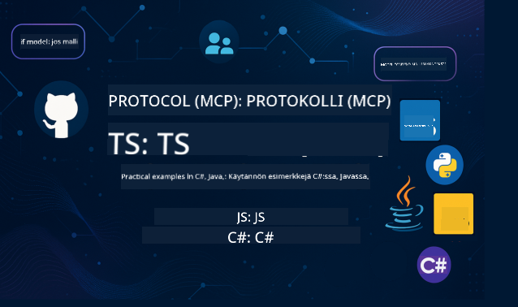

<!--
CO_OP_TRANSLATOR_METADATA:
{
  "original_hash": "866c8877136cb03e1efb9ad633a2f0a6",
  "translation_date": "2025-08-26T17:54:39+00:00",
  "source_file": "README.md",
  "language_code": "fi"
}
-->
 

Seuraa näitä vaiheita aloittaaksesi näiden resurssien käytön:
1. **Haarauta repositorio**: Klikkaa 
2. **Kloonaa repositorio**:   `git clone https://github.com/microsoft/mcp-for-beginners.git`
3. [**Liity Azure AI Foundry Discordiin ja tapaa asiantuntijoita sekä muita kehittäjiä**](https://discord.com/invite/ByRwuEEgH4)

### 🌐 Monikielinen tuki

#### Tuettu GitHub Actionin kautta (automaattinen ja aina ajan tasalla)

 [Arabic](../ar/README.md) | [Bengali](../bn/README.md) | [Bulgarian](../bg/README.md) | [Burmese (Myanmar)](../my/README.md) | [Chinese (Simplified)](../zh/README.md) | [Chinese (Traditional, Hong Kong)](../hk/README.md) | [Chinese (Traditional, Macau)](../mo/README.md) | [Chinese (Traditional, Taiwan)](../tw/README.md) | [Croatian](../hr/README.md) | [Czech](../cs/README.md) | [Danish](../da/README.md) | [Dutch](../nl/README.md) | [Finnish](./README.md) | [French](../fr/README.md) | [German](../de/README.md) | [Greek](../el/README.md) | [Hebrew](../he/README.md) | [Hindi](../hi/README.md) | [Hungarian](../hu/README.md) | [Indonesian](../id/README.md) | [Italian](../it/README.md) | [Japanese](../ja/README.md) | [Korean](../ko/README.md) | [Malay](../ms/README.md) | [Marathi](../mr/README.md) | [Nepali](../ne/README.md) | [Norwegian](../no/README.md) | [Persian (Farsi)](../fa/README.md) | [Polish](../pl/README.md) | [Portuguese (Brazil)](../br/README.md) | [Portuguese (Portugal)](../pt/README.md) | [Punjabi (Gurmukhi)](../pa/README.md) | [Romanian](../ro/README.md) | [Russian](../ru/README.md) | [Serbian (Cyrillic)](../sr/README.md) | [Slovak](../sk/README.md) | [Slovenian](../sl/README.md) | [Spanish](../es/README.md) | [Swahili](../sw/README.md) | [Swedish](../sv/README.md) | [Tagalog (Filipino)](../tl/README.md) | [Thai](../th/README.md) | [Turkish](../tr/README.md) | [Ukrainian](../uk/README.md) | [Urdu](../ur/README.md) | [Vietnamese](../vi/README.md)

# 🚀 Model Context Protocol (MCP) -opetusohjelma aloittelijoille

## **Opi MCP käytännön koodiesimerkeillä C#:ssa, Javassa, JavaScriptissä, Rustissa, Pythonissa ja TypeScriptissä**

## 🧠 Model Context Protocol -opetusohjelman yleiskatsaus

**Model Context Protocol (MCP)** on huippuluokan kehys, joka on suunniteltu standardoimaan vuorovaikutukset tekoälymallien ja asiakassovellusten välillä. Tämä avoimen lähdekoodin opetusohjelma tarjoaa jäsennellyn oppimispolun, joka sisältää käytännön koodiesimerkkejä ja todellisia käyttötapauksia suosituilla ohjelmointikielillä, kuten C#, Java, JavaScript, TypeScript ja Python.

Olitpa tekoälykehittäjä, järjestelmäarkkitehti tai ohjelmistosuunnittelija, tämä opas on kattava resurssi MCP:n perusteiden ja toteutusstrategioiden hallintaan.

## 🔗 Viralliset MCP-resurssit

- 📘 [MCP-dokumentaatio](https://modelcontextprotocol.io/) – Yksityiskohtaiset opetusohjelmat ja käyttäjäoppaat  
- 📜 [MCP-määritys](https://modelcontextprotocol.io/docs/) – Protokollan arkkitehtuuri ja tekniset viitteet  
- 📜 [Alkuperäinen MCP-määritys](https://spec.modelcontextprotocol.io/) – Vanhemmat tekniset viitteet (saattaa sisältää lisätietoja)  
- 🧑‍💻 [MCP GitHub-repositorio](https://github.com/modelcontextprotocol) – Avoimen lähdekoodin SDK:t, työkalut ja koodiesimerkit
- 🌐 [MCP-yhteisö](https://github.com/orgs/modelcontextprotocol/discussions) – Liity keskusteluihin ja osallistu yhteisöön

## 🧭 MCP-opetusohjelman yleiskatsaus

### 📚 Koko opetusohjelman rakenne

| Moduuli | Aihe | Kuvaus | Linkki |
|--------|-------|-------------|------|
| **Moduuli 1-3: Perusteet** | | | |
| 00 | Johdatus MCP:hen | Yleiskatsaus Model Context Protocoliin ja sen merkitykseen tekoälyputkistoissa | [Lue lisää](./00-Introduction/README.md) |
| 01 | Keskeiset käsitteet | Syvällinen tutkimus MCP:n keskeisistä käsitteistä | [Lue lisää](./01-CoreConcepts/README.md) |
| 02 | Turvallisuus MCP:ssä | Turvauhat ja parhaat käytännöt | [Lue lisää](./02-Security/README.md) |
| 03 | MCP:n käyttöönotto | Ympäristön asennus, peruspalvelimet/asiakkaat, integrointi | [Lue lisää](./03-GettingStarted/README.md) |
| **Moduuli 3: Ensimmäisen palvelimen ja asiakkaan rakentaminen** | | | |
| 3.1 | Ensimmäinen palvelin | Luo ensimmäinen MCP-palvelimesi | [Opas](./03-GettingStarted/01-first-server/README.md) |
| 3.2 | Ensimmäinen asiakas | Kehitä perus MCP-asiakas | [Opas](./03-GettingStarted/02-client/README.md) |
| 3.3 | Asiakas LLM:llä | Integroi suuret kielimallit | [Opas](./03-GettingStarted/03-llm-client/README.md) |
| 3.4 | VS Code -integraatio | Käytä MCP-palvelimia VS Codessa | [Opas](./03-GettingStarted/04-vscode/README.md) |
| 3.5 | stdio-palvelin | Luo palvelimia stdio-kuljetuksella | [Opas](./03-GettingStarted/05-stdio-server/README.md) |
| 3.6 | HTTP-suoratoisto | Toteuta HTTP-suoratoisto MCP:ssä | [Opas](./03-GettingStarted/06-http-streaming/README.md) |
| 3.7 | AI Toolkit | Käytä AI Toolkitia MCP:n kanssa | [Opas](./03-GettingStarted/07-aitk/README.md) |
| 3.8 | Testaus | Testaa MCP-palvelimen toteutusta | [Opas](./03-GettingStarted/08-testing/README.md) |
| 3.9 | Käyttöönotto | Ota MCP-palvelimet käyttöön tuotannossa | [Opas](./03-GettingStarted/09-deployment/README.md) |
| **Moduuli 4-5: Käytännön ja edistyneet aiheet** | | | |
| 04 | Käytännön toteutus | SDK:t, virheenkorjaus, testaus, uudelleenkäytettävät kehotepohjat | [Lue lisää](./04-PracticalImplementation/README.md) |
| 05 | Edistyneet aiheet MCP:ssä | Monimodaalinen tekoäly, skaalaus, yrityskäyttö | [Lue lisää](./05-AdvancedTopics/README.md) |
| 5.1 | Azure-integraatio | MCP-integraatio Azureen | [Opas](./05-AdvancedTopics/mcp-integration/README.md) |
| 5.2 | Monimodaalisuus | Työskentely useiden modaliteettien kanssa | [Opas](./05-AdvancedTopics/mcp-multi-modality/README.md) |
| 5.3 | OAuth2-demo | Toteuta OAuth2-autentikointi | [Opas](./05-AdvancedTopics/mcp-oauth2-demo/README.md) |
| 5.4 | Juurikontekstit | Ymmärrä ja toteuta juurikontekstit | [Opas](./05-AdvancedTopics/mcp-root-contexts/README.md) |
| 5.5 | Reititys | MCP-reititysstrategiat | [Opas](./05-AdvancedTopics/mcp-routing/README.md) |
| 5.6 | Näytteenotto | Näytteenottotekniikat MCP:ssä | [Opas](./05-AdvancedTopics/mcp-sampling/README.md) |
| 5.7 | Skaalaus | Skaalaa MCP-toteutuksia | [Opas](./05-AdvancedTopics/mcp-scaling/README.md) |
| 5.8 | Turvallisuus | Edistyneet turvallisuusharkinnat | [Opas](./05-AdvancedTopics/mcp-security/README.md) |
| 5.9 | Verkkohaku | Toteuta verkkohakutoimintoja | [Opas](./05-AdvancedTopics/web-search-mcp/README.md) |
| 5.10 | Reaaliaikainen suoratoisto | Rakenna reaaliaikainen suoratoistotoiminto | [Opas](./05-AdvancedTopics/mcp-realtimestreaming/README.md) |
| 5.11 | Reaaliaikainen haku | Toteuta reaaliaikainen haku | [Opas](./05-AdvancedTopics/mcp-realtimesearch/README.md) |
| 5.12 | Entra ID -autentikointi | Autentikointi Microsoft Entra ID:llä | [Opas](./05-AdvancedTopics/mcp-security-entra/README.md) |
| 5.13 | Foundry-integraatio | Integrointi Azure AI Foundryyn | [Opas](./05-AdvancedTopics/mcp-foundry-agent-integration/README.md) |
| 5.14 | Kontekstisuunnittelu | Tekniikat tehokkaaseen kontekstisuunnitteluun | [Opas](./05-AdvancedTopics/mcp-contextengineering/README.md) |
| **Moduuli 6-10: Yhteisö ja parhaat käytännöt** | | | |
| 06 | Yhteisön panokset | Kuinka osallistua MCP-ekosysteemiin | [Opas](./06-CommunityContributions/README.md) |
| 07 | Oivalluksia varhaisesta käyttöönotosta | Todelliset toteutustarinat | [Opas](./07-LessonsFromEarlyAdoption/README.md) |
| 08 | MCP:n parhaat käytännöt | Suorituskyky, vikasietoisuus, kestävyys | [Opas](./08-BestPractices/README.md) |
| 09 | MCP-tapaustutkimukset | Käytännön toteutusesimerkit | [Opas](./09-CaseStudy/README.md) |
| 10 | Käytännön työpaja | MCP-palvelimen rakentaminen AI Toolkitilla | [Lab](./10-StreamliningAIWorkflowsBuildingAnMCPServerWithAIToolkit/README.md) |

### 💻 Esimerkkiprojektit

#### Perus MCP-laskin

| Kieli | Kuvaus | Linkki |
|----------|-------------|------|
| C# | MCP-palvelimen esimerkki | [Katso koodi](./03-GettingStarted/samples/csharp/README.md) |
| Java | MCP-laskin | [Katso koodi](./03-GettingStarted/samples/java/calculator/README.md) |
| JavaScript | MCP-demo | [Katso koodi](./03-GettingStarted/samples/javascript/README.md) |
| Python | MCP-palvelin | [Katso koodi](../../03-GettingStarted/samples/python/mcp_calculator_server.py) |
| TypeScript | MCP-esimerkki | [Katso koodi](./03-GettingStarted/samples/typescript/README.md) |
| Rust | MCP-esimerkki | [Katso koodi](./03-GettingStarted/samples/rust/README.md) |

#### Edistyneet MCP-toteutukset

| Kieli | Kuvaus | Linkki |
|----------|-------------|------|
| C# | Edistynyt esimerkki | [View Code](./04-PracticalImplementation/samples/csharp/README.md) |
| Java with Spring | Sovelluskonttiesimerkki | [View Code](./04-PracticalImplementation/samples/java/containerapp/README.md) |
| JavaScript | Edistynyt esimerkki | [View Code](./04-PracticalImplementation/samples/javascript/README.md) |
| Python | Monimutkainen toteutus | [View Code](../../04-PracticalImplementation/samples/python/READMEmd) |
| TypeScript | Konttiesimerkki | [View Code](./04-PracticalImplementation/samples/typescript/README.md) |

## 🎯 MCP:n oppimisen edellytykset

Jotta saat parhaan hyödyn tästä oppimateriaalista, sinulla tulisi olla:

- Perustiedot ohjelmoinnista vähintään yhdessä seuraavista kielistä: C#, Java, JavaScript, Python tai TypeScript
- Ymmärrys asiakas-palvelin-mallista ja API:ista
- REST- ja HTTP-konseptien tuntemus
- (Valinnainen) Taustatietoa AI/ML-konsepteista

- Osallistuminen yhteisökeskusteluihin tuen saamiseksi

## 📚 Opas ja resurssit

Tämä arkisto sisältää useita resursseja, jotka auttavat sinua navigoimaan ja oppimaan tehokkaasti:

### Opas

Kattava [Opas](./study_guide.md) on saatavilla, jotta voit navigoida tässä arkistossa tehokkaasti. Oppaassa on:

- Visuaalinen opintokartta, joka näyttää kaikki käsitellyt aiheet
- Yksityiskohtainen jaottelu arkiston osioista
- Ohjeet näyteprojektien käyttöön
- Suositellut oppimispolut eri taitotasoille
- Lisäresursseja oppimisen täydentämiseksi

### Muutosloki

Pidämme yksityiskohtaista [Muutoslokia](./changelog.md), joka seuraa kaikkia merkittäviä päivityksiä oppimateriaalissa, mukaan lukien:

- Uudet sisältölisäykset
- Rakenteelliset muutokset
- Ominaisuuksien parannukset
- Dokumentaation päivitykset

## 🛠️ Kuinka käyttää tätä oppimateriaalia tehokkaasti

Jokainen oppitunti sisältää:

1. Selkeät selitykset MCP-konsepteista  
2. Live-koodiesimerkkejä useilla kielillä  
3. Harjoituksia MCP-sovellusten rakentamiseen  
4. Lisäresursseja edistyneille oppijoille

## Tapahtumat 

### [MCP Dev Days heinäkuu 2025](https://developer.microsoft.com/en-us/reactor/series/S-1563/)
#### [➡️Katso tallenteena - MCP Dev Days](https://developer.microsoft.com/en-us/reactor/series/S-1563/)
Valmistaudu kahden päivän syvälliseen tekniseen oppimiseen, yhteisön verkostoitumiseen ja käytännön oppimiseen MCP Dev Days -tapahtumassa, joka on virtuaalinen tapahtuma keskittyen Model Context Protocoliin (MCP) — nousevaan standardiin, joka yhdistää AI-mallit ja niiden käyttämät työkalut.
Voit katsoa MCP Dev Days -tapahtuman rekisteröitymällä tapahtumasivullamme: https://aka.ms/mcpdevdays. 

#### [Päivä 1: MCP tuottavuus, kehitystyökalut ja yhteisö:](https://developer.microsoft.com/en-us/reactor/series/S-1563/)

Keskittyy kehittäjien voimaannuttamiseen MCP:n käytössä heidän kehitystyönkulussaan ja MCP-yhteisön juhlistamiseen. Mukana ovat yhteisön jäsenet ja kumppanit, kuten Arcade, Block, Okta ja Neon, jotka näyttävät, kuinka he tekevät yhteistyötä Microsoftin kanssa avoimen ja laajennettavan MCP-ekosysteemin luomiseksi.  
Reaaliaikaisia demoja VS Code, Visual Studio, GitHub Copilot ja suosittujen yhteisötyökalujen parissa  
Käytännönläheisiä, kontekstiin perustuvia kehitystyönkulkuja  
Yhteisön vetämiä sessioita ja näkemyksiä  
Olitpa vasta aloittamassa MCP:n kanssa tai jo rakentamassa sen avulla, päivä 1 tarjoaa inspiraatiota ja konkreettisia vinkkejä.

#### [Päivä 2: Rakenna MCP-palvelimia luottavaisin mielin](https://developer.microsoft.com/en-us/reactor/series/S-1563/)

On tarkoitettu MCP-rakentajille. Sukellamme syvälle toteutusstrategioihin ja parhaisiin käytäntöihin MCP-palvelimien luomisessa ja MCP:n integroinnissa AI-työnkulkuihin.

#### Aiheet sisältävät:

- MCP-palvelimien rakentaminen ja niiden integrointi agenttikokemuksiin
- Kehitys ohjattuna kehotteilla
- Turvallisuuden parhaat käytännöt
- Rakennuspalikoiden, kuten Functions, ACA ja API Management, käyttö
- Rekisterin yhdenmukaistaminen ja työkalut (1P + 3P)

Jos olet kehittäjä, työkalujen rakentaja tai AI-tuotestrategi, tämä päivä tarjoaa tarvitsemasi näkemykset skaalautuvien, turvallisten ja tulevaisuuteen valmiiden MCP-ratkaisujen rakentamiseen.

### MCP Boot Camp elokuu 2025
Opettele intensiivisissä videosessioissa, kuinka luoda MCP-palvelimia, integroida VS Codeen ja ottaa käyttöön ammatillisesti Azureen MCP for Beginners -oppimateriaalin sisällön pohjalta. Saat käytännön taitoja teknologiasta, jota suuret yritykset jo käyttävät.

#### [➡️Katso tallenteena MCP Bootcamp | Englanti](https://developer.microsoft.com/en-us/reactor/series/s-1568/)
#### [➡️Katso tallenteena MCP Bootcamp | Brasilia](https://developer.microsoft.com/en-us/reactor/series/S-1566/)
#### [➡️Katso tallenteena MCP Bootcamp | Espanja](https://developer.microsoft.com/en-us/reactor/series/S-1567/)

## 🌟 Kiitokset yhteisölle

Kiitokset Microsoft Valued Professionalille [Shivam Goyal](https://www.linkedin.com/in/shivam2003/) tärkeiden koodiesimerkkien tuottamisesta. 

## 📜 Lisenssitiedot

Tämä sisältö on lisensoitu **MIT-lisenssillä**. Ehdot ja edellytykset löytyvät [LICENSE](../../LICENSE).

## 🤝 Ohjeet osallistumiseen

Tämä projekti toivottaa tervetulleeksi osallistumisen ja ehdotukset. Useimmat osallistumiset edellyttävät, että hyväksyt Contributor License Agreementin (CLA), jossa vakuutat, että sinulla on oikeus ja todellisuudessa annat meille oikeudet käyttää panostasi. Lisätietoja:  
<https://cla.opensource.microsoft.com>.

Kun lähetät pull requestin, CLA-botti määrittää automaattisesti, tarvitsetko CLA:n ja merkitsee PR:n asianmukaisesti (esim. tilatarkistus, kommentti). Seuraa yksinkertaisesti botin antamia ohjeita. Sinun tarvitsee tehdä tämä vain kerran kaikissa CLA:ta käyttävissä arkistoissa.

Tämä projekti on omaksunut [Microsoft Open Source Code of Conductin](https://opensource.microsoft.com/codeofconduct/).  
Lisätietoja löytyy [Code of Conduct FAQ](https://opensource.microsoft.com/codeofconduct/faq/) tai ota yhteyttä [opencode@microsoft.com](mailto:opencode@microsoft.com) lisäkysymyksissä tai kommenteissa.

## 📂 Arkiston rakenne

Arkisto on järjestetty seuraavasti:

- **Core Curriculum (00-10)**: Pääsisältö, joka on järjestetty kymmeneen peräkkäiseen moduuliin
- **images/**: Kaaviot ja kuvitukset, joita käytetään oppimateriaalissa
- **translations/**: Monikielinen tuki automaattisilla käännöksillä
- **translated_images/**: Lokalisoidut versiot kaavioista ja kuvituksista
- **study_guide.md**: Kattava opas arkiston navigointiin
- **changelog.md**: Merkittävien muutosten kirjaus oppimateriaaleissa
- **mcp.json**: MCP-määrittelyn konfiguraatiotiedosto
- **CODE_OF_CONDUCT.md, LICENSE, SECURITY.md, SUPPORT.md**: Projektin hallintadokumentit

## 🎒 Muut kurssit
Tiimimme tuottaa muita kursseja! Tutustu:

- [AI Agents For Beginners](https://github.com/microsoft/ai-agents-for-beginners?WT.mc_id=academic-105485-koreyst)
- [Generative AI for Beginners using .NET](https://github.com/microsoft/Generative-AI-for-beginners-dotnet?WT.mc_id=academic-105485-koreyst)
- [Generative AI for Beginners using JavaScript](https://github.com/microsoft/generative-ai-with-javascript?WT.mc_id=academic-105485-koreyst)
- [Generative AI for Beginners](https://github.com/microsoft/generative-ai-for-beginners?WT.mc_id=academic-105485-koreyst)
- [Generative AI for Beginners using Java](https://github.com/microsoft/generative-ai-for-beginners-java?WT.mc_id=academic-105485-koreyst)
- [ML for Beginners](https://aka.ms/ml-beginners?WT.mc_id=academic-105485-koreyst)
- [Data Science for Beginners](https://aka.ms/datascience-beginners?WT.mc_id=academic-105485-koreyst)
- [AI for Beginners](https://aka.ms/ai-beginners?WT.mc_id=academic-105485-koreyst)
- [Cybersecurity for Beginners](https://github.com/microsoft/Security-101?WT.mc_id=academic-96948-sayoung)
- [Web Dev for Beginners](https://aka.ms/webdev-beginners?WT.mc_id=academic-105485-koreyst)
- [IoT for Beginners](https://aka.ms/iot-beginners?WT.mc_id=academic-105485-koreyst)
- [XR Development for Beginners](https://github.com/microsoft/xr-development-for-beginners?WT.mc_id=academic-105485-koreyst)
- [Mastering GitHub Copilot for AI Paired Programming](https://aka.ms/GitHubCopilotAI?WT.mc_id=academic-105485-koreyst)
- [Mastering GitHub Copilot for C#/.NET Developers](https://github.com/microsoft/mastering-github-copilot-for-dotnet-csharp-developers?WT.mc_id=academic-105485-koreyst)
- [Choose Your Own Copilot Adventure](https://github.com/microsoft/CopilotAdventures?WT.mc_id=academic-105485-koreyst)

## ™️ Tavaramerkkihuomautus

Tämä projekti saattaa sisältää tavaramerkkejä tai logoja projekteille, tuotteille tai palveluille. Microsoftin tavaramerkkien tai logojen valtuutettu käyttö on Microsoftin tavaramerkki- ja brändiohjeiden mukaista:  
[Microsoft's Trademark & Brand Guidelines](https://www.microsoft.com/legal/intellectualproperty/trademarks/usage/general).  
Microsoftin tavaramerkkien tai logojen käyttö muokatuissa projektiversioissa ei saa aiheuttaa sekaannusta tai antaa ymmärtää Microsoftin sponsorointia.  
Kolmannen osapuolen tavaramerkkien tai logojen käyttö on kyseisten osapuolten käytäntöjen alaista.

---

**Vastuuvapauslauseke**:  
Tämä asiakirja on käännetty käyttämällä tekoälypohjaista käännöspalvelua [Co-op Translator](https://github.com/Azure/co-op-translator). Vaikka pyrimme tarkkuuteen, huomioithan, että automaattiset käännökset voivat sisältää virheitä tai epätarkkuuksia. Alkuperäistä asiakirjaa sen alkuperäisellä kielellä tulisi pitää ensisijaisena lähteenä. Kriittisen tiedon osalta suositellaan ammattimaista ihmiskäännöstä. Emme ole vastuussa väärinkäsityksistä tai virhetulkinnoista, jotka johtuvat tämän käännöksen käytöstä.