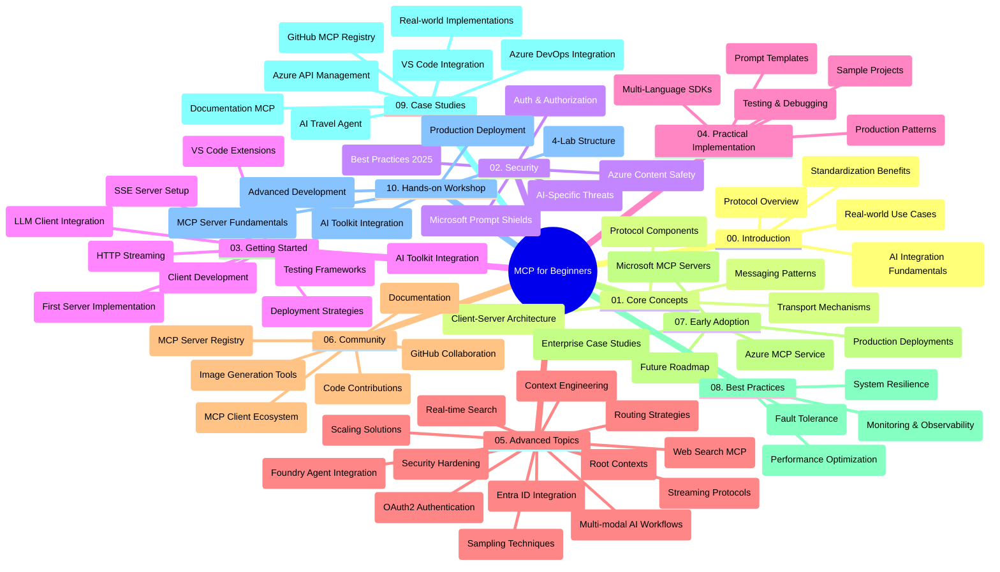

<!--
CO_OP_TRANSLATOR_METADATA:
{
  "original_hash": "719117a0a5f34ade7b5dfb61ee06fb13",
  "translation_date": "2025-09-26T18:38:06+00:00",
  "source_file": "study_guide.md",
  "language_code": "fi"
}
-->
# Model Context Protocol (MCP) aloittelijoille - Opas

Tämä opas tarjoaa yleiskatsauksen "Model Context Protocol (MCP) for Beginners" -kurssin arkiston rakenteesta ja sisällöstä. Käytä tätä opasta navigoidaksesi arkistossa tehokkaasti ja hyödyntääksesi saatavilla olevia resursseja parhaalla mahdollisella tavalla.

## Arkiston yleiskatsaus

Model Context Protocol (MCP) on standardoitu kehys AI-mallien ja asiakassovellusten välisille vuorovaikutuksille. Alun perin Anthropicin luoma MCP on nyt laajemman MCP-yhteisön ylläpitämä virallisen GitHub-organisaation kautta. Tämä arkisto tarjoaa kattavan kurssin käytännön koodiesimerkeillä C#:ssa, Javassa, JavaScriptissä, Pythonissa ja TypeScriptissä, suunnattu AI-kehittäjille, järjestelmäarkkitehdeille ja ohjelmistosuunnittelijoille.

## Visuaalinen kurssikartta

## Arkiston rakenne

Arkisto on jaettu kymmeneen pääosioon, joista jokainen keskittyy MCP:n eri osa-alueisiin:

1. **Johdanto (00-Introduction/)**
   - Model Context Protocolin yleiskatsaus
   - Miksi standardointi on tärkeää AI-putkistoissa
   - Käytännön käyttötapaukset ja hyödyt

2. **Keskeiset käsitteet (01-CoreConcepts/)**
   - Asiakas-palvelin-arkkitehtuuri
   - Protokollan keskeiset komponentit
   - Viestintämallit MCP:ssä

3. **Tietoturva (02-Security/)**
   - Tietoturvauhat MCP-pohjaisissa järjestelmissä
   - Parhaat käytännöt toteutusten suojaamiseksi
   - Todennus- ja valtuutusstrategiat
   - **Kattava tietoturvadokumentaatio**:
     - MCP Security Best Practices 2025
     - Azure Content Safety Implementation Guide
     - MCP Security Controls and Techniques
     - MCP Best Practices Quick Reference
   - **Keskeiset tietoturva-aiheet**:
     - Prompt injection ja työkalujen myrkytys
     - Istunnon kaappaus ja confused deputy -ongelmat
     - Token passthrough -haavoittuvuudet
     - Liialliset käyttöoikeudet ja pääsynhallinta
     - Toimitusketjun tietoturva AI-komponenteille
     - Microsoft Prompt Shields -integraatio

4. **Aloittaminen (03-GettingStarted/)**
   - Ympäristön asennus ja konfigurointi
   - Perus-MCP-palvelimien ja -asiakkaiden luominen
   - Integrointi olemassa oleviin sovelluksiin
   - Sisältää osiot:
     - Ensimmäinen palvelintoteutus
     - Asiakaskehitys
     - LLM-asiakasintegraatio
     - VS Code -integraatio
     - Server-Sent Events (SSE) -palvelin
     - HTTP-suoratoisto
     - AI Toolkit -integraatio
     - Testausstrategiat
     - Käyttöönotto-ohjeet

5. **Käytännön toteutus (04-PracticalImplementation/)**
   - SDK:iden käyttö eri ohjelmointikielissä
   - Virheenkorjaus, testaus ja validointitekniikat
   - Uudelleenkäytettävien prompt-mallien ja työnkulkujen luominen
   - Esimerkkiprojektit toteutusesimerkeillä

6. **Edistyneet aiheet (05-AdvancedTopics/)**
   - Kontekstisuunnittelutekniikat
   - Foundry-agentin integrointi
   - Multimodaaliset AI-työnkulut
   - OAuth2-todennusdemot
   - Reaaliaikaiset hakutoiminnot
   - Reaaliaikainen suoratoisto
   - Root-kontekstien toteutus
   - Reititysstrategiat
   - Näytteenottotekniikat
   - Skaalausmenetelmät
   - Tietoturvanäkökohdat
   - Entra ID -tietoturvaintegraatio
   - Web-hakuintegraatio

7. **Yhteisön panokset (06-CommunityContributions/)**
   - Kuinka osallistua koodin ja dokumentaation kehittämiseen
   - Yhteistyö GitHubin kautta
   - Yhteisön parannukset ja palaute
   - Erilaisten MCP-asiakkaiden käyttö (Claude Desktop, Cline, VSCode)
   - Työskentely suosittujen MCP-palvelimien kanssa, mukaan lukien kuvagenerointi

8. **Opit varhaisesta käyttöönotosta (07-LessonsfromEarlyAdoption/)**
   - Todelliset toteutukset ja menestystarinat
   - MCP-pohjaisten ratkaisujen rakentaminen ja käyttöönotto
   - Trendit ja tulevaisuuden tiekartta
   - **Microsoft MCP Servers Guide**: Kattava opas 10 tuotantovalmiista Microsoft MCP -palvelimesta, mukaan lukien:
     - Microsoft Learn Docs MCP Server
     - Azure MCP Server (15+ erikoisliitintä)
     - GitHub MCP Server
     - Azure DevOps MCP Server
     - MarkItDown MCP Server
     - SQL Server MCP Server
     - Playwright MCP Server
     - Dev Box MCP Server
     - Azure AI Foundry MCP Server
     - Microsoft 365 Agents Toolkit MCP Server

9. **Parhaat käytännöt (08-BestPractices/)**
   - Suorituskyvyn viritys ja optimointi
   - Vikasietoiset MCP-järjestelmät
   - Testaus- ja resilienssistrategiat

10. **Tapaustutkimukset (09-CaseStudy/)**
    - **Seitsemän kattavaa tapaustutkimusta**, jotka osoittavat MCP:n monipuolisuuden eri skenaarioissa:
    - **Azure AI Travel Agents**: Moniagenttiorganisointi Azure OpenAI:n ja AI-haun kanssa
    - **Azure DevOps -integraatio**: Työnkulkujen automatisointi YouTube-datapäivityksillä
    - **Reaaliaikainen dokumentaatiohaku**: Python-konsoliasiakas HTTP-suoratoistolla
    - **Interaktiivinen opintosuunnitelman generaattori**: Chainlit-verkkosovellus keskustelevaa AI:ta käyttäen
    - **Dokumentaatio editorissa**: VS Code -integraatio GitHub Copilot -työnkulkujen kanssa
    - **Azure API Management**: Yrityksen API-integraatio MCP-palvelimen luomisella
    - **GitHub MCP Registry**: Ekosysteemin kehitys ja agenttien integrointialusta
    - Toteutusesimerkit, jotka kattavat yritysintegraation, kehittäjien tuottavuuden ja ekosysteemin kehittämisen

11. **Käytännön työpaja (10-StreamliningAIWorkflowsBuildingAnMCPServerWithAIToolkit/)**
    - Kattava käytännön työpaja MCP:n ja AI Toolkitin yhdistämisestä
    - Älykkäiden sovellusten rakentaminen, jotka yhdistävät AI-mallit todellisiin työkaluihin
    - Käytännön moduulit, jotka kattavat perusteet, mukautetun palvelimen kehittämisen ja tuotantokäyttöönottostrategiat
    - **Lab-rakenne**:
      - Lab 1: MCP-palvelimen perusteet
      - Lab 2: Edistynyt MCP-palvelimen kehitys
      - Lab 3: AI Toolkit -integraatio
      - Lab 4: Tuotantokäyttöönotto ja skaalaus
    - Lab-pohjainen oppimismenetelmä vaiheittaisilla ohjeilla

## Lisäresurssit

Arkisto sisältää tukiresursseja:

- **Kuvat-kansio**: Sisältää kaavioita ja kuvituksia, joita käytetään kurssin aikana
- **Käännökset**: Monikielinen tuki dokumentaation automaattisilla käännöksillä
- **Viralliset MCP-resurssit**:
  - [MCP Documentation](https://modelcontextprotocol.io/)
  - [MCP Specification](https://spec.modelcontextprotocol.io/)
  - [MCP GitHub Repository](https://github.com/modelcontextprotocol)

## Kuinka käyttää tätä arkistoa

1. **Järjestelmällinen oppiminen**: Seuraa lukuja järjestyksessä (00–10) saadaksesi rakenteellisen oppimiskokemuksen.
2. **Kielikohtainen painotus**: Jos olet kiinnostunut tietystä ohjelmointikielestä, tutustu näytekansioihin toteutuksiin suosikkikielelläsi.
3. **Käytännön toteutus**: Aloita "Getting Started" -osiosta asentaaksesi ympäristön ja luodaksesi ensimmäisen MCP-palvelimen ja -asiakkaan.
4. **Edistynyt tutkimus**: Kun perusasiat ovat hallussa, syvenny edistyneisiin aiheisiin laajentaaksesi osaamistasi.
5. **Yhteisön osallistuminen**: Liity MCP-yhteisöön GitHub-keskustelujen ja Discord-kanavien kautta saadaksesi yhteyden asiantuntijoihin ja muihin kehittäjiin.

## MCP-asiakkaat ja työkalut

Kurssi kattaa erilaisia MCP-asiakkaita ja työkaluja:

1. **Viralliset asiakkaat**:
   - Visual Studio Code 
   - MCP Visual Studio Codessa
   - Claude Desktop
   - Claude VSCode:ssa 
   - Claude API

2. **Yhteisön asiakkaat**:
   - Cline (pohjautuu terminaaliin)
   - Cursor (koodieditori)
   - ChatMCP
   - Windsurf

3. **MCP-hallintatyökalut**:
   - MCP CLI
   - MCP Manager
   - MCP Linker
   - MCP Router

## Suositut MCP-palvelimet

Arkisto esittelee erilaisia MCP-palvelimia, mukaan lukien:

1. **Viralliset Microsoft MCP-palvelimet**:
   - Microsoft Learn Docs MCP Server
   - Azure MCP Server (15+ erikoisliitintä)
   - GitHub MCP Server
   - Azure DevOps MCP Server
   - MarkItDown MCP Server
   - SQL Server MCP Server
   - Playwright MCP Server
   - Dev Box MCP Server
   - Azure AI Foundry MCP Server
   - Microsoft 365 Agents Toolkit MCP Server

2. **Viralliset referenssipalvelimet**:
   - Filesystem
   - Fetch
   - Memory
   - Sequential Thinking

3. **Kuvagenerointi**:
   - Azure OpenAI DALL-E 3
   - Stable Diffusion WebUI
   - Replicate

4. **Kehitystyökalut**:
   - Git MCP
   - Terminal Control
   - Code Assistant

5. **Erikoistuneet palvelimet**:
   - Salesforce
   - Microsoft Teams
   - Jira & Confluence

## Osallistuminen

Tämä arkisto toivottaa yhteisön panokset tervetulleiksi. Katso Community Contributions -osio saadaksesi ohjeita MCP-ekosysteemiin osallistumisesta.

## Muutosloki

| Päivämäärä | Muutokset |
|------------|-----------|
| 26. syyskuuta 2025 | - Lisätty GitHub MCP Registry -tapaustutkimus 09-CaseStudy-osioon - Päivitetty tapaustutkimukset sisältämään seitsemän kattavaa tapaustutkimusta - Parannettu tapaustutkimusten kuvauksia yksityiskohtaisilla toteutustiedoilla - Päivitetty visuaalinen kurssikartta sisältämään GitHub MCP Registry - Uudistettu opasrakenne ekosysteemin kehityksen painotuksella |
| 18. heinäkuuta 2025 | - Päivitetty arkiston rakenne sisältämään Microsoft MCP Servers Guide - Lisätty kattava lista 10 tuotantovalmiista Microsoft MCP-palvelimesta - Parannettu Suositut MCP-palvelimet -osio virallisilla Microsoft MCP-palvelimilla - Päivitetty tapaustutkimukset todellisilla tiedosto-esimerkeillä - Lisätty Lab-rakenne yksityiskohdat käytännön työpajaan |
| 16. heinäkuuta 2025 | - Päivitetty arkiston rakenne vastaamaan nykyistä sisältöä - Lisätty MCP-asiakkaat ja työkalut -osio - Lisätty Suositut MCP-palvelimet -osio - Päivitetty visuaalinen kurssikartta kaikilla nykyisillä aiheilla - Parannettu edistyneet aiheet -osio kaikilla erikoistuneilla alueilla - Päivitetty tapaustutkimukset todellisilla esimerkeillä - Selkeytetty MCP:n alkuperä Anthropicin luomana |
| 11. kesäkuuta 2025 | - Oppaan alkuperäinen luominen - Lisätty visuaalinen kurssikartta - Kuvaillut arkiston rakenne - Sisällytetty esimerkkiprojektit ja lisäresurssit |

---

*Tämä opas päivitettiin 26. syyskuuta 2025 ja tarjoaa yleiskatsauksen arkistosta kyseisenä päivänä. Arkiston sisältöä voidaan päivittää tämän päivämäärän jälkeen.*

---

