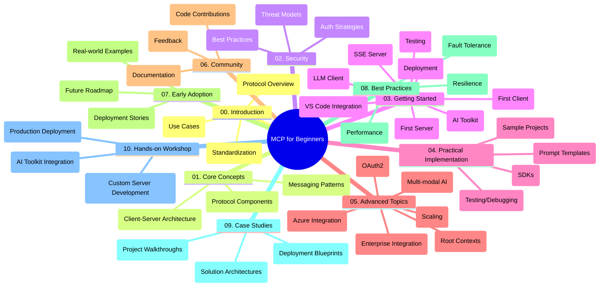

<!--
CO_OP_TRANSLATOR_METADATA:
{
  "original_hash": "a607d4febc94caee9a12b77795f7fc9a",
  "translation_date": "2025-06-11T16:46:11+00:00",
  "source_file": "study_guide.md",
  "language_code": "fi"
}
-->
# Model Context Protocol (MCP) aloittelijoille - Opas

Tämä opas tarjoaa yleiskatsauksen "Model Context Protocol (MCP) for Beginners" -kurssin repositorion rakenteesta ja sisällöstä. Käytä tätä opasta navigoidaksesi repositoriossa tehokkaasti ja hyödyntääksesi saatavilla olevat resurssit parhaalla mahdollisella tavalla.

## Repositorion yleiskatsaus

Model Context Protocol (MCP) on standardoitu kehys tekoälymallien ja asiakasohjelmien väliseen vuorovaikutukseen. Tämä repositorio sisältää kattavan kurssikokonaisuuden käytännön koodiesimerkkien kera C#, Java, JavaScript, Python ja TypeScript -kielillä, suunnattu tekoälykehittäjille, järjestelmäarkkitehdeille ja ohjelmistoinsinööreille.

## Visuaalinen kurssikartta

## Repositorion rakenne

Repositoriossa on kymmenen pääosaa, joista kukin keskittyy eri MCP:n osa-alueisiin:

1. **Johdanto (00-Introduction/)**
   - Yleiskatsaus Model Context Protocolliin
   - Miksi standardisointi on tärkeää tekoälyputkissa
   - Käytännön esimerkit ja hyödyt

2. **Peruskäsitteet (01-CoreConcepts/)**
   - Asiakas-palvelin-arkkitehtuuri
   - Protokollan keskeiset osat
   - Viestintämallit MCP:ssä

3. **Turvallisuus (02-Security/)**
   - Turvauhat MCP-pohjaisissa järjestelmissä
   - Parhaat käytännöt toteutusten suojaamiseen
   - Autentikointi- ja valtuutusstrategiat

4. **Aloittaminen (03-GettingStarted/)**
   - Ympäristön asennus ja konfigurointi
   - Perus MCP-palvelinten ja -asiakkaiden luominen
   - Integrointi olemassa oleviin sovelluksiin
   - Alaluvut ensimmäiselle palvelimelle, ensimmäiselle asiakkaalle, LLM-asiakkaalle, VS Code -integraatiolle, SSE-palvelimelle, AI Toolkitille, testaukselle ja käyttöönotolle

5. **Käytännön toteutus (04-PracticalImplementation/)**
   - SDK:iden käyttö eri ohjelmointikielillä
   - Virheenkorjaus, testaus ja validointimenetelmät
   - Uudelleenkäytettävien prompt-mallien ja työnkulkujen luominen
   - Esimerkkiprojektit toteutusesimerkkien kera

6. **Edistyneet aiheet (05-AdvancedTopics/)**
   - Monimodaaliset tekoälytyönkulut ja laajennettavuus
   - Turvalliset skaalausstrategiat
   - MCP yritysekosysteemeissä
   - Erikoisteemat kuten Azure-integraatio, monimodaalisuus, OAuth2, root-kontekstit, reititys, näytteenotto, skaalaus, turvallisuus, verkkohakujen integrointi ja striimaus.

7. **Yhteisön panokset (06-CommunityContributions/)**
   - Kuinka osallistua koodin ja dokumentaation tekemiseen
   - Yhteistyö GitHubin kautta
   - Yhteisön kehittämät parannukset ja palaute

8. **Opit varhaisesta käyttöönotosta (07-LessonsfromEarlyAdoption/)**
   - Käytännön toteutukset ja menestystarinat
   - MCP-pohjaisten ratkaisujen rakentaminen ja käyttöönotto
   - Trendit ja tulevaisuuden tiekartta

9. **Parhaat käytännöt (08-BestPractices/)**
   - Suorituskyvyn viritys ja optimointi
   - Vikasietoisten MCP-järjestelmien suunnittelu
   - Testaus ja resilienssistrategiat

10. **Tapaustutkimukset (09-CaseStudy/)**
    - Syvälliset tarkastelut MCP-ratkaisujen arkkitehtuureihin
    - Käyttöönoton suunnitelmat ja integraatiovinkit
    - Kuvitetut kaaviot ja projektikierrokset

11. **Käytännön työpaja (10-StreamliningAIWorkflowsBuildingAnMCPServerWithAIToolkit/)**
    - Laaja käytännön työpaja, jossa yhdistetään MCP Microsoftin AI Toolkitin kanssa VS Codeen
    - Älykkäiden sovellusten rakentaminen, jotka yhdistävät tekoälymallit todellisiin työkaluihin
    - Käytännön moduulit, jotka kattavat perusteet, räätälöidyn palvelimen kehityksen ja tuotantokäyttöönoton strategiat

## Esimerkkiprojektit

Repositoriossa on useita esimerkkiprojekteja, jotka demonstroivat MCP:n toteutuksia eri ohjelmointikielillä:

### Perus MCP-laskin-esimerkit
- C# MCP-palvelin-esimerkki
- Java MCP-laskin
- JavaScript MCP-demo
- Python MCP-palvelin
- TypeScript MCP-esimerkki

### Edistyneet MCP-laskinprojektit
- Edistynyt C#-esimerkki
- Java-konttisovellus-esimerkki
- JavaScriptin edistynyt esimerkki
- Pythonin monimutkainen toteutus
- TypeScript-konttiesimerkki

## Lisäresurssit

Repositoriossa on tukiresursseja:

- **Images-kansio**: Sisältää kaavioita ja kuvituksia, joita käytetään kurssin aikana
- **Käännökset**: Monikielinen tuki dokumentaation automaattisilla käännöksillä
- **Viralliset MCP-resurssit**:
  - [MCP Documentation](https://modelcontextprotocol.io/)
  - [MCP Specification](https://spec.modelcontextprotocol.io/)
  - [MCP GitHub Repository](https://github.com/modelcontextprotocol)

## Kuinka käyttää tätä repositoriota

1. **Järjestelmällinen oppiminen**: Seuraa lukuja järjestyksessä (00–10) saadaksesi rakenteellisen oppimiskokemuksen.
2. **Kielikohtainen painotus**: Jos olet kiinnostunut tietystä ohjelmointikielestä, tutustu esimerkkikansioihin kyseisen kielen toteutusten löytämiseksi.
3. **Käytännön toteutus**: Aloita "Getting Started" -osasta, jossa opetetaan ympäristön pystytys sekä ensimmäisen MCP-palvelimen ja -asiakkaan luominen.
4. **Syventävä opiskelu**: Kun perusteet ovat hallussa, sukella edistyneisiin aiheisiin laajentaaksesi osaamistasi.
5. **Yhteisön osallistuminen**: Liity [Azure AI Foundry Discordiin](https://discord.com/invite/ByRwuEEgH4) verkostoituaksesi asiantuntijoiden ja kehittäjäkollegoiden kanssa.

## Osallistuminen

Tämä repositorio toivottaa yhteisön panokset tervetulleiksi. Katso Community Contributions -osio ohjeistaaksesi osallistumista.

---

*Tämä opas on luotu 11. kesäkuuta 2025 ja se tarjoaa yleiskatsauksen repositorion tilasta tuona päivänä. Repositorion sisältöä on voitu päivittää sen jälkeen.*

**Vastuuvapauslauseke**:  
Tämä asiakirja on käännetty käyttämällä tekoälypohjaista käännöspalvelua [Co-op Translator](https://github.com/Azure/co-op-translator). Vaikka pyrimme tarkkuuteen, ole hyvä ja huomioi, että automaattikäännöksissä voi esiintyä virheitä tai epätarkkuuksia. Alkuperäistä asiakirjaa sen alkuperäiskielellä tulee pitää auktoritatiivisena lähteenä. Tärkeissä tiedoissa suositellaan ammattimaista ihmiskäännöstä. Emme ole vastuussa tämän käännöksen käytöstä johtuvista väärinymmärryksistä tai virhetulkinnoista.