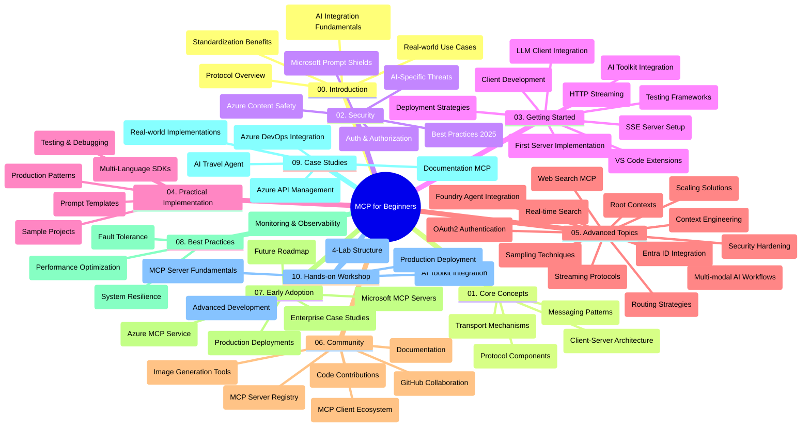

<!--
CO_OP_TRANSLATOR_METADATA:
{
  "original_hash": "e2c6ed897fa98fa08e0146101776c7ff",
  "translation_date": "2025-07-18T10:01:01+00:00",
  "source_file": "study_guide.md",
  "language_code": "fi"
}
-->
# Model Context Protocol (MCP) aloittelijoille – Opas

Tämä opas tarjoaa yleiskatsauksen "Model Context Protocol (MCP) for Beginners" -oppimateriaalin repositorion rakenteesta ja sisällöstä. Käytä tätä opasta navigoidaksesi repositoriossa tehokkaasti ja hyödyntääksesi saatavilla olevat resurssit parhaalla mahdollisella tavalla.

## Repositorion yleiskuvaus

Model Context Protocol (MCP) on standardoitu kehys tekoälymallien ja asiakasohjelmien välisille vuorovaikutuksille. Alun perin Anthropicin luoma MCP on nyt MCP-yhteisön ylläpitämä virallisen GitHub-organisaation kautta. Tämä repositorio tarjoaa kattavan opetussuunnitelman, jossa on käytännön koodiesimerkkejä C#:lla, Javalla, JavaScriptillä, Pythonilla ja TypeScriptilä, suunnattu tekoälykehittäjille, järjestelmäarkkitehdeille ja ohjelmistoinsinööreille.

## Visuaalinen opetussuunnitelmakartta

## Repositorion rakenne

Repositorio on jaettu kymmeneen pääosioon, jotka käsittelevät MCP:n eri osa-alueita:

1. **Johdanto (00-Introduction/)**
   - Model Context Protocolin yleiskatsaus
   - Miksi standardisointi on tärkeää tekoälyputkissa
   - Käytännön käyttötapaukset ja hyödyt

2. **Peruskäsitteet (01-CoreConcepts/)**
   - Asiakas-palvelin-arkkitehtuuri
   - Protokollan keskeiset osat
   - Viestintämallit MCP:ssä

3. **Turvallisuus (02-Security/)**
   - Turvauhat MCP-pohjaisissa järjestelmissä
   - Parhaat käytännöt turvallisten toteutusten varmistamiseksi
   - Autentikointi- ja valtuutusstrategiat
   - **Laaja turvallisuusdokumentaatio**:
     - MCP Security Best Practices 2025
     - Azure Content Safety Implementation Guide
     - MCP Security Controls and Techniques
     - MCP Best Practices Quick Reference
   - **Keskeiset turvallisuusaiheet**:
     - Prompt-injektio ja työkalujen myrkytys
     - Istunnon kaappaus ja confused deputy -ongelmat
     - Tokenin läpivientiin liittyvät haavoittuvuudet
     - Liialliset oikeudet ja pääsynhallinta
     - Tekoälykomponenttien toimitusketjun turvallisuus
     - Microsoft Prompt Shields -integraatio

4. **Aloittaminen (03-GettingStarted/)**
   - Ympäristön asennus ja konfigurointi
   - Perus MCP-palvelimien ja -asiakkaiden luominen
   - Integrointi olemassa oleviin sovelluksiin
   - Sisältää osiot:
     - Ensimmäinen palvelin
     - Asiakasohjelman kehitys
     - LLM-asiakasintegraatio
     - VS Code -integraatio
     - Server-Sent Events (SSE) -palvelin
     - HTTP-suoratoisto
     - AI Toolkit -integraatio
     - Testausstrategiat
     - Julkaisun ohjeet

5. **Käytännön toteutus (04-PracticalImplementation/)**
   - SDK:iden käyttö eri ohjelmointikielillä
   - Virheenkorjaus, testaus ja validointimenetelmät
   - Uudelleenkäytettävien prompt-mallien ja työnkulkujen luominen
   - Esimerkkiprojekteja toteutuksineen

6. **Edistyneet aiheet (05-AdvancedTopics/)**
   - Kontekstisuunnittelutekniikat
   - Foundry-agentin integrointi
   - Monimodaaliset tekoälytyönkulut
   - OAuth2-autentikointiesimerkit
   - Reaaliaikaiset hakutoiminnot
   - Reaaliaikainen suoratoisto
   - Root-kontekstien toteutus
   - Reititysstrategiat
   - Otantamenetelmät
   - Skaalausratkaisut
   - Turvallisuusnäkökohdat
   - Entra ID -turvallisuusintegraatio
   - Verkkohakuintegraatio

7. **Yhteisön panokset (06-CommunityContributions/)**
   - Kuinka osallistua koodilla ja dokumentaatiolla
   - Yhteistyö GitHubin kautta
   - Yhteisön kehittämät parannukset ja palaute
   - Erilaisten MCP-asiakkaiden käyttö (Claude Desktop, Cline, VSCode)
   - Työskentely suosittujen MCP-palvelimien kanssa, mukaan lukien kuvageneraattorit

8. **Varhaisen käyttöönoton opit (07-LessonsfromEarlyAdoption/)**
   - Käytännön toteutukset ja menestystarinat
   - MCP-pohjaisten ratkaisujen rakentaminen ja käyttöönotto
   - Trendit ja tulevaisuuden tiekartta
   - **Microsoft MCP Servers Guide**: Kattava opas 10 tuotantovalmiiseen Microsoft MCP -palvelimeen, mukaan lukien:
     - Microsoft Learn Docs MCP Server
     - Azure MCP Server (yli 15 erikoiskonetta)
     - GitHub MCP Server
     - Azure DevOps MCP Server
     - MarkItDown MCP Server
     - SQL Server MCP Server
     - Playwright MCP Server
     - Dev Box MCP Server
     - Azure AI Foundry MCP Server
     - Microsoft 365 Agents Toolkit MCP Server

9. **Parhaat käytännöt (08-BestPractices/)**
   - Suorituskyvyn säätö ja optimointi
   - Vikasietoisten MCP-järjestelmien suunnittelu
   - Testaus- ja resilienssistrategiat

10. **Tapaustutkimukset (09-CaseStudy/)**
    - Azure API Management -integraatioesimerkki
    - Matkatoimiston toteutusesimerkki
    - Azure DevOps -integraatio YouTube-päivityksillä
    - Dokumentaation MCP-toteutusesimerkit
    - Toteutusesimerkit yksityiskohtaisella dokumentaatiolla

11. **Käytännön työpaja (10-StreamliningAIWorkflowsBuildingAnMCPServerWithAIToolkit/)**
    - Kattava käytännön työpaja, joka yhdistää MCP:n ja AI Toolkitin
    - Älykkäiden sovellusten rakentaminen, jotka yhdistävät tekoälymallit todellisiin työkaluihin
    - Käytännön moduulit, jotka kattavat perusteet, räätälöidyn palvelinkehityksen ja tuotantoon viennin strategiat
    - **Lab-rakenne**:
      - Lab 1: MCP-palvelimen perusteet
      - Lab 2: Edistynyt MCP-palvelinkehitys
      - Lab 3: AI Toolkit -integraatio
      - Lab 4: Tuotantoon vienti ja skaalaus
    - Lab-pohjainen oppiminen vaihe vaiheelta ohjein

## Lisäresurssit

Repositoriossa on tukimateriaaleja:

- **Images-kansio**: Sisältää kaavioita ja kuvituksia, joita käytetään opetussuunnitelmassa
- **Käännökset**: Monikielinen tuki ja automaattiset dokumentaation käännökset
- **Viralliset MCP-resurssit**:
  - [MCP Documentation](https://modelcontextprotocol.io/)
  - [MCP Specification](https://spec.modelcontextprotocol.io/)
  - [MCP GitHub Repository](https://github.com/modelcontextprotocol)

## Kuinka käyttää tätä repositoriota

1. **Järjestelmällinen opiskelu**: Seuraa lukuja järjestyksessä (00–10) saadaksesi rakenteellisen oppimiskokemuksen.
2. **Kielikohtainen painotus**: Jos olet kiinnostunut tietystä ohjelmointikielestä, tutustu esimerkkihakemistoihin oman kielesi toteutuksia varten.
3. **Käytännön toteutus**: Aloita "Getting Started" -osiosta, jossa opit asentamaan ympäristön ja luomaan ensimmäisen MCP-palvelimen ja -asiakkaan.
4. **Edistynyt tutkimus**: Kun perusteet ovat hallussa, siirry edistyneisiin aiheisiin laajentaaksesi osaamistasi.
5. **Yhteisön osallistuminen**: Liity MCP-yhteisöön GitHub-keskustelujen ja Discord-kanavien kautta, jotta voit verkostoitua asiantuntijoiden ja muiden kehittäjien kanssa.

## MCP-asiakkaat ja työkalut

Opetussuunnitelma kattaa erilaisia MCP-asiakkaita ja työkaluja:

1. **Viralliset asiakkaat**:
   - Visual Studio Code
   - MCP Visual Studio Codessa
   - Claude Desktop
   - Claude VSCodessa
   - Claude API

2. **Yhteisön asiakkaat**:
   - Cline (päätteeseen perustuva)
   - Cursor (koodieditori)
   - ChatMCP
   - Windsurf

3. **MCP-hallintatyökalut**:
   - MCP CLI
   - MCP Manager
   - MCP Linker
   - MCP Router

## Suosittuja MCP-palvelimia

Repositoriossa esitellään erilaisia MCP-palvelimia, mukaan lukien:

1. **Viralliset Microsoft MCP -palvelimet**:
   - Microsoft Learn Docs MCP Server
   - Azure MCP Server (yli 15 erikoiskonetta)
   - GitHub MCP Server
   - Azure DevOps MCP Server
   - MarkItDown MCP Server
   - SQL Server MCP Server
   - Playwright MCP Server
   - Dev Box MCP Server
   - Azure AI Foundry MCP Server
   - Microsoft 365 Agents Toolkit MCP Server

2. **Viralliset referenssipalvelimet**:
   - Filesystem
   - Fetch
   - Memory
   - Sequential Thinking

3. **Kuvagenerointi**:
   - Azure OpenAI DALL-E 3
   - Stable Diffusion WebUI
   - Replicate

4. **Kehitystyökalut**:
   - Git MCP
   - Terminal Control
   - Code Assistant

5. **Erikoistuneet palvelimet**:
   - Salesforce
   - Microsoft Teams
   - Jira & Confluence

## Osallistuminen

Tämä repositorio toivottaa yhteisön panokset tervetulleiksi. Katso Yhteisön panokset -osio saadaksesi ohjeita siitä, miten voit osallistua MCP-ekosysteemin kehittämiseen tehokkaasti.

## Muutokset

| Päivämäärä | Muutokset |
|------------|-----------|
| 18. heinäkuuta 2025 | - Päivitetty repositorion rakenne sisältämään Microsoft MCP Servers Guide - Lisätty kattava lista 10 tuotantovalmiista Microsoft MCP -palvelimesta - Parannettu Suosittuja MCP-palvelimia -osiota virallisilla Microsoft MCP -palvelimilla - Päivitetty Tapaustutkimukset-osio todellisilla tiedostoesimerkeillä - Lisätty Lab-rakenteen tiedot Käytännön työpajaan |
| 16. heinäkuuta 2025 | - Päivitetty repositorion rakenne vastaamaan nykyistä sisältöä - Lisätty MCP-asiakkaat ja työkalut -osio - Lisätty Suosittuja MCP-palvelimia -osio - Päivitetty Visuaalinen opetussuunnitelmakartta kaikilla nykyisillä aiheilla - Parannettu Edistyneet aiheet -osiota kaikilla erikoisalueilla - Päivitetty Tapaustutkimukset vastaamaan todellisia esimerkkejä - Selvennetty MCP:n alkuperä Anthropicin luomana |
| 11. kesäkuuta 2025 | - Opas luotu alun perin - Lisätty Visuaalinen opetussuunnitelmakartta - Kuvattu repositorion rakenne - Sisällytetty esimerkkiprojekteja ja lisäresursseja |

---

*Tämä opas päivitettiin 18. heinäkuuta 2025 ja se tarjoaa yleiskatsauksen repositoriosta kyseisenä päivänä. Repositorion sisältöä voidaan päivittää tämän jälkeen.*

**Vastuuvapauslauseke**:  
Tämä asiakirja on käännetty käyttämällä tekoälypohjaista käännöspalvelua [Co-op Translator](https://github.com/Azure/co-op-translator). Vaikka pyrimme tarkkuuteen, huomioithan, että automaattikäännöksissä saattaa esiintyä virheitä tai epätarkkuuksia. Alkuperäistä asiakirjaa sen alkuperäiskielellä tulee pitää virallisena lähteenä. Tärkeissä tiedoissa suositellaan ammattimaista ihmiskäännöstä. Emme ole vastuussa tämän käännöksen käytöstä aiheutuvista väärinymmärryksistä tai tulkinnoista.