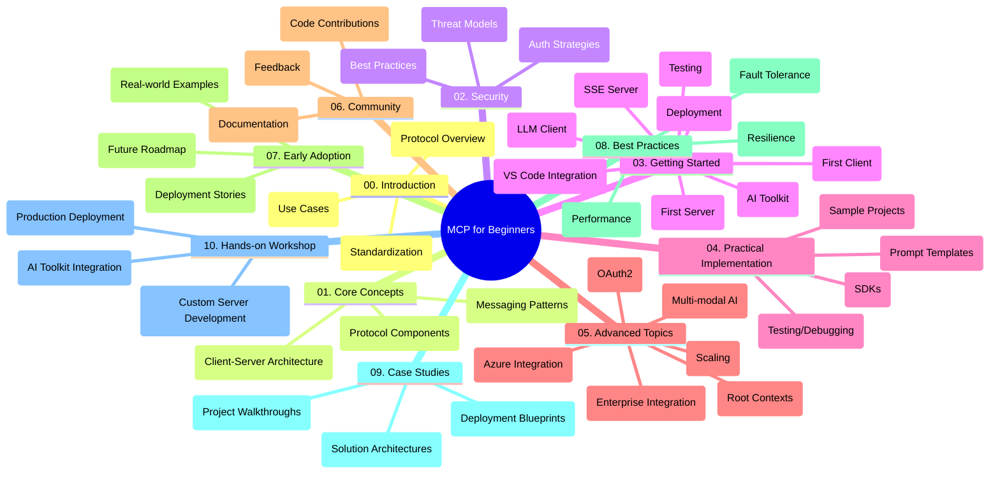

<!--
CO_OP_TRANSLATOR_METADATA:
{
  "original_hash": "a607d4febc94caee9a12b77795f7fc9a",
  "translation_date": "2025-07-13T15:15:41+00:00",
  "source_file": "study_guide.md",
  "language_code": "fi"
}
-->
# Model Context Protocol (MCP) aloittelijoille – Opas

Tämä opas tarjoaa yleiskatsauksen "Model Context Protocol (MCP) for Beginners" -oppimateriaalin repositorion rakenteesta ja sisällöstä. Käytä tätä opasta navigoidaksesi repositoriossa tehokkaasti ja hyödyntääksesi saatavilla olevat resurssit parhaalla mahdollisella tavalla.

## Repositorion yleiskuvaus

Model Context Protocol (MCP) on standardoitu kehys tekoälymallien ja asiakasohjelmien välisille vuorovaikutuksille. Tämä repositorio sisältää kattavan oppimateriaalin, jossa on käytännön koodiesimerkkejä C#:lla, Javalla, JavaScriptillä, Pythonilla ja TypeScripillä, suunnattu tekoälykehittäjille, järjestelmäarkkitehdeille ja ohjelmistoinsinööreille.

## Visuaalinen oppimateriaalin kartta

## Repositorion rakenne

Repositorio on jaettu kymmeneen pääosioon, jotka käsittelevät MCP:n eri osa-alueita:

1. **Johdanto (00-Introduction/)**
   - Yleiskatsaus Model Context Protocoliin
   - Miksi standardisointi on tärkeää tekoälyputkissa
   - Käytännön esimerkit ja hyödyt

2. **Peruskäsitteet (01-CoreConcepts/)**
   - Asiakas-palvelin-arkkitehtuuri
   - Protokollan keskeiset osat
   - Viestintämallit MCP:ssä

3. **Turvallisuus (02-Security/)**
   - Turvauhat MCP-pohjaisissa järjestelmissä
   - Parhaat käytännöt turvallisten toteutusten varmistamiseksi
   - Todennus- ja valtuutusstrategiat

4. **Aloittaminen (03-GettingStarted/)**
   - Ympäristön asennus ja konfigurointi
   - Perus MCP-palvelimien ja -asiakkaiden luominen
   - Integrointi olemassa oleviin sovelluksiin
   - Alakohdat ensimmäiselle palvelimelle, asiakkaalle, LLM-asiakkaalle, VS Code -integraatiolle, SSE-palvelimelle, AI Toolkitille, testaukselle ja käyttöönotolle

5. **Käytännön toteutus (04-PracticalImplementation/)**
   - SDK:iden käyttö eri ohjelmointikielillä
   - Virheenkorjaus, testaus ja validointimenetelmät
   - Uudelleenkäytettävien prompt-mallien ja työnkulkujen luominen
   - Esimerkkiprojekteja toteutuksineen

6. **Edistyneet aiheet (05-AdvancedTopics/)**
   - Monimodaaliset tekoälytyönkulut ja laajennettavuus
   - Turvalliset skaalausstrategiat
   - MCP yritysekosysteemeissä
   - Erikoisaiheita, kuten Azure-integraatio, monimodaalisuus, OAuth2, root-kontekstit, reititys, otanta, skaalaus, turvallisuus, verkkohaku-integraatio ja suoratoisto

7. **Yhteisön panokset (06-CommunityContributions/)**
   - Kuinka osallistua koodilla ja dokumentaatiolla
   - Yhteistyö GitHubin kautta
   - Yhteisön kehittämät parannukset ja palaute

8. **Oppeja varhaisesta käyttöönotosta (07-LessonsfromEarlyAdoption/)**
   - Käytännön toteutukset ja menestystarinat
   - MCP-pohjaisten ratkaisujen rakentaminen ja käyttöönotto
   - Trendejä ja tulevaisuuden tiekartta

9. **Parhaat käytännöt (08-BestPractices/)**
   - Suorituskyvyn optimointi ja hienosäätö
   - Vikasietoisten MCP-järjestelmien suunnittelu
   - Testaus- ja resilienssistrategiat

10. **Tapaustutkimukset (09-CaseStudy/)**
    - Syvälliset analyysit MCP-ratkaisujen arkkitehtuureista
    - Käyttöönoton suunnitelmat ja integraatiovinkit
    - Kuvitetut kaaviot ja projektikierrokset

11. **Käytännön työpaja (10-StreamliningAIWorkflowsBuildingAnMCPServerWithAIToolkit/)**
    - Kattava käytännön työpaja, joka yhdistää MCP:n Microsoftin AI Toolkitin kanssa VS Codeen
    - Älykkäiden sovellusten rakentaminen, jotka yhdistävät tekoälymallit todellisiin työkaluihin
    - Käytännön moduulit, jotka kattavat perusteet, räätälöidyn palvelimen kehityksen ja tuotantoon siirtymisen strategiat

## Esimerkkiprojektit

Repositoriossa on useita esimerkkiprojekteja, jotka demonstroivat MCP:n toteutusta eri ohjelmointikielillä:

### Perus MCP-laskin esimerkit
- C# MCP -palvelin esimerkki
- Java MCP -laskin
- JavaScript MCP -demo
- Python MCP -palvelin
- TypeScript MCP -esimerkki

### Edistyneet MCP-laskin projektit
- Edistynyt C# esimerkki
- Java konttisovellus esimerkki
- JavaScript edistynyt esimerkki
- Python monimutkainen toteutus
- TypeScript konttiesimerkki

## Lisäresurssit

Repositoriossa on tukimateriaaleja:

- **Images-kansio**: Sisältää kaavioita ja kuvituksia, joita käytetään oppimateriaalissa
- **Käännökset**: Monikielinen tuki dokumentaation automaattisilla käännöksillä
- **Viralliset MCP-resurssit**:
  - [MCP Documentation](https://modelcontextprotocol.io/)
  - [MCP Specification](https://spec.modelcontextprotocol.io/)
  - [MCP GitHub Repository](https://github.com/modelcontextprotocol)

## Kuinka käyttää tätä repositoriota

1. **Järjestelmällinen opiskelu**: Seuraa lukuja järjestyksessä (00–10) saadaksesi rakenteellisen oppimiskokemuksen.
2. **Kielikohtainen painotus**: Jos olet kiinnostunut tietystä ohjelmointikielestä, tutustu kyseisen kielen esimerkkikansioihin.
3. **Käytännön toteutus**: Aloita "Getting Started" -osiosta, jossa opit asentamaan ympäristön ja luomaan ensimmäisen MCP-palvelimen ja -asiakkaan.
4. **Edistynyt tutkimus**: Kun perusteet ovat hallussa, sukella edistyneisiin aiheisiin laajentaaksesi osaamistasi.
5. **Yhteisön osallistuminen**: Liity [Azure AI Foundry Discordiin](https://discord.com/invite/ByRwuEEgH4) verkostoituaksesi asiantuntijoiden ja muiden kehittäjien kanssa.

## Osallistuminen

Tämä repositorio toivottaa yhteisön panokset tervetulleiksi. Katso Yhteisön panokset -osio ohjeista, miten voit osallistua.

---

*Tämä opas on luotu 11. kesäkuuta 2025 ja tarjoaa yleiskatsauksen repositorion tilasta tuolloin. Repositorion sisältöä on voitu päivittää sen jälkeen.*

**Vastuuvapauslauseke**:  
Tämä asiakirja on käännetty käyttämällä tekoälypohjaista käännöspalvelua [Co-op Translator](https://github.com/Azure/co-op-translator). Vaikka pyrimme tarkkuuteen, huomioithan, että automaattikäännöksissä saattaa esiintyä virheitä tai epätarkkuuksia. Alkuperäistä asiakirjaa sen alkuperäiskielellä tulee pitää virallisena lähteenä. Tärkeissä asioissa suositellaan ammattimaista ihmiskäännöstä. Emme ole vastuussa tämän käännöksen käytöstä aiheutuvista väärinymmärryksistä tai tulkinnoista.