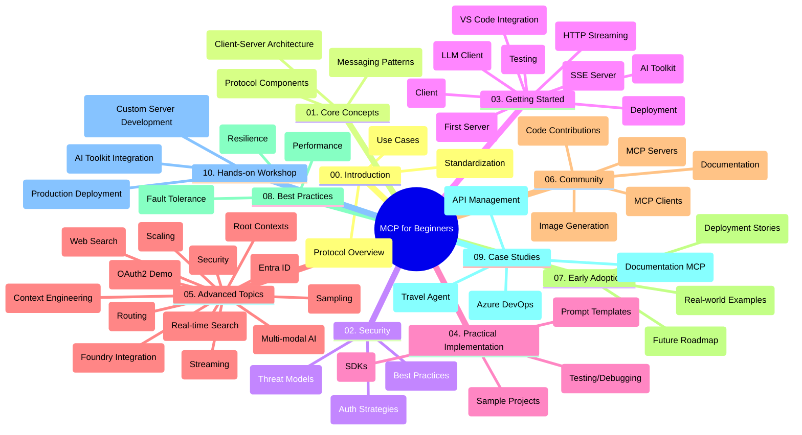

<!--
CO_OP_TRANSLATOR_METADATA:
{
  "original_hash": "5f321ea583cf087a94e47ee74c62b504",
  "translation_date": "2025-07-17T06:48:16+00:00",
  "source_file": "study_guide.md",
  "language_code": "fi"
}
-->
# Model Context Protocol (MCP) aloittelijoille – Opas

Tämä opas tarjoaa yleiskatsauksen "Model Context Protocol (MCP) for Beginners" -oppimateriaalin repositorion rakenteesta ja sisällöstä. Käytä tätä opasta navigoidaksesi repositoriossa tehokkaasti ja hyödyntääksesi saatavilla olevat resurssit parhaalla mahdollisella tavalla.

## Repositorion yleiskuvaus

Model Context Protocol (MCP) on standardoitu kehys tekoälymallien ja asiakasohjelmien välisille vuorovaikutuksille. Alun perin Anthropicin luoma MCP on nyt MCP-yhteisön ylläpitämä virallisen GitHub-organisaation kautta. Tämä repositorio tarjoaa kattavan opetussuunnitelman, jossa on käytännön koodiesimerkkejä C#:lla, Javalla, JavaScriptillä, Pythonilla ja TypeScriptilä, suunnattu tekoälykehittäjille, järjestelmäarkkitehdeille ja ohjelmistoinsinööreille.

## Visuaalinen opetussuunnitelmakartta

## Repositorion rakenne

Repositorio on jaettu kymmeneen pääosioon, jotka käsittelevät MCP:n eri osa-alueita:

1. **Johdanto (00-Introduction/)**
   - Model Context Protocolin yleiskatsaus
   - Miksi standardisointi on tärkeää tekoälyputkissa
   - Käytännön käyttötapaukset ja hyödyt

2. **Peruskäsitteet (01-CoreConcepts/)**
   - Asiakas-palvelin-arkkitehtuuri
   - Protokollan keskeiset osat
   - Viestintämallit MCP:ssä

3. **Turvallisuus (02-Security/)**
   - Turvauhat MCP-pohjaisissa järjestelmissä
   - Parhaat käytännöt turvallisten toteutusten varmistamiseksi
   - Todennus- ja valtuutusstrategiat

4. **Aloittaminen (03-GettingStarted/)**
   - Ympäristön asennus ja konfigurointi
   - Perus MCP-palvelimien ja -asiakkaiden luominen
   - Integrointi olemassa oleviin sovelluksiin
   - Sisältää osiot:
     - Ensimmäinen palvelin toteutus
     - Asiakasohjelman kehitys
     - LLM-asiakasintegraatio
     - VS Code -integraatio
     - Server-Sent Events (SSE) -palvelin
     - HTTP-suoratoisto
     - AI Toolkit -integraatio
     - Testausstrategiat
     - Julkaisun ohjeet

5. **Käytännön toteutus (04-PracticalImplementation/)**
   - SDK:iden käyttö eri ohjelmointikielillä
   - Virheenkorjaus, testaus ja validointimenetelmät
   - Uudelleenkäytettävien prompt-mallien ja työnkulkujen luominen
   - Esimerkkiprojekteja toteutusesimerkkien kera

6. **Edistyneet aiheet (05-AdvancedTopics/)**
   - Kontekstisuunnittelutekniikat
   - Foundry-agentin integrointi
   - Monimodaaliset tekoälytyönkulut
   - OAuth2-todennuksen demot
   - Reaaliaikaiset hakutoiminnot
   - Reaaliaikainen suoratoisto
   - Root-kontekstien toteutus
   - Reititysstrategiat
   - Otantatekniikat
   - Skaalausratkaisut
   - Turvallisuusnäkökohdat
   - Entra ID -turvaintegraatio
   - Verkkohakuintegraatio

7. **Yhteisön panokset (06-CommunityContributions/)**
   - Kuinka osallistua koodilla ja dokumentaatiolla
   - Yhteistyö GitHubin kautta
   - Yhteisön vetämät parannukset ja palaute
   - Erilaisten MCP-asiakkaiden käyttö (Claude Desktop, Cline, VSCode)
   - Suosittujen MCP-palvelimien käyttö, mukaan lukien kuvanluonti

8. **Varhaisen käyttöönoton opit (07-LessonsfromEarlyAdoption/)**
   - Käytännön toteutukset ja menestystarinat
   - MCP-pohjaisten ratkaisujen rakentaminen ja käyttöönotto
   - Trendit ja tulevaisuuden tiekartta

9. **Parhaat käytännöt (08-BestPractices/)**
   - Suorituskyvyn säätö ja optimointi
   - Vikasietoisten MCP-järjestelmien suunnittelu
   - Testaus- ja resilienssistrategiat

10. **Tapaustutkimukset (09-CaseStudy/)**
    - Tapaustutkimus: Azure API Management -integraatio
    - Tapaustutkimus: Matkatoimiston toteutus
    - Tapaustutkimus: Azure DevOps -integraatio YouTuben kanssa
    - Toteutusesimerkit yksityiskohtaisella dokumentaatiolla

11. **Käytännön työpaja (10-StreamliningAIWorkflowsBuildingAnMCPServerWithAIToolkit/)**
    - Kattava käytännön työpaja, joka yhdistää MCP:n ja AI Toolkitin
    - Älykkäiden sovellusten rakentaminen, jotka yhdistävät tekoälymallit todellisiin työkaluihin
    - Käytännön moduulit, jotka kattavat perusteet, räätälöidyn palvelimen kehityksen ja tuotantoon siirtymisen strategiat
    - Laboratoriopohjainen oppimismenetelmä vaiheittaisilla ohjeilla

## Lisäresurssit

Repositoriossa on tukimateriaaleja:

- **Kuvat-kansio**: Sisältää kaavioita ja kuvituksia, joita käytetään opetussuunnitelmassa
- **Käännökset**: Monikielinen tuki dokumentaation automaattisilla käännöksillä
- **Viralliset MCP-resurssit**:
  - [MCP Documentation](https://modelcontextprotocol.io/)
  - [MCP Specification](https://spec.modelcontextprotocol.io/)
  - [MCP GitHub Repository](https://github.com/modelcontextprotocol)

## Kuinka käyttää tätä repositoriota

1. **Järjestelmällinen opiskelu**: Seuraa lukuja järjestyksessä (00–10) saadaksesi rakenteellisen oppimiskokemuksen.
2. **Kielikohtainen painotus**: Jos olet kiinnostunut tietystä ohjelmointikielestä, tutustu esimerkkikansioihin oman kielesi toteutusten löytämiseksi.
3. **Käytännön toteutus**: Aloita "Aloittaminen" -osiosta, jossa opit ympäristön pystytyksen ja ensimmäisen MCP-palvelimen ja -asiakkaan luomisen.
4. **Edistynyt tutkimus**: Kun perusteet ovat hallussa, sukella edistyneisiin aiheisiin laajentaaksesi osaamistasi.
5. **Yhteisön osallistuminen**: Liity MCP-yhteisöön GitHub-keskustelujen ja Discord-kanavien kautta, jotta voit verkostoitua asiantuntijoiden ja muiden kehittäjien kanssa.

## MCP-asiakkaat ja työkalut

Oppimateriaali kattaa erilaisia MCP-asiakkaita ja työkaluja:

1. **Viralliset asiakkaat**:
   - Visual Studio Code
   - MCP Visual Studio Codessa
   - Claude Desktop
   - Claude VSCodessa
   - Claude API

2. **Yhteisön asiakkaat**:
   - Cline (päätteeseen perustuva)
   - Cursor (koodieditori)
   - ChatMCP
   - Windsurf

3. **MCP-hallintatyökalut**:
   - MCP CLI
   - MCP Manager
   - MCP Linker
   - MCP Router

## Suosittuja MCP-palvelimia

Repositoriossa esitellään erilaisia MCP-palvelimia, kuten:

1. **Viralliset referenssipalvelimet**:
   - Filesystem
   - Fetch
   - Memory
   - Sequential Thinking

2. **Kuvageneraattorit**:
   - Azure OpenAI DALL-E 3
   - Stable Diffusion WebUI
   - Replicate

3. **Kehitystyökalut**:
   - Git MCP
   - Terminal Control
   - Code Assistant

4. **Erikoistuneet palvelimet**:
   - Salesforce
   - Microsoft Teams
   - Jira & Confluence

## Osallistuminen

Tämä repositorio toivottaa yhteisön panokset tervetulleiksi. Katso Yhteisön panokset -osio saadaksesi ohjeita siitä, miten voit osallistua MCP-ekosysteemin kehittämiseen tehokkaasti.

## Muutokset

| Päivämäärä | Muutokset |
|------------|-----------|
| 16. heinäkuuta 2025 | - Päivitetty repositorion rakenne vastaamaan nykyistä sisältöä - Lisätty MCP-asiakkaat ja työkalut -osio - Lisätty Suositut MCP-palvelimet -osio - Päivitetty Visuaalinen opetussuunnitelmakartta kaikilla nykyisillä aiheilla - Laajennettu Edistyneet aiheet -osiota kaikilla erikoisalueilla - Päivitetty Tapaustutkimukset vastaamaan todellisia esimerkkejä - Selvennetty MCP:n alkuperä Anthropicin luomana |
| 11. kesäkuuta 2025 | - Opas luotu alun perin - Lisätty Visuaalinen opetussuunnitelmakartta - Kuvattu repositorion rakenne - Sisällytetty esimerkkiprojekteja ja lisäresursseja |

---

*Tämä opas päivitettiin 16. heinäkuuta 2025 ja se tarjoaa yleiskatsauksen repositoriosta kyseisenä päivänä. Repositorion sisältöä voidaan päivittää tämän jälkeen.*

**Vastuuvapauslauseke**:  
Tämä asiakirja on käännetty käyttämällä tekoälypohjaista käännöspalvelua [Co-op Translator](https://github.com/Azure/co-op-translator). Vaikka pyrimme tarkkuuteen, huomioithan, että automaattikäännöksissä saattaa esiintyä virheitä tai epätarkkuuksia. Alkuperäistä asiakirjaa sen alkuperäisellä kielellä tulee pitää virallisena lähteenä. Tärkeissä tiedoissa suositellaan ammattimaista ihmiskäännöstä. Emme ole vastuussa tämän käännöksen käytöstä aiheutuvista väärinymmärryksistä tai tulkinnoista.