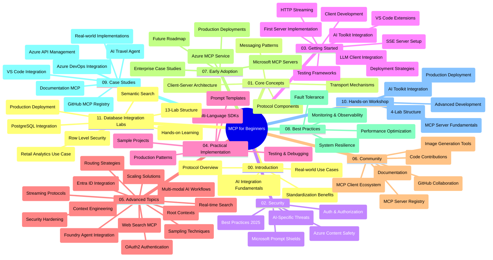

<!--
CO_OP_TRANSLATOR_METADATA:
{
  "original_hash": "aa1ce97bc694b08faf3018bab6d275b9",
  "translation_date": "2025-09-30T17:57:22+00:00",
  "source_file": "study_guide.md",
  "language_code": "fi"
}
-->
# Model Context Protocol (MCP) aloittelijoille - Opas

Tämä opas tarjoaa yleiskatsauksen "Model Context Protocol (MCP) for Beginners" -opetussuunnitelman arkiston rakenteesta ja sisällöstä. Käytä tätä opasta navigoidaksesi arkistossa tehokkaasti ja hyödyntääksesi saatavilla olevia resursseja parhaalla mahdollisella tavalla.

## Arkiston yleiskatsaus

Model Context Protocol (MCP) on standardoitu kehys AI-mallien ja asiakassovellusten välisille vuorovaikutuksille. Alun perin Anthropicin luoma MCP on nyt laajemman MCP-yhteisön ylläpitämä virallisen GitHub-organisaation kautta. Tämä arkisto tarjoaa kattavan opetussuunnitelman käytännön koodiesimerkeillä C#:ssa, Javassa, JavaScriptissä, Pythonissa ja TypeScriptissä, ja se on suunnattu AI-kehittäjille, järjestelmäarkkitehdeille ja ohjelmistosuunnittelijoille.

## Visuaalinen opetussuunnitelmakartta

## Arkiston rakenne

Arkisto on jaettu yhteentoista pääosioon, joista jokainen keskittyy MCP:n eri osa-alueisiin:

1. **Johdanto (00-Introduction/)**
   - Model Context Protocolin yleiskatsaus
   - Miksi standardointi on tärkeää AI-putkistoissa
   - Käytännön käyttötapaukset ja hyödyt

2. **Peruskäsitteet (01-CoreConcepts/)**
   - Asiakas-palvelin-arkkitehtuuri
   - Protokollan keskeiset komponentit
   - Viestintämallit MCP:ssä

3. **Tietoturva (02-Security/)**
   - Tietoturvauhat MCP-pohjaisissa järjestelmissä
   - Parhaat käytännöt toteutusten suojaamiseksi
   - Todennus- ja valtuutusstrategiat
   - **Kattava tietoturvadokumentaatio**:
     - MCP Security Best Practices 2025
     - Azure Content Safety Implementation Guide
     - MCP Security Controls and Techniques
     - MCP Best Practices Quick Reference
   - **Keskeiset tietoturva-aiheet**:
     - Prompt injection- ja työkalumyrkytysiskut
     - Istunnon kaappaus ja confused deputy -ongelmat
     - Token passthrough -haavoittuvuudet
     - Liialliset käyttöoikeudet ja pääsynhallinta
     - Toimitusketjun tietoturva AI-komponenteille
     - Microsoft Prompt Shields -integraatio

4. **Aloittaminen (03-GettingStarted/)**
   - Ympäristön asennus ja konfigurointi
   - Perus-MCP-palvelimien ja -asiakkaiden luominen
   - Integrointi olemassa oleviin sovelluksiin
   - Sisältää osiot:
     - Ensimmäinen palvelintoteutus
     - Asiakaskehitys
     - LLM-asiakasintegraatio
     - VS Code -integraatio
     - Server-Sent Events (SSE) -palvelin
     - HTTP-suoratoisto
     - AI Toolkit -integraatio
     - Testausstrategiat
     - Käyttöönotto-ohjeet

5. **Käytännön toteutus (04-PracticalImplementation/)**
   - SDK:iden käyttö eri ohjelmointikielissä
   - Virheenkorjaus-, testaus- ja validointitekniikat
   - Uudelleenkäytettävien prompt-mallien ja työnkulkujen luominen
   - Esimerkkiprojektit toteutusesimerkeillä

6. **Edistyneet aiheet (05-AdvancedTopics/)**
   - Kontekstisuunnittelutekniikat
   - Foundry-agentin integrointi
   - Monimodaaliset AI-työnkulut
   - OAuth2-todennusdemot
   - Reaaliaikaiset hakutoiminnot
   - Reaaliaikainen suoratoisto
   - Root-kontekstien toteutus
   - Reititysstrategiat
   - Näytteenottotekniikat
   - Skaalauslähestymistavat
   - Tietoturvanäkökohdat
   - Entra ID -tietoturvaintegraatio
   - Web-hakuintegraatio

7. **Yhteisön panokset (06-CommunityContributions/)**
   - Kuinka osallistua koodin ja dokumentaation kehittämiseen
   - Yhteistyö GitHubin kautta
   - Yhteisön parannukset ja palaute
   - Erilaisten MCP-asiakkaiden käyttö (Claude Desktop, Cline, VSCode)
   - Työskentely suosittujen MCP-palvelimien kanssa, mukaan lukien kuvagenerointi

8. **Opit varhaisesta käyttöönotosta (07-LessonsfromEarlyAdoption/)**
   - Todelliset toteutukset ja menestystarinat
   - MCP-pohjaisten ratkaisujen rakentaminen ja käyttöönotto
   - Trendit ja tulevaisuuden tiekartta
   - **Microsoft MCP Servers Guide**: Kattava opas 10 tuotantovalmiista Microsoft MCP -palvelimesta, mukaan lukien:
     - Microsoft Learn Docs MCP Server
     - Azure MCP Server (15+ erikoistunutta liitintä)
     - GitHub MCP Server
     - Azure DevOps MCP Server
     - MarkItDown MCP Server
     - SQL Server MCP Server
     - Playwright MCP Server
     - Dev Box MCP Server
     - Azure AI Foundry MCP Server
     - Microsoft 365 Agents Toolkit MCP Server

9. **Parhaat käytännöt (08-BestPractices/)**
   - Suorituskyvyn viritys ja optimointi
   - Vikasietoiset MCP-järjestelmät
   - Testaus- ja resilienssistrategiat

10. **Tapaustutkimukset (09-CaseStudy/)**
    - **Seitsemän kattavaa tapaustutkimusta**, jotka osoittavat MCP:n monipuolisuuden eri skenaarioissa:
    - **Azure AI Travel Agents**: Moniagenttiorganisointi Azure OpenAI:n ja AI-haun kanssa
    - **Azure DevOps -integraatio**: Työnkulkujen automatisointi YouTube-datapäivityksillä
    - **Reaaliaikainen dokumentaatiohaku**: Python-konsoliasiakas suoratoistavalla HTTP:llä
    - **Interaktiivinen opintosuunnitelman luonti**: Chainlit-verkkosovellus keskustelevaa AI:ta käyttäen
    - **Dokumentaatio editorissa**: VS Code -integraatio GitHub Copilot -työnkulkujen kanssa
    - **Azure API Management**: Yrityksen API-integraatio MCP-palvelimen luomisella
    - **GitHub MCP Registry**: Ekosysteemin kehitys ja agenttien integrointialusta
    - Toteutusesimerkit kattavat yritysintegraation, kehittäjän tuottavuuden ja ekosysteemin kehityksen

11. **Käytännön työpaja (10-StreamliningAIWorkflowsBuildingAnMCPServerWithAIToolkit/)**
    - Kattava käytännön työpaja, joka yhdistää MCP:n AI Toolkitin kanssa
    - Älykkäiden sovellusten rakentaminen, jotka yhdistävät AI-mallit todellisiin työkaluihin
    - Käytännön moduulit, jotka kattavat perusteet, mukautetun palvelimen kehittämisen ja tuotantokäyttöönottostrategiat
    - **Lab-rakenne**:
      - Lab 1: MCP-palvelimen perusteet
      - Lab 2: Edistynyt MCP-palvelimen kehitys
      - Lab 3: AI Toolkit -integraatio
      - Lab 4: Tuotantokäyttö ja skaalaus
    - Lab-pohjainen oppimismenetelmä vaiheittaisilla ohjeilla

12. **MCP-palvelimen tietokantaintegraatiolaboratoriot (11-MCPServerHandsOnLabs/)**
    - **Kattava 13-laboratorion oppimispolku** tuotantovalmiiden MCP-palvelimien rakentamiseen PostgreSQL-integraatiolla
    - **Todellisen vähittäiskaupan analytiikan toteutus** Zava Retail -käyttötapauksen avulla
    - **Yritystason mallit**, mukaan lukien rivitason tietoturva (RLS), semanttinen haku ja monivuokraajadata
    - **Täydellinen laboratoriorakenne**:
      - **Laboratoriot 00-03: Perusteet** - Johdanto, arkkitehtuuri, tietoturva, ympäristön asennus
      - **Laboratoriot 04-06: MCP-palvelimen rakentaminen** - Tietokantasuunnittelu, MCP-palvelimen toteutus, työkalujen kehitys
      - **Laboratoriot 07-09: Edistyneet ominaisuudet** - Semanttinen haku, testaus ja virheenkorjaus, VS Code -integraatio
      - **Laboratoriot 10-12: Tuotanto ja parhaat käytännöt** - Käyttöönotto, valvonta, optimointi
    - **Käytetyt teknologiat**: FastMCP-kehys, PostgreSQL, Azure OpenAI, Azure Container Apps, Application Insights
    - **Oppimistulokset**: Tuotantovalmiit MCP-palvelimet, tietokantaintegraatiomallit, AI-pohjainen analytiikka, yritystason tietoturva

## Lisäresurssit

Arkisto sisältää tukiresursseja:

- **Kuvat-kansio**: Sisältää kaavioita ja kuvituksia, joita käytetään opetussuunnitelmassa
- **Käännökset**: Monikielinen tuki dokumentaation automaattisilla käännöksillä
- **Viralliset MCP-resurssit**:
  - [MCP Documentation](https://modelcontextprotocol.io/)
  - [MCP Specification](https://spec.modelcontextprotocol.io/)
  - [MCP GitHub Repository](https://github.com/modelcontextprotocol)

## Kuinka käyttää tätä arkistoa

1. **Järjestelmällinen oppiminen**: Seuraa lukuja järjestyksessä (00–11) saadaksesi rakenteellisen oppimiskokemuksen.
2. **Kielikohtainen painotus**: Jos olet kiinnostunut tietystä ohjelmointikielestä, tutustu näytekansioihin toteutuksiin haluamallasi kielellä.
3. **Käytännön toteutus**: Aloita "Aloittaminen"-osiosta asentaaksesi ympäristön ja luodaksesi ensimmäisen MCP-palvelimen ja -asiakkaan.
4. **Edistynyt tutkimus**: Kun perusasiat ovat hallussa, syvenny edistyneisiin aiheisiin laajentaaksesi osaamistasi.
5. **Yhteisön osallistuminen**: Liity MCP-yhteisöön GitHub-keskustelujen ja Discord-kanavien kautta saadaksesi yhteyden asiantuntijoihin ja muihin kehittäjiin.

## MCP-asiakkaat ja työkalut

Opetussuunnitelma kattaa erilaisia MCP-asiakkaita ja työkaluja:

1. **Viralliset asiakkaat**:
   - Visual Studio Code 
   - MCP Visual Studio Codessa
   - Claude Desktop
   - Claude VSCode:ssa 
   - Claude API

2. **Yhteisön asiakkaat**:
   - Cline (pohjautuu terminaaliin)
   - Cursor (koodieditori)
   - ChatMCP
   - Windsurf

3. **MCP-hallintatyökalut**:
   - MCP CLI
   - MCP Manager
   - MCP Linker
   - MCP Router

## Suositut MCP-palvelimet

Arkisto esittelee erilaisia MCP-palvelimia, mukaan lukien:

1. **Viralliset Microsoft MCP-palvelimet**:
   - Microsoft Learn Docs MCP Server
   - Azure MCP Server (15+ erikoistunutta liitintä)
   - GitHub MCP Server
   - Azure DevOps MCP Server
   - MarkItDown MCP Server
   - SQL Server MCP Server
   - Playwright MCP Server
   - Dev Box MCP Server
   - Azure AI Foundry MCP Server
   - Microsoft 365 Agents Toolkit MCP Server

2. **Viralliset referenssipalvelimet**:
   - Tiedostojärjestelmä
   - Fetch
   - Muisti
   - Järjestelmällinen ajattelu

3. **Kuvagenerointi**:
   - Azure OpenAI DALL-E 3
   - Stable Diffusion WebUI
   - Replicate

4. **Kehitystyökalut**:
   - Git MCP
   - Terminaalin hallinta
   - Koodiassistentti

5. **Erikoistuneet palvelimet**:
   - Salesforce
   - Microsoft Teams
   - Jira & Confluence

## Osallistuminen

Tämä arkisto toivottaa yhteisön panokset tervetulleiksi. Katso Yhteisön panokset -osio saadaksesi ohjeita MCP-ekosysteemiin osallistumisesta.

## Muutosloki

| Päivämäärä | Muutokset |
|------------|-----------||
| 29. syyskuuta 2025 | - Lisätty 11-MCPServerHandsOnLabs-osio kattavalla 13-laboratorion tietokantaintegraation oppimispolulla - Päivitetty visuaalinen opetussuunnitelmakartta sisältämään tietokantaintegraatiolaboratoriot - Parannettu arkiston rakennetta heijastamaan yksitoista pääosaa - Lisätty yksityiskohtainen kuvaus PostgreSQL-integraatiosta, vähittäiskaupan analytiikan käyttötapauksesta ja yritystason malleista - Päivitetty navigointiohjeet sisältämään osiot 00–11 |
| 26. syyskuuta 2025 | - Lisätty GitHub MCP Registry -tapaustutkimus 09-CaseStudy-osioon - Päivitetty tapaustutkimukset sisältämään seitsemän kattavaa tapaustutkimusta - Parannettu tapaustutkimusten kuvauksia erityisillä toteutustiedoilla - Päivitetty visuaalinen opetussuunnitelmakartta sisältämään GitHub MCP Registry - Tarkistettu opasrakenne heijastamaan ekosysteemin kehityksen painopistettä |
| 18. heinäkuuta 2025 | - Päivitetty arkiston rakenne sisältämään Microsoft MCP Servers Guide - Lisätty kattava lista 10 tuotantovalmiista Microsoft MCP-palvelimesta - Parannettu Suositut MCP-palvelimet -osio virallisilla Microsoft MCP-palvelimilla - Päivitetty tapaustutkimukset todellisten tiedostoesimerkkien kanssa - Lisätty Lab-rakenteen yksityiskohdat käytännön työpajalle |
| 16. heinäkuuta 2025 | - Päivitetty arkiston rakenne heijastamaan nykyistä sisältöä - Lisätty MCP-asiakkaat ja työkalut -osio - Lisätty Suositut MCP-palvelimet -osio - Päivitetty visuaalinen opetussuunnitelmakartta kaikilla nykyisillä aiheilla - Parannettu Edistyneet aiheet -osio kaikilla erikoistuneilla alueilla - Päivitetty tapaustutkimukset todellisten esimerkkien kanssa - Selkeytetty MCP:n alkuperä Anthropicin luomana |
| 11. kesäkuuta 2025 | - Oppaan alkuperäinen luominen - Lisätty visuaalinen opetussuunnitelmakartta - Kuvaillut arkiston rakenne - Sisällytetty esimerkkiprojektit ja lisäresurssit |

---

*Tämä opas päivitettiin 29. syyskuuta 2025 ja tarjoaa yleiskatsauksen arkistosta kyseisenä päivänä. Arkiston sisältöä voidaan päivittää tämän päivämäärän jälkeen.*

---

**Vastuuvapauslauseke**:  
Tämä asiakirja on käännetty käyttämällä tekoälypohjaista käännöspalvelua [Co-op Translator](https://github.com/Azure/co-op-translator). Vaikka pyrimme tarkkuuteen, huomioithan, että automaattiset käännökset voivat sisältää virheitä tai epätarkkuuksia. Alkuperäistä asiakirjaa sen alkuperäisellä kielellä tulisi pitää ensisijaisena lähteenä. Kriittisen tiedon osalta suositellaan ammattimaista ihmiskäännöstä. Emme ole vastuussa väärinkäsityksistä tai virhetulkinnoista, jotka johtuvat tämän käännöksen käytöstä.