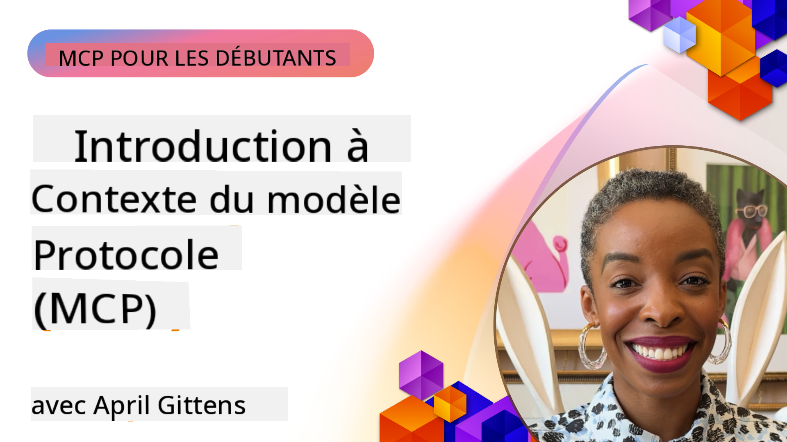
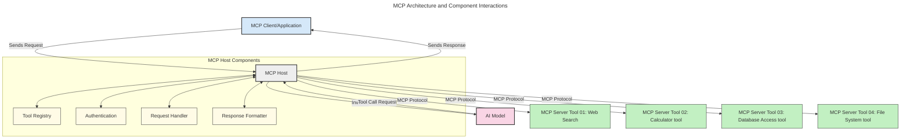
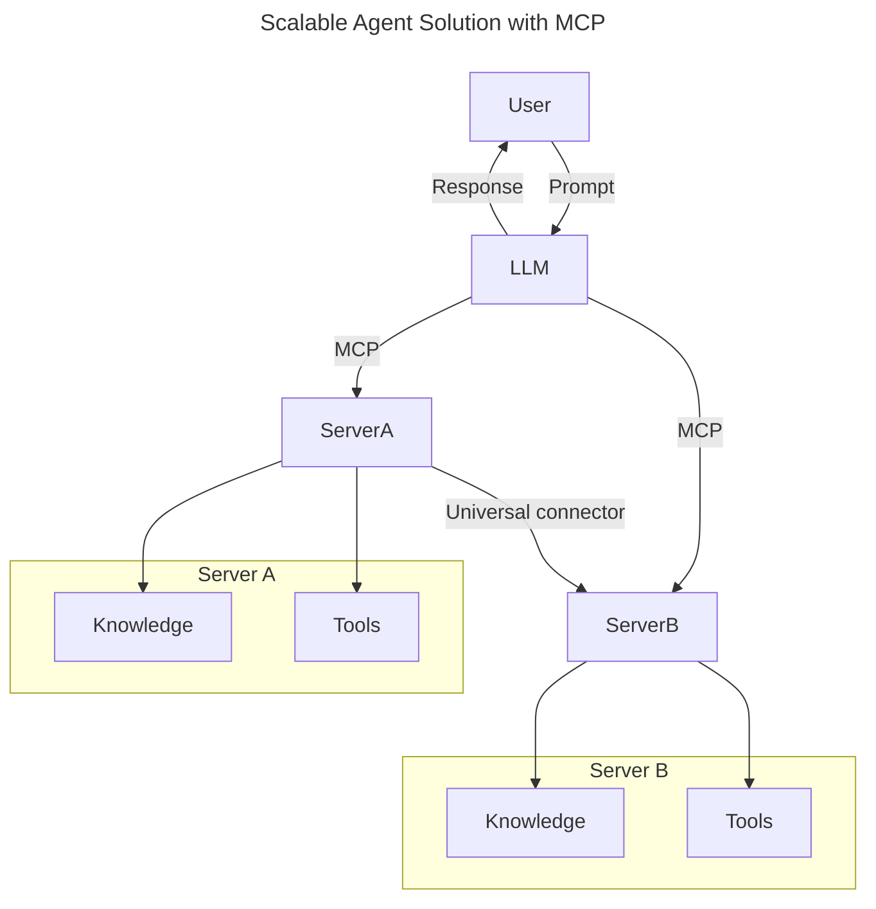
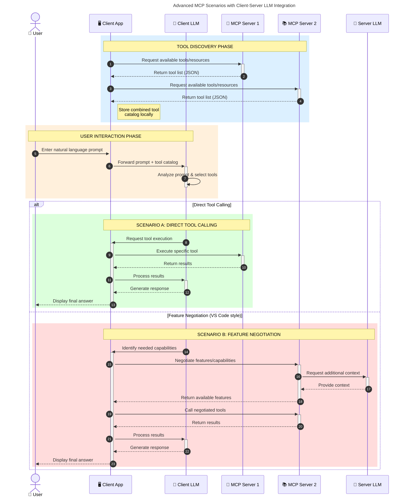

<!--
CO_OP_TRANSLATOR_METADATA:
{
  "original_hash": "0df1ee78a6dd8300f3a040ca5b411c2e",
  "translation_date": "2025-08-12T07:41:55+00:00",
  "source_file": "00-Introduction/README.md",
  "language_code": "fr"
}
-->
# Introduction au protocole de contexte de modèle (MCP) : Pourquoi il est essentiel pour des applications d'IA évolutives

_(Cliquez sur l'image ci-dessus pour visionner la vidéo de cette leçon)_

Les applications d'IA générative représentent une avancée majeure, car elles permettent souvent à l'utilisateur d'interagir avec l'application via des invites en langage naturel. Cependant, à mesure que davantage de temps et de ressources sont investis dans ces applications, il est crucial de s'assurer que vous pouvez intégrer facilement des fonctionnalités et des ressources de manière extensible, que votre application puisse prendre en charge plusieurs modèles, et qu'elle gère les spécificités de chaque modèle. En résumé, construire des applications d'IA générative est simple au départ, mais à mesure qu'elles se développent et deviennent plus complexes, il devient nécessaire de définir une architecture et probablement de s'appuyer sur une norme pour garantir une construction cohérente. C'est là que le MCP intervient pour organiser les choses et fournir une norme.

---

## **🔍 Qu'est-ce que le protocole de contexte de modèle (MCP) ?**

Le **protocole de contexte de modèle (MCP)** est une **interface ouverte et standardisée** qui permet aux modèles de langage de grande taille (LLMs) d'interagir de manière fluide avec des outils externes, des API et des sources de données. Il offre une architecture cohérente pour améliorer les fonctionnalités des modèles d'IA au-delà de leurs données d'entraînement, permettant des systèmes d'IA plus intelligents, évolutifs et réactifs.

---

## **🎯 Pourquoi la standardisation en IA est importante**

À mesure que les applications d'IA générative deviennent plus complexes, il est essentiel d'adopter des normes qui garantissent **l'évolutivité, l'extensibilité, la maintenabilité** et **l'évitement de l'enfermement propriétaire**. Le MCP répond à ces besoins en :

- Unifiant les intégrations entre modèles et outils
- Réduisant les solutions personnalisées fragiles et ponctuelles
- Permettant à plusieurs modèles de différents fournisseurs de coexister dans un même écosystème

**Note :** Bien que le MCP se présente comme une norme ouverte, il n'existe aucun plan pour le standardiser via des organismes de normalisation existants tels que l'IEEE, l'IETF, le W3C, l'ISO ou tout autre organisme.

---

## **📚 Objectifs d'apprentissage**

À la fin de cet article, vous serez capable de :

- Définir le **protocole de contexte de modèle (MCP)** et ses cas d'utilisation
- Comprendre comment le MCP standardise la communication entre modèles et outils
- Identifier les composants clés de l'architecture MCP
- Explorer des applications concrètes du MCP dans des contextes d'entreprise et de développement

---

## **💡 Pourquoi le protocole de contexte de modèle (MCP) est révolutionnaire**

### **🔗 Le MCP résout la fragmentation des interactions en IA**

Avant le MCP, intégrer des modèles avec des outils nécessitait :

- Du code personnalisé pour chaque paire outil-modèle
- Des API non standardisées pour chaque fournisseur
- Des interruptions fréquentes dues aux mises à jour
- Une évolutivité limitée avec l'ajout de nouveaux outils

### **✅ Avantages de la standardisation avec le MCP**

| **Avantage**              | **Description**                                                                |
|---------------------------|--------------------------------------------------------------------------------|
| Interopérabilité          | Les LLMs fonctionnent de manière fluide avec des outils de différents fournisseurs |
| Cohérence                 | Comportement uniforme sur les plateformes et outils                            |
| Réutilisabilité           | Les outils créés une fois peuvent être utilisés dans plusieurs projets et systèmes |
| Développement accéléré    | Réduction du temps de développement grâce à des interfaces standardisées et prêtes à l'emploi |

---

## **🧱 Vue d'ensemble de l'architecture MCP**

Le MCP suit un modèle **client-serveur**, où :

- Les **hôtes MCP** exécutent les modèles d'IA
- Les **clients MCP** initient les requêtes
- Les **serveurs MCP** fournissent le contexte, les outils et les capacités

### **Composants clés :**

- **Ressources** – Données statiques ou dynamiques pour les modèles  
- **Prompts** – Flux de travail prédéfinis pour une génération guidée  
- **Outils** – Fonctions exécutables comme la recherche, les calculs  
- **Échantillonnage** – Comportement agentique via des interactions récursives  

---

## Comment fonctionnent les serveurs MCP

Les serveurs MCP fonctionnent de la manière suivante :

- **Flux de requêtes** :
    1. Une requête est initiée par un utilisateur final ou un logiciel agissant en son nom.
    2. Le **client MCP** envoie la requête à un **hôte MCP**, qui gère l'exécution du modèle d'IA.
    3. Le **modèle d'IA** reçoit l'invite utilisateur et peut demander l'accès à des outils ou données externes via un ou plusieurs appels d'outils.
    4. L'**hôte MCP**, et non le modèle directement, communique avec le(s) **serveur(s) MCP** approprié(s) en utilisant le protocole standardisé.
- **Fonctionnalités de l'hôte MCP** :
    - **Registre d'outils** : Maintient un catalogue des outils disponibles et de leurs capacités.
    - **Authentification** : Vérifie les permissions pour l'accès aux outils.
    - **Gestionnaire de requêtes** : Traite les requêtes d'outils provenant du modèle.
    - **Formateur de réponses** : Structure les sorties des outils dans un format compréhensible par le modèle.
- **Exécution du serveur MCP** :
    - L'**hôte MCP** redirige les appels d'outils vers un ou plusieurs **serveurs MCP**, chacun exposant des fonctions spécialisées (par exemple, recherche, calculs, requêtes de base de données).
    - Les **serveurs MCP** effectuent leurs opérations respectives et renvoient les résultats à l'**hôte MCP** dans un format cohérent.
    - L'**hôte MCP** formate et transmet ces résultats au **modèle d'IA**.
- **Finalisation de la réponse** :
    - Le **modèle d'IA** intègre les sorties des outils dans une réponse finale.
    - L'**hôte MCP** envoie cette réponse au **client MCP**, qui la transmet à l'utilisateur final ou au logiciel appelant.

## 👨‍💻 Comment créer un serveur MCP (avec exemples)

Les serveurs MCP permettent d'étendre les capacités des LLMs en fournissant des données et des fonctionnalités.

Prêt à essayer ? Voici des SDK spécifiques à des langages ou stacks avec des exemples pour créer des serveurs MCP simples :

- **SDK Python** : https://github.com/modelcontextprotocol/python-sdk

- **SDK TypeScript** : https://github.com/modelcontextprotocol/typescript-sdk

- **SDK Java** : https://github.com/modelcontextprotocol/java-sdk

- **SDK C#/.NET** : https://github.com/modelcontextprotocol/csharp-sdk

---

## 🌍 Cas d'utilisation concrets du MCP

Le MCP permet une large gamme d'applications en étendant les capacités de l'IA :

| **Application**              | **Description**                                                                |
|------------------------------|--------------------------------------------------------------------------------|
| Intégration de données d'entreprise | Connecter les LLMs à des bases de données, CRM ou outils internes              |
| Systèmes d'IA agentiques     | Permettre à des agents autonomes d'accéder à des outils et de suivre des flux de travail décisionnels |
| Applications multimodales    | Combiner des outils de texte, image et audio dans une seule application d'IA unifiée |
| Intégration de données en temps réel | Intégrer des données en direct dans les interactions IA pour des résultats plus précis et actuels |

### 🧠 MCP = Norme universelle pour les interactions en IA

Le protocole de contexte de modèle (MCP) agit comme une norme universelle pour les interactions en IA, tout comme l'USB-C a standardisé les connexions physiques pour les appareils. Dans le domaine de l'IA, le MCP fournit une interface cohérente, permettant aux modèles (clients) de s'intégrer de manière fluide avec des outils externes et des fournisseurs de données (serveurs). Cela élimine le besoin de protocoles divers et personnalisés pour chaque API ou source de données.

Sous MCP, un outil compatible MCP (appelé serveur MCP) suit une norme unifiée. Ces serveurs peuvent lister les outils ou actions qu'ils offrent et exécuter ces actions lorsqu'ils sont sollicités par un agent d'IA. Les plateformes d'agents d'IA prenant en charge le MCP sont capables de découvrir les outils disponibles sur les serveurs et de les invoquer via ce protocole standardisé.

### 💡 Facilite l'accès à la connaissance

Au-delà de l'offre d'outils, le MCP facilite également l'accès à la connaissance. Il permet aux applications de fournir un contexte aux modèles de langage de grande taille (LLMs) en les reliant à diverses sources de données. Par exemple, un serveur MCP pourrait représenter le dépôt de documents d'une entreprise, permettant aux agents de récupérer des informations pertinentes à la demande. Un autre serveur pourrait gérer des actions spécifiques comme l'envoi d'e-mails ou la mise à jour de dossiers. Du point de vue de l'agent, ce ne sont que des outils qu'il peut utiliser : certains outils renvoient des données (contexte de connaissance), tandis que d'autres exécutent des actions. Le MCP gère efficacement les deux.

Un agent se connectant à un serveur MCP apprend automatiquement les capacités disponibles et les données accessibles via un format standard. Cette standardisation permet une disponibilité dynamique des outils. Par exemple, l'ajout d'un nouveau serveur MCP au système d'un agent rend ses fonctions immédiatement utilisables sans nécessiter de personnalisation supplémentaire des instructions de l'agent.

Cette intégration simplifiée s'aligne avec le flux illustré dans le diagramme suivant, où les serveurs fournissent à la fois des outils et des connaissances, assurant une collaboration fluide entre les systèmes.

### 👉 Exemple : Solution d'agent évolutive

### 🔄 Scénarios avancés MCP avec intégration LLM côté client

Au-delà de l'architecture MCP de base, il existe des scénarios avancés où le client et le serveur contiennent des LLMs, permettant des interactions plus sophistiquées. Dans le diagramme suivant, l'**application cliente** pourrait être un IDE avec plusieurs outils MCP disponibles pour l'utilisation par le LLM :

---

## 🔐 Avantages pratiques du MCP

Voici les avantages pratiques de l'utilisation du MCP :

- **Actualité** : Les modèles peuvent accéder à des informations à jour au-delà de leurs données d'entraînement
- **Extension des capacités** : Les modèles peuvent utiliser des outils spécialisés pour des tâches pour lesquelles ils n'ont pas été entraînés
- **Réduction des hallucinations** : Les sources de données externes fournissent une base factuelle
- **Confidentialité** : Les données sensibles peuvent rester dans des environnements sécurisés au lieu d'être intégrées dans des invites

---

## 📌 Points clés à retenir

Voici les points clés à retenir sur le MCP :

- Le **MCP** standardise la manière dont les modèles d'IA interagissent avec les outils et les données
- Il favorise **l'extensibilité, la cohérence et l'interopérabilité**
- Le MCP aide à **réduire le temps de développement, améliorer la fiabilité et étendre les capacités des modèles**
- L'architecture client-serveur **permet des applications d'IA flexibles et extensibles**

---

## 🧠 Exercice

Réfléchissez à une application d'IA que vous souhaitez développer.

- Quels **outils ou données externes** pourraient améliorer ses capacités ?
- Comment le MCP pourrait-il rendre l'intégration **plus simple et plus fiable** ?

---

## Ressources supplémentaires

- [Dépôt GitHub du MCP](https://github.com/modelcontextprotocol)

---

## Et après ?

Prochain chapitre : [Chapitre 1 : Concepts de base](../01-CoreConcepts/README.md)

**Avertissement** :  
Ce document a été traduit à l'aide du service de traduction automatique [Co-op Translator](https://github.com/Azure/co-op-translator). Bien que nous nous efforcions d'assurer l'exactitude, veuillez noter que les traductions automatisées peuvent contenir des erreurs ou des inexactitudes. Le document original dans sa langue d'origine doit être considéré comme la source faisant autorité. Pour des informations critiques, il est recommandé de faire appel à une traduction humaine professionnelle. Nous déclinons toute responsabilité en cas de malentendus ou d'interprétations erronées résultant de l'utilisation de cette traduction.