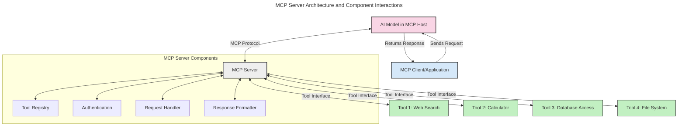
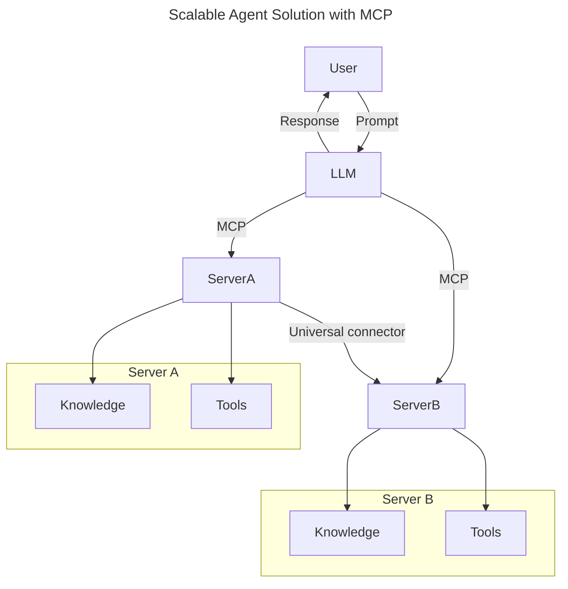
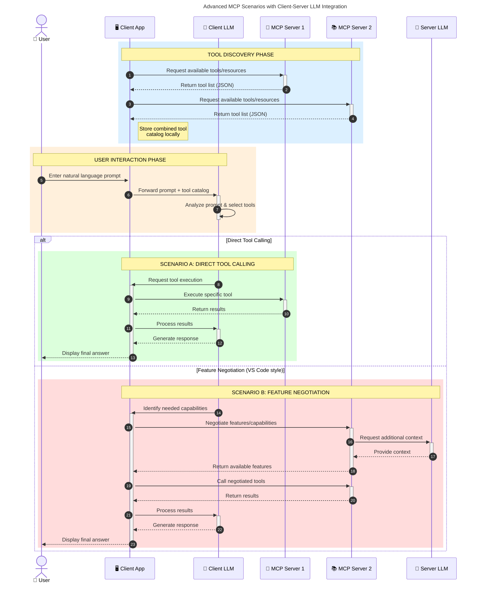

<!--
CO_OP_TRANSLATOR_METADATA:
{
  "original_hash": "1446979020432f512c883848d7eca144",
  "translation_date": "2025-05-29T21:39:53+00:00",
  "source_file": "00-Introduction/README.md",
  "language_code": "fr"
}
-->
# Introduction au Model Context Protocol (MCP) : Pourquoi c’est important pour des applications d’IA évolutives

Les applications d’IA générative représentent une avancée majeure car elles permettent souvent à l’utilisateur d’interagir avec l’application via des requêtes en langage naturel. Cependant, à mesure que vous investissez plus de temps et de ressources dans ces applications, vous souhaitez vous assurer que l’intégration des fonctionnalités et des ressources soit facile à étendre, que votre application puisse gérer plusieurs modèles simultanément, et qu’elle prenne en compte les spécificités de chaque modèle. En résumé, créer des applications Gen AI est simple au départ, mais à mesure qu’elles grandissent et gagnent en complexité, il devient nécessaire de définir une architecture et de s’appuyer sur une norme pour garantir une construction cohérente. C’est là qu’intervient le MCP, pour organiser et fournir un standard.

---

## **🔍 Qu’est-ce que le Model Context Protocol (MCP) ?**

Le **Model Context Protocol (MCP)** est une **interface ouverte et standardisée** qui permet aux grands modèles de langage (LLM) d’interagir de manière fluide avec des outils externes, des API et des sources de données. Il offre une architecture cohérente pour enrichir les fonctionnalités des modèles d’IA au-delà de leurs données d’entraînement, permettant des systèmes d’IA plus intelligents, évolutifs et réactifs.

---

## **🎯 Pourquoi la standardisation est-elle importante en IA**

À mesure que les applications d’IA générative deviennent plus complexes, il est essentiel d’adopter des normes garantissant la **scalabilité, l’extensibilité** et la **maintenabilité**. Le MCP répond à ces besoins en :

- Unifiant les intégrations modèle-outil  
- Réduisant les solutions personnalisées fragiles et ponctuelles  
- Permettant la coexistence de plusieurs modèles dans un même écosystème  

---

## **📚 Objectifs d’apprentissage**

À la fin de cet article, vous serez capable de :

- Définir le **Model Context Protocol (MCP)** et ses cas d’usage  
- Comprendre comment le MCP standardise la communication modèle-outil  
- Identifier les composants clés de l’architecture MCP  
- Explorer des applications concrètes du MCP en entreprise et dans le développement  

---

## **💡 Pourquoi le Model Context Protocol (MCP) change la donne**

### **🔗 MCP résout la fragmentation dans les interactions IA**

Avant le MCP, intégrer des modèles avec des outils nécessitait :

- Du code personnalisé pour chaque paire outil-modèle  
- Des API non standardisées propres à chaque fournisseur  
- Des interruptions fréquentes dues aux mises à jour  
- Une faible scalabilité avec l’ajout d’outils  

### **✅ Avantages de la standardisation MCP**

| **Avantage**             | **Description**                                                                |
|-------------------------|--------------------------------------------------------------------------------|
| Interopérabilité        | Les LLM fonctionnent sans accroc avec des outils de différents fournisseurs    |
| Cohérence               | Comportement uniforme sur toutes les plateformes et outils                     |
| Réutilisabilité         | Les outils développés une fois peuvent être utilisés dans plusieurs projets    |
| Développement accéléré  | Réduction du temps de développement grâce à des interfaces standardisées et plug-and-play |

---

## **🧱 Vue d’ensemble de l’architecture MCP**

Le MCP suit un **modèle client-serveur**, où :

- Les **MCP Hosts** hébergent les modèles IA  
- Les **MCP Clients** initient les requêtes  
- Les **MCP Servers** fournissent le contexte, les outils et les capacités  

### **Composants clés :**

- **Ressources** – Données statiques ou dynamiques pour les modèles  
- **Prompts** – Flux de travail prédéfinis pour guider la génération  
- **Outils** – Fonctions exécutables comme la recherche, les calculs  
- **Sampling** – Comportement agentif via des interactions récursives  

---

## Fonctionnement des MCP Servers

Les serveurs MCP fonctionnent de la manière suivante :

- **Flux de requête** :  
    1. Le MCP Client envoie une requête au modèle IA hébergé dans un MCP Host.  
    2. Le modèle IA détecte quand il a besoin d’outils externes ou de données.  
    3. Le modèle communique avec le MCP Server via le protocole standardisé.

- **Fonctionnalités du MCP Server** :  
    - Registre d’outils : Maintient un catalogue des outils disponibles et leurs capacités.  
    - Authentification : Vérifie les permissions d’accès aux outils.  
    - Gestionnaire de requêtes : Traite les demandes d’outils provenant du modèle.  
    - Formateur de réponses : Structure les résultats des outils dans un format compréhensible par le modèle.

- **Exécution des outils** :  
    - Le serveur redirige les requêtes vers les outils externes appropriés  
    - Les outils exécutent leurs fonctions spécialisées (recherche, calcul, requêtes en base, etc.)  
    - Les résultats sont retournés au modèle dans un format uniforme.

- **Finalisation de la réponse** :  
    - Le modèle IA intègre les résultats des outils dans sa réponse.  
    - La réponse finale est renvoyée à l’application cliente.

## 👨‍💻 Comment construire un MCP Server (avec exemples)

Les serveurs MCP vous permettent d’étendre les capacités des LLM en fournissant données et fonctionnalités.

Prêt à tester ? Voici des exemples de création d’un serveur MCP simple dans plusieurs langages :

- **Exemple Python** : https://github.com/modelcontextprotocol/python-sdk

- **Exemple TypeScript** : https://github.com/modelcontextprotocol/typescript-sdk

- **Exemple Java** : https://github.com/modelcontextprotocol/java-sdk

- **Exemple C#/.NET** : https://github.com/modelcontextprotocol/csharp-sdk

## 🌍 Cas d’usage concrets du MCP

Le MCP permet une large gamme d’applications en étendant les capacités de l’IA :

| **Application**            | **Description**                                                                |
|----------------------------|--------------------------------------------------------------------------------|
| Intégration de données en entreprise | Connecter les LLM à des bases de données, CRM ou outils internes       |
| Systèmes IA agentifs       | Permettre des agents autonomes avec accès aux outils et workflows décisionnels |
| Applications multimodales  | Combiner outils texte, image et audio dans une seule application IA unifiée    |
| Intégration de données en temps réel | Intégrer des données en direct dans les interactions IA pour des résultats plus précis et à jour |

### 🧠 MCP = Standard universel pour les interactions IA

Le Model Context Protocol (MCP) agit comme un standard universel pour les interactions IA, à l’image de la manière dont l’USB-C a standardisé les connexions physiques des appareils. Dans le monde de l’IA, le MCP fournit une interface cohérente, permettant aux modèles (clients) de s’intégrer sans effort avec des outils externes et fournisseurs de données (serveurs). Cela évite d’avoir à gérer des protocoles personnalisés différents pour chaque API ou source de données.

Sous MCP, un outil compatible MCP (appelé MCP server) suit une norme unifiée. Ces serveurs peuvent lister les outils ou actions qu’ils proposent et exécuter ces actions lorsqu’un agent IA les sollicite. Les plateformes d’agents IA compatibles MCP peuvent découvrir les outils disponibles sur les serveurs et les invoquer via ce protocole standard.

### 💡 Facilite l’accès au savoir

Au-delà des outils, le MCP facilite aussi l’accès au savoir. Il permet aux applications d’apporter du contexte aux grands modèles de langage (LLM) en les connectant à diverses sources de données. Par exemple, un serveur MCP peut représenter un dépôt documentaire d’une entreprise, permettant aux agents de récupérer les informations pertinentes à la demande. Un autre serveur peut gérer des actions spécifiques comme l’envoi d’emails ou la mise à jour de dossiers. Du point de vue de l’agent, ce sont simplement des outils qu’il peut utiliser — certains retournent des données (contexte de connaissance), d’autres exécutent des actions. Le MCP gère efficacement les deux.

Un agent se connectant à un serveur MCP apprend automatiquement les capacités disponibles et les données accessibles via un format standard. Cette standardisation permet une disponibilité dynamique des outils. Par exemple, ajouter un nouveau serveur MCP au système d’un agent rend ses fonctions immédiatement utilisables sans nécessiter de personnalisation supplémentaire des instructions de l’agent.

Cette intégration fluide correspond au flux représenté dans le diagramme mermaid, où les serveurs fournissent à la fois outils et connaissances, assurant une collaboration sans faille entre les systèmes.

### 👉 Exemple : solution d’agent évolutive

### 🔄 Scénarios avancés MCP avec intégration LLM côté client

Au-delà de l’architecture MCP de base, il existe des scénarios avancés où client et serveur contiennent des LLM, permettant des interactions plus sophistiquées :

## 🔐 Bénéfices pratiques du MCP

Voici les bénéfices concrets de l’utilisation du MCP :

- **Actualité** : Les modèles peuvent accéder à des informations à jour au-delà de leurs données d’entraînement  
- **Extension des capacités** : Les modèles peuvent utiliser des outils spécialisés pour des tâches non prévues lors de leur entraînement  
- **Réduction des hallucinations** : Les sources de données externes apportent un socle factuel  
- **Confidentialité** : Les données sensibles restent dans des environnements sécurisés au lieu d’être intégrées dans les prompts  

## 📌 Points clés à retenir

Voici les points clés à retenir sur le MCP :

- Le **MCP** standardise la manière dont les modèles IA interagissent avec les outils et les données  
- Favorise **l’extensibilité, la cohérence et l’interopérabilité**  
- Le MCP aide à **réduire le temps de développement, améliorer la fiabilité et étendre les capacités des modèles**  
- L’architecture client-serveur **permet des applications IA flexibles et évolutives**  

## 🧠 Exercice

Pensez à une application IA que vous souhaitez développer.

- Quels **outils ou données externes** pourraient en améliorer les capacités ?  
- Comment le MCP pourrait-il rendre l’intégration **plus simple et fiable** ?  

## Ressources supplémentaires

- [MCP GitHub Repository](https://github.com/modelcontextprotocol)

## Et après ?

Suivant : [Chapitre 1 : Concepts fondamentaux](/01-CoreConcepts/README.md)

**Avertissement** :  
Ce document a été traduit à l'aide du service de traduction automatique [Co-op Translator](https://github.com/Azure/co-op-translator). Bien que nous nous efforcions d'assurer l'exactitude, veuillez noter que les traductions automatiques peuvent contenir des erreurs ou des inexactitudes. Le document original dans sa langue native doit être considéré comme la source faisant foi. Pour les informations critiques, une traduction professionnelle réalisée par un humain est recommandée. Nous déclinons toute responsabilité en cas de malentendus ou de mauvaises interprétations résultant de l'utilisation de cette traduction.