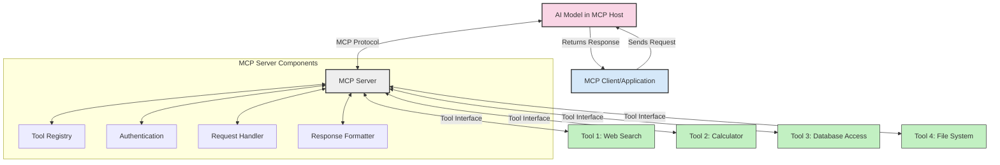
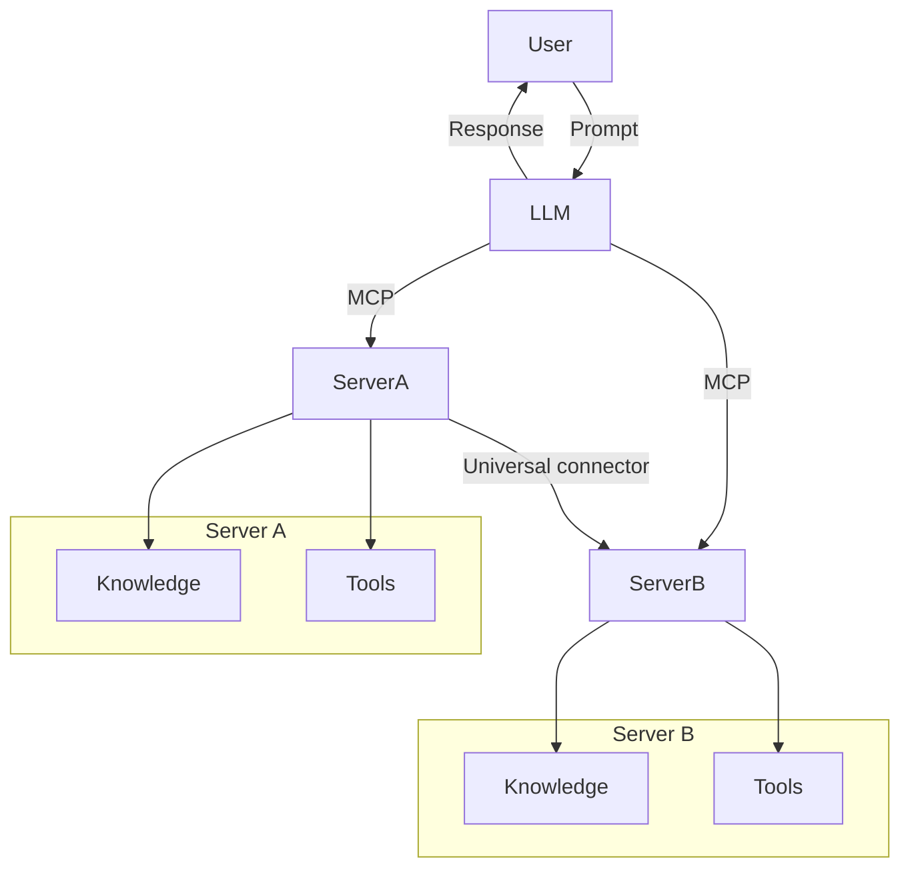

<!--
CO_OP_TRANSLATOR_METADATA:
{
  "original_hash": "02301140adbd807ecf0f17720fa307bc",
  "translation_date": "2025-05-16T14:31:38+00:00",
  "source_file": "00-Introduction/README.md",
  "language_code": "fr"
}
-->
# Introduction au Model Context Protocol (MCP) : Pourquoi c’est important pour des applications IA évolutives

Les applications d’IA générative représentent un grand pas en avant puisqu’elles permettent souvent à l’utilisateur d’interagir avec l’application via des requêtes en langage naturel. Cependant, à mesure que l’on investit plus de temps et de ressources dans ces applications, il est essentiel de pouvoir intégrer facilement des fonctionnalités et des ressources de manière à ce que l’extension soit simple, que votre application puisse gérer plusieurs modèles utilisés simultanément, ainsi que leurs spécificités. En résumé, créer des applications Gen AI est facile au départ, mais à mesure qu’elles grandissent et deviennent plus complexes, il devient nécessaire de définir une architecture et, très probablement, de s’appuyer sur une norme pour garantir que vos applications sont construites de manière cohérente. C’est là qu’intervient MCP pour organiser les choses et fournir un standard.

---

## **🔍 Qu’est-ce que le Model Context Protocol (MCP) ?**

Le **Model Context Protocol (MCP)** est une **interface ouverte et standardisée** qui permet aux grands modèles de langage (LLM) d’interagir de façon fluide avec des outils externes, des API et des sources de données. Il offre une architecture cohérente pour améliorer les fonctionnalités des modèles d’IA au-delà de leurs données d’entraînement, permettant ainsi des systèmes d’IA plus intelligents, évolutifs et réactifs.

---

## **🎯 Pourquoi la standardisation est cruciale en IA**

À mesure que les applications d’IA générative gagnent en complexité, il devient essentiel d’adopter des standards garantissant la **scalabilité, l’extensibilité** et la **maintenabilité**. MCP répond à ces besoins en :

- Unifiant les intégrations modèle-outil
- Réduisant les solutions personnalisées fragiles et ponctuelles
- Permettant la coexistence de plusieurs modèles dans un même écosystème

---

## **📚 Objectifs d’apprentissage**

À la fin de cet article, vous serez capable de :

- Définir le **Model Context Protocol (MCP)** et ses cas d’usage
- Comprendre comment MCP standardise la communication entre modèles et outils
- Identifier les composants clés de l’architecture MCP
- Explorer des applications concrètes de MCP en entreprise et en développement

---

## **💡 Pourquoi le Model Context Protocol (MCP) change la donne**

### **🔗 MCP résout la fragmentation dans les interactions IA**

Avant MCP, intégrer des modèles avec des outils nécessitait :

- Du code personnalisé pour chaque couple outil-modèle
- Des API non standardisées pour chaque fournisseur
- Des ruptures fréquentes dues aux mises à jour
- Une faible évolutivité avec l’ajout d’outils

### **✅ Avantages de la standardisation MCP**

| **Avantage**              | **Description**                                                                 |
|---------------------------|---------------------------------------------------------------------------------|
| Interopérabilité          | Les LLM fonctionnent sans accroc avec des outils de différents fournisseurs     |
| Cohérence                 | Comportement uniforme sur toutes les plateformes et outils                     |
| Réutilisabilité           | Les outils développés une fois peuvent être utilisés dans plusieurs projets     |
| Développement accéléré    | Réduction du temps de développement grâce à des interfaces standardisées plug-and-play |

---

## **🧱 Vue d’ensemble de l’architecture MCP**

MCP suit un **modèle client-serveur**, où :

- Les **MCP Hosts** hébergent les modèles IA
- Les **MCP Clients** initient les requêtes
- Les **MCP Servers** fournissent contexte, outils et capacités

### **Composants clés :**

- **Ressources** – Données statiques ou dynamiques pour les modèles  
- **Prompts** – Flux de travail prédéfinis pour une génération guidée  
- **Outils** – Fonctions exécutables comme la recherche, les calculs  
- **Sampling** – Comportement agentique via des interactions récursives

---

## Fonctionnement des MCP Servers

Les serveurs MCP fonctionnent de la manière suivante :

- **Flux de requêtes** :  
    1. Le MCP Client envoie une requête au modèle IA hébergé sur un MCP Host.  
    2. Le modèle IA détecte quand il a besoin d’outils ou de données externes.  
    3. Le modèle communique avec le MCP Server via le protocole standardisé.

- **Fonctionnalités du MCP Server** :  
    - Registre d’outils : Gère un catalogue des outils disponibles et leurs capacités.  
    - Authentification : Vérifie les permissions d’accès aux outils.  
    - Gestionnaire de requêtes : Traite les demandes d’outils provenant du modèle.  
    - Formateur de réponses : Structure les résultats des outils dans un format compréhensible par le modèle.

- **Exécution des outils** :  
    - Le serveur redirige les requêtes vers les outils externes appropriés  
    - Les outils réalisent leurs fonctions spécialisées (recherche, calcul, requêtes en base de données, etc.)  
    - Les résultats sont renvoyés au modèle dans un format cohérent.

- **Finalisation de la réponse** :  
    - Le modèle IA intègre les résultats des outils dans sa réponse.  
    - La réponse finale est envoyée à l’application cliente.

## 👨‍💻 Comment construire un MCP Server (avec exemples)

Les serveurs MCP vous permettent d’étendre les capacités des LLM en fournissant données et fonctionnalités.

Prêt à essayer ? Voici des exemples pour créer un serveur MCP simple dans différents langages :

- **Exemple Python** : https://github.com/modelcontextprotocol/python-sdk

- **Exemple TypeScript** : https://github.com/modelcontextprotocol/typescript-sdk

- **Exemple Java** : https://github.com/modelcontextprotocol/java-sdk

- **Exemple C#/.NET** : https://github.com/modelcontextprotocol/csharp-sdk

## 🌍 Cas d’usage concrets pour MCP

MCP permet une large gamme d’applications en étendant les capacités de l’IA :

| **Application**               | **Description**                                                              |
|------------------------------|------------------------------------------------------------------------------|
| Intégration de données d’entreprise | Connecter les LLM à des bases de données, CRM ou outils internes           |
| Systèmes d’IA agentiques     | Permettre des agents autonomes avec accès aux outils et workflows décisionnels |
| Applications multimodales     | Combiner texte, image et audio dans une même application IA unifiée          |
| Intégration de données en temps réel | Apporter des données en direct dans les interactions IA pour des résultats plus précis et actuels |

### 🧠 MCP = Standard universel pour les interactions IA

Le Model Context Protocol (MCP) agit comme un standard universel pour les interactions IA, à l’image de ce que l’USB-C a fait pour les connexions physiques entre appareils. Dans l’univers de l’IA, MCP fournit une interface cohérente, permettant aux modèles (clients) de s’intégrer facilement avec des outils externes et fournisseurs de données (serveurs). Cela élimine la nécessité de protocoles personnalisés et variés pour chaque API ou source de données.

Avec MCP, un outil compatible (appelé MCP server) suit une norme unifiée. Ces serveurs peuvent lister les outils ou actions qu’ils proposent et exécuter ces actions à la demande d’un agent IA. Les plateformes d’agents IA qui supportent MCP peuvent découvrir les outils disponibles sur les serveurs et les invoquer via ce protocole standard.

### 💡 Facilite l’accès au savoir

Au-delà de fournir des outils, MCP facilite aussi l’accès au savoir. Il permet aux applications d’apporter du contexte aux grands modèles de langage (LLM) en les reliant à diverses sources de données. Par exemple, un MCP server peut représenter un référentiel documentaire d’une entreprise, permettant aux agents de récupérer des informations pertinentes à la demande. Un autre serveur peut gérer des actions spécifiques comme l’envoi d’emails ou la mise à jour d’enregistrements. Du point de vue de l’agent, ce sont simplement des outils utilisables — certains retournent des données (contexte de connaissance), d’autres exécutent des actions. MCP gère efficacement les deux.

Un agent qui se connecte à un MCP server apprend automatiquement les capacités disponibles et les données accessibles via un format standard. Cette standardisation permet une disponibilité dynamique des outils. Par exemple, ajouter un nouveau MCP server au système d’un agent rend ses fonctions immédiatement utilisables sans nécessiter de personnalisation supplémentaire des instructions de l’agent.

Cette intégration simplifiée correspond au flux illustré dans le diagramme mermaid, où les serveurs fournissent à la fois outils et connaissances, assurant une collaboration fluide entre systèmes.

### 👉 Exemple : Solution d’agent évolutive

## 🔐 Avantages pratiques du MCP

Voici quelques bénéfices concrets à utiliser MCP :

- **Actualité** : Les modèles peuvent accéder à des informations à jour au-delà de leurs données d’entraînement  
- **Extension des capacités** : Les modèles peuvent exploiter des outils spécialisés pour des tâches non prévues lors de l’entraînement  
- **Réduction des hallucinations** : Les sources de données externes apportent une base factuelle  
- **Confidentialité** : Les données sensibles restent dans des environnements sécurisés plutôt que d’être intégrées dans les prompts

## 📌 Points clés à retenir

Voici les points clés pour utiliser MCP :

- **MCP** standardise la manière dont les modèles IA interagissent avec les outils et les données  
- Favorise **l’extensibilité, la cohérence et l’interopérabilité**  
- MCP aide à **réduire le temps de développement, améliorer la fiabilité et étendre les capacités des modèles**  
- L’architecture client-serveur **permet des applications IA flexibles et extensibles**

## 🧠 Exercice

Réfléchissez à une application IA que vous souhaitez développer.

- Quels **outils externes ou données** pourraient améliorer ses capacités ?  
- En quoi MCP pourrait-il rendre l’intégration **plus simple et plus fiable** ?

## Ressources supplémentaires

- [MCP GitHub Repository](https://github.com/modelcontextprotocol)

## Et après ?

Suivant : [Chapitre 1 : Concepts fondamentaux](/01-CoreConcepts/README.md)

**Avertissement** :  
Ce document a été traduit à l’aide du service de traduction automatique [Co-op Translator](https://github.com/Azure/co-op-translator). Bien que nous nous efforçons d’assurer l’exactitude, veuillez noter que les traductions automatiques peuvent contenir des erreurs ou des inexactitudes. Le document original dans sa langue d’origine doit être considéré comme la source faisant foi. Pour des informations critiques, une traduction professionnelle réalisée par un humain est recommandée. Nous ne sommes pas responsables des malentendus ou des mauvaises interprétations résultant de l’utilisation de cette traduction.