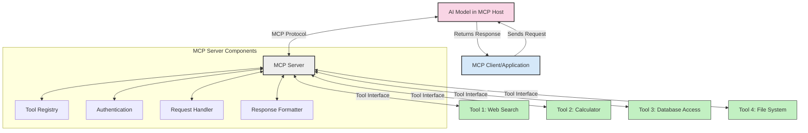
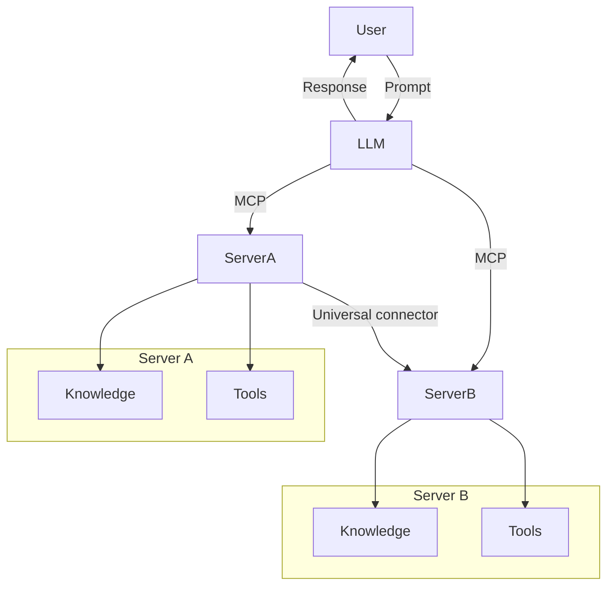

<!--
CO_OP_TRANSLATOR_METADATA:
{
  "original_hash": "cf84f987e1b771d2201408e110dfd2db",
  "translation_date": "2025-05-20T15:32:51+00:00",
  "source_file": "00-Introduction/README.md",
  "language_code": "fr"
}
-->
# Introduction au Model Context Protocol (MCP) : Pourquoi c’est essentiel pour des applications IA évolutives

Les applications d’IA générative représentent un grand pas en avant, car elles permettent souvent à l’utilisateur d’interagir avec l’application via des commandes en langage naturel. Cependant, à mesure que vous investissez plus de temps et de ressources dans ces applications, il est important de pouvoir intégrer facilement des fonctionnalités et des ressources de manière à faciliter leur extension, à gérer plusieurs modèles simultanément et leurs spécificités. En résumé, créer des applications d’IA générative est simple au départ, mais à mesure qu’elles grandissent et deviennent plus complexes, il faut commencer à définir une architecture et probablement s’appuyer sur une norme pour garantir une construction cohérente des applications. C’est là que le MCP intervient pour organiser les choses et fournir un standard.

---

## **🔍 Qu’est-ce que le Model Context Protocol (MCP) ?**

Le **Model Context Protocol (MCP)** est une **interface ouverte et standardisée** qui permet aux grands modèles de langage (LLM) d’interagir de manière fluide avec des outils externes, des API et des sources de données. Il offre une architecture cohérente pour étendre les fonctionnalités des modèles d’IA au-delà de leurs données d’entraînement, permettant ainsi des systèmes d’IA plus intelligents, évolutifs et réactifs.

---

## **🎯 Pourquoi la standardisation est-elle importante en IA ?**

À mesure que les applications d’IA générative gagnent en complexité, il est essentiel d’adopter des standards garantissant la **scalabilité, l’extensibilité** et la **maintenabilité**. Le MCP répond à ces besoins en :

- Unifiant les intégrations modèle-outil
- Réduisant les solutions personnalisées fragiles et ponctuelles
- Permettant la coexistence de plusieurs modèles dans un même écosystème

---

## **📚 Objectifs d’apprentissage**

À la fin de cet article, vous serez capable de :

- Définir le **Model Context Protocol (MCP)** et ses cas d’usage
- Comprendre comment le MCP standardise la communication entre modèles et outils
- Identifier les composants clés de l’architecture MCP
- Explorer des applications concrètes du MCP en entreprise et en développement

---

## **💡 Pourquoi le Model Context Protocol (MCP) change la donne**

### **🔗 Le MCP résout la fragmentation des interactions en IA**

Avant le MCP, intégrer des modèles avec des outils nécessitait :

- Du code personnalisé pour chaque paire outil-modèle
- Des API non standardisées pour chaque fournisseur
- Des interruptions fréquentes dues aux mises à jour
- Une mauvaise évolutivité avec l’ajout d’outils

### **✅ Avantages de la standardisation MCP**

| **Avantage**             | **Description**                                                                 |
|--------------------------|---------------------------------------------------------------------------------|
| Interopérabilité         | Les LLM fonctionnent sans accroc avec des outils de différents fournisseurs      |
| Cohérence                | Comportement uniforme sur toutes les plateformes et outils                      |
| Réutilisabilité          | Les outils développés une fois peuvent être utilisés dans plusieurs projets      |
| Développement accéléré   | Réduction du temps de développement grâce à des interfaces standardisées plug-and-play |

---

## **🧱 Vue d’ensemble de l’architecture MCP**

Le MCP suit un **modèle client-serveur**, où :

- Les **MCP Hosts** hébergent les modèles d’IA
- Les **MCP Clients** initient les requêtes
- Les **MCP Servers** fournissent contexte, outils et capacités

### **Composants clés :**

- **Resources** – Données statiques ou dynamiques pour les modèles  
- **Prompts** – Flux de travail prédéfinis pour guider la génération  
- **Tools** – Fonctions exécutables comme la recherche, les calculs  
- **Sampling** – Comportement agentif via des interactions récursives

---

## Fonctionnement des MCP Servers

Les serveurs MCP fonctionnent de la manière suivante :

- **Flux de requête** :  
    1. Le MCP Client envoie une requête au modèle d’IA hébergé sur un MCP Host.  
    2. Le modèle d’IA détecte quand il a besoin d’outils ou de données externes.  
    3. Le modèle communique avec le MCP Server via le protocole standardisé.

- **Fonctionnalités du MCP Server** :  
    - Registre d’outils : Maintient un catalogue des outils disponibles et leurs capacités.  
    - Authentification : Vérifie les permissions d’accès aux outils.  
    - Gestionnaire de requêtes : Traite les demandes d’outils venant du modèle.  
    - Formateur de réponses : Structure les résultats des outils dans un format compréhensible par le modèle.

- **Exécution des outils** :  
    - Le serveur oriente les requêtes vers les outils externes appropriés  
    - Les outils exécutent leurs fonctions spécialisées (recherche, calcul, requêtes base de données, etc.)  
    - Les résultats sont renvoyés au modèle dans un format uniforme.

- **Finalisation de la réponse** :  
    - Le modèle d’IA intègre les résultats des outils dans sa réponse.  
    - La réponse finale est envoyée à l’application cliente.

## 👨‍💻 Comment créer un MCP Server (avec exemples)

Les serveurs MCP permettent d’étendre les capacités des LLM en fournissant données et fonctionnalités.

Prêt à essayer ? Voici des exemples pour créer un serveur MCP simple dans différents langages :

- **Exemple Python** : https://github.com/modelcontextprotocol/python-sdk

- **Exemple TypeScript** : https://github.com/modelcontextprotocol/typescript-sdk

- **Exemple Java** : https://github.com/modelcontextprotocol/java-sdk

- **Exemple C#/.NET** : https://github.com/modelcontextprotocol/csharp-sdk

## 🌍 Cas d’usage concrets pour MCP

Le MCP permet une large gamme d’applications en étendant les capacités de l’IA :

| **Application**               | **Description**                                                                 |
|------------------------------|---------------------------------------------------------------------------------|
| Intégration de données en entreprise | Connecter les LLM aux bases de données, CRM ou outils internes                  |
| Systèmes d’IA agentifs        | Permettre aux agents autonomes d’accéder aux outils et de prendre des décisions |
| Applications multimodales      | Combiner texte, image et audio dans une application IA unifiée                  |
| Intégration de données en temps réel | Intégrer des données en direct pour des résultats plus précis et à jour          |

### 🧠 MCP = Standard universel pour les interactions IA

Le Model Context Protocol (MCP) agit comme un standard universel pour les interactions en IA, à l’image de ce que l’USB-C a apporté aux connexions physiques des appareils. Dans le monde de l’IA, le MCP fournit une interface cohérente permettant aux modèles (clients) de s’intégrer facilement avec des outils externes et des fournisseurs de données (serveurs). Cela élimine la nécessité de protocoles divers et personnalisés pour chaque API ou source de données.

Avec le MCP, un outil compatible (appelé serveur MCP) suit un standard unifié. Ces serveurs peuvent lister les outils ou actions qu’ils proposent et exécuter ces actions lorsqu’un agent IA en fait la demande. Les plateformes d’agents IA compatibles MCP peuvent découvrir les outils disponibles sur les serveurs et les invoquer via ce protocole standard.

### 💡 Facilite l’accès au savoir

Au-delà de fournir des outils, le MCP facilite aussi l’accès au savoir. Il permet aux applications de fournir un contexte aux grands modèles de langage (LLM) en les reliant à diverses sources de données. Par exemple, un serveur MCP peut représenter un référentiel documentaire d’entreprise, permettant aux agents de récupérer des informations pertinentes à la demande. Un autre serveur pourrait gérer des actions spécifiques comme l’envoi d’e-mails ou la mise à jour de dossiers. Du point de vue de l’agent, ce sont simplement des outils utilisables — certains retournent des données (contexte de connaissance), d’autres effectuent des actions. Le MCP gère efficacement les deux.

Un agent se connectant à un serveur MCP apprend automatiquement les capacités disponibles et les données accessibles via un format standard. Cette standardisation permet une disponibilité dynamique des outils. Par exemple, ajouter un nouveau serveur MCP au système d’un agent rend ses fonctions immédiatement utilisables sans nécessiter de personnalisation supplémentaire des instructions de l’agent.

Cette intégration fluide correspond au flux illustré dans le diagramme mermaid, où les serveurs fournissent à la fois outils et connaissances, assurant une collaboration transparente entre systèmes.

### 👉 Exemple : Solution agent évolutive

## 🔐 Avantages pratiques du MCP

Voici les avantages concrets de l’utilisation du MCP :

- **Actualité** : Les modèles peuvent accéder à des informations à jour au-delà de leurs données d’entraînement  
- **Extension des capacités** : Les modèles peuvent exploiter des outils spécialisés pour des tâches pour lesquelles ils n’ont pas été entraînés  
- **Réduction des hallucinations** : Les sources de données externes apportent un ancrage factuel  
- **Confidentialité** : Les données sensibles restent dans des environnements sécurisés au lieu d’être intégrées dans les prompts

## 📌 Points clés à retenir

Voici les points essentiels pour utiliser le MCP :

- Le **MCP** standardise la manière dont les modèles IA interagissent avec les outils et les données  
- Favorise l’**extensibilité, la cohérence et l’interopérabilité**  
- Le MCP aide à **réduire le temps de développement, améliorer la fiabilité et étendre les capacités des modèles**  
- L’architecture client-serveur **permet des applications IA flexibles et évolutives**

## 🧠 Exercice

Réfléchissez à une application IA que vous souhaitez développer.

- Quels **outils externes ou données** pourraient améliorer ses capacités ?  
- En quoi le MCP pourrait-il rendre l’intégration **plus simple et fiable** ?

## Ressources supplémentaires

- [Dépôt GitHub MCP](https://github.com/modelcontextprotocol)

## Et ensuite

Suivant : [Chapitre 1 : Concepts fondamentaux](/01-CoreConcepts/README.md)

**Avertissement** :  
Ce document a été traduit à l’aide du service de traduction automatique [Co-op Translator](https://github.com/Azure/co-op-translator). Bien que nous nous efforçons d’assurer l’exactitude, veuillez noter que les traductions automatiques peuvent contenir des erreurs ou des inexactitudes. Le document original dans sa langue d’origine doit être considéré comme la source faisant foi. Pour les informations critiques, il est recommandé de recourir à une traduction professionnelle réalisée par un humain. Nous déclinons toute responsabilité en cas de malentendus ou d’interprétations erronées résultant de l’utilisation de cette traduction.