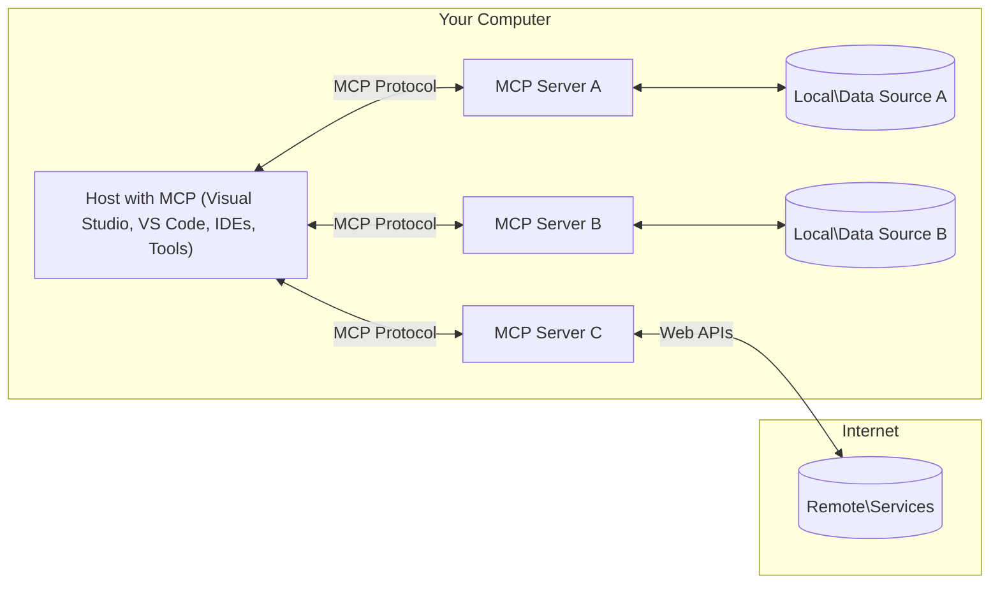

<!--
CO_OP_TRANSLATOR_METADATA:
{
  "original_hash": "11010ad254e48628bb6a457be2211640",
  "translation_date": "2025-08-12T07:40:11+00:00",
  "source_file": "01-CoreConcepts/README.md",
  "language_code": "fr"
}
-->
# 📖 Concepts Fondamentaux de MCP : Maîtriser le Protocole de Contexte Modèle pour l'Intégration de l'IA

[](https://youtu.be/earDzWGtE84)

_(Cliquez sur l'image ci-dessus pour visionner la vidéo de cette leçon)_

Le [Protocole de Contexte Modèle (MCP)](https://github.com/modelcontextprotocol) est un cadre puissant et standardisé qui optimise la communication entre les grands modèles de langage (LLMs) et les outils, applications et sources de données externes. Ce guide vous accompagnera à travers les concepts fondamentaux de MCP, en vous assurant de comprendre son architecture client-serveur, ses composants essentiels, ses mécanismes de communication et ses meilleures pratiques d'implémentation.

## Vue d'ensemble

Cette leçon explore l'architecture fondamentale et les composants qui constituent l'écosystème du Protocole de Contexte Modèle (MCP). Vous apprendrez l'architecture client-serveur, les composants clés et les mécanismes de communication qui alimentent les interactions MCP.

## 👩‍🎓 Objectifs d'apprentissage clés

À la fin de cette leçon, vous serez capable de :

- Comprendre l'architecture client-serveur de MCP.
- Identifier les rôles et responsabilités des Hôtes, Clients et Serveurs.
- Analyser les fonctionnalités principales qui font de MCP une couche d'intégration flexible.
- Apprendre comment l'information circule dans l'écosystème MCP.
- Acquérir des connaissances pratiques grâce à des exemples de code en .NET, Java, Python et JavaScript.

## 🔎 Architecture de MCP : Une analyse approfondie

L'écosystème MCP repose sur un modèle client-serveur. Cette structure modulaire permet aux applications d'IA d'interagir efficacement avec des outils, bases de données, API et ressources contextuelles. Décomposons cette architecture en ses composants principaux.

Au cœur de MCP, on trouve une architecture client-serveur où une application hôte peut se connecter à plusieurs serveurs :



- **Hôtes MCP** : Programmes comme VSCode, Claude Desktop, IDEs ou outils d'IA qui souhaitent accéder aux données via MCP.
- **Clients MCP** : Clients du protocole qui maintiennent des connexions 1:1 avec les serveurs.
- **Serveurs MCP** : Programmes légers qui exposent chacun des capacités spécifiques via le Protocole de Contexte Modèle standardisé.
- **Sources de données locales** : Fichiers, bases de données et services de votre ordinateur auxquels les serveurs MCP peuvent accéder en toute sécurité.
- **Services distants** : Systèmes externes disponibles sur Internet auxquels les serveurs MCP peuvent se connecter via des API.

Le Protocole MCP est une norme en constante évolution. Vous pouvez consulter les dernières mises à jour de la [spécification du protocole](https://modelcontextprotocol.io/specification/2025-06-18/).

### 1. Hôtes

Dans le Protocole de Contexte Modèle (MCP), les Hôtes jouent un rôle crucial en tant qu'interface principale par laquelle les utilisateurs interagissent avec le protocole. Les Hôtes sont des applications ou environnements qui initient des connexions avec les serveurs MCP pour accéder aux données, outils et invites. Des exemples d'Hôtes incluent des environnements de développement intégrés (IDEs) comme Visual Studio Code, des outils d'IA comme Claude Desktop, ou des agents personnalisés conçus pour des tâches spécifiques.

**Les Hôtes** sont des applications qui initient des connexions avec les LLMs. Ils :

- Exécutent ou interagissent avec des modèles d'IA pour générer des réponses.
- Initient des connexions avec les serveurs MCP.
- Gèrent le flux de conversation et l'interface utilisateur.
- Contrôlent les permissions et les contraintes de sécurité.
- Gèrent le consentement des utilisateurs pour le partage de données et l'exécution d'outils.

### 2. Clients

Les Clients sont des composants essentiels qui facilitent l'interaction entre les Hôtes et les serveurs MCP. Ils agissent comme des intermédiaires, permettant aux Hôtes d'accéder et d'utiliser les fonctionnalités fournies par les serveurs MCP. Ils jouent un rôle crucial pour garantir une communication fluide et un échange de données efficace dans l'architecture MCP.

**Les Clients** sont des connecteurs au sein de l'application hôte. Ils :

- Envoient des requêtes aux serveurs avec des invites/instructions.
- Négocient les capacités avec les serveurs.
- Gèrent les demandes d'exécution d'outils provenant des modèles.
- Traitent et affichent les réponses aux utilisateurs.

### 3. Serveurs

Les Serveurs sont responsables de la gestion des requêtes des clients MCP et de la fourniture de réponses appropriées. Le plus souvent, les serveurs agissent comme des outils qui fournissent une capacité spécifique au LLM. Ils gèrent diverses opérations telles que la récupération de données, l'exécution d'outils et la génération d'invites. Les Serveurs garantissent que la communication entre les Clients et les Hôtes est efficace et fiable, tout en maintenant l'intégrité du processus d'interaction.

**Les Serveurs** sont des services qui fournissent du contexte et des capacités. Ils :

- Enregistrent les fonctionnalités disponibles (ressources, invites, outils).
- Reçoivent et exécutent les appels d'outils provenant du client.
- Fournissent des informations contextuelles pour améliorer les réponses du modèle.
- Renvoient les résultats au client.
- Maintiennent l'état entre les interactions si nécessaire.

Les Serveurs peuvent être développés par n'importe qui pour étendre les capacités des modèles avec des fonctionnalités spécialisées.

### 4. Fonctionnalités des Serveurs

Les Serveurs dans le Protocole de Contexte Modèle (MCP) fournissent des blocs de construction fondamentaux qui permettent des interactions riches entre les Clients, les Hôtes et les modèles de langage. Ces fonctionnalités sont conçues pour améliorer les capacités de MCP en offrant un contexte structuré, des outils et des invites.

Les serveurs MCP peuvent offrir les fonctionnalités suivantes :

#### 📑 Ressources 

Les Ressources dans le Protocole de Contexte Modèle (MCP) englobent divers types de contexte et de données qui peuvent être utilisés par les utilisateurs ou les modèles d'IA. Cela inclut :

- **Données contextuelles** : Informations et contexte que les utilisateurs ou les modèles d'IA peuvent exploiter pour la prise de décision et l'exécution des tâches.
- **Bases de connaissances et dépôts de documents** : Collections de données structurées et non structurées, telles que des articles, des manuels et des documents de recherche, qui fournissent des informations précieuses.
- **Fichiers locaux et bases de données** : Données stockées localement sur des appareils ou dans des bases de données, accessibles pour traitement et analyse.
- **APIs et services web** : Interfaces et services externes qui offrent des données et des fonctionnalités supplémentaires, permettant une intégration avec diverses ressources et outils en ligne.

Un exemple de ressource peut être un schéma de base de données ou un fichier accessible comme suit :

```text
file://log.txt
database://schema
```

### 🤖 Invites
Les Invites dans le Protocole de Contexte Modèle (MCP) incluent divers modèles prédéfinis et schémas d'interaction conçus pour rationaliser les flux de travail des utilisateurs et améliorer la communication. Cela inclut :

- **Messages et flux de travail modélisés** : Messages et processus préstructurés qui guident les utilisateurs à travers des tâches et interactions spécifiques.
- **Schémas d'interaction prédéfinis** : Séquences standardisées d'actions et de réponses qui facilitent une communication cohérente et efficace.
- **Modèles de conversation spécialisés** : Modèles personnalisables adaptés à des types spécifiques de conversations, garantissant des interactions pertinentes et contextuellement appropriées.

Un modèle d'invite pourrait ressembler à ceci :

```markdown
Generate a product slogan based on the following {{product}} with the following {{keywords}}
```

#### ⛏️ Outils

Les Outils dans le Protocole de Contexte Modèle (MCP) sont des fonctions que le modèle d'IA peut exécuter pour accomplir des tâches spécifiques. Ces outils sont conçus pour améliorer les capacités du modèle d'IA en fournissant des opérations structurées et fiables. Les aspects clés incluent :

- **Fonctions exécutables par le modèle d'IA** : Les outils sont des fonctions exécutables que le modèle d'IA peut invoquer pour effectuer diverses tâches.
- **Nom unique et description** : Chaque outil a un nom distinct et une description détaillée expliquant son objectif et ses fonctionnalités.
- **Paramètres et résultats** : Les outils acceptent des paramètres spécifiques et renvoient des résultats structurés, garantissant des résultats cohérents et prévisibles.
- **Fonctions discrètes** : Les outils exécutent des fonctions discrètes telles que des recherches web, des calculs et des requêtes de bases de données.

Un exemple d'outil pourrait ressembler à ceci :

```typescript
server.tool(
  "GetProducts",
  {
    pageSize: z.string().optional(),
    pageCount: z.string().optional()
  }, () => {
    // return results from API
  }
)
```

## Fonctionnalités des Clients
Dans le Protocole de Contexte Modèle (MCP), les Clients offrent plusieurs fonctionnalités clés aux Serveurs, améliorant la fonctionnalité globale et l'interaction au sein du protocole. Une des fonctionnalités notables est l'Échantillonnage.

### 👉 Échantillonnage

- **Comportements agentiques initiés par le serveur** : Les Clients permettent aux Serveurs d'initier des actions ou comportements spécifiques de manière autonome, améliorant les capacités dynamiques du système.
- **Interactions récursives avec les LLMs** : Cette fonctionnalité permet des interactions récursives avec les grands modèles de langage (LLMs), permettant un traitement plus complexe et itératif des tâches.
- **Demande de complétions supplémentaires du modèle** : Les Serveurs peuvent demander des complétions supplémentaires au modèle, garantissant que les réponses sont complètes et contextuellement pertinentes.

## Flux d'information dans MCP

Le Protocole de Contexte Modèle (MCP) définit un flux structuré d'informations entre les Hôtes, Clients, Serveurs et Modèles. Comprendre ce flux aide à clarifier comment les requêtes des utilisateurs sont traitées et comment les outils et données externes sont intégrés dans les réponses des modèles.

- **L'Hôte initie la connexion**  
  L'application hôte (comme un IDE ou une interface de chat) établit une connexion à un serveur MCP, généralement via STDIO, WebSocket ou un autre transport pris en charge.

- **Négociation des capacités**  
  Le Client (intégré dans l'Hôte) et le Serveur échangent des informations sur leurs fonctionnalités, outils, ressources et versions de protocole prises en charge. Cela garantit que les deux parties comprennent les capacités disponibles pour la session.

- **Requête utilisateur**  
  L'utilisateur interagit avec l'Hôte (par exemple, entre une invite ou une commande). L'Hôte collecte cette entrée et la transmet au Client pour traitement.

- **Utilisation des ressources ou outils**  
  - Le Client peut demander un contexte ou des ressources supplémentaires au Serveur (comme des fichiers, des entrées de base de données ou des articles de base de connaissances) pour enrichir la compréhension du modèle.
  - Si le modèle détermine qu'un outil est nécessaire (par exemple, pour récupérer des données, effectuer un calcul ou appeler une API), le Client envoie une requête d'invocation d'outil au Serveur, en spécifiant le nom de l'outil et les paramètres.

- **Exécution par le Serveur**  
  Le Serveur reçoit la requête de ressource ou d'outil, exécute les opérations nécessaires (comme exécuter une fonction, interroger une base de données ou récupérer un fichier) et renvoie les résultats au Client dans un format structuré.

- **Génération de réponse**  
  Le Client intègre les réponses du Serveur (données de ressources, résultats d'outils, etc.) dans l'interaction en cours avec le modèle. Le modèle utilise ces informations pour générer une réponse complète et contextuellement pertinente.

- **Présentation des résultats**  
  L'Hôte reçoit la sortie finale du Client et la présente à l'utilisateur, incluant souvent à la fois le texte généré par le modèle et les résultats des exécutions d'outils ou des recherches de ressources.

Ce flux permet à MCP de prendre en charge des applications d'IA avancées, interactives et contextuellement conscientes en connectant de manière transparente les modèles avec des outils et des sources de données externes.

## Détails du protocole

MCP (Protocole de Contexte Modèle) est construit sur [JSON-RPC 2.0](https://www.jsonrpc.org/), fournissant un format de message standardisé et indépendant du langage pour la communication entre Hôtes, Clients et Serveurs. Cette base permet des interactions fiables, structurées et extensibles sur des plateformes et langages de programmation divers.

### Fonctionnalités clés du protocole

MCP étend JSON-RPC 2.0 avec des conventions supplémentaires pour l'invocation d'outils, l'accès aux ressources et la gestion des invites. Il prend en charge plusieurs couches de transport (STDIO, WebSocket, SSE) et permet une communication sécurisée, extensible et indépendante du langage entre les composants.

#### 🧢 Protocole de base

- **Format de message JSON-RPC** : Toutes les requêtes et réponses utilisent la spécification JSON-RPC 2.0, garantissant une structure cohérente pour les appels de méthode, les paramètres, les résultats et la gestion des erreurs.
- **Connexions avec état** : Les sessions MCP maintiennent un état à travers plusieurs requêtes, prenant en charge des conversations continues, l'accumulation de contexte et la gestion des ressources.
- **Négociation des capacités** : Lors de l'établissement de la connexion, les Clients et Serveurs échangent des informations sur les fonctionnalités prises en charge, les versions du protocole, les outils disponibles et les ressources. Cela garantit que les deux parties comprennent les capacités de l'autre et peuvent s'adapter en conséquence.

#### ➕ Utilitaires supplémentaires

Voici quelques utilitaires supplémentaires et extensions de protocole que MCP fournit pour améliorer l'expérience des développeurs et permettre des scénarios avancés :

- **Options de configuration** : MCP permet une configuration dynamique des paramètres de session, tels que les permissions d'outils, l'accès aux ressources et les paramètres du modèle, adaptés à chaque interaction.
- **Suivi de progression** : Les opérations longues peuvent signaler des mises à jour de progression, permettant des interfaces utilisateur réactives et une meilleure expérience utilisateur lors de tâches complexes.
- **Annulation de requêtes** : Les Clients peuvent annuler des requêtes en cours, permettant aux utilisateurs d'interrompre des opérations qui ne sont plus nécessaires ou qui prennent trop de temps.
- **Rapport d'erreurs** : Des messages d'erreur et des codes standardisés aident à diagnostiquer les problèmes, à gérer les échecs de manière élégante et à fournir des retours exploitables aux utilisateurs et développeurs.
- **Journalisation** : Les Clients et Serveurs peuvent émettre des journaux structurés pour l'audit, le débogage et la surveillance des interactions du protocole.

En tirant parti de ces fonctionnalités du protocole, MCP garantit une communication robuste, sécurisée et flexible entre les modèles de langage et les outils ou sources de données externes.

### 🔐 Considérations de sécurité

Les implémentations de MCP doivent respecter plusieurs principes de sécurité clés pour garantir des interactions sûres et fiables :

- **Consentement et contrôle de l'utilisateur** : Les utilisateurs doivent donner un consentement explicite avant que des données ne soient accessibles ou que des opérations ne soient effectuées. Ils doivent avoir un contrôle clair sur les données partagées et les actions autorisées, soutenu par des interfaces utilisateur intuitives pour examiner et approuver les activités.

- **Confidentialité des données** : Les données des utilisateurs ne doivent être exposées qu'avec un consentement explicite et doivent être protégées par des contrôles d'accès appropriés. Les implémentations MCP doivent se prémunir contre toute transmission non autorisée de données et garantir que la confidentialité est maintenue tout au long des interactions.

- **Sécurité des outils** : Avant d'invoquer un outil, un consentement explicite de l'utilisateur est requis. Les utilisateurs doivent avoir une compréhension claire des fonctionnalités de chaque outil, et des limites de sécurité robustes doivent être appliquées pour éviter toute exécution d'outil involontaire ou dangereuse.

En suivant ces principes, MCP garantit que la confiance, la confidentialité et la sécurité des utilisateurs sont maintenues dans toutes les interactions du protocole.

## Exemples de code : Composants clés

Voici des exemples de code dans plusieurs langages de programmation populaires qui illustrent comment implémenter les composants clés des serveurs MCP et des outils.

### Exemple .NET : Création d'un serveur MCP simple avec des outils

Voici un exemple pratique en .NET montrant comment implémenter un serveur MCP simple avec des outils personnalisés. Cet exemple montre comment définir et enregistrer des outils, gérer les requêtes et connecter le serveur en utilisant le Protocole de Contexte Modèle.

```csharp
using System;
using System.Threading.Tasks;
using ModelContextProtocol.Server;
using ModelContextProtocol.Server.Transport;
using ModelContextProtocol.Server.Tools;

public class WeatherServer
{
    public static async Task Main(string[] args)
    {
        // Create an MCP server
        var server = new McpServer(
            name: "Weather MCP Server",
            version: "1.0.0"
        );
        
        // Register our custom weather tool
        server.AddTool<string, WeatherData>("weatherTool", 
            description: "Gets current weather for a location",
            execute: async (location) => {
                // Call weather API (simplified)
                var weatherData = await GetWeatherDataAsync(location);
                return weatherData;
            });
        
        // Connect the server using stdio transport
        var transport = new StdioServerTransport();
        await server.ConnectAsync(transport);
        
        Console.WriteLine("Weather MCP Server started");
        
        // Keep the server running until process is terminated
        await Task.Delay(-1);
    }
    
    private static async Task<WeatherData> GetWeatherDataAsync(string location)
    {
        // This would normally call a weather API
        // Simplified for demonstration
        await Task.Delay(100); // Simulate API call
        return new WeatherData { 
            Temperature = 72.5,
            Conditions = "Sunny",
            Location = location
        };
    }
}

public class WeatherData
{
    public double Temperature { get; set; }
    public string Conditions { get; set; }
    public string Location { get; set; }
}
```

### Exemple Java : Composants du serveur MCP

Cet exemple montre le même serveur MCP et l'enregistrement des outils que l'exemple .NET ci-dessus, mais implémenté en Java.

```java
import io.modelcontextprotocol.server.McpServer;
import io.modelcontextprotocol.server.McpToolDefinition;
import io.modelcontextprotocol.server.transport.StdioServerTransport;
import io.modelcontextprotocol.server.tool.ToolExecutionContext;
import io.modelcontextprotocol.server.tool.ToolResponse;

public class WeatherMcpServer {
    public static void main(String[] args) throws Exception {
        // Create an MCP server
        McpServer server = McpServer.builder()
            .name("Weather MCP Server")
            .version("1.0.0")
            .build();
            
        // Register a weather tool
        server.registerTool(McpToolDefinition.builder("weatherTool")
            .description("Gets current weather for a location")
            .parameter("location", String.class)
            .execute((ToolExecutionContext ctx) -> {
                String location = ctx.getParameter("location", String.class);
                
                // Get weather data (simplified)
                WeatherData data = getWeatherData(location);
                
                // Return formatted response
                return ToolResponse.content(
                    String.format("Temperature: %.1f°F, Conditions: %s, Location: %s", 
                    data.getTemperature(), 
                    data.getConditions(), 
                    data.getLocation())
                );
            })
            .build());
        
        // Connect the server using stdio transport
        try (StdioServerTransport transport = new StdioServerTransport()) {
            server.connect(transport);
            System.out.println("Weather MCP Server started");
            // Keep server running until process is terminated
            Thread.currentThread().join();
        }
    }
    
    private static WeatherData getWeatherData(String location) {
        // Implementation would call a weather API
        // Simplified for example purposes
        return new WeatherData(72.5, "Sunny", location);
    }
}

class WeatherData {
    private double temperature;
    private String conditions;
    private String location;
    
    public WeatherData(double temperature, String conditions, String location) {
        this.temperature = temperature;
        this.conditions = conditions;
        this.location = location;
    }
    
    public double getTemperature() {
        return temperature;
    }
    
    public String getConditions() {
        return conditions;
    }
    
    public String getLocation() {
        return location;
    }
}
```

### Exemple Python : Construction d'un serveur MCP

Dans cet exemple, nous montrons comment construire un serveur MCP en Python. Deux méthodes différentes pour créer des outils sont également présentées.

```python
#!/usr/bin/env python3
import asyncio
from mcp.server.fastmcp import FastMCP
from mcp.server.transports.stdio import serve_stdio

# Create a FastMCP server
mcp = FastMCP(
    name="Weather MCP Server",
    version="1.0.0"
)

@mcp.tool()
def get_weather(location: str) -> dict:
    """Gets current weather for a location."""
    # This would normally call a weather API
    # Simplified for demonstration
    return {
        "temperature": 72.5,
        "conditions": "Sunny",
        "location": location
    }

# Alternative approach using a class
class WeatherTools:
    @mcp.tool()
    def forecast(self, location: str, days: int = 1) -> dict:
        """Gets weather forecast for a location for the specified number of days."""
        # This would normally call a weather API forecast endpoint
        # Simplified for demonstration
        return {
            "location": location,
            "forecast": [
                {"day": i+1, "temperature": 70 + i, "conditions": "Partly Cloudy"}
                for i in range(days)
            ]
        }

# Instantiate the class to register its tools
weather_tools = WeatherTools()

# Start the server using stdio transport
if __name__ == "__main__":
    asyncio.run(serve_stdio(mcp))
```

### Exemple JavaScript : Création d'un serveur MCP
Cet exemple montre la création d'un serveur MCP en JavaScript et comment enregistrer deux outils liés à la météo.

```javascript
// Using the official Model Context Protocol SDK
import { McpServer } from "@modelcontextprotocol/sdk/server/mcp.js";
import { StdioServerTransport } from "@modelcontextprotocol/sdk/server/stdio.js";
import { z } from "zod"; // For parameter validation

// Create an MCP server
const server = new McpServer({
  name: "Weather MCP Server",
  version: "1.0.0"
});

// Define a weather tool
server.tool(
  "weatherTool",
  {
    location: z.string().describe("The location to get weather for")
  },
  async ({ location }) => {
    // This would normally call a weather API
    // Simplified for demonstration
    const weatherData = await getWeatherData(location);
    
    return {
      content: [
        { 
          type: "text", 
          text: `Temperature: ${weatherData.temperature}°F, Conditions: ${weatherData.conditions}, Location: ${weatherData.location}` 
        }
      ]
    };
  }
);

// Define a forecast tool
server.tool(
  "forecastTool",
  {
    location: z.string(),
    days: z.number().default(3).describe("Number of days for forecast")
  },
  async ({ location, days }) => {
    // This would normally call a weather API
    // Simplified for demonstration
    const forecast = await getForecastData(location, days);
    
    return {
      content: [
        { 
          type: "text", 
          text: `${days}-day forecast for ${location}: ${JSON.stringify(forecast)}` 
        }
      ]
    };
  }
);

// Helper functions
async function getWeatherData(location) {
  // Simulate API call
  return {
    temperature: 72.5,
    conditions: "Sunny",
    location: location
  };
}

async function getForecastData(location, days) {
  // Simulate API call
  return Array.from({ length: days }, (_, i) => ({
    day: i + 1,
    temperature: 70 + Math.floor(Math.random() * 10),
    conditions: i % 2 === 0 ? "Sunny" : "Partly Cloudy"
  }));
}

// Connect the server using stdio transport
const transport = new StdioServerTransport();
server.connect(transport).catch(console.error);

console.log("Weather MCP Server started");
```

Cet exemple en JavaScript illustre comment créer un client MCP qui se connecte à un serveur, envoie une invite, et traite la réponse, y compris les appels d'outils effectués.

## Sécurité et Autorisation

MCP intègre plusieurs concepts et mécanismes pour gérer la sécurité et l'autorisation tout au long du protocole :

1. **Contrôle des permissions des outils** :  
   Les clients peuvent spécifier quels outils un modèle est autorisé à utiliser pendant une session. Cela garantit que seuls les outils explicitement autorisés sont accessibles, réduisant ainsi les risques d'opérations involontaires ou dangereuses. Les permissions peuvent être configurées dynamiquement en fonction des préférences de l'utilisateur, des politiques organisationnelles ou du contexte de l'interaction.

2. **Authentification** :  
   Les serveurs peuvent exiger une authentification avant d'accorder l'accès aux outils, ressources ou opérations sensibles. Cela peut inclure des clés API, des jetons OAuth ou d'autres mécanismes d'authentification. Une authentification appropriée garantit que seuls les clients et utilisateurs de confiance peuvent invoquer les capacités côté serveur.

3. **Validation** :  
   La validation des paramètres est appliquée à toutes les invocations d'outils. Chaque outil définit les types, formats et contraintes attendus pour ses paramètres, et le serveur valide les requêtes entrantes en conséquence. Cela empêche les entrées malformées ou malveillantes d'atteindre les implémentations des outils et contribue à maintenir l'intégrité des opérations.

4. **Limitation de débit** :  
   Pour prévenir les abus et garantir une utilisation équitable des ressources du serveur, les serveurs MCP peuvent mettre en œuvre une limitation de débit pour les appels d'outils et l'accès aux ressources. Les limites de débit peuvent être appliquées par utilisateur, par session ou globalement, et aident à se protéger contre les attaques par déni de service ou une consommation excessive de ressources.

En combinant ces mécanismes, MCP offre une base sécurisée pour intégrer des modèles de langage avec des outils et des sources de données externes, tout en donnant aux utilisateurs et développeurs un contrôle précis sur l'accès et l'utilisation.

## Messages du protocole

La communication MCP utilise des messages JSON structurés pour faciliter des interactions claires et fiables entre les clients, les serveurs et les modèles. Les principaux types de messages incluent :

- **Requête client**  
  Envoyée par le client au serveur, cette requête inclut généralement :
  - L'invite ou commande de l'utilisateur
  - L'historique de la conversation pour le contexte
  - La configuration et les permissions des outils
  - Toute information supplémentaire ou métadonnée de session

- **Réponse du modèle**  
  Renvoyée par le modèle (via le client), cette réponse contient :
  - Du texte généré ou une complétion basée sur l'invite et le contexte
  - Éventuellement des instructions d'appel d'outil si le modèle détermine qu'un outil doit être invoqué
  - Des références à des ressources ou un contexte supplémentaire si nécessaire

- **Requête d'outil**  
  Envoyée par le client au serveur lorsqu'un outil doit être exécuté. Ce message inclut :
  - Le nom de l'outil à invoquer
  - Les paramètres requis par l'outil (validés selon le schéma de l'outil)
  - Des informations contextuelles ou des identifiants pour suivre la requête

- **Réponse d'outil**  
  Renvoyée par le serveur après l'exécution d'un outil. Cette réponse fournit :
  - Les résultats de l'exécution de l'outil (données structurées ou contenu)
  - Les éventuelles erreurs ou informations de statut si l'appel de l'outil a échoué
  - Optionnellement, des métadonnées ou journaux supplémentaires liés à l'exécution

Ces messages structurés garantissent que chaque étape du flux de travail MCP est explicite, traçable et extensible, prenant en charge des scénarios avancés tels que les conversations multi-tours, l'enchaînement d'outils et la gestion robuste des erreurs.

## Points clés à retenir

- MCP utilise une architecture client-serveur pour connecter les modèles à des capacités externes
- L'écosystème se compose de clients, hôtes, serveurs, outils et sources de données
- La communication peut se faire via STDIO, SSE ou WebSockets
- Les outils sont les unités fondamentales de fonctionnalité exposées aux modèles
- Les protocoles de communication structurés garantissent des interactions cohérentes

## Exercice

Concevez un outil MCP simple qui serait utile dans votre domaine. Définissez :
1. Le nom de l'outil
2. Les paramètres qu'il accepterait
3. Les résultats qu'il renverrait
4. Comment un modèle pourrait utiliser cet outil pour résoudre des problèmes d'utilisateur


---

## Et après

Prochain chapitre : [Chapitre 2 : Sécurité](../02-Security/README.md)

**Avertissement** :  
Ce document a été traduit à l'aide du service de traduction automatique [Co-op Translator](https://github.com/Azure/co-op-translator). Bien que nous nous efforcions d'assurer l'exactitude, veuillez noter que les traductions automatisées peuvent contenir des erreurs ou des inexactitudes. Le document original dans sa langue d'origine doit être considéré comme la source faisant autorité. Pour des informations critiques, il est recommandé de faire appel à une traduction humaine professionnelle. Nous déclinons toute responsabilité en cas de malentendus ou d'interprétations erronées résultant de l'utilisation de cette traduction.