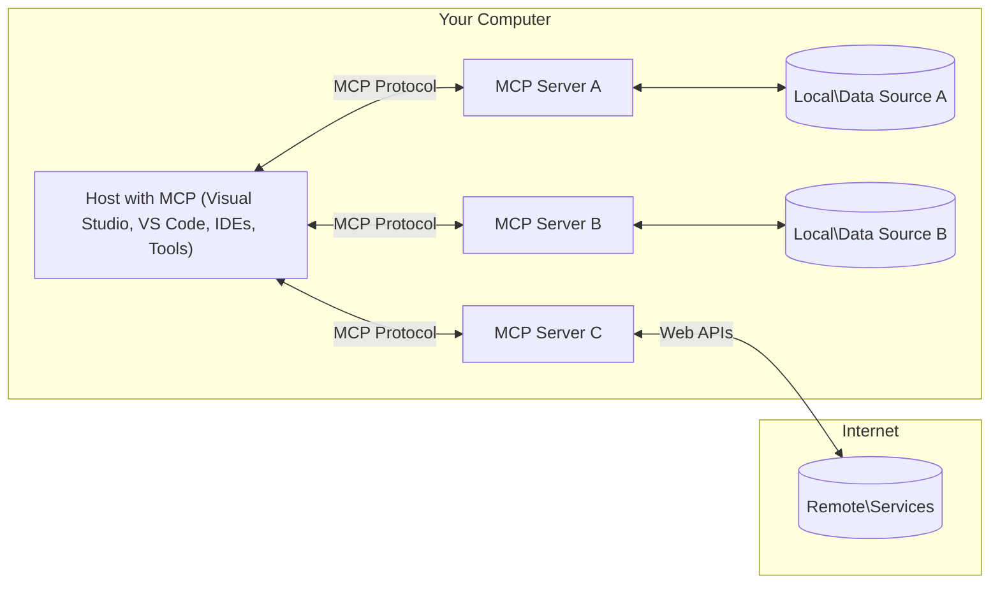

<!--
CO_OP_TRANSLATOR_METADATA:
{
  "original_hash": "904b59de1de9264801242d90a42cdd9d",
  "translation_date": "2025-09-05T10:13:43+00:00",
  "source_file": "01-CoreConcepts/README.md",
  "language_code": "fr"
}
-->
# Concepts de Base de MCP : Maîtriser le Protocole de Contexte Modèle pour l'Intégration de l'IA

[](https://youtu.be/earDzWGtE84)

_(Cliquez sur l'image ci-dessus pour visionner la vidéo de cette leçon)_

Le [Model Context Protocol (MCP)](https://github.com/modelcontextprotocol) est un cadre standardisé puissant qui optimise la communication entre les grands modèles de langage (LLMs) et les outils, applications et sources de données externes.  
Ce guide vous expliquera les concepts fondamentaux de MCP. Vous apprendrez son architecture client-serveur, ses composants essentiels, ses mécanismes de communication et les meilleures pratiques pour sa mise en œuvre.

- **Consentement Explicite de l'Utilisateur** : Tout accès aux données et toute opération nécessitent une approbation explicite de l'utilisateur avant exécution. Les utilisateurs doivent comprendre clairement quelles données seront accessibles et quelles actions seront effectuées, avec un contrôle granulaire sur les autorisations.

- **Protection de la Vie Privée des Données** : Les données des utilisateurs ne sont exposées qu'avec leur consentement explicite et doivent être protégées par des contrôles d'accès robustes tout au long du cycle d'interaction. Les implémentations doivent empêcher toute transmission non autorisée de données et maintenir des limites strictes de confidentialité.

- **Sécurité d'Exécution des Outils** : Chaque invocation d'outil nécessite un consentement explicite de l'utilisateur, avec une compréhension claire des fonctionnalités, des paramètres et des impacts potentiels de l'outil. Des limites de sécurité robustes doivent empêcher toute exécution d'outil non intentionnelle, dangereuse ou malveillante.

- **Sécurité de la Couche de Transport** : Tous les canaux de communication doivent utiliser des mécanismes appropriés de chiffrement et d'authentification. Les connexions distantes doivent implémenter des protocoles de transport sécurisés et une gestion adéquate des identifiants.

#### Directives de Mise en Œuvre :

- **Gestion des Permissions** : Implémentez des systèmes de permissions granulaires permettant aux utilisateurs de contrôler quels serveurs, outils et ressources sont accessibles.  
- **Authentification & Autorisation** : Utilisez des méthodes d'authentification sécurisées (OAuth, clés API) avec une gestion et une expiration appropriées des jetons.  
- **Validation des Entrées** : Validez tous les paramètres et données d'entrée selon des schémas définis pour prévenir les attaques par injection.  
- **Journalisation des Audits** : Maintenez des journaux complets de toutes les opérations pour la surveillance de la sécurité et la conformité.

## Vue d'Ensemble

Cette leçon explore l'architecture fondamentale et les composants qui composent l'écosystème du Model Context Protocol (MCP). Vous apprendrez l'architecture client-serveur, les composants clés et les mécanismes de communication qui alimentent les interactions MCP.

## Objectifs d'Apprentissage Clés

À la fin de cette leçon, vous serez capable de :

- Comprendre l'architecture client-serveur de MCP.  
- Identifier les rôles et responsabilités des Hôtes, Clients et Serveurs.  
- Analyser les fonctionnalités clés qui font de MCP une couche d'intégration flexible.  
- Apprendre comment l'information circule dans l'écosystème MCP.  
- Acquérir des connaissances pratiques grâce à des exemples de code en .NET, Java, Python et JavaScript.

## Architecture de MCP : Une Analyse Approfondie

L'écosystème MCP repose sur un modèle client-serveur. Cette structure modulaire permet aux applications d'IA d'interagir efficacement avec des outils, bases de données, API et ressources contextuelles. Décomposons cette architecture en ses composants fondamentaux.

Au cœur de MCP, on trouve une architecture client-serveur où une application hôte peut se connecter à plusieurs serveurs :



- **Hôtes MCP** : Programmes comme VSCode, Claude Desktop, IDEs ou outils d'IA qui souhaitent accéder aux données via MCP.  
- **Clients MCP** : Clients du protocole qui maintiennent des connexions 1:1 avec les serveurs.  
- **Serveurs MCP** : Programmes légers qui exposent chacun des capacités spécifiques via le protocole standardisé Model Context Protocol.  
- **Sources de Données Locales** : Fichiers, bases de données et services de votre ordinateur auxquels les serveurs MCP peuvent accéder en toute sécurité.  
- **Services Distants** : Systèmes externes disponibles sur Internet auxquels les serveurs MCP peuvent se connecter via des API.

Le protocole MCP est une norme évolutive utilisant un versionnement basé sur les dates (format AAAA-MM-JJ). La version actuelle du protocole est **2025-06-18**. Vous pouvez consulter les dernières mises à jour de la [spécification du protocole](https://modelcontextprotocol.io/specification/2025-06-18/).

### 1. Hôtes

Dans le Model Context Protocol (MCP), les **Hôtes** sont des applications d'IA qui servent d'interface principale par laquelle les utilisateurs interagissent avec le protocole. Les Hôtes coordonnent et gèrent les connexions à plusieurs serveurs MCP en créant des clients MCP dédiés pour chaque connexion serveur. Exemples d'Hôtes :

- **Applications d'IA** : Claude Desktop, Visual Studio Code, Claude Code  
- **Environnements de Développement** : IDEs et éditeurs de code avec intégration MCP  
- **Applications Personnalisées** : Agents et outils d'IA conçus sur mesure  

Les **Hôtes** sont des applications qui coordonnent les interactions avec les modèles d'IA. Ils :

- **Orchestrent les Modèles d'IA** : Exécutent ou interagissent avec les LLMs pour générer des réponses et coordonner les flux de travail d'IA.  
- **Gèrent les Connexions Clients** : Créent et maintiennent un client MCP par connexion serveur MCP.  
- **Contrôlent l'Interface Utilisateur** : Gèrent le flux de conversation, les interactions utilisateur et la présentation des réponses.  
- **Appliquent la Sécurité** : Contrôlent les permissions, les contraintes de sécurité et l'authentification.  
- **Gèrent le Consentement Utilisateur** : Supervisent l'approbation des utilisateurs pour le partage de données et l'exécution d'outils.

### 2. Clients

Les **Clients** sont des composants essentiels qui maintiennent des connexions dédiées un-à-un entre les Hôtes et les serveurs MCP. Chaque client MCP est instancié par l'Hôte pour se connecter à un serveur MCP spécifique, garantissant des canaux de communication organisés et sécurisés. Plusieurs clients permettent aux Hôtes de se connecter simultanément à plusieurs serveurs.

Les **Clients** sont des composants connecteurs au sein de l'application hôte. Ils :

- **Communication du Protocole** : Envoient des requêtes JSON-RPC 2.0 aux serveurs avec des instructions et des invites.  
- **Négociation des Capacités** : Négocient les fonctionnalités prises en charge et les versions du protocole avec les serveurs lors de l'initialisation.  
- **Exécution des Outils** : Gèrent les demandes d'exécution d'outils des modèles et traitent les réponses.  
- **Mises à Jour en Temps Réel** : Traitent les notifications et mises à jour en temps réel des serveurs.  
- **Traitement des Réponses** : Traitent et formatent les réponses des serveurs pour les afficher aux utilisateurs.

### 3. Serveurs

Les **Serveurs** sont des programmes qui fournissent du contexte, des outils et des capacités aux clients MCP. Ils peuvent s'exécuter localement (sur la même machine que l'Hôte) ou à distance (sur des plateformes externes) et sont responsables de la gestion des requêtes des clients et de la fourniture de réponses structurées. Les serveurs exposent des fonctionnalités spécifiques via le protocole standardisé Model Context Protocol.

Les **Serveurs** sont des services qui fournissent du contexte et des capacités. Ils :

- **Enregistrement des Fonctionnalités** : Enregistrent et exposent les primitives disponibles (ressources, invites, outils) aux clients.  
- **Traitement des Requêtes** : Reçoivent et exécutent les appels d'outils, les requêtes de ressources et les demandes d'invites des clients.  
- **Fourniture de Contexte** : Fournissent des informations contextuelles et des données pour améliorer les réponses des modèles.  
- **Gestion des États** : Maintiennent l'état des sessions et gèrent les interactions avec état si nécessaire.  
- **Notifications en Temps Réel** : Envoient des notifications sur les changements de capacités et les mises à jour aux clients connectés.

Les serveurs peuvent être développés par n'importe qui pour étendre les capacités des modèles avec des fonctionnalités spécialisées, et ils prennent en charge des scénarios de déploiement locaux et distants.

### 4. Primitives des Serveurs

Les serveurs dans le Model Context Protocol (MCP) fournissent trois **primitives** principales qui définissent les blocs de construction fondamentaux pour des interactions riches entre les clients, les hôtes et les modèles de langage. Ces primitives spécifient les types d'informations contextuelles et d'actions disponibles via le protocole.

Les serveurs MCP peuvent exposer n'importe quelle combinaison des trois primitives principales suivantes :

#### Ressources

Les **Ressources** sont des sources de données qui fournissent des informations contextuelles aux applications d'IA. Elles représentent du contenu statique ou dynamique qui peut améliorer la compréhension et la prise de décision des modèles :

- **Données Contextuelles** : Informations structurées et contexte pour la consommation des modèles d'IA.  
- **Bases de Connaissances** : Dépôts de documents, articles, manuels et articles de recherche.  
- **Sources de Données Locales** : Fichiers, bases de données et informations système locales.  
- **Données Externes** : Réponses d'API, services web et données de systèmes distants.  
- **Contenu Dynamique** : Données en temps réel qui se mettent à jour en fonction des conditions externes.

Les ressources sont identifiées par des URI et prennent en charge la découverte via les méthodes `resources/list` et la récupération via `resources/read` :

```text
file://documents/project-spec.md
database://production/users/schema
api://weather/current
```

#### Invites

Les **Invites** sont des modèles réutilisables qui aident à structurer les interactions avec les modèles de langage. Elles fournissent des schémas d'interaction standardisés et des flux de travail modélisés :

- **Interactions Basées sur des Modèles** : Messages pré-structurés et amorces de conversation.  
- **Modèles de Flux de Travail** : Séquences standardisées pour des tâches et interactions courantes.  
- **Exemples Few-shot** : Modèles basés sur des exemples pour l'instruction des modèles.  
- **Invites Systémiques** : Invites fondamentales qui définissent le comportement et le contexte des modèles.  
- **Modèles Dynamiques** : Invites paramétrées qui s'adaptent à des contextes spécifiques.

Les invites prennent en charge la substitution de variables et peuvent être découvertes via `prompts/list` et récupérées avec `prompts/get` :

```markdown
Generate a {{task_type}} for {{product}} targeting {{audience}} with the following requirements: {{requirements}}
```

#### Outils

Les **Outils** sont des fonctions exécutables que les modèles d'IA peuvent invoquer pour effectuer des actions spécifiques. Ils représentent les "verbes" de l'écosystème MCP, permettant aux modèles d'interagir avec des systèmes externes :

- **Fonctions Exécutables** : Opérations discrètes que les modèles peuvent invoquer avec des paramètres spécifiques.  
- **Intégration de Systèmes Externes** : Appels d'API, requêtes de bases de données, opérations sur fichiers, calculs.  
- **Identité Unique** : Chaque outil a un nom distinct, une description et un schéma de paramètres.  
- **Entrées/Sorties Structurées** : Les outils acceptent des paramètres validés et renvoient des réponses structurées et typées.  
- **Capacités d'Action** : Permettent aux modèles d'effectuer des actions réelles et de récupérer des données en direct.

Les outils sont définis avec JSON Schema pour la validation des paramètres, découverts via `tools/list` et exécutés via `tools/call` :

```typescript
server.tool(
  "search_products", 
  {
    query: z.string().describe("Search query for products"),
    category: z.string().optional().describe("Product category filter"),
    max_results: z.number().default(10).describe("Maximum results to return")
  }, 
  async (params) => {
    // Execute search and return structured results
    return await productService.search(params);
  }
);
```

## Primitives des Clients

Dans le Model Context Protocol (MCP), les **clients** peuvent exposer des primitives permettant aux serveurs de demander des capacités supplémentaires à l'application hôte. Ces primitives côté client permettent des implémentations de serveurs plus riches et interactives, capables d'accéder aux capacités des modèles d'IA et aux interactions utilisateur.

### Échantillonnage

L'**Échantillonnage** permet aux serveurs de demander des complétions de modèles de langage à l'application d'IA du client. Cette primitive permet aux serveurs d'accéder aux capacités des LLM sans dépendances de modèle intégrées :

- **Accès Indépendant du Modèle** : Les serveurs peuvent demander des complétions sans inclure de SDK LLM ou gérer l'accès au modèle.  
- **IA Initiée par le Serveur** : Permet aux serveurs de générer du contenu de manière autonome en utilisant le modèle d'IA du client.  
- **Interactions LLM Récursives** : Prend en charge des scénarios complexes où les serveurs ont besoin d'une assistance IA pour le traitement.  
- **Génération de Contenu Dynamique** : Permet aux serveurs de créer des réponses contextuelles en utilisant le modèle de l'hôte.

L'échantillonnage est initié via la méthode `sampling/complete`, où les serveurs envoient des demandes de complétion aux clients.

### Sollicitation

La **Sollicitation** permet aux serveurs de demander des informations supplémentaires ou des confirmations aux utilisateurs via l'interface du client :

- **Demandes d'Entrées Utilisateur** : Les serveurs peuvent demander des informations supplémentaires nécessaires à l'exécution d'outils.  
- **Dialogues de Confirmation** : Solliciter l'approbation de l'utilisateur pour des opérations sensibles ou ayant un impact.  
- **Flux de Travail Interactifs** : Permettre aux serveurs de créer des interactions utilisateur étape par étape.  
- **Collecte Dynamique de Paramètres** : Rassembler des paramètres manquants ou optionnels lors de l'exécution d'outils.

Les demandes de sollicitation sont effectuées via la méthode `elicitation/request` pour collecter les entrées utilisateur via l'interface du client.

### Journalisation

La **Journalisation** permet aux serveurs d'envoyer des messages de journal structurés aux clients pour le débogage, la surveillance et la visibilité opérationnelle :

- **Support de Débogage** : Permettre aux serveurs de fournir des journaux d'exécution détaillés pour le dépannage.  
- **Surveillance Opérationnelle** : Envoyer des mises à jour de statut et des métriques de performance aux clients.  
- **Rapports d'Erreurs** : Fournir un contexte d'erreur détaillé et des informations de diagnostic.  
- **Traçabilité des Audits** : Créer des journaux complets des opérations et décisions des serveurs.

Les messages de journalisation sont envoyés aux clients pour offrir une transparence sur les opérations des serveurs et faciliter le débogage.

## Flux d'Information dans MCP

Le Model Context Protocol (MCP) définit un flux structuré d'informations entre les hôtes, clients, serveurs et modèles. Comprendre ce flux aide à clarifier comment les demandes des utilisateurs sont traitées et comment les outils et données externes sont intégrés dans les réponses des modèles.

- **L'Hôte Initie la Connexion**  
  L'application hôte (comme un IDE ou une interface de chat) établit une connexion à un serveur MCP, généralement via STDIO, WebSocket ou un autre transport pris en charge.

- **Négociation des Capacités**  
  Le client (intégré dans l'hôte) et le serveur échangent des informations sur leurs fonctionnalités prises en charge, outils, ressources et versions du protocole. Cela garantit que les deux parties comprennent les capacités disponibles pour la session.

- **Demande de l'Utilisateur**  
  L'utilisateur interagit avec l'hôte (par exemple, entre une invite ou une commande). L'hôte collecte cette entrée et la transmet au client pour traitement.

- **Utilisation de Ressources ou d'Outils**  
  - Le client peut demander un contexte ou des ressources supplémentaires au serveur (comme des fichiers, des entrées de base de données ou des articles de base de connaissances) pour enrichir la compréhension du modèle.  
  - Si le modèle détermine qu'un outil est nécessaire (par exemple, pour récupérer des données, effectuer un calcul ou appeler une API), le client envoie une demande d'invocation d'outil au serveur, en spécifiant le nom de l'outil et les paramètres.

- **Exécution par le Serveur**  
  Le serveur reçoit la demande de ressource ou d'outil, exécute les opérations nécessaires (comme exécuter une fonction, interroger une base de données ou récupérer un fichier) et renvoie les résultats au client dans un format structuré.

- **Génération de Réponse**  
  Le client intègre les réponses du serveur (données de ressources, sorties d'outils, etc.) dans l'interaction en cours avec le modèle. Le modèle utilise ces informations pour générer une réponse complète et contextuellement pertinente.

- **Présentation des Résultats**  
  L'hôte reçoit la sortie finale du client et la présente à l'utilisateur, incluant souvent à la fois le texte généré par le modèle et les résultats des exécutions d'outils ou des recherches de ressources.

Ce flux permet à MCP de prendre en charge des applications d'IA avancées, interactives et conscientes du contexte en connectant de manière transparente les modèles avec des outils et des sources de données externes.

## Architecture & Couches du Protocole

MCP se compose de deux couches architecturales distinctes qui travaillent ensemble pour fournir un cadre de communication complet :

### Couche de Données

La **Couche de Données** implémente le protocole MCP de base en utilisant **JSON-RPC 2.0** comme fondation. Cette couche définit la structure des messages, la sémantique et les schémas d'interaction :

#### Composants Clés :
- **Protocole JSON-RPC 2.0** : Toutes les communications utilisent le format de message standardisé JSON-RPC 2.0 pour les appels de méthode, les réponses et les notifications.  
- **Gestion du cycle de vie** : Gère l'initialisation de la connexion, la négociation des capacités et la terminaison de session entre les clients et les serveurs.  
- **Primitives côté serveur** : Permet aux serveurs de fournir des fonctionnalités essentielles via des outils, des ressources et des invites.  
- **Primitives côté client** : Permet aux serveurs de demander des échantillons aux LLM, de solliciter des entrées utilisateur et d'envoyer des messages de journalisation.  
- **Notifications en temps réel** : Prend en charge les notifications asynchrones pour des mises à jour dynamiques sans interrogation.  

#### Fonctionnalités clés :

- **Négociation de version du protocole** : Utilise un système de versionnement basé sur les dates (AAAA-MM-JJ) pour garantir la compatibilité.  
- **Découverte des capacités** : Les clients et les serveurs échangent des informations sur les fonctionnalités prises en charge lors de l'initialisation.  
- **Sessions avec état** : Maintient l'état de la connexion à travers plusieurs interactions pour assurer la continuité du contexte.  

### Couche de transport

La **couche de transport** gère les canaux de communication, le formatage des messages et l'authentification entre les participants MCP :

#### Mécanismes de transport pris en charge :

1. **Transport STDIO** :  
   - Utilise les flux d'entrée/sortie standard pour une communication directe entre processus.  
   - Optimal pour les processus locaux sur la même machine sans surcharge réseau.  
   - Couramment utilisé pour les implémentations de serveurs MCP locaux.  

2. **Transport HTTP avec streaming** :  
   - Utilise HTTP POST pour les messages client-serveur.  
   - Événements envoyés par le serveur (SSE) optionnels pour le streaming serveur-client.  
   - Permet la communication avec des serveurs distants via des réseaux.  
   - Prend en charge l'authentification HTTP standard (jetons d'accès, clés API, en-têtes personnalisés).  
   - MCP recommande OAuth pour une authentification sécurisée basée sur des jetons.  

#### Abstraction de transport :

La couche de transport abstrait les détails de communication de la couche de données, permettant d'utiliser le même format de message JSON-RPC 2.0 sur tous les mécanismes de transport. Cette abstraction permet aux applications de basculer facilement entre serveurs locaux et distants.

### Considérations de sécurité

Les implémentations MCP doivent respecter plusieurs principes de sécurité essentiels pour garantir des interactions sûres, fiables et sécurisées dans toutes les opérations du protocole :

- **Consentement et contrôle utilisateur** : Les utilisateurs doivent donner leur consentement explicite avant que des données soient accessibles ou que des opérations soient effectuées. Ils doivent avoir un contrôle clair sur les données partagées et les actions autorisées, soutenu par des interfaces utilisateur intuitives pour examiner et approuver les activités.  

- **Confidentialité des données** : Les données utilisateur ne doivent être exposées qu'avec un consentement explicite et doivent être protégées par des contrôles d'accès appropriés. Les implémentations MCP doivent empêcher toute transmission non autorisée de données et garantir que la confidentialité est maintenue tout au long des interactions.  

- **Sécurité des outils** : Avant d'invoquer un outil, un consentement explicite de l'utilisateur est requis. Les utilisateurs doivent comprendre clairement la fonctionnalité de chaque outil, et des limites de sécurité robustes doivent être appliquées pour éviter toute exécution involontaire ou dangereuse.  

En suivant ces principes de sécurité, MCP garantit la confiance, la confidentialité et la sécurité des utilisateurs tout en permettant des intégrations puissantes avec l'IA.

## Exemples de code : Composants clés

Voici des exemples de code dans plusieurs langages de programmation populaires illustrant comment implémenter les composants et outils clés d'un serveur MCP.

### Exemple .NET : Création d'un serveur MCP simple avec outils

Voici un exemple pratique en .NET montrant comment implémenter un serveur MCP simple avec des outils personnalisés. Cet exemple montre comment définir et enregistrer des outils, gérer les requêtes et connecter le serveur en utilisant le protocole Model Context Protocol.

```csharp
using System;
using System.Threading.Tasks;
using ModelContextProtocol.Server;
using ModelContextProtocol.Server.Transport;
using ModelContextProtocol.Server.Tools;

public class WeatherServer
{
    public static async Task Main(string[] args)
    {
        // Create an MCP server
        var server = new McpServer(
            name: "Weather MCP Server",
            version: "1.0.0"
        );
        
        // Register our custom weather tool
        server.AddTool<string, WeatherData>("weatherTool", 
            description: "Gets current weather for a location",
            execute: async (location) => {
                // Call weather API (simplified)
                var weatherData = await GetWeatherDataAsync(location);
                return weatherData;
            });
        
        // Connect the server using stdio transport
        var transport = new StdioServerTransport();
        await server.ConnectAsync(transport);
        
        Console.WriteLine("Weather MCP Server started");
        
        // Keep the server running until process is terminated
        await Task.Delay(-1);
    }
    
    private static async Task<WeatherData> GetWeatherDataAsync(string location)
    {
        // This would normally call a weather API
        // Simplified for demonstration
        await Task.Delay(100); // Simulate API call
        return new WeatherData { 
            Temperature = 72.5,
            Conditions = "Sunny",
            Location = location
        };
    }
}

public class WeatherData
{
    public double Temperature { get; set; }
    public string Conditions { get; set; }
    public string Location { get; set; }
}
```

### Exemple Java : Composants du serveur MCP

Cet exemple montre le même serveur MCP et l'enregistrement des outils que l'exemple .NET ci-dessus, mais implémenté en Java.

```java
import io.modelcontextprotocol.server.McpServer;
import io.modelcontextprotocol.server.McpToolDefinition;
import io.modelcontextprotocol.server.transport.StdioServerTransport;
import io.modelcontextprotocol.server.tool.ToolExecutionContext;
import io.modelcontextprotocol.server.tool.ToolResponse;

public class WeatherMcpServer {
    public static void main(String[] args) throws Exception {
        // Create an MCP server
        McpServer server = McpServer.builder()
            .name("Weather MCP Server")
            .version("1.0.0")
            .build();
            
        // Register a weather tool
        server.registerTool(McpToolDefinition.builder("weatherTool")
            .description("Gets current weather for a location")
            .parameter("location", String.class)
            .execute((ToolExecutionContext ctx) -> {
                String location = ctx.getParameter("location", String.class);
                
                // Get weather data (simplified)
                WeatherData data = getWeatherData(location);
                
                // Return formatted response
                return ToolResponse.content(
                    String.format("Temperature: %.1f°F, Conditions: %s, Location: %s", 
                    data.getTemperature(), 
                    data.getConditions(), 
                    data.getLocation())
                );
            })
            .build());
        
        // Connect the server using stdio transport
        try (StdioServerTransport transport = new StdioServerTransport()) {
            server.connect(transport);
            System.out.println("Weather MCP Server started");
            // Keep server running until process is terminated
            Thread.currentThread().join();
        }
    }
    
    private static WeatherData getWeatherData(String location) {
        // Implementation would call a weather API
        // Simplified for example purposes
        return new WeatherData(72.5, "Sunny", location);
    }
}

class WeatherData {
    private double temperature;
    private String conditions;
    private String location;
    
    public WeatherData(double temperature, String conditions, String location) {
        this.temperature = temperature;
        this.conditions = conditions;
        this.location = location;
    }
    
    public double getTemperature() {
        return temperature;
    }
    
    public String getConditions() {
        return conditions;
    }
    
    public String getLocation() {
        return location;
    }
}
```

### Exemple Python : Construction d'un serveur MCP

Cet exemple utilise fastmcp, assurez-vous de l'installer au préalable :

```python
pip install fastmcp
```  
Exemple de code :  

```python
#!/usr/bin/env python3
import asyncio
from fastmcp import FastMCP
from fastmcp.transports.stdio import serve_stdio

# Create a FastMCP server
mcp = FastMCP(
    name="Weather MCP Server",
    version="1.0.0"
)

@mcp.tool()
def get_weather(location: str) -> dict:
    """Gets current weather for a location."""
    return {
        "temperature": 72.5,
        "conditions": "Sunny",
        "location": location
    }

# Alternative approach using a class
class WeatherTools:
    @mcp.tool()
    def forecast(self, location: str, days: int = 1) -> dict:
        """Gets weather forecast for a location for the specified number of days."""
        return {
            "location": location,
            "forecast": [
                {"day": i+1, "temperature": 70 + i, "conditions": "Partly Cloudy"}
                for i in range(days)
            ]
        }

# Register class tools
weather_tools = WeatherTools()

# Start the server
if __name__ == "__main__":
    asyncio.run(serve_stdio(mcp))
```

### Exemple JavaScript : Création d'un serveur MCP

Cet exemple montre la création d'un serveur MCP en JavaScript et comment enregistrer deux outils liés à la météo.

```javascript
// Using the official Model Context Protocol SDK
import { McpServer } from "@modelcontextprotocol/sdk/server/mcp.js";
import { StdioServerTransport } from "@modelcontextprotocol/sdk/server/stdio.js";
import { z } from "zod"; // For parameter validation

// Create an MCP server
const server = new McpServer({
  name: "Weather MCP Server",
  version: "1.0.0"
});

// Define a weather tool
server.tool(
  "weatherTool",
  {
    location: z.string().describe("The location to get weather for")
  },
  async ({ location }) => {
    // This would normally call a weather API
    // Simplified for demonstration
    const weatherData = await getWeatherData(location);
    
    return {
      content: [
        { 
          type: "text", 
          text: `Temperature: ${weatherData.temperature}°F, Conditions: ${weatherData.conditions}, Location: ${weatherData.location}` 
        }
      ]
    };
  }
);

// Define a forecast tool
server.tool(
  "forecastTool",
  {
    location: z.string(),
    days: z.number().default(3).describe("Number of days for forecast")
  },
  async ({ location, days }) => {
    // This would normally call a weather API
    // Simplified for demonstration
    const forecast = await getForecastData(location, days);
    
    return {
      content: [
        { 
          type: "text", 
          text: `${days}-day forecast for ${location}: ${JSON.stringify(forecast)}` 
        }
      ]
    };
  }
);

// Helper functions
async function getWeatherData(location) {
  // Simulate API call
  return {
    temperature: 72.5,
    conditions: "Sunny",
    location: location
  };
}

async function getForecastData(location, days) {
  // Simulate API call
  return Array.from({ length: days }, (_, i) => ({
    day: i + 1,
    temperature: 70 + Math.floor(Math.random() * 10),
    conditions: i % 2 === 0 ? "Sunny" : "Partly Cloudy"
  }));
}

// Connect the server using stdio transport
const transport = new StdioServerTransport();
server.connect(transport).catch(console.error);

console.log("Weather MCP Server started");
```

Cet exemple JavaScript montre également comment créer un client MCP qui se connecte à un serveur, envoie une invite et traite la réponse, y compris les appels d'outils effectués.

## Sécurité et autorisation

MCP inclut plusieurs concepts et mécanismes intégrés pour gérer la sécurité et l'autorisation dans tout le protocole :

1. **Contrôle des permissions des outils** :  
   Les clients peuvent spécifier quels outils un modèle est autorisé à utiliser pendant une session. Cela garantit que seuls les outils explicitement autorisés sont accessibles, réduisant le risque d'opérations involontaires ou dangereuses. Les permissions peuvent être configurées dynamiquement en fonction des préférences utilisateur, des politiques organisationnelles ou du contexte de l'interaction.  

2. **Authentification** :  
   Les serveurs peuvent exiger une authentification avant d'accorder l'accès aux outils, ressources ou opérations sensibles. Cela peut inclure des clés API, des jetons OAuth ou d'autres schémas d'authentification. Une authentification appropriée garantit que seuls les clients et utilisateurs de confiance peuvent invoquer les capacités côté serveur.  

3. **Validation** :  
   La validation des paramètres est appliquée à toutes les invocations d'outils. Chaque outil définit les types, formats et contraintes attendus pour ses paramètres, et le serveur valide les requêtes entrantes en conséquence. Cela empêche les entrées malformées ou malveillantes d'atteindre les implémentations des outils et aide à maintenir l'intégrité des opérations.  

4. **Limitation de débit** :  
   Pour prévenir les abus et garantir une utilisation équitable des ressources du serveur, les serveurs MCP peuvent implémenter une limitation de débit pour les appels d'outils et l'accès aux ressources. Les limites de débit peuvent être appliquées par utilisateur, par session ou globalement, et aident à protéger contre les attaques par déni de service ou une consommation excessive de ressources.  

En combinant ces mécanismes, MCP fournit une base sécurisée pour intégrer des modèles de langage avec des outils et sources de données externes, tout en offrant aux utilisateurs et développeurs un contrôle précis sur l'accès et l'utilisation.

## Messages du protocole et flux de communication

La communication MCP utilise des messages structurés **JSON-RPC 2.0** pour faciliter des interactions claires et fiables entre hôtes, clients et serveurs. Le protocole définit des modèles de messages spécifiques pour différents types d'opérations :

### Types de messages principaux :

#### **Messages d'initialisation**  
- **Requête `initialize`** : Établit la connexion et négocie la version du protocole et les capacités.  
- **Réponse `initialize`** : Confirme les fonctionnalités prises en charge et les informations du serveur.  
- **`notifications/initialized`** : Signale que l'initialisation est terminée et que la session est prête.  

#### **Messages de découverte**  
- **Requête `tools/list`** : Découvre les outils disponibles sur le serveur.  
- **Requête `resources/list`** : Liste les ressources disponibles (sources de données).  
- **Requête `prompts/list`** : Récupère les modèles d'invite disponibles.  

#### **Messages d'exécution**  
- **Requête `tools/call`** : Exécute un outil spécifique avec les paramètres fournis.  
- **Requête `resources/read`** : Récupère le contenu d'une ressource spécifique.  
- **Requête `prompts/get`** : Récupère un modèle d'invite avec des paramètres optionnels.  

#### **Messages côté client**  
- **Requête `sampling/complete`** : Le serveur demande une complétion LLM au client.  
- **`elicitation/request`** : Le serveur demande une entrée utilisateur via l'interface client.  
- **Messages de journalisation** : Le serveur envoie des messages de journalisation structurés au client.  

#### **Messages de notification**  
- **`notifications/tools/list_changed`** : Le serveur informe le client des changements d'outils.  
- **`notifications/resources/list_changed`** : Le serveur informe le client des changements de ressources.  
- **`notifications/prompts/list_changed`** : Le serveur informe le client des changements d'invites.  

### Structure des messages :

Tous les messages MCP suivent le format JSON-RPC 2.0 avec :  
- **Messages de requête** : Incluent `id`, `method` et des `params` optionnels.  
- **Messages de réponse** : Incluent `id` et soit `result` soit `error`.  
- **Messages de notification** : Incluent `method` et des `params` optionnels (pas de `id` ni de réponse attendue).  

Cette communication structurée garantit des interactions fiables, traçables et extensibles, prenant en charge des scénarios avancés comme les mises à jour en temps réel, le chaînage d'outils et la gestion robuste des erreurs.

## Points clés

- **Architecture** : MCP utilise une architecture client-serveur où les hôtes gèrent plusieurs connexions client-serveur.  
- **Participants** : L'écosystème inclut des hôtes (applications IA), des clients (connecteurs de protocole) et des serveurs (fournisseurs de capacités).  
- **Mécanismes de transport** : La communication prend en charge STDIO (local) et HTTP avec streaming SSE (distant).  
- **Primitives essentielles** : Les serveurs exposent des outils (fonctions exécutables), des ressources (sources de données) et des invites (modèles).  
- **Primitives côté client** : Les serveurs peuvent demander des échantillons (complétions LLM), des sollicitations (entrées utilisateur) et des journaux aux clients.  
- **Fondation du protocole** : Basé sur JSON-RPC 2.0 avec versionnement basé sur les dates (actuel : 2025-06-18).  
- **Capacités en temps réel** : Prend en charge les notifications pour des mises à jour dynamiques et une synchronisation en temps réel.  
- **Priorité à la sécurité** : Consentement explicite des utilisateurs, protection de la confidentialité des données et transport sécurisé sont des exigences fondamentales.  

## Exercice

Concevez un outil MCP simple qui serait utile dans votre domaine. Définissez :  
1. Le nom de l'outil.  
2. Les paramètres qu'il accepterait.  
3. La sortie qu'il retournerait.  
4. Comment un modèle pourrait utiliser cet outil pour résoudre des problèmes utilisateur.  

---

## Et après

Prochain chapitre : [Chapitre 2 : Sécurité](../02-Security/README.md)

---

**Avertissement** :  
Ce document a été traduit à l'aide du service de traduction automatique [Co-op Translator](https://github.com/Azure/co-op-translator). Bien que nous nous efforcions d'assurer l'exactitude, veuillez noter que les traductions automatisées peuvent contenir des erreurs ou des inexactitudes. Le document original dans sa langue d'origine doit être considéré comme la source faisant autorité. Pour des informations critiques, il est recommandé de faire appel à une traduction humaine professionnelle. Nous déclinons toute responsabilité en cas de malentendus ou d'interprétations erronées résultant de l'utilisation de cette traduction.