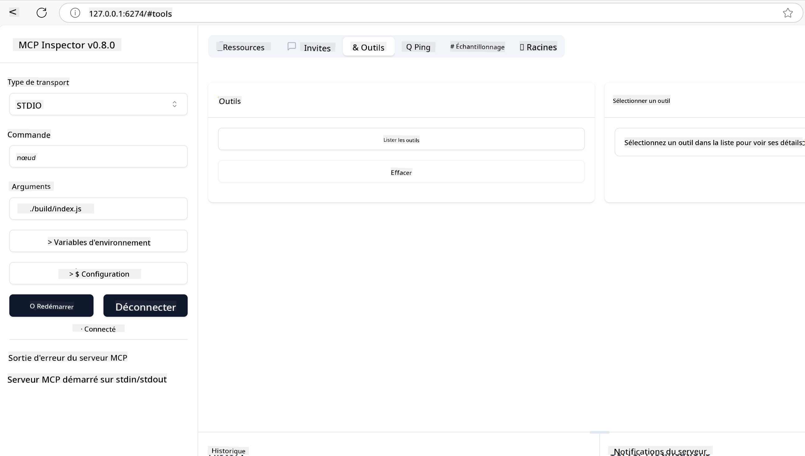
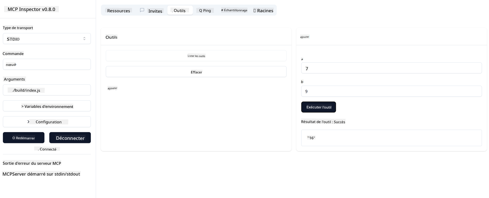

<!--
CO_OP_TRANSLATOR_METADATA:
{
  "original_hash": "5331ffd328a54b90f76706c52b673e27",
  "translation_date": "2025-05-16T15:07:19+00:00",
  "source_file": "03-GettingStarted/01-first-server/README.md",
  "language_code": "fr"
}
-->
### -2- Créer un projet

Maintenant que vous avez installé votre SDK, créons un projet : 

### -3- Créer les fichiers du projet

### -4- Écrire le code du serveur

### -5- Ajouter un outil et une ressource

Ajoutez un outil et une ressource en insérant le code suivant : 

### -6- Code final

Ajoutons le dernier morceau de code nécessaire pour que le serveur puisse démarrer : 

### -7- Tester le serveur

Démarrez le serveur avec la commande suivante : 

### -8- Utiliser l'inspecteur

L'inspecteur est un excellent outil qui peut lancer votre serveur et vous permettre d'interagir avec lui pour tester son bon fonctionnement. Démarrons-le :

> [!NOTE]
> le champ "commande" peut sembler différent car il contient la commande adaptée à votre runtime spécifique/

Vous devriez voir l'interface utilisateur suivante :

1. Connectez-vous au serveur en sélectionnant le bouton Connect  
  Une fois connecté, vous devriez voir ceci :

  

2. Sélectionnez "Tools" puis "listTools", vous devriez voir apparaître "Add". Sélectionnez "Add" et renseignez les valeurs des paramètres.

  Vous verrez alors la réponse suivante, c’est-à-dire le résultat de l’outil "add" :

  

Félicitations, vous avez réussi à créer et lancer votre premier serveur !

### SDK officiels

MCP propose des SDK officiels pour plusieurs langages :  
- [C# SDK](https://github.com/modelcontextprotocol/csharp-sdk) - Maintenu en collaboration avec Microsoft  
- [Java SDK](https://github.com/modelcontextprotocol/java-sdk) - Maintenu en collaboration avec Spring AI  
- [TypeScript SDK](https://github.com/modelcontextprotocol/typescript-sdk) - Implémentation officielle TypeScript  
- [Python SDK](https://github.com/modelcontextprotocol/python-sdk) - Implémentation officielle Python  
- [Kotlin SDK](https://github.com/modelcontextprotocol/kotlin-sdk) - Implémentation officielle Kotlin  
- [Swift SDK](https://github.com/modelcontextprotocol/swift-sdk) - Maintenu en collaboration avec Loopwork AI  
- [Rust SDK](https://github.com/modelcontextprotocol/rust-sdk) - Implémentation officielle Rust  

## Points clés à retenir

- La configuration d’un environnement de développement MCP est simple grâce aux SDK spécifiques à chaque langage  
- Construire des serveurs MCP consiste à créer et enregistrer des outils avec des schémas clairs  
- Tester et déboguer sont essentiels pour garantir des implémentations MCP fiables  

## Exemples

- [Calculatrice Java](../samples/java/calculator/README.md)  
- [Calculatrice .Net](../../../../03-GettingStarted/samples/csharp)  
- [Calculatrice JavaScript](../samples/javascript/README.md)  
- [Calculatrice TypeScript](../samples/typescript/README.md)  
- [Calculatrice Python](../../../../03-GettingStarted/samples/python)  

## Exercice

Créez un serveur MCP simple avec un outil de votre choix :  
1. Implémentez l’outil dans le langage de votre préférence (.NET, Java, Python ou JavaScript).  
2. Définissez les paramètres d’entrée et les valeurs de retour.  
3. Lancez l’outil inspecteur pour vérifier que le serveur fonctionne comme prévu.  
4. Testez l’implémentation avec différentes entrées.  

## Solution

[Solution](./solution/README.md)  

## Ressources supplémentaires

- [Dépôt GitHub MCP](https://github.com/microsoft/mcp-for-beginners)  

## Et ensuite

Suivant : [Premiers pas avec les clients MCP](/03-GettingStarted/02-client/README.md)

**Avertissement** :  
Ce document a été traduit à l’aide du service de traduction automatique [Co-op Translator](https://github.com/Azure/co-op-translator). Bien que nous nous efforçons d’assurer l’exactitude, veuillez noter que les traductions automatiques peuvent contenir des erreurs ou des inexactitudes. Le document original dans sa langue d’origine doit être considéré comme la source faisant foi. Pour les informations critiques, une traduction professionnelle réalisée par un humain est recommandée. Nous ne saurions être tenus responsables des malentendus ou des erreurs d’interprétation résultant de l’utilisation de cette traduction.