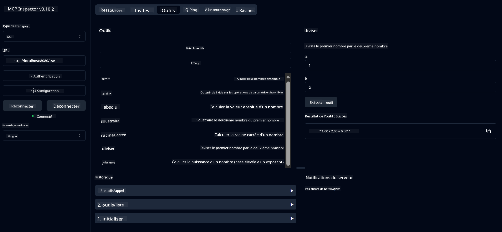

<!--
CO_OP_TRANSLATOR_METADATA:
{
  "original_hash": "ed9cab32cc67c12d8969b407aa47100a",
  "translation_date": "2025-07-13T17:51:34+00:00",
  "source_file": "03-GettingStarted/01-first-server/solution/java/README.md",
  "language_code": "fr"
}
-->
# Service de Calculatrice Basique MCP

Ce service fournit des opérations de calcul basiques via le Model Context Protocol (MCP) en utilisant Spring Boot avec un transport WebFlux. Il est conçu comme un exemple simple pour les débutants qui souhaitent découvrir les implémentations MCP.

Pour plus d’informations, consultez la documentation de référence [MCP Server Boot Starter](https://docs.spring.io/spring-ai/reference/api/mcp/mcp-server-boot-starter-docs.html).


## Utilisation du Service

Le service expose les points d’API suivants via le protocole MCP :

- `add(a, b)` : Additionner deux nombres
- `subtract(a, b)` : Soustraire le second nombre du premier
- `multiply(a, b)` : Multiplier deux nombres
- `divide(a, b)` : Diviser le premier nombre par le second (avec vérification de zéro)
- `power(base, exponent)` : Calculer la puissance d’un nombre
- `squareRoot(number)` : Calculer la racine carrée (avec vérification des nombres négatifs)
- `modulus(a, b)` : Calculer le reste de la division
- `absolute(number)` : Calculer la valeur absolue

## Dépendances

Le projet nécessite les dépendances clés suivantes :

```xml
<dependency>
    <groupId>org.springframework.ai</groupId>
    <artifactId>spring-ai-starter-mcp-server-webflux</artifactId>
</dependency>
```

## Compilation du Projet

Compilez le projet avec Maven :
```bash
./mvnw clean install -DskipTests
```

## Lancement du Serveur

### Avec Java

```bash
java -jar target/calculator-server-0.0.1-SNAPSHOT.jar
```

### Avec MCP Inspector

Le MCP Inspector est un outil pratique pour interagir avec les services MCP. Pour l’utiliser avec ce service de calculatrice :

1. **Installer et lancer MCP Inspector** dans une nouvelle fenêtre de terminal :  
   ```bash
   npx @modelcontextprotocol/inspector
   ```

2. **Accéder à l’interface web** en cliquant sur l’URL affichée par l’application (généralement http://localhost:6274)

3. **Configurer la connexion** :  
   - Choisir le type de transport "SSE"  
   - Saisir l’URL du point SSE de votre serveur en cours d’exécution : `http://localhost:8080/sse`  
   - Cliquer sur "Connect"

4. **Utiliser les outils** :  
   - Cliquer sur "List Tools" pour voir les opérations de calcul disponibles  
   - Sélectionner un outil et cliquer sur "Run Tool" pour exécuter une opération



**Avertissement** :  
Ce document a été traduit à l’aide du service de traduction automatique [Co-op Translator](https://github.com/Azure/co-op-translator). Bien que nous nous efforcions d’assurer l’exactitude, veuillez noter que les traductions automatiques peuvent contenir des erreurs ou des inexactitudes. Le document original dans sa langue d’origine doit être considéré comme la source faisant foi. Pour les informations critiques, une traduction professionnelle réalisée par un humain est recommandée. Nous déclinons toute responsabilité en cas de malentendus ou de mauvaises interprétations résultant de l’utilisation de cette traduction.