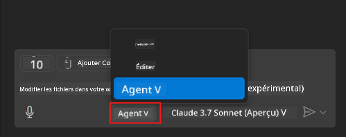
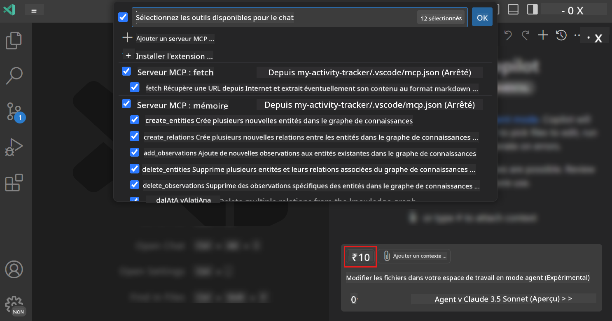
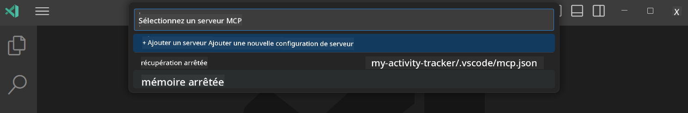
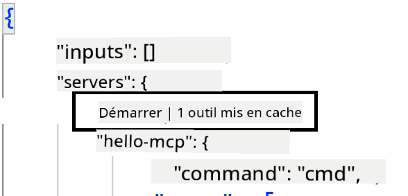
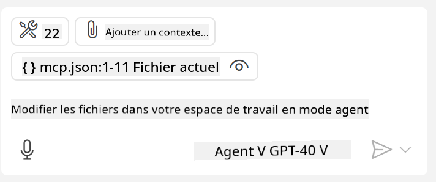
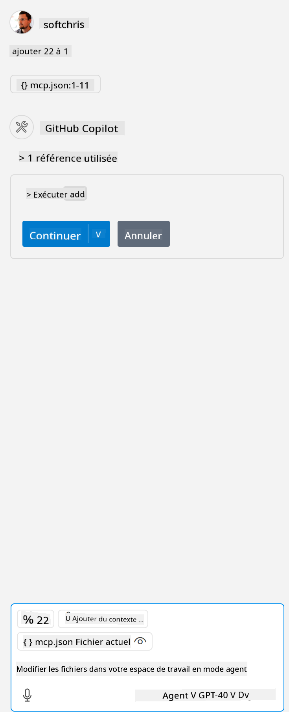

<!--
CO_OP_TRANSLATOR_METADATA:
{
  "original_hash": "d940b5e0af75e3a3a4d1c3179120d1d9",
  "translation_date": "2025-08-26T17:02:04+00:00",
  "source_file": "03-GettingStarted/04-vscode/README.md",
  "language_code": "fr"
}
-->
# Consommer un serveur en mode Agent de GitHub Copilot

Visual Studio Code et GitHub Copilot peuvent agir comme un client et consommer un serveur MCP. Pourquoi voudrions-nous faire cela, vous demandez-vous peut-être ? Eh bien, cela signifie que toutes les fonctionnalités du serveur MCP peuvent désormais être utilisées directement depuis votre IDE. Imaginez, par exemple, ajouter le serveur MCP de GitHub : cela permettrait de contrôler GitHub via des commandes naturelles plutôt que de taper des commandes spécifiques dans le terminal. Ou imaginez tout ce qui pourrait améliorer votre expérience de développement, contrôlé par langage naturel. Vous commencez à voir l'intérêt, n'est-ce pas ?

## Vue d'ensemble

Cette leçon explique comment utiliser Visual Studio Code et le mode Agent de GitHub Copilot comme client pour votre serveur MCP.

## Objectifs d'apprentissage

À la fin de cette leçon, vous serez capable de :

- Consommer un serveur MCP via Visual Studio Code.
- Exécuter des fonctionnalités comme des outils via GitHub Copilot.
- Configurer Visual Studio Code pour trouver et gérer votre serveur MCP.

## Utilisation

Vous pouvez contrôler votre serveur MCP de deux manières différentes :

- Interface utilisateur : vous verrez comment cela fonctionne plus tard dans ce chapitre.
- Terminal : il est possible de contrôler les choses depuis le terminal en utilisant l'exécutable `code` :

  Pour ajouter un serveur MCP à votre profil utilisateur, utilisez l'option de ligne de commande --add-mcp et fournissez la configuration JSON du serveur sous la forme {\"name\":\"server-name\",\"command\":...}.

  ```
  code --add-mcp "{\"name\":\"my-server\",\"command\": \"uvx\",\"args\": [\"mcp-server-fetch\"]}"
  ```

### Captures d'écran





Parlons davantage de l'utilisation de l'interface visuelle dans les sections suivantes.

## Approche

Voici comment nous devons aborder cela à un niveau général :

- Configurer un fichier pour trouver notre serveur MCP.
- Démarrer/Se connecter au serveur pour qu'il liste ses fonctionnalités.
- Utiliser ces fonctionnalités via l'interface de chat de GitHub Copilot.

Parfait, maintenant que nous comprenons le processus, essayons d'utiliser un serveur MCP via Visual Studio Code à travers un exercice.

## Exercice : Consommer un serveur

Dans cet exercice, nous allons configurer Visual Studio Code pour trouver votre serveur MCP afin qu'il puisse être utilisé via l'interface de chat de GitHub Copilot.

### -0- Étape préliminaire, activer la découverte des serveurs MCP

Vous devrez peut-être activer la découverte des serveurs MCP.

1. Allez dans `Fichier -> Préférences -> Paramètres` dans Visual Studio Code.

1. Recherchez "MCP" et activez `chat.mcp.discovery.enabled` dans le fichier settings.json.

### -1- Créer un fichier de configuration

Commencez par créer un fichier de configuration à la racine de votre projet. Vous aurez besoin d'un fichier appelé MCP.json à placer dans un dossier nommé .vscode. Cela devrait ressembler à ceci :

```text
.vscode
|-- mcp.json
```

Ensuite, voyons comment ajouter une entrée de serveur.

### -2- Configurer un serveur

Ajoutez le contenu suivant à *mcp.json* :

```json
{
    "inputs": [],
    "servers": {
       "hello-mcp": {
           "command": "node",
           "args": [
               "build/index.js"
           ]
       }
    }
}
```

Voici un exemple simple pour démarrer un serveur écrit en Node.js. Pour d'autres environnements d'exécution, indiquez la commande appropriée pour démarrer le serveur en utilisant `command` et `args`.

### -3- Démarrer le serveur

Maintenant que vous avez ajouté une entrée, démarrez le serveur :

1. Localisez votre entrée dans *mcp.json* et assurez-vous de trouver l'icône "play" :

    

1. Cliquez sur l'icône "play". Vous devriez voir l'icône des outils dans GitHub Copilot Chat augmenter le nombre d'outils disponibles. Si vous cliquez sur cette icône, vous verrez une liste des outils enregistrés. Vous pouvez cocher/décocher chaque outil selon que vous souhaitez que GitHub Copilot les utilise comme contexte :

  

1. Pour exécuter un outil, tapez une commande qui correspond à la description de l'un de vos outils, par exemple une commande comme "ajouter 22 à 1" :

  

  Vous devriez voir une réponse indiquant 23.

## Devoir

Essayez d'ajouter une entrée de serveur à votre fichier *mcp.json* et assurez-vous de pouvoir démarrer/arrêter le serveur. Assurez-vous également de pouvoir communiquer avec les outils de votre serveur via l'interface de chat de GitHub Copilot.

## Solution

[Solution](./solution/README.md)

## Points clés à retenir

Les points clés à retenir de ce chapitre sont les suivants :

- Visual Studio Code est un excellent client qui vous permet de consommer plusieurs serveurs MCP et leurs outils.
- L'interface de chat de GitHub Copilot est le moyen d'interagir avec les serveurs.
- Vous pouvez demander à l'utilisateur des entrées comme des clés API qui peuvent être transmises au serveur MCP lors de la configuration de l'entrée du serveur dans le fichier *mcp.json*.

## Exemples

- [Calculatrice Java](../samples/java/calculator/README.md)
- [Calculatrice .Net](../../../../03-GettingStarted/samples/csharp)
- [Calculatrice JavaScript](../samples/javascript/README.md)
- [Calculatrice TypeScript](../samples/typescript/README.md)
- [Calculatrice Python](../../../../03-GettingStarted/samples/python)

## Ressources supplémentaires

- [Documentation Visual Studio](https://code.visualstudio.com/docs/copilot/chat/mcp-servers)

## Et après ?

- Suivant : [Créer un serveur stdio](../05-stdio-server/README.md)

---

**Avertissement** :  
Ce document a été traduit à l'aide du service de traduction automatique [Co-op Translator](https://github.com/Azure/co-op-translator). Bien que nous nous efforcions d'assurer l'exactitude, veuillez noter que les traductions automatisées peuvent contenir des erreurs ou des inexactitudes. Le document original dans sa langue d'origine doit être considéré comme la source faisant autorité. Pour des informations critiques, il est recommandé de recourir à une traduction professionnelle réalisée par un humain. Nous déclinons toute responsabilité en cas de malentendus ou d'interprétations erronées résultant de l'utilisation de cette traduction.