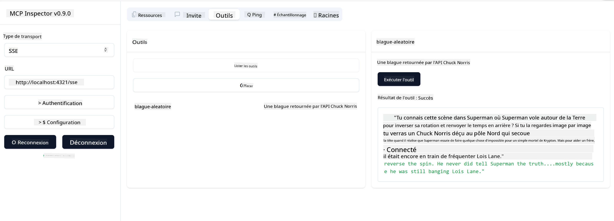

<!--
CO_OP_TRANSLATOR_METADATA:
{
  "original_hash": "0a8086dc4bf89448f83e7936db972c42",
  "translation_date": "2025-05-16T15:16:51+00:00",
  "source_file": "03-GettingStarted/05-sse-server/README.md",
  "language_code": "fr"
}
-->
Maintenant que nous en savons un peu plus sur SSE, construisons un serveur SSE.

## Exercice : Création d’un serveur SSE

Pour créer notre serveur, nous devons garder deux choses en tête :

- Nous devons utiliser un serveur web pour exposer des points de connexion pour la connexion et les messages.
- Construire notre serveur comme nous le faisons habituellement avec des outils, des ressources et des invites lorsque nous utilisions stdio.

### -1- Créer une instance de serveur

Pour créer notre serveur, nous utilisons les mêmes types qu’avec stdio. Cependant, pour le transport, nous devons choisir SSE.

---

Ajoutons maintenant les routes nécessaires.

### -2- Ajouter des routes

Ajoutons ensuite les routes qui gèrent la connexion et les messages entrants :

---

Ajoutons maintenant des fonctionnalités au serveur.

### -3- Ajout des capacités du serveur

Maintenant que tout ce qui est spécifique à SSE est défini, ajoutons des capacités au serveur comme des outils, des invites et des ressources.

---

Votre code complet devrait ressembler à ceci :

---

Super, nous avons un serveur utilisant SSE, testons-le maintenant.

## Exercice : Déboguer un serveur SSE avec Inspector

Inspector est un excellent outil que nous avons vu dans une leçon précédente [Créer votre premier serveur](/03-GettingStarted/01-first-server/README.md). Voyons si nous pouvons l’utiliser ici aussi :

### -1- Lancer l’inspecteur

Pour lancer l’inspecteur, vous devez d’abord avoir un serveur SSE en cours d’exécution, faisons cela maintenant :

1. Démarrez le serveur

---

1. Lancez l’inspecteur

    > ![NOTE]
    > Exécutez cette commande dans une fenêtre de terminal différente de celle où le serveur tourne. Notez aussi que vous devez adapter la commande ci-dessous à l’URL où votre serveur est hébergé.

    ```sh
    npx @modelcontextprotocol/inspector --cli http://localhost:8000/sse --method tools/list
    ```

    L’exécution de l’inspecteur est identique dans tous les environnements d’exécution. Notez qu’au lieu de passer un chemin vers notre serveur et une commande pour démarrer le serveur, nous passons l’URL où le serveur tourne et spécifions également la route `/sse`.

### -2- Tester l’outil

Connectez le serveur en sélectionnant SSE dans la liste déroulante et remplissez le champ URL avec l’adresse où votre serveur tourne, par exemple http://localhost:4321/sse. Cliquez ensuite sur le bouton "Connect". Comme précédemment, sélectionnez pour lister les outils, choisissez un outil et fournissez les valeurs d’entrée. Vous devriez voir un résultat comme ci-dessous :



Super, vous pouvez travailler avec l’inspecteur, voyons maintenant comment utiliser Visual Studio Code.

## Travail à faire

Essayez d’enrichir votre serveur avec plus de fonctionnalités. Consultez [cette page](https://api.chucknorris.io/) pour ajouter par exemple un outil qui appelle une API, c’est vous qui décidez à quoi doit ressembler le serveur. Amusez-vous bien :)

## Solution

[Solution](./solution/README.md) Voici une solution possible avec du code fonctionnel.

## Points clés à retenir

Les points clés de ce chapitre sont les suivants :

- SSE est le deuxième type de transport supporté après stdio.
- Pour supporter SSE, vous devez gérer les connexions entrantes et les messages en utilisant un framework web.
- Vous pouvez utiliser à la fois Inspector et Visual Studio Code pour consommer un serveur SSE, comme pour les serveurs stdio. Notez que cela diffère un peu entre stdio et SSE. Pour SSE, vous devez démarrer le serveur séparément puis lancer votre outil inspecteur. Pour l’outil inspecteur, il y a aussi quelques différences, notamment la nécessité de spécifier l’URL.

## Exemples

- [Calculatrice Java](../samples/java/calculator/README.md)
- [Calculatrice .Net](../../../../03-GettingStarted/samples/csharp)
- [Calculatrice JavaScript](../samples/javascript/README.md)
- [Calculatrice TypeScript](../samples/typescript/README.md)
- [Calculatrice Python](../../../../03-GettingStarted/samples/python)

## Ressources supplémentaires

- [SSE](https://developer.mozilla.org/en-US/docs/Web/API/Server-sent_events)

## Suite

- Suivant : [Premiers pas avec AI Toolkit pour VSCode](/03-GettingStarted/06-aitk/README.md)

**Avertissement** :  
Ce document a été traduit à l'aide du service de traduction automatique [Co-op Translator](https://github.com/Azure/co-op-translator). Bien que nous nous efforcions d'assurer l'exactitude, veuillez noter que les traductions automatiques peuvent contenir des erreurs ou des inexactitudes. Le document original dans sa langue native doit être considéré comme la source faisant foi. Pour les informations critiques, il est recommandé de recourir à une traduction professionnelle humaine. Nous déclinons toute responsabilité en cas de malentendus ou de mauvaises interprétations résultant de l'utilisation de cette traduction.