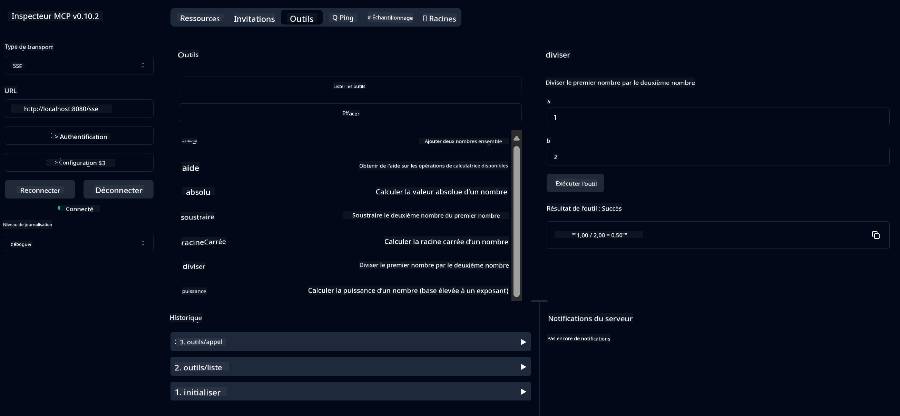

<!--
CO_OP_TRANSLATOR_METADATA:
{
  "original_hash": "13231e9951b68efd9df8c56bd5cdb27e",
  "translation_date": "2025-07-13T22:20:26+00:00",
  "source_file": "03-GettingStarted/samples/java/calculator/README.md",
  "language_code": "fr"
}
-->
# Service de Calculatrice Basique MCP

Ce service fournit des opérations de calculatrice basiques via le Model Context Protocol (MCP) en utilisant Spring Boot avec un transport WebFlux. Il est conçu comme un exemple simple pour les débutants qui souhaitent apprendre les implémentations MCP.

Pour plus d’informations, consultez la documentation de référence [MCP Server Boot Starter](https://docs.spring.io/spring-ai/reference/api/mcp/mcp-server-boot-starter-docs.html).

## Vue d’ensemble

Le service met en avant :
- Le support des SSE (Server-Sent Events)
- L’enregistrement automatique des outils grâce à l’annotation `@Tool` de Spring AI
- Les fonctions basiques de calculatrice :
  - Addition, soustraction, multiplication, division
  - Calcul de puissance et racine carrée
  - Modulo (reste) et valeur absolue
  - Fonction d’aide pour la description des opérations

## Fonctionnalités

Ce service de calculatrice offre les capacités suivantes :

1. **Opérations arithmétiques de base** :
   - Addition de deux nombres
   - Soustraction d’un nombre par rapport à un autre
   - Multiplication de deux nombres
   - Division d’un nombre par un autre (avec vérification de la division par zéro)

2. **Opérations avancées** :
   - Calcul de puissance (élever une base à un exposant)
   - Calcul de racine carrée (avec vérification des nombres négatifs)
   - Calcul du modulo (reste de la division)
   - Calcul de la valeur absolue

3. **Système d’aide** :
   - Fonction d’aide intégrée expliquant toutes les opérations disponibles

## Utilisation du Service

Le service expose les points d’API suivants via le protocole MCP :

- `add(a, b)` : Additionner deux nombres
- `subtract(a, b)` : Soustraire le second nombre du premier
- `multiply(a, b)` : Multiplier deux nombres
- `divide(a, b)` : Diviser le premier nombre par le second (avec vérification de zéro)
- `power(base, exponent)` : Calculer la puissance d’un nombre
- `squareRoot(number)` : Calculer la racine carrée (avec vérification des nombres négatifs)
- `modulus(a, b)` : Calculer le reste de la division
- `absolute(number)` : Calculer la valeur absolue
- `help()` : Obtenir des informations sur les opérations disponibles

## Client de Test

Un client de test simple est inclus dans le package `com.microsoft.mcp.sample.client`. La classe `SampleCalculatorClient` illustre les opérations disponibles du service de calculatrice.

## Utilisation du Client LangChain4j

Le projet inclut un exemple de client LangChain4j dans `com.microsoft.mcp.sample.client.LangChain4jClient` qui montre comment intégrer le service de calculatrice avec LangChain4j et les modèles GitHub :

### Prérequis

1. **Configuration du Token GitHub** :

   Pour utiliser les modèles IA de GitHub (comme phi-4), vous devez disposer d’un token d’accès personnel GitHub :

   a. Rendez-vous dans les paramètres de votre compte GitHub : https://github.com/settings/tokens

   b. Cliquez sur « Generate new token » → « Generate new token (classic) »

   c. Donnez un nom descriptif à votre token

   d. Sélectionnez les scopes suivants :
      - `repo` (Contrôle total des dépôts privés)
      - `read:org` (Lecture des membres d’organisation et d’équipe, lecture des projets d’organisation)
      - `gist` (Création de gists)
      - `user:email` (Accès en lecture seule aux adresses email utilisateur)

   e. Cliquez sur « Generate token » et copiez votre nouveau token

   f. Configurez-le en variable d’environnement :

      Sous Windows :  
      ```
      set GITHUB_TOKEN=your-github-token
      ```

      Sous macOS/Linux :  
      ```bash
      export GITHUB_TOKEN=your-github-token
      ```

   g. Pour une configuration persistante, ajoutez-le à vos variables d’environnement via les paramètres système

2. Ajoutez la dépendance LangChain4j GitHub à votre projet (déjà incluse dans pom.xml) :  
   ```xml
   <dependency>
       <groupId>dev.langchain4j</groupId>
       <artifactId>langchain4j-github</artifactId>
       <version>${langchain4j.version}</version>
   </dependency>
   ```

3. Assurez-vous que le serveur de calculatrice tourne sur `localhost:8080`

### Exécution du Client LangChain4j

Cet exemple montre :
- La connexion au serveur MCP de la calculatrice via le transport SSE
- L’utilisation de LangChain4j pour créer un chatbot qui exploite les opérations de la calculatrice
- L’intégration avec les modèles IA GitHub (utilisant désormais le modèle phi-4)

Le client envoie les requêtes d’exemple suivantes pour démontrer les fonctionnalités :  
1. Calculer la somme de deux nombres  
2. Trouver la racine carrée d’un nombre  
3. Obtenir des informations d’aide sur les opérations disponibles

Lancez l’exemple et consultez la sortie console pour voir comment le modèle IA utilise les outils de la calculatrice pour répondre aux requêtes.

### Configuration du Modèle GitHub

Le client LangChain4j est configuré pour utiliser le modèle phi-4 de GitHub avec les paramètres suivants :

```java
ChatLanguageModel model = GitHubChatModel.builder()
    .apiKey(System.getenv("GITHUB_TOKEN"))
    .timeout(Duration.ofSeconds(60))
    .modelName("phi-4")
    .logRequests(true)
    .logResponses(true)
    .build();
```

Pour utiliser d’autres modèles GitHub, il suffit de modifier le paramètre `modelName` avec un autre modèle supporté (par exemple, "claude-3-haiku-20240307", "llama-3-70b-8192", etc.).

## Dépendances

Le projet nécessite les dépendances clés suivantes :

```xml
<!-- For MCP Server -->
<dependency>
    <groupId>org.springframework.ai</groupId>
    <artifactId>spring-ai-starter-mcp-server-webflux</artifactId>
</dependency>

<!-- For LangChain4j integration -->
<dependency>
    <groupId>dev.langchain4j</groupId>
    <artifactId>langchain4j-mcp</artifactId>
    <version>${langchain4j.version}</version>
</dependency>

<!-- For GitHub models support -->
<dependency>
    <groupId>dev.langchain4j</groupId>
    <artifactId>langchain4j-github</artifactId>
    <version>${langchain4j.version}</version>
</dependency>
```

## Compilation du Projet

Compilez le projet avec Maven :  
```bash
./mvnw clean install -DskipTests
```

## Lancement du Serveur

### Avec Java

```bash
java -jar target/calculator-server-0.0.1-SNAPSHOT.jar
```

### Avec MCP Inspector

Le MCP Inspector est un outil pratique pour interagir avec les services MCP. Pour l’utiliser avec ce service de calculatrice :

1. **Installez et lancez MCP Inspector** dans un nouveau terminal :  
   ```bash
   npx @modelcontextprotocol/inspector
   ```

2. **Accédez à l’interface web** en cliquant sur l’URL affichée par l’application (généralement http://localhost:6274)

3. **Configurez la connexion** :  
   - Choisissez le type de transport « SSE »  
   - Indiquez l’URL du serveur SSE en cours d’exécution : `http://localhost:8080/sse`  
   - Cliquez sur « Connect »

4. **Utilisez les outils** :  
   - Cliquez sur « List Tools » pour voir les opérations de la calculatrice disponibles  
   - Sélectionnez un outil et cliquez sur « Run Tool » pour exécuter une opération



### Avec Docker

Le projet inclut un Dockerfile pour un déploiement en conteneur :

1. **Construisez l’image Docker** :  
   ```bash
   docker build -t calculator-mcp-service .
   ```

2. **Lancez le conteneur Docker** :  
   ```bash
   docker run -p 8080:8080 calculator-mcp-service
   ```

Cela va :  
- Construire une image Docker multi-étapes avec Maven 3.9.9 et Eclipse Temurin 24 JDK  
- Créer une image optimisée pour le conteneur  
- Exposer le service sur le port 8080  
- Démarrer le service MCP calculatrice à l’intérieur du conteneur

Vous pourrez accéder au service à l’adresse `http://localhost:8080` une fois le conteneur lancé.

## Dépannage

### Problèmes courants avec le Token GitHub

1. **Problèmes de permissions du token** : Si vous obtenez une erreur 403 Forbidden, vérifiez que votre token possède bien les permissions requises comme indiqué dans les prérequis.

2. **Token introuvable** : Si vous recevez une erreur « No API key found », assurez-vous que la variable d’environnement GITHUB_TOKEN est correctement configurée.

3. **Limitation de débit** : L’API GitHub impose des limites de requêtes. En cas d’erreur de limitation (code 429), patientez quelques minutes avant de réessayer.

4. **Expiration du token** : Les tokens GitHub peuvent expirer. Si vous rencontrez des erreurs d’authentification après un certain temps, générez un nouveau token et mettez à jour votre variable d’environnement.

Pour plus d’aide, consultez la [documentation LangChain4j](https://github.com/langchain4j/langchain4j) ou la [documentation API GitHub](https://docs.github.com/en/rest).

**Avertissement** :  
Ce document a été traduit à l’aide du service de traduction automatique [Co-op Translator](https://github.com/Azure/co-op-translator). Bien que nous nous efforcions d’assurer l’exactitude, veuillez noter que les traductions automatiques peuvent contenir des erreurs ou des inexactitudes. Le document original dans sa langue d’origine doit être considéré comme la source faisant foi. Pour les informations critiques, une traduction professionnelle réalisée par un humain est recommandée. Nous déclinons toute responsabilité en cas de malentendus ou de mauvaises interprétations résultant de l’utilisation de cette traduction.