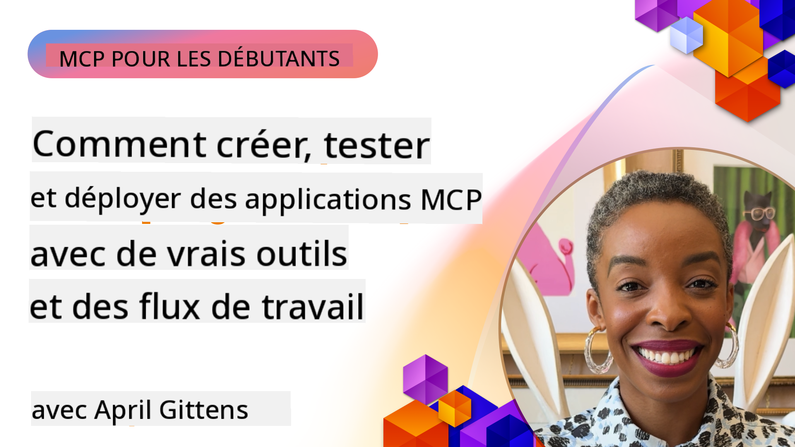
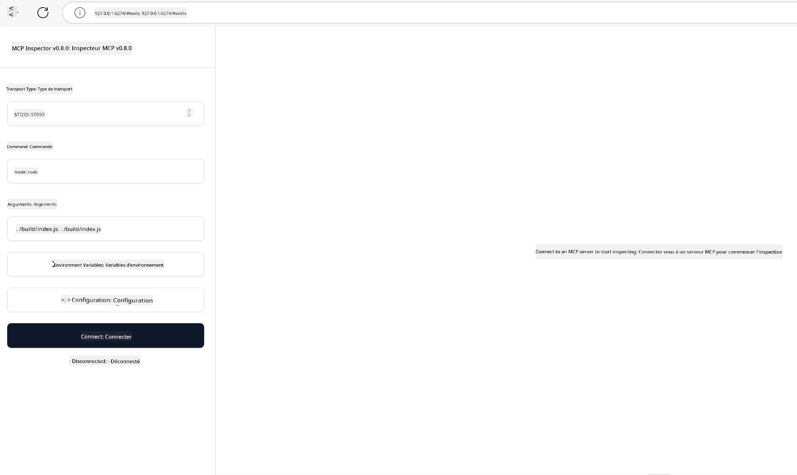

<!--
CO_OP_TRANSLATOR_METADATA:
{
  "original_hash": "83efa75a69bc831277263a6f1ae53669",
  "translation_date": "2025-08-11T10:09:32+00:00",
  "source_file": "04-PracticalImplementation/README.md",
  "language_code": "fr"
}
-->
# Mise en œuvre pratique

[](https://youtu.be/vCN9-mKBDfQ)

_(Cliquez sur l'image ci-dessus pour visionner la vidéo de cette leçon)_

La mise en œuvre pratique est le moment où la puissance du Model Context Protocol (MCP) devient concrète. Bien que comprendre la théorie et l'architecture derrière MCP soit important, la véritable valeur réside dans l'application de ces concepts pour concevoir, tester et déployer des solutions qui répondent à des problèmes réels. Ce chapitre comble le fossé entre les connaissances conceptuelles et le développement pratique, en vous guidant dans le processus de création d'applications basées sur MCP.

Que vous développiez des assistants intelligents, intégriez l'IA dans des workflows métier ou construisiez des outils personnalisés pour le traitement des données, MCP offre une base flexible. Son design indépendant du langage et ses SDK officiels pour les langages de programmation populaires le rendent accessible à un large éventail de développeurs. En exploitant ces SDK, vous pouvez rapidement prototyper, itérer et déployer vos solutions sur différentes plateformes et environnements.

Dans les sections suivantes, vous trouverez des exemples pratiques, du code d'exemple et des stratégies de déploiement qui montrent comment implémenter MCP en C#, Java avec Spring, TypeScript, JavaScript et Python. Vous apprendrez également à déboguer et tester vos serveurs MCP, gérer les API et déployer des solutions dans le cloud avec Azure. Ces ressources pratiques sont conçues pour accélérer votre apprentissage et vous aider à créer des applications MCP robustes et prêtes pour la production.

## Aperçu

Cette leçon se concentre sur les aspects pratiques de l'implémentation de MCP dans plusieurs langages de programmation. Nous explorerons comment utiliser les SDK MCP en C#, Java avec Spring, TypeScript, JavaScript et Python pour construire des applications robustes, déboguer et tester des serveurs MCP, et créer des ressources, des invites et des outils réutilisables.

## Objectifs d'apprentissage

À la fin de cette leçon, vous serez capable de :

- Implémenter des solutions MCP en utilisant les SDK officiels dans divers langages de programmation
- Déboguer et tester systématiquement les serveurs MCP
- Créer et utiliser des fonctionnalités de serveur (Ressources, Invites et Outils)
- Concevoir des workflows MCP efficaces pour des tâches complexes
- Optimiser les implémentations MCP pour la performance et la fiabilité

## Ressources SDK officielles

Le Model Context Protocol propose des SDK officiels pour plusieurs langages :

- [SDK C#](https://github.com/modelcontextprotocol/csharp-sdk)
- [SDK Java avec Spring](https://github.com/modelcontextprotocol/java-sdk) **Remarque :** nécessite une dépendance à [Project Reactor](https://projectreactor.io). (Voir [discussion issue 246](https://github.com/orgs/modelcontextprotocol/discussions/246).)
- [SDK TypeScript](https://github.com/modelcontextprotocol/typescript-sdk)
- [SDK Python](https://github.com/modelcontextprotocol/python-sdk)
- [SDK Kotlin](https://github.com/modelcontextprotocol/kotlin-sdk)

## Travailler avec les SDK MCP

Cette section fournit des exemples pratiques d'implémentation de MCP dans plusieurs langages de programmation. Vous pouvez trouver du code d'exemple dans le répertoire `samples` organisé par langage.

### Exemples disponibles

Le dépôt inclut [des implémentations d'exemple](../../../04-PracticalImplementation/samples) dans les langages suivants :

- [C#](./samples/csharp/README.md)
- [Java avec Spring](./samples/java/containerapp/README.md)
- [TypeScript](./samples/typescript/README.md)
- [JavaScript](./samples/javascript/README.md)
- [Python](./samples/python/README.md)

Chaque exemple démontre des concepts clés de MCP et des modèles d'implémentation spécifiques à ce langage et écosystème.

## Fonctionnalités principales du serveur

Les serveurs MCP peuvent implémenter une combinaison des fonctionnalités suivantes :

### Ressources

Les ressources fournissent un contexte et des données à utiliser par l'utilisateur ou le modèle d'IA :

- Répertoires de documents
- Bases de connaissances
- Sources de données structurées
- Systèmes de fichiers

### Invites

Les invites sont des messages et workflows prédéfinis pour les utilisateurs :

- Modèles de conversation prédéfinis
- Modèles d'interaction guidée
- Structures de dialogue spécialisées

### Outils

Les outils sont des fonctions que le modèle d'IA peut exécuter :

- Utilitaires de traitement des données
- Intégrations d'API externes
- Capacités computationnelles
- Fonctionnalités de recherche

## Implémentations d'exemple : Implémentation en C#

Le dépôt officiel du SDK C# contient plusieurs implémentations d'exemple démontrant différents aspects de MCP :

- **Client MCP basique** : Exemple simple montrant comment créer un client MCP et appeler des outils
- **Serveur MCP basique** : Implémentation minimale de serveur avec enregistrement d'outils basique
- **Serveur MCP avancé** : Serveur complet avec enregistrement d'outils, authentification et gestion des erreurs
- **Intégration ASP.NET** : Exemples démontrant l'intégration avec ASP.NET Core
- **Modèles d'implémentation d'outils** : Divers modèles pour implémenter des outils avec différents niveaux de complexité

Le SDK MCP C# est en aperçu et les API peuvent évoluer. Nous mettrons continuellement à jour ce blog au fur et à mesure que le SDK évolue.

### Fonctionnalités clés

- [C# MCP Nuget ModelContextProtocol](https://www.nuget.org/packages/ModelContextProtocol)
- Construire votre [premier serveur MCP](https://devblogs.microsoft.com/dotnet/build-a-model-context-protocol-mcp-server-in-csharp/).

Pour des exemples complets d'implémentation en C#, visitez le [dépôt officiel des exemples du SDK C#](https://github.com/modelcontextprotocol/csharp-sdk)

## Implémentation d'exemple : Implémentation en Java avec Spring

Le SDK Java avec Spring offre des options d'implémentation MCP robustes avec des fonctionnalités de niveau entreprise.

### Fonctionnalités clés

- Intégration avec le framework Spring
- Forte sécurité des types
- Support de la programmation réactive
- Gestion complète des erreurs

Pour un exemple complet d'implémentation en Java avec Spring, consultez [l'exemple Java avec Spring](samples/java/containerapp/README.md) dans le répertoire des exemples.

## Implémentation d'exemple : Implémentation en JavaScript

Le SDK JavaScript fournit une approche légère et flexible pour l'implémentation de MCP.

### Fonctionnalités clés

- Support pour Node.js et les navigateurs
- API basée sur les promesses
- Intégration facile avec Express et d'autres frameworks
- Support WebSocket pour le streaming

Pour un exemple complet d'implémentation en JavaScript, consultez [l'exemple JavaScript](samples/javascript/README.md) dans le répertoire des exemples.

## Implémentation d'exemple : Implémentation en Python

Le SDK Python offre une approche Pythonique de l'implémentation MCP avec d'excellentes intégrations aux frameworks ML.

### Fonctionnalités clés

- Support async/await avec asyncio
- Intégration avec FastAPI
- Enregistrement d'outils simple
- Intégration native avec les bibliothèques ML populaires

Pour un exemple complet d'implémentation en Python, consultez [l'exemple Python](samples/python/README.md) dans le répertoire des exemples.

## Gestion des API

Azure API Management est une excellente solution pour sécuriser les serveurs MCP. L'idée est de placer une instance Azure API Management devant votre serveur MCP et de lui permettre de gérer des fonctionnalités que vous êtes susceptible de vouloir, comme :

- Limitation de débit
- Gestion des jetons
- Surveillance
- Équilibrage de charge
- Sécurité

### Exemple Azure

Voici un exemple Azure qui fait exactement cela, c'est-à-dire [créer un serveur MCP et le sécuriser avec Azure API Management](https://github.com/Azure-Samples/remote-mcp-apim-functions-python).

Voyez comment le flux d'autorisation se déroule dans l'image ci-dessous :


Dans l'image précédente, les étapes suivantes ont lieu :

- L'authentification/autorisation se fait via Microsoft Entra.
- Azure API Management agit comme une passerelle et utilise des politiques pour diriger et gérer le trafic.
- Azure Monitor journalise toutes les requêtes pour une analyse ultérieure.

#### Flux d'autorisation

Examinons le flux d'autorisation plus en détail :


#### Spécification d'autorisation MCP

En savoir plus sur la [spécification d'autorisation MCP](https://modelcontextprotocol.io/specification/2025-03-26/basic/authorization#2-10-third-party-authorization-flow)

## Déployer un serveur MCP distant sur Azure

Voyons si nous pouvons déployer l'exemple mentionné précédemment :

1. Clonez le dépôt

    ```bash
    git clone https://github.com/Azure-Samples/remote-mcp-apim-functions-python.git
    cd remote-mcp-apim-functions-python
    ```

1. Enregistrez le fournisseur de ressources `Microsoft.App`.

   - Si vous utilisez Azure CLI, exécutez `az provider register --namespace Microsoft.App --wait`.
   - Si vous utilisez Azure PowerShell, exécutez `Register-AzResourceProvider -ProviderNamespace Microsoft.App`. Ensuite, exécutez `(Get-AzResourceProvider -ProviderNamespace Microsoft.App).RegistrationState` après un certain temps pour vérifier si l'enregistrement est terminé.

1. Exécutez cette commande [azd](https://aka.ms/azd) pour provisionner le service de gestion des API, l'application fonctionnelle (avec code) et toutes les autres ressources Azure nécessaires

    ```shell
    azd up
    ```

    Cette commande devrait déployer toutes les ressources cloud sur Azure.

### Tester votre serveur avec MCP Inspector

1. Dans une **nouvelle fenêtre de terminal**, installez et exécutez MCP Inspector

    ```shell
    npx @modelcontextprotocol/inspector
    ```

    Vous devriez voir une interface similaire à :

    

1. CTRL cliquez pour charger l'application web MCP Inspector depuis l'URL affichée par l'application (par exemple [http://127.0.0.1:6274/#resources](http://127.0.0.1:6274/#resources))
1. Définissez le type de transport sur `SSE`
1. Définissez l'URL sur votre point de terminaison SSE API Management en cours d'exécution affiché après `azd up` et **Connectez-vous** :

    ```shell
    https://<apim-servicename-from-azd-output>.azure-api.net/mcp/sse
    ```

1. **Lister les outils**. Cliquez sur un outil et **Exécutez l'outil**.

Si toutes les étapes ont fonctionné, vous devriez maintenant être connecté au serveur MCP et avoir pu appeler un outil.

## Serveurs MCP pour Azure

[Remote-mcp-functions](https://github.com/Azure-Samples/remote-mcp-functions-dotnet) : Cet ensemble de dépôts est un modèle de démarrage rapide pour construire et déployer des serveurs MCP (Model Context Protocol) distants personnalisés en utilisant Azure Functions avec Python, C# .NET ou Node/TypeScript.

Les exemples fournissent une solution complète permettant aux développeurs de :

- Construire et exécuter localement : Développer et déboguer un serveur MCP sur une machine locale
- Déployer sur Azure : Déployer facilement dans le cloud avec une simple commande azd up
- Se connecter depuis des clients : Se connecter au serveur MCP depuis divers clients, y compris le mode agent de Copilot dans VS Code et l'outil MCP Inspector

### Fonctionnalités clés

- Sécurité par conception : Le serveur MCP est sécurisé à l'aide de clés et HTTPS
- Options d'authentification : Prend en charge OAuth avec authentification intégrée et/ou gestion des API
- Isolation réseau : Permet l'isolation réseau en utilisant des réseaux virtuels Azure (VNET)
- Architecture sans serveur : Exploite Azure Functions pour une exécution évolutive et basée sur les événements
- Développement local : Support complet pour le développement et le débogage local
- Déploiement simple : Processus de déploiement simplifié vers Azure

Le dépôt inclut tous les fichiers de configuration nécessaires, le code source et les définitions d'infrastructure pour commencer rapidement avec une implémentation de serveur MCP prête pour la production.

- [Azure Remote MCP Functions Python](https://github.com/Azure-Samples/remote-mcp-functions-python) - Exemple d'implémentation de MCP utilisant Azure Functions avec Python

- [Azure Remote MCP Functions .NET](https://github.com/Azure-Samples/remote-mcp-functions-dotnet) - Exemple d'implémentation de MCP utilisant Azure Functions avec C# .NET

- [Azure Remote MCP Functions Node/Typescript](https://github.com/Azure-Samples/remote-mcp-functions-typescript) - Exemple d'implémentation de MCP utilisant Azure Functions avec Node/TypeScript.

## Points clés à retenir

- Les SDK MCP fournissent des outils spécifiques au langage pour implémenter des solutions MCP robustes
- Le processus de débogage et de test est essentiel pour des applications MCP fiables
- Les modèles d'invites réutilisables permettent des interactions cohérentes avec l'IA
- Des workflows bien conçus peuvent orchestrer des tâches complexes en utilisant plusieurs outils
- L'implémentation de solutions MCP nécessite une prise en compte de la sécurité, des performances et de la gestion des erreurs

## Exercice

Concevez un workflow MCP pratique qui répond à un problème réel dans votre domaine :

1. Identifiez 3-4 outils qui seraient utiles pour résoudre ce problème
2. Créez un diagramme de workflow montrant comment ces outils interagissent
3. Implémentez une version basique de l'un des outils en utilisant votre langage préféré
4. Créez un modèle d'invite qui aiderait le modèle à utiliser efficacement votre outil

## Ressources supplémentaires

---

Suivant : [Sujets avancés](../05-AdvancedTopics/README.md)

**Avertissement** :  
Ce document a été traduit à l'aide du service de traduction automatique [Co-op Translator](https://github.com/Azure/co-op-translator). Bien que nous nous efforcions d'assurer l'exactitude, veuillez noter que les traductions automatisées peuvent contenir des erreurs ou des inexactitudes. Le document original dans sa langue d'origine doit être considéré comme la source faisant autorité. Pour des informations critiques, il est recommandé de recourir à une traduction professionnelle réalisée par un humain. Nous déclinons toute responsabilité en cas de malentendus ou d'interprétations erronées résultant de l'utilisation de cette traduction.