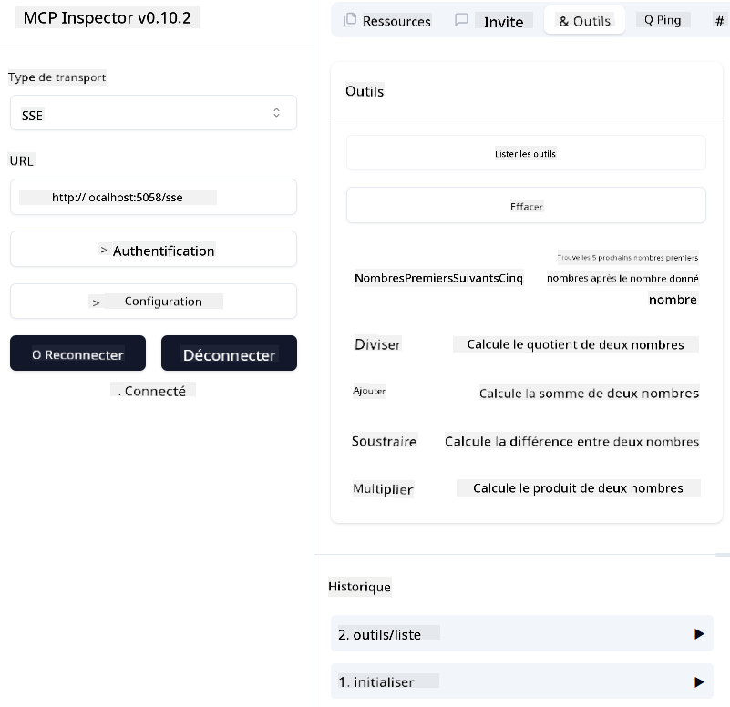

<!--
CO_OP_TRANSLATOR_METADATA:
{
  "original_hash": "5020a3e1a1c7f30c00f9e37f1fa208e3",
  "translation_date": "2025-05-16T15:40:34+00:00",
  "source_file": "04-PracticalImplementation/samples/csharp/README.md",
  "language_code": "fr"
}
-->
# Exemple

L'exemple précédent montre comment utiliser un projet .NET local avec le type `sdio`. Et comment exécuter le serveur localement dans un conteneur. C’est une bonne solution dans de nombreuses situations. Cependant, il peut être utile d’avoir le serveur qui fonctionne à distance, comme dans un environnement cloud. C’est là que le type `http` entre en jeu.

En regardant la solution dans le dossier `04-PracticalImplementation`, cela peut sembler bien plus complexe que le précédent. Mais en réalité, ce n’est pas le cas. Si vous regardez de près le projet `src/mcpserver/mcpserver.csproj`, vous verrez que c’est essentiellement le même code que dans l’exemple précédent. La seule différence est que nous utilisons une bibliothèque différente `ModelContextProtocol.AspNetCore` pour gérer les requêtes HTTP. Et nous modifions la méthode `IsPrime` pour la rendre privée, juste pour montrer que vous pouvez avoir des méthodes privées dans votre code. Le reste du code est identique.

Les autres projets proviennent de [.NET Aspire](https://learn.microsoft.com/dotnet/aspire/get-started/aspire-overview). Avoir .NET Aspire dans la solution améliore l’expérience du développeur lors du développement et des tests, et facilite l’observabilité. Ce n’est pas obligatoire pour faire tourner le serveur, mais c’est une bonne pratique de l’intégrer dans votre solution.

## Démarrer le serveur localement

1. Depuis VS Code (avec l’extension C# DevKit), ouvrez la solution `04-PracticalImplementation\samples\csharp\src\Calculator-chap4.sln`.
2. Appuyez sur `F5` pour démarrer le serveur. Cela devrait ouvrir un navigateur web avec le tableau de bord .NET Aspire.

ou

1. Depuis un terminal, naviguez jusqu’au dossier `04-PracticalImplementation\samples\csharp\src`
2. Exécutez la commande suivante pour démarrer le serveur :
   ```bash
    dotnet run --project .\AppHost
   ```

3. Depuis le tableau de bord, notez l’URL `http`. Elle devrait ressembler à `http://localhost:5058/`.

## Test `SSE` avec le ModelContext Protocol Inspector

Si vous avez Node.js 22.7.5 ou une version supérieure, vous pouvez utiliser le ModelContext Protocol Inspector pour tester votre serveur.

Démarrez le serveur et exécutez la commande suivante dans un terminal :

```bash
npx @modelcontextprotocol/inspector@latest
```



- Sélectionnez `SSE` as the Transport type. SSE stand for Server-Sent Events. 
- In the Url field, enter the URL of the server noted earlier,and append `/sse`. Cela devrait être `http` (pas `https`) something like `http://localhost:5058/sse`.
- select the Connect button.

A nice thing about the Inspector is that it provide a nice visibility on what is happening.

- Try listing the availables tools
- Try some of them, it should works just like before.


## Test `SSE` with Github Copilot Chat in VS Code

To use the `SSE` transport with Github Copilot Chat, change the configuration of the `mcp-calc`) serveur créé précédemment pour ressembler à ceci :

```json
"mcp-calc": {
    "type": "sse",
    "url": "http://localhost:5058/sse"
}
```

Faites quelques tests :
- Demandez les 3 nombres premiers après 6780. Notez comment Copilot utilise les nouveaux outils `NextFivePrimeNumbers` et ne renvoie que les 3 premiers nombres premiers.
- Demandez les 7 nombres premiers après 111, pour voir ce qui se passe.

# Déployer le serveur sur Azure

Déployons le serveur sur Azure pour que plus de personnes puissent l’utiliser.

Depuis un terminal, naviguez jusqu’au dossier `04-PracticalImplementation\samples\csharp\src` et lancez la commande suivante :

```bash
azd init
```

Cela va créer quelques fichiers localement pour sauvegarder la configuration des ressources Azure, ainsi que votre Infrastructure as Code (IaC).

Ensuite, exécutez la commande suivante pour déployer le serveur sur Azure :

```bash
azd up
```

Une fois le déploiement terminé, vous devriez voir un message comme celui-ci :


Accédez au tableau de bord Aspire et notez l’URL `HTTP` pour l’utiliser dans le MCP Inspector et dans Github Copilot Chat.

## Et après ?

Nous avons essayé différents types de transport, des outils de test, et nous avons aussi déployé notre serveur MCP sur Azure. Mais que faire si notre serveur doit accéder à des ressources privées ? Par exemple, une base de données ou une API privée ? Dans le chapitre suivant, nous verrons comment renforcer la sécurité de notre serveur.

**Avertissement** :  
Ce document a été traduit à l'aide du service de traduction automatique [Co-op Translator](https://github.com/Azure/co-op-translator). Bien que nous nous efforcions d'assurer l'exactitude, veuillez noter que les traductions automatiques peuvent contenir des erreurs ou des inexactitudes. Le document original dans sa langue d'origine doit être considéré comme la source faisant foi. Pour les informations critiques, une traduction professionnelle réalisée par un humain est recommandée. Nous déclinons toute responsabilité en cas de malentendus ou de mauvaises interprétations résultant de l'utilisation de cette traduction.