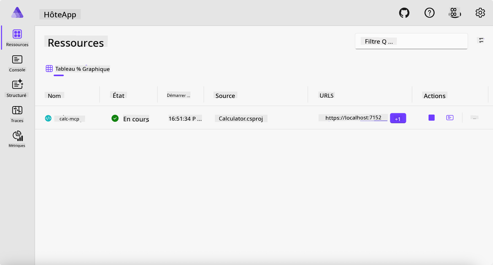
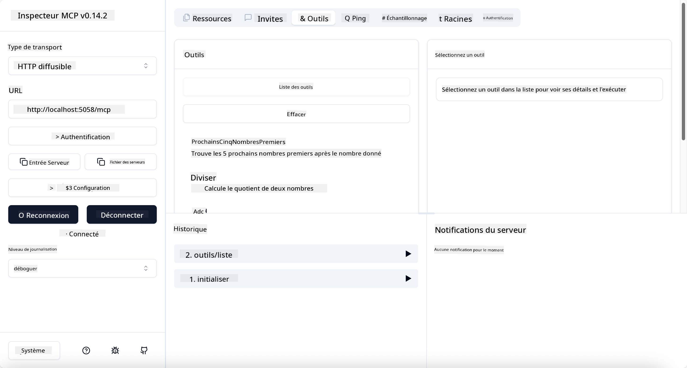
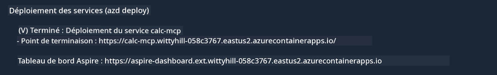

<!--
CO_OP_TRANSLATOR_METADATA:
{
  "original_hash": "0bc7bd48f55f1565f1d95ccb2c16f728",
  "translation_date": "2025-06-18T07:45:58+00:00",
  "source_file": "04-PracticalImplementation/samples/csharp/README.md",
  "language_code": "fr"
}
-->
# Exemple

L'exemple précédent montre comment utiliser un projet .NET local avec le type `stdio`. Et comment exécuter le serveur localement dans un conteneur. C’est une bonne solution dans de nombreuses situations. Cependant, il peut être utile d’avoir le serveur qui tourne à distance, comme dans un environnement cloud. C’est là qu’intervient le type `http`.

En regardant la solution dans le dossier `04-PracticalImplementation`, elle peut sembler beaucoup plus complexe que la précédente. Mais en réalité, ce n’est pas le cas. Si vous observez de près le projet `src/Calculator`, vous verrez qu’il s’agit essentiellement du même code que dans l’exemple précédent. La seule différence est que nous utilisons une bibliothèque différente `ModelContextProtocol.AspNetCore` pour gérer les requêtes HTTP. Et nous changeons la méthode `IsPrime` pour la rendre privée, juste pour montrer que vous pouvez avoir des méthodes privées dans votre code. Le reste du code est identique.

Les autres projets proviennent de [.NET Aspire](https://learn.microsoft.com/dotnet/aspire/get-started/aspire-overview). Avoir .NET Aspire dans la solution améliore l’expérience du développeur pendant le développement et les tests, et aide à l’observabilité. Ce n’est pas obligatoire pour faire tourner le serveur, mais c’est une bonne pratique de l’avoir dans votre solution.

## Démarrer le serveur localement

1. Depuis VS Code (avec l’extension C# DevKit), naviguez jusqu’au répertoire `04-PracticalImplementation/samples/csharp`.
1. Exécutez la commande suivante pour démarrer le serveur :

   ```bash
    dotnet watch run --project ./src/AppHost
   ```

1. Quand un navigateur web ouvre le tableau de bord .NET Aspire, notez l’URL `http`. Elle devrait ressembler à `http://localhost:5058/`.

   

## Tester Streamable HTTP avec le MCP Inspector

Si vous avez Node.js 22.7.5 ou supérieur, vous pouvez utiliser le MCP Inspector pour tester votre serveur.

Démarrez le serveur et lancez la commande suivante dans un terminal :

```bash
npx @modelcontextprotocol/inspector http://localhost:5058
```



- Sélectionnez `Streamable HTTP` as the Transport type.
- In the Url field, enter the URL of the server noted earlier, and append `/mcp`. Cela devrait être `http` (et non `https`) something like `http://localhost:5058/mcp`.
- select the Connect button.

A nice thing about the Inspector is that it provide a nice visibility on what is happening.

- Try listing the available tools
- Try some of them, it should works just like before.

## Test MCP Server with GitHub Copilot Chat in VS Code

To use the Streamable HTTP transport with GitHub Copilot Chat, change the configuration of the `calc-mcp`) pour que le serveur créé précédemment ressemble à ceci :

```jsonc
// .vscode/mcp.json
{
  "servers": {
    "calc-mcp": {
      "type": "http",
      "url": "http://localhost:5058/mcp"
    }
  }
}
```

Faites quelques tests :

- Demandez « 3 nombres premiers après 6780 ». Notez que Copilot utilisera les nouveaux outils `NextFivePrimeNumbers` et ne retournera que les 3 premiers nombres premiers.
- Demandez « 7 nombres premiers après 111 », pour voir ce qui se passe.
- Demandez « John a 24 sucettes et veut les répartir entre ses 3 enfants. Combien de sucettes chaque enfant aura-t-il ? », pour voir ce qui se passe.

## Déployer le serveur sur Azure

Déployons le serveur sur Azure pour que plus de personnes puissent l’utiliser.

Depuis un terminal, rendez-vous dans le dossier `04-PracticalImplementation/samples/csharp` et exécutez la commande suivante :

```bash
azd up
```

Une fois le déploiement terminé, vous devriez voir un message comme celui-ci :



Récupérez l’URL et utilisez-la dans le MCP Inspector ainsi que dans GitHub Copilot Chat.

```jsonc
// .vscode/mcp.json
{
  "servers": {
    "calc-mcp": {
      "type": "http",
      "url": "https://calc-mcp.gentleriver-3977fbcf.australiaeast.azurecontainerapps.io/mcp"
    }
  }
}
```

## Et ensuite ?

Nous avons essayé différents types de transport et d’outils de test. Nous avons aussi déployé votre serveur MCP sur Azure. Mais que se passe-t-il si notre serveur doit accéder à des ressources privées ? Par exemple, une base de données ou une API privée ? Dans le chapitre suivant, nous verrons comment améliorer la sécurité de notre serveur.

**Avertissement** :  
Ce document a été traduit à l’aide du service de traduction automatique [Co-op Translator](https://github.com/Azure/co-op-translator). Bien que nous nous efforcions d’assurer l’exactitude, veuillez noter que les traductions automatiques peuvent contenir des erreurs ou des inexactitudes. Le document original dans sa langue d’origine doit être considéré comme la source faisant foi. Pour des informations critiques, une traduction professionnelle réalisée par un humain est recommandée. Nous ne sommes pas responsables des malentendus ou interprétations erronées résultant de l’utilisation de cette traduction.