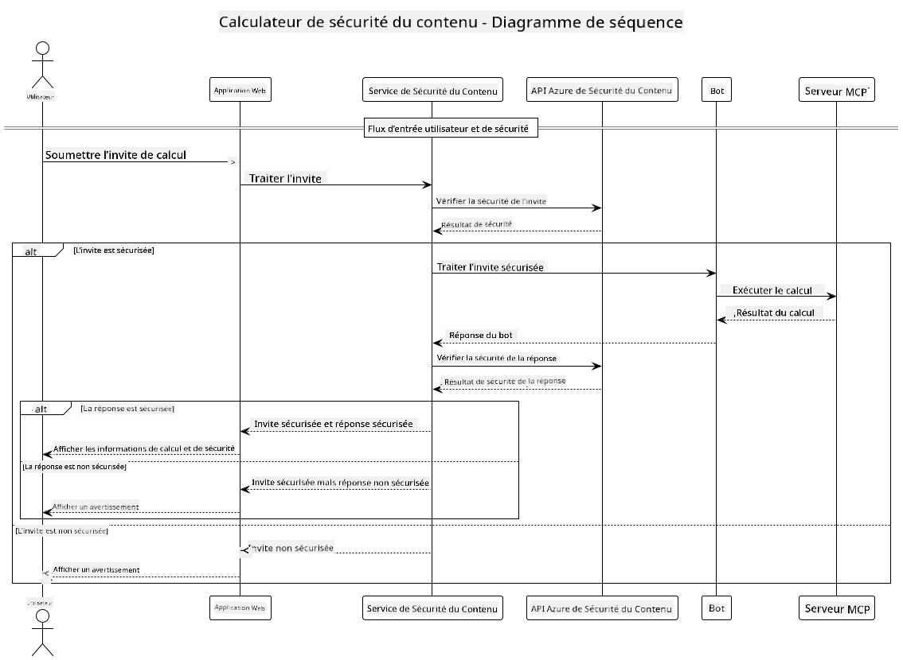

<!--
CO_OP_TRANSLATOR_METADATA:
{
  "original_hash": "e5ea5e7582f70008ea9bec3b3820f20a",
  "translation_date": "2025-07-13T23:11:13+00:00",
  "source_file": "04-PracticalImplementation/samples/java/containerapp/README.md",
  "language_code": "fr"
}
-->
## Architecture du Système

Ce projet présente une application web qui utilise une vérification de sécurité du contenu avant de transmettre les requêtes des utilisateurs à un service de calcul via le Model Context Protocol (MCP).



### Fonctionnement

1. **Saisie Utilisateur** : L’utilisateur saisit une requête de calcul dans l’interface web  
2. **Filtrage de Sécurité du Contenu (Entrée)** : La requête est analysée par l’API Azure Content Safety  
3. **Décision de Sécurité (Entrée)** :  
   - Si le contenu est sûr (sévérité < 2 dans toutes les catégories), il est transmis au calculateur  
   - Si le contenu est signalé comme potentiellement dangereux, le processus s’arrête et un avertissement est renvoyé  
4. **Intégration du Calculateur** : Le contenu sûr est traité par LangChain4j, qui communique avec le serveur calculateur MCP  
5. **Filtrage de Sécurité du Contenu (Sortie)** : La réponse du bot est analysée par l’API Azure Content Safety  
6. **Décision de Sécurité (Sortie)** :  
   - Si la réponse du bot est sûre, elle est affichée à l’utilisateur  
   - Si la réponse du bot est signalée comme potentiellement dangereuse, elle est remplacée par un avertissement  
7. **Réponse** : Les résultats (si sûrs) sont affichés à l’utilisateur avec les deux analyses de sécurité

## Utilisation du Model Context Protocol (MCP) avec les Services de Calcul

Ce projet montre comment utiliser le Model Context Protocol (MCP) pour appeler les services calculateur MCP depuis LangChain4j. L’implémentation utilise un serveur MCP local fonctionnant sur le port 8080 pour fournir les opérations de calcul.

### Configuration du Service Azure Content Safety

Avant d’utiliser les fonctionnalités de sécurité du contenu, vous devez créer une ressource Azure Content Safety :

1. Connectez-vous au [Portail Azure](https://portal.azure.com)  
2. Cliquez sur "Créer une ressource" et recherchez "Content Safety"  
3. Sélectionnez "Content Safety" puis cliquez sur "Créer"  
4. Saisissez un nom unique pour votre ressource  
5. Sélectionnez votre abonnement et groupe de ressources (ou créez-en un nouveau)  
6. Choisissez une région prise en charge (vérifiez la [disponibilité par région](https://azure.microsoft.com/en-us/global-infrastructure/services/?products=cognitive-services) pour plus de détails)  
7. Sélectionnez un niveau tarifaire approprié  
8. Cliquez sur "Créer" pour déployer la ressource  
9. Une fois le déploiement terminé, cliquez sur "Accéder à la ressource"  
10. Dans le panneau de gauche, sous "Gestion des ressources", sélectionnez "Clés et point de terminaison"  
11. Copiez l’une des clés ainsi que l’URL du point de terminaison pour l’étape suivante

### Configuration des Variables d’Environnement

Définissez la variable d’environnement `GITHUB_TOKEN` pour l’authentification des modèles GitHub :  
```sh
export GITHUB_TOKEN=<your_github_token>
```

Pour les fonctionnalités de sécurité du contenu, définissez :  
```sh
export CONTENT_SAFETY_ENDPOINT=<your_content_safety_endpoint>
export CONTENT_SAFETY_KEY=<your_content_safety_key>
```

Ces variables d’environnement sont utilisées par l’application pour s’authentifier auprès du service Azure Content Safety. Si elles ne sont pas définies, l’application utilisera des valeurs fictives à des fins de démonstration, mais les fonctionnalités de sécurité du contenu ne fonctionneront pas correctement.

### Démarrage du Serveur MCP Calculateur

Avant d’exécuter le client, vous devez démarrer le serveur MCP calculateur en mode SSE sur localhost:8080.

## Description du Projet

Ce projet illustre l’intégration du Model Context Protocol (MCP) avec LangChain4j pour appeler des services de calcul. Les principales fonctionnalités incluent :

- Utilisation de MCP pour se connecter à un service calculateur pour des opérations mathématiques basiques  
- Vérification de sécurité du contenu en double couche sur les requêtes utilisateur et les réponses du bot  
- Intégration avec le modèle gpt-4.1-nano de GitHub via LangChain4j  
- Utilisation des Server-Sent Events (SSE) pour le transport MCP

## Intégration de la Sécurité du Contenu

Le projet intègre des fonctionnalités complètes de sécurité du contenu pour garantir que les entrées utilisateur et les réponses du système sont exemptes de contenu nuisible :

1. **Filtrage à l’Entrée** : Toutes les requêtes utilisateur sont analysées pour détecter des catégories de contenu nuisible telles que discours haineux, violence, automutilation et contenu sexuel avant traitement.

2. **Filtrage à la Sortie** : Même en utilisant des modèles potentiellement non censurés, le système vérifie toutes les réponses générées via les mêmes filtres de sécurité du contenu avant de les afficher à l’utilisateur.

Cette approche à double couche garantit que le système reste sécurisé, quel que soit le modèle d’IA utilisé, protégeant les utilisateurs à la fois des entrées nuisibles et des sorties potentiellement problématiques générées par l’IA.

## Client Web

L’application comprend une interface web conviviale qui permet aux utilisateurs d’interagir avec le système Content Safety Calculator :

### Fonctionnalités de l’Interface Web

- Formulaire simple et intuitif pour saisir des requêtes de calcul  
- Validation de sécurité du contenu en double couche (entrée et sortie)  
- Retour en temps réel sur la sécurité des requêtes et des réponses  
- Indicateurs de sécurité codés par couleur pour une interprétation facile  
- Design épuré et réactif, compatible avec différents appareils  
- Exemples de requêtes sûres pour guider les utilisateurs

### Utilisation du Client Web

1. Démarrez l’application :  
   ```sh
   mvn spring-boot:run
   ```

2. Ouvrez votre navigateur et rendez-vous sur `http://localhost:8087`

3. Saisissez une requête de calcul dans la zone de texte prévue (par exemple, "Calculez la somme de 24.5 et 17.3")

4. Cliquez sur "Submit" pour traiter votre demande

5. Consultez les résultats, qui incluront :  
   - L’analyse de sécurité du contenu de votre requête  
   - Le résultat calculé (si la requête était sûre)  
   - L’analyse de sécurité du contenu de la réponse du bot  
   - Tout avertissement de sécurité si l’entrée ou la sortie a été signalée

Le client web gère automatiquement les deux processus de vérification de sécurité du contenu, garantissant que toutes les interactions sont sûres et appropriées, quel que soit le modèle d’IA utilisé.

**Avertissement** :  
Ce document a été traduit à l’aide du service de traduction automatique [Co-op Translator](https://github.com/Azure/co-op-translator). Bien que nous nous efforcions d’assurer l’exactitude, veuillez noter que les traductions automatiques peuvent contenir des erreurs ou des inexactitudes. Le document original dans sa langue d’origine doit être considéré comme la source faisant foi. Pour les informations critiques, une traduction professionnelle réalisée par un humain est recommandée. Nous déclinons toute responsabilité en cas de malentendus ou de mauvaises interprétations résultant de l’utilisation de cette traduction.