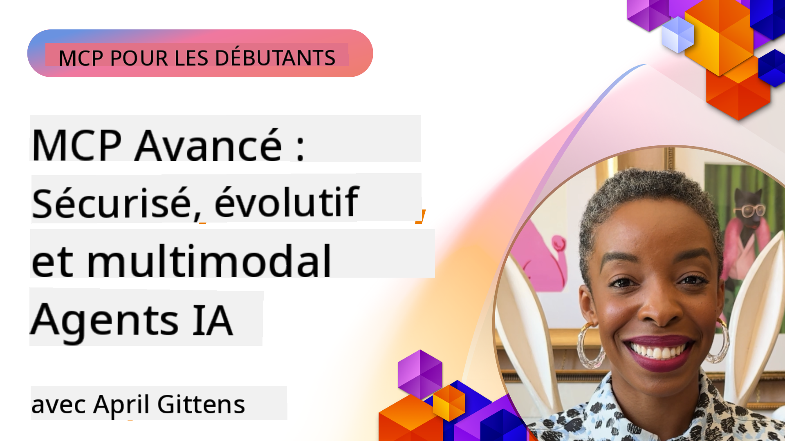

<!--
CO_OP_TRANSLATOR_METADATA:
{
  "original_hash": "d204bc94ea6027d06a703b21b711ca57",
  "translation_date": "2025-07-28T23:56:04+00:00",
  "source_file": "05-AdvancedTopics/README.md",
  "language_code": "fr"
}
-->
# Sujets avancés dans MCP

_(Cliquez sur l'image ci-dessus pour visionner la vidéo de cette leçon)_

Ce chapitre aborde une série de sujets avancés liés à la mise en œuvre du Model Context Protocol (MCP), notamment l'intégration multi-modale, l'évolutivité, les meilleures pratiques en matière de sécurité et l'intégration en entreprise. Ces sujets sont essentiels pour développer des applications MCP robustes et prêtes pour la production, capables de répondre aux exigences des systèmes d'IA modernes.

## Aperçu

Cette leçon explore des concepts avancés de mise en œuvre du Model Context Protocol, en mettant l'accent sur l'intégration multi-modale, l'évolutivité, les meilleures pratiques de sécurité et l'intégration en entreprise. Ces sujets sont cruciaux pour construire des applications MCP de niveau production capables de gérer des exigences complexes dans des environnements d'entreprise.

## Objectifs d'apprentissage

À la fin de cette leçon, vous serez capable de :

- Implémenter des capacités multi-modales dans les cadres MCP
- Concevoir des architectures MCP évolutives pour des scénarios à forte demande
- Appliquer les meilleures pratiques de sécurité alignées avec les principes de sécurité de MCP
- Intégrer MCP avec des systèmes et cadres d'IA d'entreprise
- Optimiser les performances et la fiabilité dans des environnements de production

## Leçons et projets d'exemple

| Lien | Titre | Description |
|------|-------|-------------|
| [5.1 Intégration avec Azure](./mcp-integration/README.md) | Intégration avec Azure | Apprenez à intégrer votre serveur MCP sur Azure |
| [5.2 Exemple multi-modal](./mcp-multi-modality/README.md) | Exemples MCP multi-modaux | Exemples pour les réponses audio, image et multi-modales |
| [5.3 Exemple OAuth2 MCP](../../../05-AdvancedTopics/mcp-oauth2-demo) | Démo OAuth2 MCP | Application Spring Boot minimale montrant OAuth2 avec MCP, à la fois comme serveur d'autorisation et serveur de ressources. Démontre l'émission sécurisée de jetons, des points de terminaison protégés, le déploiement sur Azure Container Apps et l'intégration avec API Management. |
| [5.4 Contextes racine](./mcp-root-contexts/README.md) | Contextes racine | En savoir plus sur les contextes racine et comment les implémenter |
| [5.5 Routage](./mcp-routing/README.md) | Routage | Découvrez différents types de routage |
| [5.6 Échantillonnage](./mcp-sampling/README.md) | Échantillonnage | Apprenez à travailler avec l'échantillonnage |
| [5.7 Mise à l'échelle](./mcp-scaling/README.md) | Mise à l'échelle | Découvrez la mise à l'échelle |
| [5.8 Sécurité](./mcp-security/README.md) | Sécurité | Sécurisez votre serveur MCP |
| [5.9 Exemple de recherche web](./web-search-mcp/README.md) | Recherche web MCP | Serveur et client MCP Python intégrant SerpAPI pour la recherche web, d'actualités, de produits en temps réel, et les questions-réponses. Démontre l'orchestration multi-outils, l'intégration d'API externes et une gestion robuste des erreurs. |
| [5.10 Diffusion en temps réel](./mcp-realtimestreaming/README.md) | Diffusion | La diffusion de données en temps réel est devenue essentielle dans le monde axé sur les données d'aujourd'hui, où les entreprises et les applications nécessitent un accès immédiat à l'information pour prendre des décisions opportunes. |
| [5.11 Recherche web en temps réel](./mcp-realtimesearch/README.md) | Recherche web | Découvrez comment MCP transforme la recherche web en temps réel en fournissant une approche standardisée pour la gestion des contextes entre modèles d'IA, moteurs de recherche et applications. |
| [5.12 Authentification Entra ID pour les serveurs MCP](./mcp-security-entra/README.md) | Authentification Entra ID | Microsoft Entra ID offre une solution robuste de gestion des identités et des accès basée sur le cloud, garantissant que seuls les utilisateurs et applications autorisés peuvent interagir avec votre serveur MCP. |
| [5.13 Intégration avec Azure AI Foundry](./mcp-foundry-agent-integration/README.md) | Intégration Azure AI Foundry | Apprenez à intégrer les serveurs MCP avec les agents Azure AI Foundry, permettant une orchestration puissante des outils et des capacités d'IA d'entreprise avec des connexions standardisées aux sources de données externes. |
| [5.14 Ingénierie des contextes](./mcp-contextengineering/README.md) | Ingénierie des contextes | Découvrez les opportunités futures des techniques d'ingénierie des contextes pour les serveurs MCP, y compris l'optimisation des contextes, la gestion dynamique des contextes et les stratégies pour un prompt engineering efficace dans les cadres MCP. |

## Références supplémentaires

Pour des informations à jour sur les sujets avancés de MCP, consultez :
- [Documentation MCP](https://modelcontextprotocol.io/)
- [Spécification MCP](https://spec.modelcontextprotocol.io/)
- [Dépôt GitHub](https://github.com/modelcontextprotocol)

## Points clés à retenir

- Les implémentations MCP multi-modales étendent les capacités de l'IA au-delà du traitement textuel
- L'évolutivité est essentielle pour les déploiements en entreprise et peut être abordée par la mise à l'échelle horizontale et verticale
- Des mesures de sécurité complètes protègent les données et garantissent un contrôle d'accès approprié
- L'intégration en entreprise avec des plateformes comme Azure OpenAI et Microsoft AI Foundry améliore les capacités de MCP
- Les implémentations avancées de MCP bénéficient d'architectures optimisées et d'une gestion rigoureuse des ressources

## Exercice

Concevez une implémentation MCP de niveau entreprise pour un cas d'utilisation spécifique :

1. Identifiez les besoins multi-modaux pour votre cas d'utilisation
2. Définissez les contrôles de sécurité nécessaires pour protéger les données sensibles
3. Concevez une architecture évolutive capable de gérer des charges variables
4. Planifiez les points d'intégration avec les systèmes d'IA d'entreprise
5. Documentez les éventuels goulots d'étranglement en termes de performances et les stratégies d'atténuation

## Ressources supplémentaires

- [Documentation Azure OpenAI](https://learn.microsoft.com/en-us/azure/ai-services/openai/)
- [Documentation Microsoft AI Foundry](https://learn.microsoft.com/en-us/ai-services/)

---

## Et après

- [5.1 Intégration MCP](./mcp-integration/README.md)

**Avertissement** :  
Ce document a été traduit à l'aide du service de traduction automatique [Co-op Translator](https://github.com/Azure/co-op-translator). Bien que nous nous efforcions d'assurer l'exactitude, veuillez noter que les traductions automatisées peuvent contenir des erreurs ou des inexactitudes. Le document original dans sa langue d'origine doit être considéré comme la source faisant autorité. Pour des informations critiques, il est recommandé de recourir à une traduction professionnelle réalisée par un humain. Nous ne sommes pas responsables des malentendus ou des interprétations erronées résultant de l'utilisation de cette traduction.