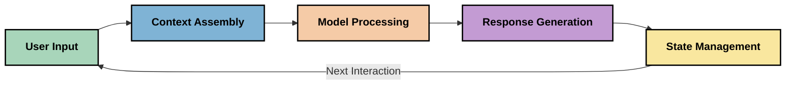
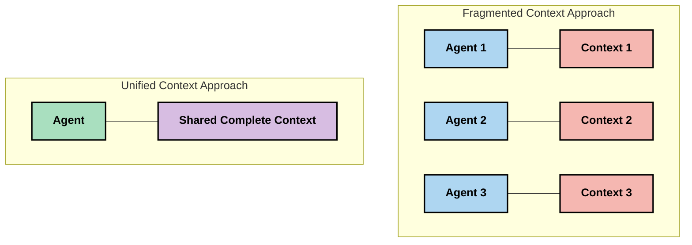
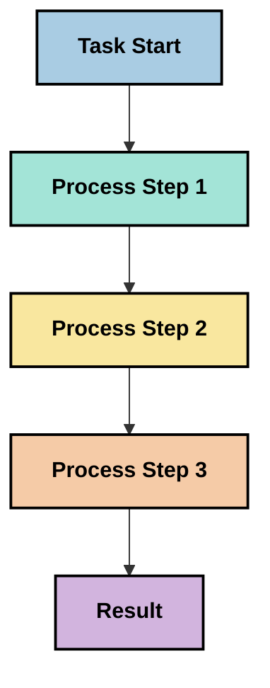
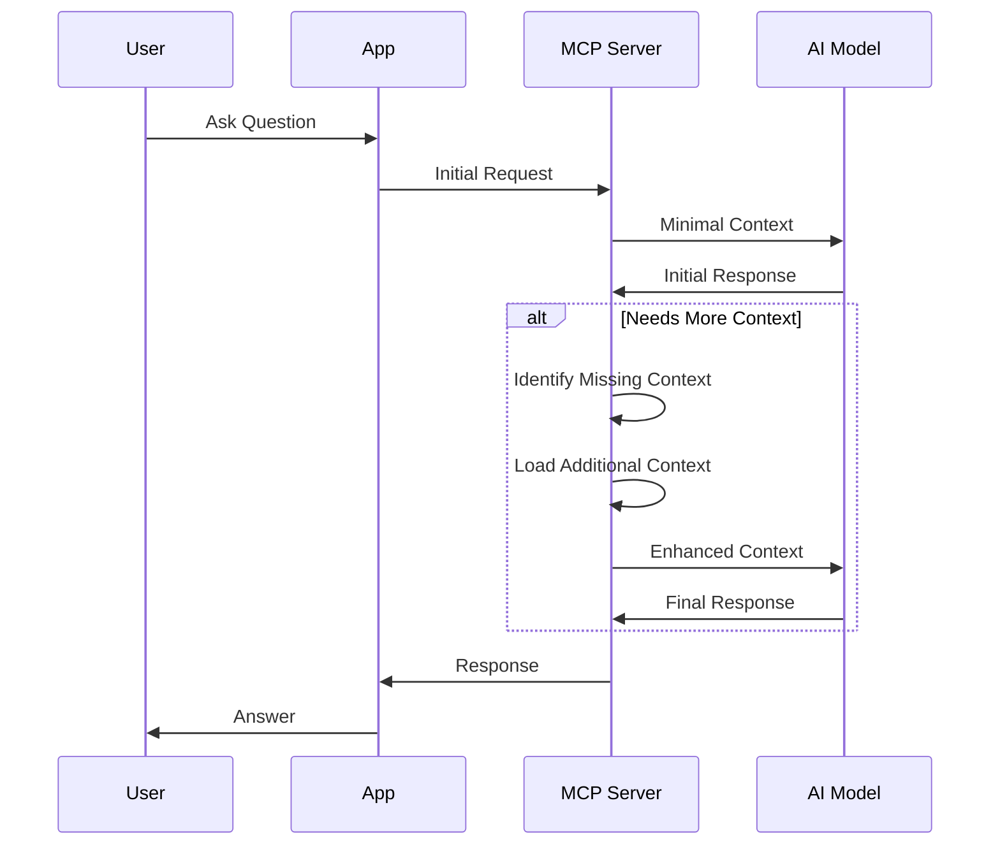
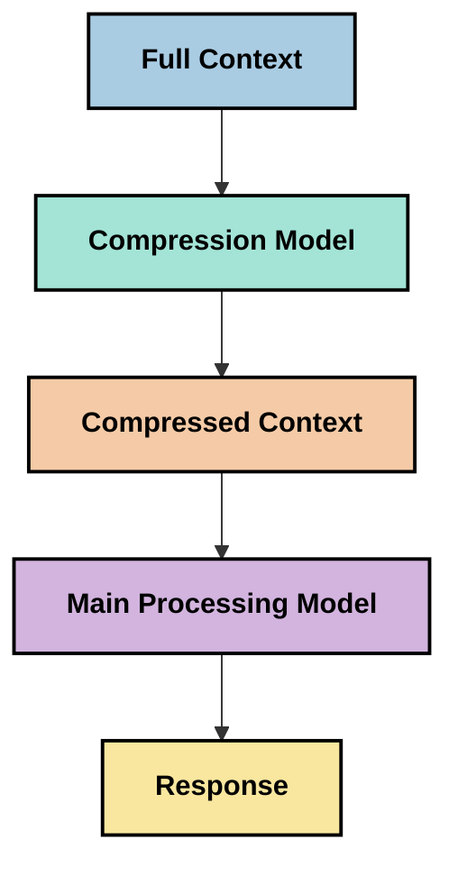
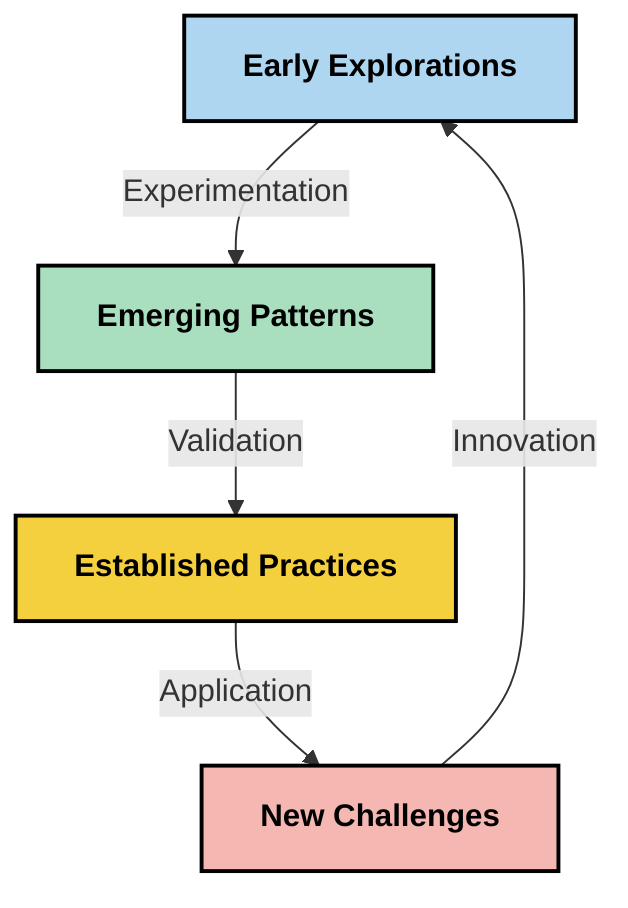

<!--
CO_OP_TRANSLATOR_METADATA:
{
  "original_hash": "fd169ca3071b81b5ee282e194bc823df",
  "translation_date": "2025-09-15T19:36:28+00:00",
  "source_file": "05-AdvancedTopics/mcp-contextengineering/README.md",
  "language_code": "fr"
}
-->
# Ingénierie du contexte : un concept émergent dans l'écosystème MCP

## Aperçu

L'ingénierie du contexte est un concept émergent dans le domaine de l'IA qui explore la manière dont l'information est structurée, transmise et maintenue au cours des interactions entre les clients et les services d'IA. À mesure que l'écosystème du protocole de contexte de modèle (MCP) évolue, comprendre comment gérer efficacement le contexte devient de plus en plus crucial. Ce module introduit le concept d'ingénierie du contexte et examine ses applications potentielles dans les implémentations MCP.

## Objectifs d'apprentissage

À la fin de ce module, vous serez capable de :

- Comprendre le concept émergent d'ingénierie du contexte et son rôle potentiel dans les applications MCP
- Identifier les principaux défis de la gestion du contexte que la conception du protocole MCP cherche à résoudre
- Explorer des techniques pour améliorer les performances des modèles grâce à une meilleure gestion du contexte
- Considérer des approches pour mesurer et évaluer l'efficacité du contexte
- Appliquer ces concepts émergents pour améliorer les expériences d'IA via le cadre MCP

## Introduction à l'ingénierie du contexte

L'ingénierie du contexte est un concept émergent axé sur la conception et la gestion délibérées du flux d'informations entre les utilisateurs, les applications et les modèles d'IA. Contrairement à des domaines établis comme l'ingénierie des prompts, l'ingénierie du contexte est encore en cours de définition par les praticiens qui cherchent à résoudre les défis uniques liés à la fourniture d'informations pertinentes aux modèles d'IA au bon moment.

À mesure que les grands modèles de langage (LLMs) ont évolué, l'importance du contexte est devenue de plus en plus évidente. La qualité, la pertinence et la structure du contexte fourni influencent directement les résultats des modèles. L'ingénierie du contexte explore cette relation et cherche à développer des principes pour une gestion efficace du contexte.

> "En 2025, les modèles disponibles seront extrêmement intelligents. Mais même l'humain le plus intelligent ne pourra pas faire son travail efficacement sans le contexte de ce qu'on lui demande... 'L'ingénierie du contexte' est le niveau suivant de l'ingénierie des prompts. Il s'agit de le faire automatiquement dans un système dynamique." — Walden Yan, Cognition AI

L'ingénierie du contexte peut inclure :

1. **Sélection du contexte** : Déterminer quelles informations sont pertinentes pour une tâche donnée
2. **Structuration du contexte** : Organiser les informations pour maximiser la compréhension du modèle
3. **Transmission du contexte** : Optimiser la manière et le moment où les informations sont envoyées aux modèles
4. **Maintien du contexte** : Gérer l'état et l'évolution du contexte au fil du temps
5. **Évaluation du contexte** : Mesurer et améliorer l'efficacité du contexte

Ces domaines d'intérêt sont particulièrement pertinents pour l'écosystème MCP, qui fournit une méthode standardisée permettant aux applications de transmettre un contexte aux LLMs.

## La perspective du parcours du contexte

Une façon de visualiser l'ingénierie du contexte est de suivre le parcours que l'information emprunte à travers un système MCP :



### Étapes clés du parcours du contexte :

1. **Entrée utilisateur** : Informations brutes provenant de l'utilisateur (texte, images, documents)
2. **Assemblage du contexte** : Combinaison des entrées utilisateur avec le contexte système, l'historique de la conversation et d'autres informations récupérées
3. **Traitement par le modèle** : Le modèle d'IA traite le contexte assemblé
4. **Génération de réponse** : Le modèle produit des résultats basés sur le contexte fourni
5. **Gestion de l'état** : Le système met à jour son état interne en fonction de l'interaction

Cette perspective met en lumière la nature dynamique du contexte dans les systèmes d'IA et soulève des questions importantes sur la meilleure manière de gérer l'information à chaque étape.

## Principes émergents de l'ingénierie du contexte

À mesure que le domaine de l'ingénierie du contexte prend forme, certains principes préliminaires commencent à émerger parmi les praticiens. Ces principes peuvent aider à orienter les choix d'implémentation MCP :

### Principe 1 : Partager le contexte complètement

Le contexte doit être partagé complètement entre tous les composants d'un système plutôt que fragmenté entre plusieurs agents ou processus. Lorsque le contexte est distribué, les décisions prises dans une partie du système peuvent entrer en conflit avec celles prises ailleurs.



Dans les applications MCP, cela suggère de concevoir des systèmes où le contexte circule de manière fluide dans tout le pipeline plutôt que d'être compartimenté.

### Principe 2 : Reconnaître que les actions impliquent des décisions implicites

Chaque action qu'un modèle entreprend incarne des décisions implicites sur la manière d'interpréter le contexte. Lorsque plusieurs composants agissent sur des contextes différents, ces décisions implicites peuvent entrer en conflit, entraînant des résultats incohérents.

Ce principe a des implications importantes pour les applications MCP :
- Préférer un traitement linéaire des tâches complexes plutôt qu'une exécution parallèle avec un contexte fragmenté
- S'assurer que tous les points de décision ont accès aux mêmes informations contextuelles
- Concevoir des systèmes où les étapes ultérieures peuvent voir le contexte complet des décisions précédentes

### Principe 3 : Équilibrer la profondeur du contexte avec les limitations des fenêtres

À mesure que les conversations et les processus s'allongent, les fenêtres de contexte finissent par déborder. L'ingénierie du contexte explore des approches pour gérer cette tension entre un contexte complet et des limitations techniques.

Approches potentielles explorées :
- Compression du contexte qui conserve les informations essentielles tout en réduisant l'utilisation des tokens
- Chargement progressif du contexte en fonction de sa pertinence pour les besoins actuels
- Résumé des interactions précédentes tout en préservant les décisions et faits clés

## Défis du contexte et conception du protocole MCP

Le protocole de contexte de modèle (MCP) a été conçu en tenant compte des défis uniques de la gestion du contexte. Comprendre ces défis aide à expliquer les aspects clés de la conception du protocole MCP :

### Défi 1 : Limitations des fenêtres de contexte
La plupart des modèles d'IA ont des tailles de fenêtres de contexte fixes, limitant la quantité d'informations qu'ils peuvent traiter à la fois.

**Réponse de la conception MCP :** 
- Le protocole prend en charge un contexte structuré basé sur des ressources qui peut être référencé efficacement
- Les ressources peuvent être paginées et chargées progressivement

### Défi 2 : Détermination de la pertinence
Déterminer quelles informations sont les plus pertinentes à inclure dans le contexte est difficile.

**Réponse de la conception MCP :**
- Des outils flexibles permettent la récupération dynamique d'informations en fonction des besoins
- Des prompts structurés permettent une organisation cohérente du contexte

### Défi 3 : Persistance du contexte
Gérer l'état à travers les interactions nécessite un suivi minutieux du contexte.

**Réponse de la conception MCP :**
- Gestion de session standardisée
- Modèles d'interaction clairement définis pour l'évolution du contexte

### Défi 4 : Contexte multimodal
Différents types de données (texte, images, données structurées) nécessitent un traitement différent.

**Réponse de la conception MCP :**
- La conception du protocole prend en charge divers types de contenu
- Représentation standardisée des informations multimodales

### Défi 5 : Sécurité et confidentialité
Le contexte contient souvent des informations sensibles qui doivent être protégées.

**Réponse de la conception MCP :**
- Limites claires entre les responsabilités du client et du serveur
- Options de traitement local pour minimiser l'exposition des données

Comprendre ces défis et la manière dont MCP les aborde fournit une base pour explorer des techniques d'ingénierie du contexte plus avancées.

## Approches émergentes de l'ingénierie du contexte

À mesure que le domaine de l'ingénierie du contexte se développe, plusieurs approches prometteuses émergent. Elles représentent une réflexion actuelle plutôt que des pratiques établies et évolueront probablement à mesure que nous acquérons plus d'expérience avec les implémentations MCP.

### 1. Traitement linéaire à thread unique

Contrairement aux architectures multi-agents qui distribuent le contexte, certains praticiens constatent que le traitement linéaire à thread unique produit des résultats plus cohérents. Cela s'aligne avec le principe de maintien d'un contexte unifié.



Bien que cette approche puisse sembler moins efficace que le traitement parallèle, elle produit souvent des résultats plus cohérents et fiables car chaque étape s'appuie sur une compréhension complète des décisions précédentes.

### 2. Fragmentation et priorisation du contexte

Diviser les grands contextes en morceaux gérables et prioriser ce qui est le plus important.

```python
# Conceptual Example: Context Chunking and Prioritization
def process_with_chunked_context(documents, query):
    # 1. Break documents into smaller chunks
    chunks = chunk_documents(documents)
    
    # 2. Calculate relevance scores for each chunk
    scored_chunks = [(chunk, calculate_relevance(chunk, query)) for chunk in chunks]
    
    # 3. Sort chunks by relevance score
    sorted_chunks = sorted(scored_chunks, key=lambda x: x[1], reverse=True)
    
    # 4. Use the most relevant chunks as context
    context = create_context_from_chunks([chunk for chunk, score in sorted_chunks[:5]])
    
    # 5. Process with the prioritized context
    return generate_response(context, query)
```

Le concept ci-dessus illustre comment nous pourrions diviser de grands documents en morceaux gérables et sélectionner uniquement les parties les plus pertinentes pour le contexte. Cette approche peut aider à travailler dans les limites des fenêtres de contexte tout en exploitant de vastes bases de connaissances.

### 3. Chargement progressif du contexte

Charger le contexte progressivement selon les besoins plutôt que tout à la fois.



Le chargement progressif du contexte commence avec un contexte minimal et s'étend uniquement lorsque nécessaire. Cela peut réduire considérablement l'utilisation des tokens pour des requêtes simples tout en maintenant la capacité de gérer des questions complexes.

### 4. Compression et résumé du contexte

Réduire la taille du contexte tout en préservant les informations essentielles.



La compression du contexte se concentre sur :
- Éliminer les informations redondantes
- Résumer les contenus longs
- Extraire les faits et détails clés
- Préserver les éléments critiques du contexte
- Optimiser l'efficacité des tokens

Cette approche peut être particulièrement précieuse pour maintenir des conversations longues dans les fenêtres de contexte ou pour traiter efficacement de grands documents. Certains praticiens utilisent des modèles spécialisés spécifiquement pour la compression et le résumé du contexte de l'historique des conversations.

## Considérations exploratoires en ingénierie du contexte

En explorant le domaine émergent de l'ingénierie du contexte, plusieurs considérations méritent d'être prises en compte lors du travail avec les implémentations MCP. Ce ne sont pas des pratiques prescriptives, mais plutôt des domaines d'exploration qui peuvent apporter des améliorations à votre cas d'utilisation spécifique.

### Considérez vos objectifs de contexte

Avant de mettre en œuvre des solutions complexes de gestion du contexte, articulez clairement ce que vous essayez d'accomplir :
- Quelles informations spécifiques le modèle doit-il avoir pour réussir ?
- Quelles informations sont essentielles par rapport à celles qui sont complémentaires ?
- Quelles sont vos contraintes de performance (latence, limites de tokens, coûts) ?

### Explorez des approches de contexte en couches

Certains praticiens trouvent du succès avec un contexte organisé en couches conceptuelles :
- **Couche centrale** : Informations essentielles dont le modèle a toujours besoin
- **Couche situationnelle** : Contexte spécifique à l'interaction actuelle
- **Couche de soutien** : Informations supplémentaires qui peuvent être utiles
- **Couche de secours** : Informations accessibles uniquement en cas de besoin

### Enquêtez sur les stratégies de récupération

L'efficacité de votre contexte dépend souvent de la manière dont vous récupérez les informations :
- Recherche sémantique et embeddings pour trouver des informations conceptuellement pertinentes
- Recherche par mots-clés pour des détails factuels spécifiques
- Approches hybrides combinant plusieurs méthodes de récupération
- Filtrage par métadonnées pour réduire la portée en fonction des catégories, dates ou sources

### Expérimentez avec la cohérence du contexte

La structure et le flux de votre contexte peuvent affecter la compréhension du modèle :
- Regrouper les informations connexes
- Utiliser un formatage et une organisation cohérents
- Maintenir un ordre logique ou chronologique lorsque cela est approprié
- Éviter les informations contradictoires

### Pesez les compromis des architectures multi-agents

Bien que les architectures multi-agents soient populaires dans de nombreux cadres d'IA, elles présentent des défis importants pour la gestion du contexte :
- La fragmentation du contexte peut entraîner des décisions incohérentes entre les agents
- Le traitement parallèle peut introduire des conflits difficiles à résoudre
- La surcharge de communication entre les agents peut compenser les gains de performance
- Une gestion complexe de l'état est nécessaire pour maintenir la cohérence

Dans de nombreux cas, une approche à agent unique avec une gestion complète du contexte peut produire des résultats plus fiables que plusieurs agents spécialisés avec un contexte fragmenté.

### Développez des méthodes d'évaluation

Pour améliorer l'ingénierie du contexte au fil du temps, réfléchissez à la manière dont vous mesurerez le succès :
- Tests A/B de différentes structures de contexte
- Surveillance de l'utilisation des tokens et des temps de réponse
- Suivi de la satisfaction des utilisateurs et des taux d'achèvement des tâches
- Analyse des raisons pour lesquelles les stratégies de contexte échouent

Ces considérations représentent des domaines actifs d'exploration dans l'espace de l'ingénierie du contexte. À mesure que le domaine mûrit, des modèles et pratiques plus définitifs émergeront probablement.

## Mesurer l'efficacité du contexte : un cadre en évolution

À mesure que l'ingénierie du contexte émerge en tant que concept, les praticiens commencent à explorer comment nous pourrions mesurer son efficacité. Aucun cadre établi n'existe encore, mais divers indicateurs sont envisagés pour guider les travaux futurs.

### Dimensions potentielles de mesure

#### 1. Considérations sur l'efficacité des entrées

- **Ratio contexte-réponse** : Quelle quantité de contexte est nécessaire par rapport à la taille de la réponse ?
- **Utilisation des tokens** : Quel pourcentage des tokens de contexte fournis influence la réponse ?
- **Réduction du contexte** : Dans quelle mesure pouvons-nous compresser les informations brutes ?

#### 2. Considérations sur les performances

- **Impact sur la latence** : Comment la gestion du contexte affecte-t-elle le temps de réponse ?
- **Économie de tokens** : Optimisons-nous efficacement l'utilisation des tokens ?
- **Précision de récupération** : Quelle est la pertinence des informations récupérées ?
- **Utilisation des ressources** : Quelles ressources informatiques sont nécessaires ?

#### 3. Considérations sur la qualité

- **Pertinence de la réponse** : Dans quelle mesure la réponse répond-elle à la requête ?
- **Exactitude factuelle** : La gestion du contexte améliore-t-elle la précision factuelle ?
- **Cohérence** : Les réponses sont-elles cohérentes pour des requêtes similaires ?
- **Taux d'hallucination** : Un meilleur contexte réduit-il les hallucinations du modèle ?

#### 4. Considérations sur l'expérience utilisateur

- **Taux de suivi** : À quelle fréquence les utilisateurs demandent-ils des clarifications ?
- **Achèvement des tâches** : Les utilisateurs atteignent-ils leurs objectifs avec succès ?
- **Indicateurs de satisfaction** : Comment les utilisateurs évaluent-ils leur expérience ?

### Approches exploratoires de mesure

Lors de l'expérimentation avec l'ingénierie du contexte dans les implémentations MCP, envisagez ces approches exploratoires :

1. **Comparaisons de base** : Établissez une base avec des approches simples de contexte avant de tester des méthodes plus sophistiquées

2. **Changements progressifs** : Modifiez un aspect de la gestion du contexte à la fois pour isoler ses effets

3. **Évaluation centrée sur l'utilisateur** : Combinez des métriques quantitatives avec des retours qualitatifs des utilisateurs

4. **Analyse des échecs** : Examinez les cas où les stratégies de contexte échouent pour comprendre les améliorations potentielles

5. **Évaluation multidimensionnelle** : Considérez les compromis entre efficacité, qualité et expérience utilisateur

Cette approche expérimentale et multifacette de la mesure s'aligne avec la nature émergente de l'ingénierie du contexte.

## Réflexions finales

L'ingénierie du contexte est un domaine émergent d'exploration qui pourrait s'avérer central pour les applications MCP efficaces. En réfléchissant soigneusement à la manière dont l'information circule dans votre système, vous pouvez potentiellement créer des expériences d'IA plus efficaces, précises et précieuses pour les utilisateurs.

Les techniques et approches décrites dans ce module représentent une réflexion préliminaire dans cet espace, et non des pratiques établies. L'ingénierie du contexte pourrait évoluer vers une discipline plus définie à mesure que les capacités de l'IA progressent et que notre compréhension s'approfondit. Pour l'instant, l'expérimentation combinée à une mesure attentive semble être l'approche la plus productive.

## Directions futures potentielles

Le domaine de l'ingénierie du contexte en est encore à ses débuts, mais plusieurs directions prometteuses émergent :

- Les principes d'ingénierie du contexte pourraient avoir un impact significatif sur les performances des modèles, l'efficacité, l'expérience utilisateur et la fiabilité
- Les approches à thread unique avec une gestion complète du contexte pourraient surpasser les architectures multi-agents pour de nombreux cas d'utilisation
- Les modèles spécialisés de compression du contexte pourraient devenir des composants standard dans les pipelines d'IA
- La tension entre la complétude du contexte et les limitations des tokens pourrait stimuler l'innovation dans la gestion du contexte
- À mesure que les modèles deviennent plus capables de communiquer efficacement de manière humaine, une véritable collaboration multi-agents pourrait devenir viable
- Les implémentations MCP pourraient évoluer pour standardiser les modèles de gestion du contexte qui émergent des expérimentations actuelles



## Ressources

### Ressources officielles MCP
- [Site Web du protocole Model Context](https://modelcontextprotocol.io/)
- [Spécification du protocole Model Context](https://github.com/modelcontextprotocol/modelcontextprotocol)
- [Documentation MCP](https://modelcontextprotocol.io/docs)
- [SDK MCP C#](https://github.com/modelcontextprotocol/csharp-sdk)
- [SDK MCP Python](https://github.com/modelcontextprotocol/python-sdk)
- [SDK MCP TypeScript](https://github.com/modelcontextprotocol/typescript-sdk)
- [Inspecteur MCP](https://github.com/modelcontextprotocol/inspector) - Outil de test visuel pour les serveurs MCP

### Articles sur l'ingénierie du contexte
- [Ne construisez pas de multi-agents : principes de l'ingénierie du contexte](https://cognition.ai/blog/dont-build-multi-agents) - Les réflexions de Walden Yan sur les principes de l'ingénierie du contexte
- [Guide pratique pour construire des agents](https://cdn.openai.com/business-guides-and-resources/a-practical-guide-to-building-agents.pdf) - Guide d'OpenAI sur la conception efficace d'agents
- [Construire des agents efficaces](https://www.anthropic.com/engineering/building-effective-agents) - Approche d'Anthropic pour le développement d'agents

### Recherche associée
- [Augmentation dynamique de la récupération pour les grands modèles de langage](https://arxiv.org/abs/2310.01487) - Recherche sur les approches de récupération dynamique
- [Perdus au milieu : comment les modèles de langage utilisent de longs contextes](https://arxiv.org/abs/2307.03172) - Recherche importante sur les schémas de traitement du contexte
- [Génération d'images hiérarchiques conditionnées par du texte avec des latents CLIP](https://arxiv.org/abs/2204.06125) - Article sur DALL-E 2 avec des perspectives sur la structuration du contexte
- [Explorer le rôle du contexte dans les architectures des grands modèles de langage](https://aclanthology.org/2023.findings-emnlp.124/) - Recherche récente sur la gestion du contexte
- [Collaboration multi-agents : un état des lieux](https://arxiv.org/abs/2304.03442) - Recherche sur les systèmes multi-agents et leurs défis

### Ressources supplémentaires
- [Techniques d'optimisation de la fenêtre de contexte](https://learn.microsoft.com/en-us/azure/ai-services/openai/concepts/context-window)
- [Techniques avancées de RAG](https://www.microsoft.com/en-us/research/blog/retrieval-augmented-generation-rag-and-frontier-models/)
- [Documentation Semantic Kernel](https://github.com/microsoft/semantic-kernel)
- [Kit d'outils IA pour la gestion du contexte](https://github.com/microsoft/aitoolkit)

## Et après 

- [5.15 MCP Transport personnalisé](../mcp-transport/README.md)

---

**Avertissement** :  
Ce document a été traduit à l'aide du service de traduction automatique [Co-op Translator](https://github.com/Azure/co-op-translator). Bien que nous nous efforcions d'assurer l'exactitude, veuillez noter que les traductions automatisées peuvent contenir des erreurs ou des inexactitudes. Le document original dans sa langue d'origine doit être considéré comme la source faisant autorité. Pour des informations critiques, il est recommandé de recourir à une traduction professionnelle réalisée par un humain. Nous déclinons toute responsabilité en cas de malentendus ou d'interprétations erronées résultant de l'utilisation de cette traduction.