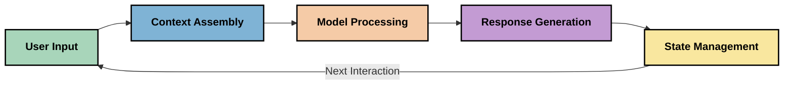
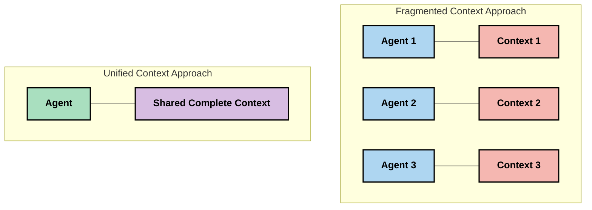
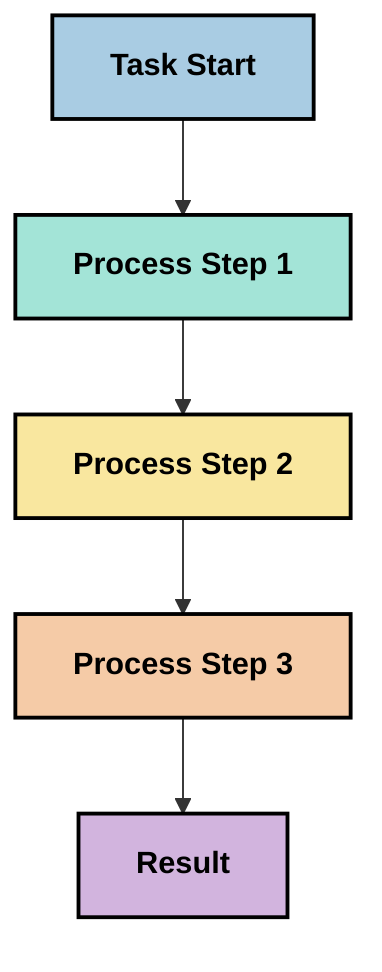
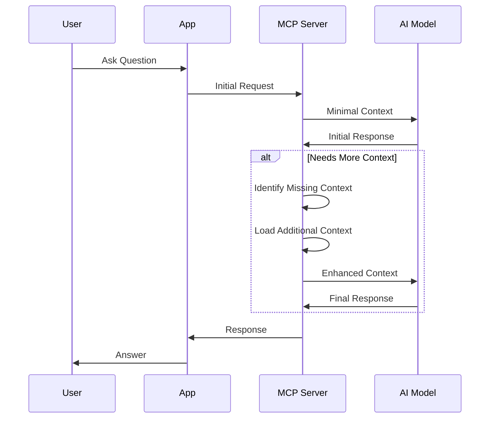
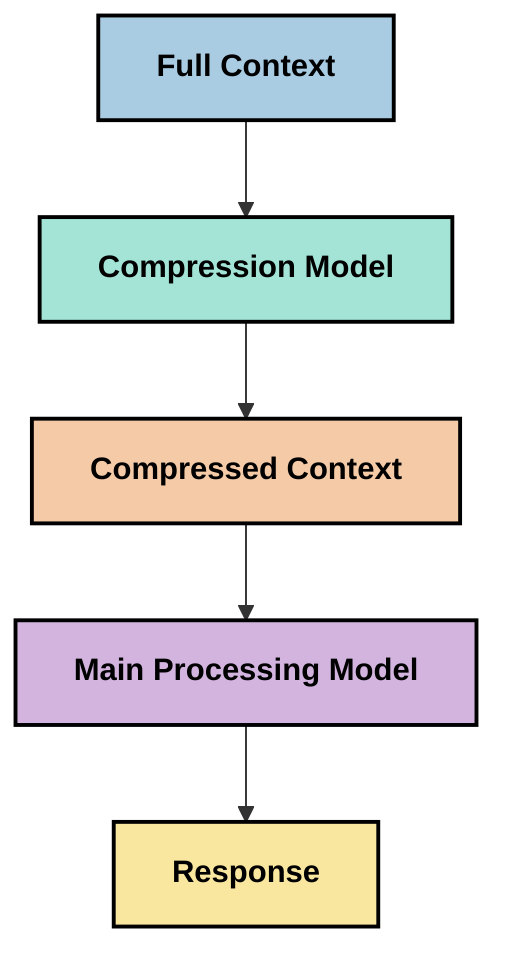
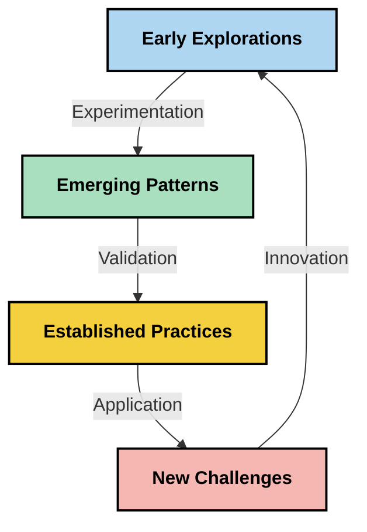

<!--
CO_OP_TRANSLATOR_METADATA:
{
  "original_hash": "5762e8e74dd99d8b7dbb31e69a82561e",
  "translation_date": "2025-07-16T22:57:26+00:00",
  "source_file": "05-AdvancedTopics/mcp-contextengineering/README.md",
  "language_code": "fr"
}
-->
# Ingénierie du Contexte : Un Concept Émergent dans l’Écosystème MCP

## Vue d’ensemble

L’ingénierie du contexte est un concept émergent dans le domaine de l’IA qui étudie la manière dont l’information est structurée, transmise et maintenue tout au long des interactions entre les clients et les services d’IA. À mesure que l’écosystème du Model Context Protocol (MCP) évolue, comprendre comment gérer efficacement le contexte devient de plus en plus crucial. Ce module présente le concept d’ingénierie du contexte et explore ses applications potentielles dans les implémentations MCP.

## Objectifs d’apprentissage

À la fin de ce module, vous serez capable de :

- Comprendre le concept émergent d’ingénierie du contexte et son rôle potentiel dans les applications MCP
- Identifier les principaux défis de la gestion du contexte auxquels la conception du protocole MCP répond
- Explorer des techniques pour améliorer les performances des modèles grâce à une meilleure gestion du contexte
- Envisager des approches pour mesurer et évaluer l’efficacité du contexte
- Appliquer ces concepts émergents pour améliorer les expériences IA via le cadre MCP

## Introduction à l’Ingénierie du Contexte

L’ingénierie du contexte est un concept émergent qui se concentre sur la conception délibérée et la gestion du flux d’information entre les utilisateurs, les applications et les modèles d’IA. Contrairement à des domaines établis comme l’ingénierie des prompts, l’ingénierie du contexte est encore en cours de définition par les praticiens qui cherchent à résoudre les défis uniques liés à la fourniture aux modèles d’IA des bonnes informations au bon moment.

Avec l’évolution des grands modèles de langage (LLM), l’importance du contexte est devenue de plus en plus évidente. La qualité, la pertinence et la structure du contexte fourni influencent directement les résultats du modèle. L’ingénierie du contexte étudie cette relation et cherche à développer des principes pour une gestion efficace du contexte.

> « En 2025, les modèles sont extrêmement intelligents. Mais même l’humain le plus brillant ne pourra pas faire son travail efficacement sans le contexte de ce qu’on lui demande... L’‘ingénierie du contexte’ est le niveau supérieur de l’ingénierie des prompts. Il s’agit de faire cela automatiquement dans un système dynamique. » — Walden Yan, Cognition AI

L’ingénierie du contexte peut inclure :

1. **Sélection du Contexte** : Déterminer quelles informations sont pertinentes pour une tâche donnée  
2. **Structuration du Contexte** : Organiser l’information pour maximiser la compréhension du modèle  
3. **Transmission du Contexte** : Optimiser la manière et le moment où l’information est envoyée aux modèles  
4. **Maintien du Contexte** : Gérer l’état et l’évolution du contexte au fil du temps  
5. **Évaluation du Contexte** : Mesurer et améliorer l’efficacité du contexte

Ces domaines sont particulièrement pertinents pour l’écosystème MCP, qui offre une méthode standardisée pour que les applications fournissent du contexte aux LLM.

## La Perspective du Parcours du Contexte

Une façon de visualiser l’ingénierie du contexte est de suivre le parcours de l’information à travers un système MCP :



### Étapes Clés du Parcours du Contexte :

1. **Entrée Utilisateur** : Informations brutes provenant de l’utilisateur (texte, images, documents)  
2. **Assemblage du Contexte** : Combinaison de l’entrée utilisateur avec le contexte système, l’historique de la conversation et d’autres informations récupérées  
3. **Traitement par le Modèle** : Le modèle d’IA traite le contexte assemblé  
4. **Génération de la Réponse** : Le modèle produit des résultats basés sur le contexte fourni  
5. **Gestion de l’État** : Le système met à jour son état interne en fonction de l’interaction

Cette perspective met en lumière la nature dynamique du contexte dans les systèmes d’IA et soulève des questions importantes sur la meilleure façon de gérer l’information à chaque étape.

## Principes Émergents en Ingénierie du Contexte

À mesure que le domaine de l’ingénierie du contexte se structure, certains principes initiaux commencent à émerger chez les praticiens. Ces principes peuvent guider les choix d’implémentation MCP :

### Principe 1 : Partager le Contexte Complètement

Le contexte doit être partagé intégralement entre tous les composants d’un système plutôt que fragmenté entre plusieurs agents ou processus. Lorsque le contexte est distribué, les décisions prises dans une partie du système peuvent entrer en conflit avec celles prises ailleurs.



Dans les applications MCP, cela suggère de concevoir des systèmes où le contexte circule de manière fluide à travers toute la chaîne plutôt que d’être compartimenté.

### Principe 2 : Reconnaître que les Actions Impliquent des Décisions Implicites

Chaque action prise par un modèle incarne des décisions implicites sur la manière d’interpréter le contexte. Lorsque plusieurs composants agissent sur des contextes différents, ces décisions implicites peuvent entrer en conflit, entraînant des résultats incohérents.

Ce principe a des implications importantes pour les applications MCP :  
- Privilégier un traitement linéaire des tâches complexes plutôt qu’une exécution parallèle avec un contexte fragmenté  
- S’assurer que tous les points de décision ont accès à la même information contextuelle  
- Concevoir des systèmes où les étapes ultérieures peuvent voir le contexte complet des décisions antérieures

### Principe 3 : Trouver l’Équilibre entre la Profondeur du Contexte et les Limitations de la Fenêtre

À mesure que les conversations et les processus s’allongent, les fenêtres de contexte finissent par déborder. L’ingénierie du contexte explore des approches pour gérer cette tension entre un contexte complet et les contraintes techniques.

Parmi les approches explorées :  
- Compression du contexte qui conserve l’essentiel tout en réduisant l’usage des tokens  
- Chargement progressif du contexte selon la pertinence pour les besoins actuels  
- Résumé des interactions précédentes tout en préservant les décisions et faits clés

## Défis du Contexte et Conception du Protocole MCP

Le Model Context Protocol (MCP) a été conçu en tenant compte des défis uniques de la gestion du contexte. Comprendre ces défis aide à expliquer certains aspects clés de la conception du protocole MCP :

### Défi 1 : Limitations de la Fenêtre de Contexte  
La plupart des modèles IA ont une taille de fenêtre de contexte fixe, limitant la quantité d’information qu’ils peuvent traiter simultanément.

**Réponse de la Conception MCP :**  
- Le protocole supporte un contexte structuré basé sur des ressources pouvant être référencées efficacement  
- Les ressources peuvent être paginées et chargées progressivement

### Défi 2 : Détermination de la Pertinence  
Il est difficile de déterminer quelles informations sont les plus pertinentes à inclure dans le contexte.

**Réponse de la Conception MCP :**  
- Des outils flexibles permettent la récupération dynamique d’informations selon les besoins  
- Des prompts structurés assurent une organisation cohérente du contexte

### Défi 3 : Persistance du Contexte  
Gérer l’état à travers les interactions nécessite un suivi rigoureux du contexte.

**Réponse de la Conception MCP :**  
- Gestion standardisée des sessions  
- Modèles d’interaction clairement définis pour l’évolution du contexte

### Défi 4 : Contexte Multi-Modal  
Différents types de données (texte, images, données structurées) nécessitent des traitements spécifiques.

**Réponse de la Conception MCP :**  
- Le protocole prend en charge divers types de contenu  
- Représentation standardisée des informations multi-modales

### Défi 5 : Sécurité et Confidentialité  
Le contexte contient souvent des informations sensibles qui doivent être protégées.

**Réponse de la Conception MCP :**  
- Délimitations claires entre les responsabilités client et serveur  
- Options de traitement local pour minimiser l’exposition des données

Comprendre ces défis et la manière dont MCP y répond fournit une base pour explorer des techniques plus avancées d’ingénierie du contexte.

## Approches Émergentes en Ingénierie du Contexte

À mesure que le domaine se développe, plusieurs approches prometteuses apparaissent. Elles reflètent la pensée actuelle plutôt que des pratiques établies, et évolueront probablement avec l’expérience acquise dans les implémentations MCP.

### 1. Traitement Linéaire Monothread

Contrairement aux architectures multi-agents qui distribuent le contexte, certains praticiens constatent que le traitement linéaire monothread produit des résultats plus cohérents. Cela correspond au principe de maintien d’un contexte unifié.



Bien que cette approche puisse sembler moins efficace que le traitement parallèle, elle produit souvent des résultats plus cohérents et fiables car chaque étape s’appuie sur une compréhension complète des décisions précédentes.

### 2. Découpage et Priorisation du Contexte

Diviser de grands contextes en morceaux gérables et prioriser ce qui est le plus important.

```python
# Conceptual Example: Context Chunking and Prioritization
def process_with_chunked_context(documents, query):
    # 1. Break documents into smaller chunks
    chunks = chunk_documents(documents)
    
    # 2. Calculate relevance scores for each chunk
    scored_chunks = [(chunk, calculate_relevance(chunk, query)) for chunk in chunks]
    
    # 3. Sort chunks by relevance score
    sorted_chunks = sorted(scored_chunks, key=lambda x: x[1], reverse=True)
    
    # 4. Use the most relevant chunks as context
    context = create_context_from_chunks([chunk for chunk, score in sorted_chunks[:5]])
    
    # 5. Process with the prioritized context
    return generate_response(context, query)
```

Le concept ci-dessus illustre comment on peut découper de longs documents en parties gérables et ne sélectionner que les éléments les plus pertinents pour le contexte. Cette approche aide à travailler dans les limites des fenêtres de contexte tout en exploitant de grandes bases de connaissances.

### 3. Chargement Progressif du Contexte

Charger le contexte progressivement selon les besoins plutôt que tout d’un coup.



Le chargement progressif commence avec un contexte minimal et s’étend uniquement lorsque nécessaire. Cela peut réduire significativement l’usage des tokens pour des requêtes simples tout en conservant la capacité de gérer des questions complexes.

### 4. Compression et Résumé du Contexte

Réduire la taille du contexte tout en préservant l’essentiel.



La compression du contexte se concentre sur :  
- La suppression des informations redondantes  
- Le résumé des contenus longs  
- L’extraction des faits et détails clés  
- La préservation des éléments critiques du contexte  
- L’optimisation de l’utilisation des tokens

Cette approche est particulièrement utile pour maintenir de longues conversations dans les fenêtres de contexte ou pour traiter efficacement de gros documents. Certains praticiens utilisent des modèles spécialisés dédiés à la compression et au résumé de l’historique des conversations.

## Considérations Exploratoires en Ingénierie du Contexte

En explorant ce domaine émergent, plusieurs points méritent d’être gardés à l’esprit lors du travail avec des implémentations MCP. Il ne s’agit pas de meilleures pratiques prescrites, mais de pistes d’exploration susceptibles d’améliorer votre cas d’usage.

### Définissez Vos Objectifs de Contexte

Avant de mettre en place des solutions complexes de gestion du contexte, clarifiez ce que vous souhaitez atteindre :  
- Quelles informations spécifiques le modèle doit-il avoir pour réussir ?  
- Quelles informations sont essentielles versus complémentaires ?  
- Quelles sont vos contraintes de performance (latence, limites de tokens, coûts) ?

### Explorez des Approches en Couches

Certains praticiens réussissent en organisant le contexte en couches conceptuelles :  
- **Couche Centrale** : Informations essentielles toujours nécessaires au modèle  
- **Couche Situationnelle** : Contexte spécifique à l’interaction en cours  
- **Couche de Soutien** : Informations supplémentaires potentiellement utiles  
- **Couche de Repli** : Informations accessibles uniquement en cas de besoin

### Étudiez les Stratégies de Récupération

L’efficacité du contexte dépend souvent de la manière dont vous récupérez l’information :  
- Recherche sémantique et embeddings pour trouver des informations conceptuellement pertinentes  
- Recherche par mots-clés pour des détails factuels spécifiques  
- Approches hybrides combinant plusieurs méthodes de récupération  
- Filtrage par métadonnées pour restreindre la portée selon catégories, dates ou sources

### Expérimentez la Cohérence du Contexte

La structure et le flux du contexte peuvent influencer la compréhension du modèle :  
- Regrouper les informations liées  
- Utiliser un formatage et une organisation cohérents  
- Maintenir un ordre logique ou chronologique lorsque c’est pertinent  
- Éviter les informations contradictoires

### Évaluez les Compromis des Architectures Multi-Agents

Bien que les architectures multi-agents soient populaires dans de nombreux cadres IA, elles posent des défis importants pour la gestion du contexte :  
- La fragmentation du contexte peut entraîner des décisions incohérentes entre agents  
- Le traitement parallèle peut générer des conflits difficiles à résoudre  
- Le surcoût de communication entre agents peut annuler les gains de performance  
- La gestion complexe de l’état est nécessaire pour maintenir la cohérence

Dans bien des cas, une approche mono-agent avec une gestion complète du contexte peut produire des résultats plus fiables que plusieurs agents spécialisés avec un contexte fragmenté.

### Développez des Méthodes d’Évaluation

Pour améliorer l’ingénierie du contexte au fil du temps, réfléchissez à la manière dont vous mesurerez le succès :  
- Tests A/B de différentes structures de contexte  
- Suivi de l’usage des tokens et des temps de réponse  
- Mesure de la satisfaction utilisateur et des taux d’achèvement des tâches  
- Analyse des cas d’échec des stratégies de contexte

Ces considérations représentent des axes d’exploration actifs dans le domaine de l’ingénierie du contexte. À mesure que le domaine mûrit, des schémas et pratiques plus définis émergeront probablement.

## Mesurer l’Efficacité du Contexte : Un Cadre en Évolution

Avec l’émergence de l’ingénierie du contexte, les praticiens commencent à explorer comment mesurer son efficacité. Aucun cadre établi n’existe encore, mais plusieurs métriques sont envisagées pour guider les travaux futurs.

### Dimensions Potentielles de Mesure

#### 1. Considérations d’Efficacité d’Entrée

- **Ratio Contexte/Réponse** : Quelle quantité de contexte est nécessaire par rapport à la taille de la réponse ?  
- **Utilisation des Tokens** : Quel pourcentage des tokens de contexte fournis influence réellement la réponse ?  
- **Réduction du Contexte** : Quelle efficacité dans la compression de l’information brute ?

#### 2. Considérations de Performance

- **Impact sur la Latence** : Comment la gestion du contexte affecte-t-elle le temps de réponse ?  
- **Économie de Tokens** : Optimise-t-on efficacement l’usage des tokens ?  
- **Précision de la Récupération** : Quelle est la pertinence des informations récupérées ?  
- **Utilisation des Ressources** : Quelles ressources informatiques sont nécessaires ?

#### 3. Considérations de Qualité

- **Pertinence de la Réponse** : Dans quelle mesure la réponse correspond-elle à la requête ?  
- **Exactitude Factuelle** : La gestion du contexte améliore-t-elle la justesse des faits ?  
- **Cohérence** : Les réponses sont-elles cohérentes pour des requêtes similaires ?  
- **Taux d’Hallucination** : Une meilleure gestion du contexte réduit-elle les hallucinations du modèle ?

#### 4. Considérations d’Expérience Utilisateur

- **Taux de Relance** : À quelle fréquence les utilisateurs demandent-ils des clarifications ?  
- **Achèvement des Tâches** : Les utilisateurs atteignent-ils leurs objectifs ?  
- **Indicateurs de Satisfaction** : Comment les utilisateurs évaluent-ils leur expérience ?

### Approches Exploratoires de Mesure

Lors d’expérimentations en ingénierie du contexte avec MCP, considérez ces approches exploratoires :

1. **Comparaisons de Référence** : Établir une base simple avant de tester des méthodes plus sophistiquées  
2. **Modifications Progressives** : Modifier un aspect de la gestion du contexte à la fois pour isoler ses effets  
3. **Évaluation Centrée Utilisateur** : Combiner métriques quantitatives et retours qualitatifs des utilisateurs  
4. **Analyse des Échecs** : Étudier les cas où les stratégies de contexte échouent pour identifier des améliorations possibles  
5. **Évaluation Multi-Dimensionnelle** : Peser les compromis entre efficacité, qualité et expérience utilisateur

Cette approche expérimentale et multidimensionnelle correspond à la nature émergente de l’ingénierie du contexte.

## Conclusion

L’ingénierie du contexte est un domaine d’exploration émergent qui pourrait s’avérer central pour des applications MCP efficaces. En réfléchissant soigneusement au flux d’information dans votre système, vous pouvez potentiellement créer des expériences IA plus efficaces, précises et utiles pour les utilisateurs.

Les techniques et approches présentées dans ce module reflètent une réflexion initiale dans ce domaine, non des pratiques établies. L’ingénierie du contexte pourrait devenir une discipline plus définie à mesure que les capacités de l’IA évoluent et que notre compréhension s’approfondit. Pour l’instant, l’expérimentation combinée à une mesure rigoureuse semble être la voie la plus productive.

## Directions Futures Potentielles

Le domaine de l’ingénierie du contexte en est encore à ses débuts, mais plusieurs pistes prometteuses émergent :

- Les principes d’ingénierie du contexte pourraient avoir un impact significatif sur les performances, l’efficacité, l’expérience utilisateur et la fiabilité des modèles  
- Les approches monothread avec une gestion complète du contexte pourraient surpasser les architectures multi-agents pour de nombreux cas d’usage  
- Des modèles spécialisés de compression du contexte pourraient devenir des composants standards dans les pipelines IA  
- La tension entre exhaustivité du contexte et limites de tokens stimulera probablement l’innovation dans la gestion du contexte  
- À mesure que les modèles deviennent plus aptes à une communication humaine efficace, la collaboration multi-agent véritable pourrait devenir plus viable  
- Les implémentations MCP pourraient évoluer pour standardiser les schémas de gestion du contexte issus des expérimentations actuelles



## Ressources

### Ressources Officielles MCP
- [Model Context Protocol Website](https://modelcontextprotocol.io/)
- [Model Context Protocol Specification](https://github.com/modelcontextprotocol/modelcontextprotocol)
- [MCP Documentation](https://modelcontextprotocol.io/docs)
- [MCP C# SDK](https://github.com/modelcontextprotocol/csharp-sdk)
- [MCP Python SDK](https://github.com/modelcontextprotocol/python-sdk)
- [MCP TypeScript SDK](https://github.com/modelcontextprotocol/typescript-sdk)
- [MCP Inspector](https://github.com/modelcontextprotocol/inspector) - Outil de test visuel pour les serveurs MCP

### Articles sur l'ingénierie du contexte
- [Don't Build Multi-Agents: Principles of Context Engineering](https://cognition.ai/blog/dont-build-multi-agents) - Les réflexions de Walden Yan sur les principes de l'ingénierie du contexte
- [A Practical Guide to Building Agents](https://cdn.openai.com/business-guides-and-resources/a-practical-guide-to-building-agents.pdf) - Guide d'OpenAI pour concevoir des agents efficaces
- [Building Effective Agents](https://www.anthropic.com/engineering/building-effective-agents) - L'approche d'Anthropic pour le développement d'agents

### Recherches associées
- [Dynamic Retrieval Augmentation for Large Language Models](https://arxiv.org/abs/2310.01487) - Recherche sur les approches dynamiques de récupération
- [Lost in the Middle: How Language Models Use Long Contexts](https://arxiv.org/abs/2307.03172) - Recherche importante sur les modes de traitement du contexte
- [Hierarchical Text-Conditioned Image Generation with CLIP Latents](https://arxiv.org/abs/2204.06125) - Article sur DALL-E 2 avec des insights sur la structuration du contexte
- [Exploring the Role of Context in Large Language Model Architectures](https://aclanthology.org/2023.findings-emnlp.124/) - Recherche récente sur la gestion du contexte
- [Multi-Agent Collaboration: A Survey](https://arxiv.org/abs/2304.03442) - Recherche sur les systèmes multi-agents et leurs défis

### Ressources supplémentaires
- [Context Window Optimization Techniques](https://learn.microsoft.com/en-us/azure/ai-services/openai/concepts/context-window)
- [Advanced RAG Techniques](https://www.microsoft.com/en-us/research/blog/retrieval-augmented-generation-rag-and-frontier-models/)
- [Semantic Kernel Documentation](https://github.com/microsoft/semantic-kernel)
- [AI Toolkit for Context Management](https://github.com/microsoft/aitoolkit)

## Et ensuite
- [6. Community Contributions](../../06-CommunityContributions/README.md)

**Avertissement** :  
Ce document a été traduit à l’aide du service de traduction automatique [Co-op Translator](https://github.com/Azure/co-op-translator). Bien que nous nous efforcions d’assurer l’exactitude, veuillez noter que les traductions automatiques peuvent contenir des erreurs ou des inexactitudes. Le document original dans sa langue d’origine doit être considéré comme la source faisant foi. Pour les informations critiques, une traduction professionnelle réalisée par un humain est recommandée. Nous déclinons toute responsabilité en cas de malentendus ou de mauvaises interprétations résultant de l’utilisation de cette traduction.