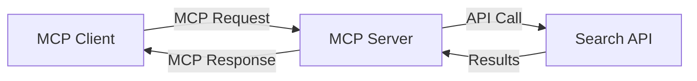
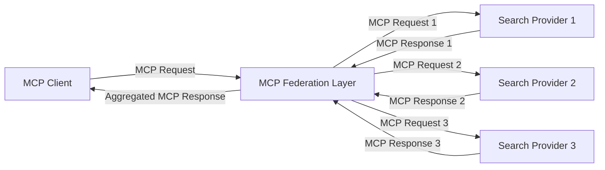
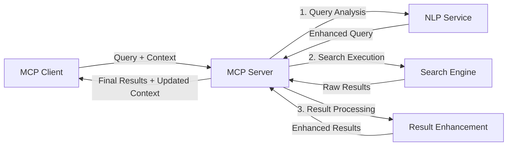

<!--
CO_OP_TRANSLATOR_METADATA:
{
  "original_hash": "333a03e51f90bdf3e6f1ba1694c73f36",
  "translation_date": "2025-07-16T21:25:55+00:00",
  "source_file": "05-AdvancedTopics/mcp-realtimesearch/README.md",
  "language_code": "fr"
}
-->
## Avertissement sur les exemples de code

> **Note importante** : Les exemples de code ci-dessous illustrent l’intégration du Model Context Protocol (MCP) avec la fonctionnalité de recherche web. Bien qu’ils suivent les modèles et structures des SDK MCP officiels, ils ont été simplifiés à des fins pédagogiques.
> 
> Ces exemples présentent :
> 
> 1. **Implémentation Python** : Une implémentation serveur FastMCP qui fournit un outil de recherche web et se connecte à une API de recherche externe. Cet exemple montre une gestion correcte du cycle de vie, du contexte et de l’implémentation des outils en suivant les modèles du [SDK MCP Python officiel](https://github.com/modelcontextprotocol/python-sdk). Le serveur utilise le transport HTTP Streamable recommandé, qui a remplacé l’ancien transport SSE pour les déploiements en production.
> 
> 2. **Implémentation JavaScript** : Une implémentation TypeScript/JavaScript utilisant le modèle FastMCP du [SDK MCP TypeScript officiel](https://github.com/modelcontextprotocol/typescript-sdk) pour créer un serveur de recherche avec des définitions d’outils appropriées et des connexions clients. Elle suit les derniers modèles recommandés pour la gestion des sessions et la préservation du contexte.
> 
> Ces exemples nécessiteraient une gestion d’erreurs supplémentaire, une authentification et un code d’intégration API spécifique pour une utilisation en production. Les points de terminaison de l’API de recherche indiqués (`https://api.search-service.example/search`) sont des espaces réservés et doivent être remplacés par de véritables points de service de recherche.
> 
> Pour des détails complets d’implémentation et les approches les plus récentes, veuillez consulter la [spécification MCP officielle](https://spec.modelcontextprotocol.io/) et la documentation des SDK.

## Concepts clés

### Le cadre du Model Context Protocol (MCP)

À sa base, le Model Context Protocol fournit un moyen standardisé pour que les modèles d’IA, applications et services échangent du contexte. Dans la recherche web en temps réel, ce cadre est essentiel pour créer des expériences de recherche cohérentes et multi-interactions. Les composants clés incluent :

1. **Architecture client-serveur** : MCP établit une séparation claire entre les clients de recherche (demandeurs) et les serveurs de recherche (fournisseurs), permettant des modèles de déploiement flexibles.

2. **Communication JSON-RPC** : Le protocole utilise JSON-RPC pour l’échange de messages, ce qui le rend compatible avec les technologies web et facile à implémenter sur différentes plateformes.

3. **Gestion du contexte** : MCP définit des méthodes structurées pour maintenir, mettre à jour et exploiter le contexte de recherche à travers plusieurs interactions.

4. **Définitions d’outils** : Les capacités de recherche sont exposées comme des outils standardisés avec des paramètres et valeurs de retour bien définis.

5. **Support du streaming** : Le protocole supporte la diffusion progressive des résultats, essentielle pour la recherche en temps réel où les résultats peuvent arriver de manière incrémentale.

### Modèles d’intégration de la recherche web

Lors de l’intégration de MCP avec la recherche web, plusieurs modèles se dégagent :

#### 1. Intégration directe avec un fournisseur de recherche

Dans ce modèle, le serveur MCP interagit directement avec une ou plusieurs API de recherche, traduisant les requêtes MCP en appels spécifiques à l’API et formatant les résultats en réponses MCP.

#### 2. Recherche fédérée avec préservation du contexte

Ce modèle distribue les requêtes de recherche à travers plusieurs fournisseurs compatibles MCP, chacun pouvant se spécialiser dans différents types de contenu ou capacités de recherche, tout en maintenant un contexte unifié.

#### 3. Chaîne de recherche enrichie par le contexte

Ici, le processus de recherche est divisé en plusieurs étapes, le contexte étant enrichi à chaque étape, ce qui aboutit à des résultats de plus en plus pertinents.

### Composants du contexte de recherche

Dans la recherche web basée sur MCP, le contexte inclut généralement :

- **Historique des requêtes** : Les requêtes précédentes dans la session
- **Préférences utilisateur** : Langue, région, paramètres de recherche sécurisée
- **Historique d’interaction** : Résultats cliqués, temps passé sur les résultats
- **Paramètres de recherche** : Filtres, ordres de tri et autres modificateurs
- **Connaissances spécifiques au domaine** : Contexte lié au sujet pertinent pour la recherche
- **Contexte temporel** : Facteurs de pertinence basés sur le temps
- **Préférences de sources** : Sources d’information fiables ou préférées

## Cas d’usage et applications

### Recherche et collecte d’informations

MCP améliore les flux de travail de recherche en :

- Préservant le contexte de recherche à travers les sessions
- Permettant des requêtes plus sophistiquées et contextuellement pertinentes
- Supportant la fédération multi-sources
- Facilitant l’extraction de connaissances à partir des résultats

### Surveillance en temps réel des actualités et tendances

La recherche alimentée par MCP offre des avantages pour la veille d’actualités :

- Découverte quasi instantanée des nouvelles émergentes
- Filtrage contextuel des informations pertinentes
- Suivi des sujets et entités à travers plusieurs sources
- Alertes personnalisées basées sur le contexte utilisateur

### Navigation et recherche augmentées par l’IA

MCP ouvre de nouvelles possibilités pour la navigation augmentée par IA :

- Suggestions de recherche contextuelles basées sur l’activité actuelle du navigateur
- Intégration fluide de la recherche web avec des assistants propulsés par LLM
- Raffinement multi-interactions de la recherche avec maintien du contexte
- Vérification des faits et validation de l’information améliorées

## Tendances et innovations futures

### Évolution du MCP dans la recherche web

À l’avenir, nous anticipons que MCP évoluera pour prendre en charge :

- **Recherche multimodale** : Intégration de la recherche textuelle, image, audio et vidéo avec contexte préservé
- **Recherche décentralisée** : Support des écosystèmes de recherche distribuée et fédérée
- **Confidentialité de la recherche** : Mécanismes de recherche respectant la vie privée et sensibles au contexte  
- **Compréhension des requêtes** : Analyse sémantique approfondie des requêtes de recherche en langage naturel

### Progrès technologiques potentiels

Technologies émergentes qui façonneront l’avenir de la recherche MCP :

1. **Architectures de recherche neuronale** : Systèmes de recherche basés sur des embeddings optimisés pour MCP  
2. **Contexte de recherche personnalisé** : Apprentissage des habitudes de recherche individuelles au fil du temps  
3. **Intégration de graphes de connaissances** : Recherche contextuelle enrichie par des graphes de connaissances spécifiques à un domaine  
4. **Contexte multimodal** : Maintien du contexte à travers différentes modalités de recherche

## Exercices pratiques

### Exercice 1 : Mise en place d’un pipeline de recherche MCP basique

Dans cet exercice, vous apprendrez à :  
- Configurer un environnement de recherche MCP basique  
- Implémenter des gestionnaires de contexte pour la recherche web  
- Tester et valider la préservation du contexte au fil des itérations de recherche

### Exercice 2 : Créer un assistant de recherche avec MCP

Créez une application complète qui :  
- Traite des questions de recherche en langage naturel  
- Effectue des recherches web sensibles au contexte  
- Synthétise les informations issues de plusieurs sources  
- Présente les résultats de recherche de manière organisée

### Exercice 3 : Implémenter une fédération de recherche multi-sources avec MCP

Exercice avancé couvrant :  
- L’envoi contextuel des requêtes vers plusieurs moteurs de recherche  
- Le classement et l’agrégation des résultats  
- La déduplication contextuelle des résultats de recherche  
- La gestion des métadonnées spécifiques aux sources

## Ressources supplémentaires

- [Model Context Protocol Specification](https://spec.modelcontextprotocol.io/) - Spécification officielle MCP et documentation détaillée du protocole  
- [Model Context Protocol Documentation](https://modelcontextprotocol.io/) - Tutoriels détaillés et guides d’implémentation  
- [MCP Python SDK](https://github.com/modelcontextprotocol/python-sdk) - Implémentation officielle Python du protocole MCP  
- [MCP TypeScript SDK](https://github.com/modelcontextprotocol/typescript-sdk) - Implémentation officielle TypeScript du protocole MCP  
- [MCP Reference Servers](https://github.com/modelcontextprotocol/servers) - Implémentations de référence des serveurs MCP  
- [Bing Web Search API Documentation](https://learn.microsoft.com/en-us/bing/search-apis/bing-web-search/overview) - API de recherche web de Microsoft  
- [Google Custom Search JSON API](https://developers.google.com/custom-search/v1/overview) - Moteur de recherche programmable de Google  
- [SerpAPI Documentation](https://serpapi.com/search-api) - API des pages de résultats des moteurs de recherche  
- [Meilisearch Documentation](https://www.meilisearch.com/docs) - Moteur de recherche open source  
- [Elasticsearch Documentation](https://www.elastic.co/guide/index.html) - Moteur de recherche et d’analyse distribué  
- [LangChain Documentation](https://python.langchain.com/docs/get_started/introduction) - Création d’applications avec des LLM

## Objectifs d’apprentissage

En complétant ce module, vous serez capable de :

- Comprendre les bases de la recherche web en temps réel et ses défis  
- Expliquer comment le Model Context Protocol (MCP) améliore les capacités de recherche web en temps réel  
- Implémenter des solutions de recherche basées sur MCP en utilisant des frameworks et API populaires  
- Concevoir et déployer des architectures de recherche évolutives et performantes avec MCP  
- Appliquer les concepts MCP à divers cas d’usage, notamment la recherche sémantique, l’assistance à la recherche et la navigation augmentée par IA  
- Évaluer les tendances émergentes et les innovations futures dans les technologies de recherche basées sur MCP

### Considérations de confiance et de sécurité

Lors de la mise en œuvre de solutions de recherche web basées sur MCP, gardez à l’esprit ces principes importants issus de la spécification MCP :

1. **Consentement et contrôle des utilisateurs** : Les utilisateurs doivent donner un consentement explicite et comprendre toutes les opérations et accès aux données. Ceci est particulièrement crucial pour les implémentations de recherche web pouvant accéder à des sources de données externes.

2. **Confidentialité des données** : Assurez une gestion appropriée des requêtes et des résultats de recherche, surtout lorsqu’ils peuvent contenir des informations sensibles. Mettez en place des contrôles d’accès adaptés pour protéger les données des utilisateurs.

3. **Sécurité des outils** : Implémentez une autorisation et une validation rigoureuses pour les outils de recherche, car ils représentent des risques potentiels de sécurité via l’exécution de code arbitraire. Les descriptions du comportement des outils doivent être considérées comme non fiables sauf si elles proviennent d’un serveur de confiance.

4. **Documentation claire** : Fournissez une documentation claire sur les capacités, les limites et les considérations de sécurité de votre implémentation MCP, en suivant les recommandations de la spécification MCP.

5. **Flux de consentement robustes** : Construisez des flux de consentement et d’autorisation solides qui expliquent clairement le rôle de chaque outil avant d’autoriser son utilisation, en particulier pour les outils interagissant avec des ressources web externes.

Pour plus de détails sur la sécurité et la confiance dans MCP, consultez la [documentation officielle](https://modelcontextprotocol.io/specification/2025-03-26#security-and-trust-%26-safety).

## Et ensuite

- [5.12 Entra ID Authentication for Model Context Protocol Servers](../mcp-security-entra/README.md)

**Avertissement** :  
Ce document a été traduit à l’aide du service de traduction automatique [Co-op Translator](https://github.com/Azure/co-op-translator). Bien que nous nous efforcions d’assurer l’exactitude, veuillez noter que les traductions automatiques peuvent contenir des erreurs ou des inexactitudes. Le document original dans sa langue d’origine doit être considéré comme la source faisant foi. Pour les informations critiques, une traduction professionnelle réalisée par un humain est recommandée. Nous déclinons toute responsabilité en cas de malentendus ou de mauvaises interprétations résultant de l’utilisation de cette traduction.