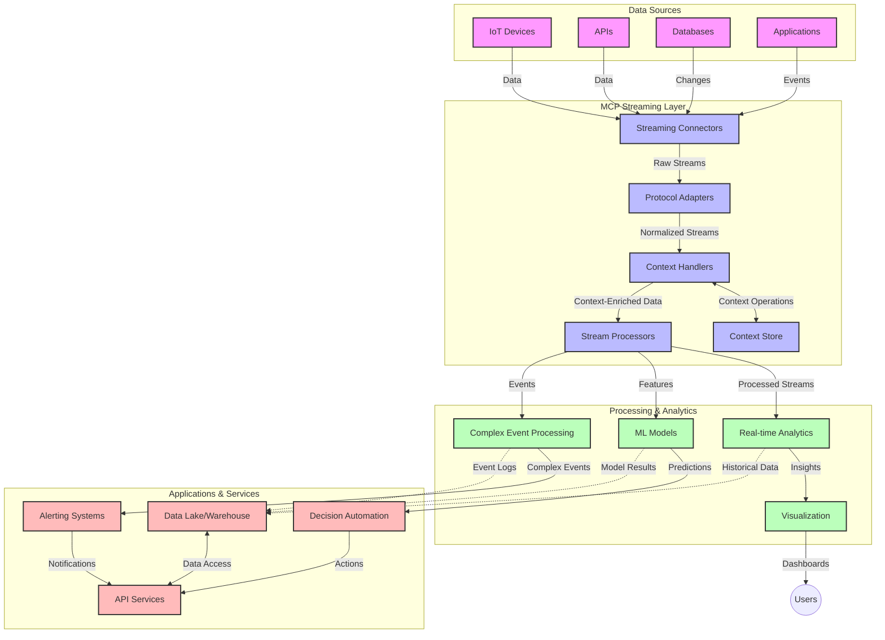

<!--
CO_OP_TRANSLATOR_METADATA:
{
  "original_hash": "68c518dbff8a3b127ed2aa934054c56c",
  "translation_date": "2025-06-11T16:53:19+00:00",
  "source_file": "05-AdvancedTopics/mcp-realtimestreaming/README.md",
  "language_code": "fr"
}
-->
# Model Context Protocol pour le Streaming de Données en Temps Réel

## Vue d'ensemble

Le streaming de données en temps réel est devenu essentiel dans le monde axé sur les données d'aujourd'hui, où les entreprises et les applications ont besoin d'un accès immédiat à l'information pour prendre des décisions rapides. Le Model Context Protocol (MCP) représente une avancée majeure dans l'optimisation de ces processus de streaming en temps réel, améliorant l'efficacité du traitement des données, préservant l'intégrité contextuelle et renforçant la performance globale des systèmes.

Ce module explore comment le MCP transforme le streaming de données en temps réel en fournissant une approche standardisée de la gestion du contexte entre les modèles d'IA, les plateformes de streaming et les applications.

## Introduction au Streaming de Données en Temps Réel

Le streaming de données en temps réel est un paradigme technologique qui permet le transfert, le traitement et l'analyse continus des données au fur et à mesure de leur génération, permettant aux systèmes de réagir immédiatement aux nouvelles informations. Contrairement au traitement par lots traditionnel qui opère sur des ensembles de données statiques, le streaming traite les données en mouvement, offrant des insights et des actions avec une latence minimale.

### Concepts clés du Streaming de Données en Temps Réel :

- **Flux de Données Continu** : Les données sont traitées sous forme d'un flux continu et ininterrompu d'événements ou d'enregistrements.
- **Traitement à Faible Latence** : Les systèmes sont conçus pour minimiser le délai entre la génération et le traitement des données.
- **Scalabilité** : Les architectures de streaming doivent gérer des volumes et des vitesses de données variables.
- **Tolérance aux Pannes** : Les systèmes doivent être résilients face aux défaillances pour garantir un flux de données ininterrompu.
- **Traitement Stateful** : Maintenir le contexte entre les événements est crucial pour une analyse pertinente.

### Le Model Context Protocol et le Streaming en Temps Réel

Le Model Context Protocol (MCP) répond à plusieurs défis majeurs dans les environnements de streaming en temps réel :

1. **Continuité Contextuelle** : Le MCP standardise la manière dont le contexte est maintenu à travers les composants de streaming distribués, garantissant que les modèles d'IA et les nœuds de traitement disposent du contexte historique et environnemental pertinent.

2. **Gestion Efficace de l'État** : En fournissant des mécanismes structurés pour la transmission du contexte, le MCP réduit la surcharge liée à la gestion de l'état dans les pipelines de streaming.

3. **Interopérabilité** : Le MCP crée un langage commun pour le partage du contexte entre diverses technologies de streaming et modèles d'IA, permettant des architectures plus flexibles et extensibles.

4. **Contexte Optimisé pour le Streaming** : Les implémentations MCP peuvent prioriser les éléments de contexte les plus pertinents pour la prise de décision en temps réel, optimisant à la fois la performance et la précision.

5. **Traitement Adaptatif** : Grâce à une gestion adéquate du contexte via MCP, les systèmes de streaming peuvent ajuster dynamiquement leur traitement en fonction des conditions et des tendances évolutives des données.

Dans les applications modernes, allant des réseaux de capteurs IoT aux plateformes de trading financier, l’intégration du MCP avec les technologies de streaming permet un traitement plus intelligent, conscient du contexte, capable de répondre de manière appropriée à des situations complexes et évolutives en temps réel.

## Objectifs d'apprentissage

À la fin de cette leçon, vous serez capable de :

- Comprendre les fondamentaux du streaming de données en temps réel et ses défis
- Expliquer comment le Model Context Protocol (MCP) améliore le streaming de données en temps réel
- Implémenter des solutions de streaming basées sur MCP avec des frameworks populaires comme Kafka et Pulsar
- Concevoir et déployer des architectures de streaming tolérantes aux pannes et performantes avec MCP
- Appliquer les concepts MCP aux cas d’usage IoT, trading financier et analyses pilotées par l’IA
- Évaluer les tendances émergentes et les innovations futures dans les technologies de streaming basées sur MCP

### Définition et Importance

Le streaming de données en temps réel implique la génération, le traitement et la livraison continus des données avec une latence minimale. Contrairement au traitement par lots, où les données sont collectées et traitées en groupes, les données en streaming sont traitées de manière incrémentale à leur arrivée, permettant des insights et actions immédiats.

Caractéristiques clés du streaming de données en temps réel :

- **Faible Latence** : Traitement et analyse des données en quelques millisecondes à secondes
- **Flux Continu** : Flux ininterrompus de données provenant de diverses sources
- **Traitement Immédiat** : Analyse des données à leur arrivée plutôt qu’en lots
- **Architecture Événementielle** : Réponse aux événements dès leur occurrence

### Défis du Streaming de Données Traditionnel

Les approches traditionnelles de streaming de données rencontrent plusieurs limitations :

1. **Perte de Contexte** : Difficulté à maintenir le contexte à travers des systèmes distribués
2. **Problèmes de Scalabilité** : Difficultés à gérer des volumes et vitesses de données élevés
3. **Complexité d’Intégration** : Problèmes d’interopérabilité entre différents systèmes
4. **Gestion de la Latence** : Équilibrer le débit et le temps de traitement
5. **Cohérence des Données** : Assurer l’exactitude et l’exhaustivité des données dans le flux

## Comprendre le Model Context Protocol (MCP)

### Qu’est-ce que le MCP ?

Le Model Context Protocol (MCP) est un protocole de communication standardisé conçu pour faciliter l’interaction efficace entre modèles d’IA et applications. Dans le contexte du streaming de données en temps réel, le MCP fournit un cadre pour :

- Préserver le contexte tout au long du pipeline de données
- Standardiser les formats d’échange de données
- Optimiser la transmission de gros ensembles de données
- Améliorer la communication modèle-à-modèle et modèle-à-application

### Composants clés et Architecture

L’architecture MCP pour le streaming en temps réel comprend plusieurs composants essentiels :

1. **Gestionnaires de Contexte** : Gèrent et maintiennent l’information contextuelle à travers le pipeline de streaming
2. **Processeurs de Flux** : Traitent les flux de données entrants en utilisant des techniques conscientes du contexte
3. **Adaptateurs de Protocole** : Convertissent entre différents protocoles de streaming tout en préservant le contexte
4. **Magasin de Contexte** : Stocke et récupère efficacement l’information contextuelle
5. **Connecteurs de Streaming** : Se connectent à diverses plateformes de streaming (Kafka, Pulsar, Kinesis, etc.)



### Comment le MCP Améliore la Gestion des Données en Temps Réel

Le MCP répond aux défis traditionnels du streaming par :

- **Intégrité Contextuelle** : Maintenir les relations entre les points de données à travers tout le pipeline
- **Transmission Optimisée** : Réduire les redondances dans l’échange de données grâce à une gestion intelligente du contexte
- **Interfaces Standardisées** : Fournir des API cohérentes pour les composants de streaming
- **Latence Réduite** : Minimiser la surcharge de traitement via une gestion efficace du contexte
- **Scalabilité Améliorée** : Supporter la montée en charge horizontale tout en préservant le contexte

## Intégration et Mise en œuvre

Les systèmes de streaming de données en temps réel nécessitent une conception architecturale et une mise en œuvre soignées pour maintenir à la fois la performance et l’intégrité contextuelle. Le Model Context Protocol offre une approche standardisée pour intégrer les modèles d’IA et les technologies de streaming, permettant des pipelines de traitement plus sophistiqués et conscients du contexte.

### Vue d’ensemble de l’intégration MCP dans les architectures de streaming

L’implémentation du MCP dans les environnements de streaming en temps réel implique plusieurs points clés :

1. **Sérialisation et Transport du Contexte** : Le MCP fournit des mécanismes efficaces pour encoder l’information contextuelle dans les paquets de données de streaming, garantissant que le contexte essentiel accompagne les données tout au long du pipeline de traitement. Cela inclut des formats de sérialisation standardisés optimisés pour le transport en streaming.

2. **Traitement Stateful des Flux** : Le MCP permet un traitement stateful plus intelligent en maintenant une représentation cohérente du contexte à travers les nœuds de traitement. Ceci est particulièrement précieux dans les architectures de streaming distribuées où la gestion de l’état est traditionnellement complexe.

3. **Temps d’Événement vs Temps de Traitement** : Les implémentations MCP dans les systèmes de streaming doivent gérer la problématique courante de différencier le moment où les événements se sont produits et celui où ils sont traités. Le protocole peut intégrer un contexte temporel préservant la sémantique du temps d’événement.

4. **Gestion de la Rétropression (Backpressure)** : En standardisant la gestion du contexte, le MCP aide à gérer la rétropression dans les systèmes de streaming, permettant aux composants de communiquer leurs capacités de traitement et d’ajuster le flux en conséquence.

5. **Fenêtrage et Agrégation du Contexte** : Le MCP facilite des opérations de fenêtrage plus sophistiquées en fournissant des représentations structurées des contextes temporels et relationnels, permettant des agrégations plus significatives à travers les flux d’événements.

6. **Traitement Exactement-Une-Fois** : Dans les systèmes de streaming nécessitant une sémantique d’exactement-une-fois, le MCP peut intégrer des métadonnées de traitement pour aider à suivre et vérifier le statut de traitement à travers les composants distribués.

La mise en œuvre du MCP à travers diverses technologies de streaming crée une approche unifiée de gestion du contexte, réduisant le besoin de code d’intégration personnalisé tout en améliorant la capacité du système à maintenir un contexte pertinent au fil du flux de données.

### MCP dans Divers Frameworks de Streaming de Données

Le MCP peut être intégré avec des frameworks de streaming populaires, notamment :

#### Intégration Apache Kafka

```python
from mcp_streaming import MCPKafkaConnector

# Initialize MCP Kafka connector
connector = MCPKafkaConnector(
    bootstrap_servers='localhost:9092',
    context_preservation=True
)

# Create a context-aware consumer
consumer = connector.create_consumer('input-topic')

# Process streaming data with context
for message in consumer:
    context = message.get_context()
    data = message.get_value()
    
    # Process with context awareness
    result = process_with_context(data, context)
    
    # Produce output with preserved context
    connector.produce('output-topic', result, context=context)
```

#### Implémentation Apache Pulsar

```python
from mcp_streaming import MCPPulsarClient

# Initialize MCP Pulsar client
client = MCPPulsarClient('pulsar://localhost:6650')

# Subscribe with context awareness
consumer = client.subscribe('input-topic', 'subscription-name', 
                           context_enabled=True)

# Process messages with context preservation
while True:
    message = consumer.receive()
    context = message.get_context()
    
    # Process with context
    result = process_with_context(message.data(), context)
    
    # Acknowledge the message
    consumer.acknowledge(message)
    
    # Send result with preserved context
    producer = client.create_producer('output-topic')
    producer.send(result, context=context)
```

### Bonnes Pratiques pour le Déploiement

Lors de la mise en œuvre du MCP pour le streaming en temps réel :

1. **Concevoir pour la Tolérance aux Pannes** :
   - Implémenter une gestion appropriée des erreurs
   - Utiliser des files d’attente dead-letter pour les messages échoués
   - Concevoir des processeurs idempotents

2. **Optimiser la Performance** :
   - Configurer des tailles de tampon adaptées
   - Utiliser le traitement par lots lorsque pertinent
   - Mettre en œuvre des mécanismes de rétropression

3. **Surveiller et Observer** :
   - Suivre les métriques de traitement des flux
   - Contrôler la propagation du contexte
   - Mettre en place des alertes en cas d’anomalies

4. **Sécuriser vos Flux** :
   - Chiffrer les données sensibles
   - Utiliser l’authentification et l’autorisation
   - Appliquer des contrôles d’accès appropriés

### MCP dans l’IoT et l’Edge Computing

Le MCP améliore le streaming IoT en :

- Préservant le contexte des appareils tout au long du pipeline de traitement
- Permettant un streaming efficace du edge vers le cloud
- Supportant l’analyse en temps réel des flux de données IoT
- Facilitant la communication entre appareils avec contexte

Exemple : Réseaux de capteurs pour villes intelligentes  
```
Sensors → Edge Gateways → MCP Stream Processors → Real-time Analytics → Automated Responses
```

### Rôle dans les Transactions Financières et le Trading à Haute Fréquence

Le MCP offre des avantages significatifs pour le streaming de données financières :

- Traitement à ultra-faible latence pour les décisions de trading
- Maintien du contexte transactionnel tout au long du traitement
- Support du traitement complexe d’événements avec conscience contextuelle
- Garantie de la cohérence des données à travers les systèmes de trading distribués

### Amélioration de l’Analyse de Données Pilotée par l’IA

Le MCP ouvre de nouvelles possibilités pour l’analyse en streaming :

- Entraînement et inférence de modèles en temps réel
- Apprentissage continu à partir des données en streaming
- Extraction de caractéristiques consciente du contexte
- Pipelines d’inférence multi-modèles avec contexte préservé

## Tendances Futures et Innovations

### Évolution du MCP dans les Environnements Temps Réel

À l’avenir, on s’attend à ce que le MCP évolue pour répondre à :

- **Intégration de l’Informatique Quantique** : Préparer les systèmes de streaming basés sur le quantique
- **Traitement Edge-Natif** : Déplacer davantage de traitement contextuel vers les appareils en périphérie
- **Gestion Autonome des Flux** : Pipelines de streaming auto-optimisés
- **Streaming Fédéré** : Traitement distribué tout en préservant la confidentialité

### Avancées Technologiques Potentielles

Les technologies émergentes qui façonneront l’avenir du streaming MCP :

1. **Protocoles de Streaming Optimisés pour l’IA** : Protocoles personnalisés spécifiquement conçus pour les charges de travail IA
2. **Intégration de l’Informatique Neuromorphique** : Calcul inspiré du cerveau pour le traitement des flux
3. **Streaming Serverless** : Streaming scalable et piloté par événements sans gestion d’infrastructure
4. **Magasins de Contexte Distribués** : Gestion du contexte globalement distribuée mais hautement cohérente

## Exercices Pratiques

### Exercice 1 : Mise en place d’un Pipeline de Streaming MCP Basique

Dans cet exercice, vous apprendrez à :  
- Configurer un environnement de streaming MCP basique  
- Implémenter des gestionnaires de contexte pour le traitement des flux  
- Tester et valider la préservation du contexte

### Exercice 2 : Création d’un Tableau de Bord d’Analyse en Temps Réel

Créez une application complète qui :  
- Ingestione des données en streaming avec MCP  
- Traite le flux tout en maintenant le contexte  
- Visualise les résultats en temps réel

### Exercice 3 : Implémentation d’un Traitement Complexe d’Événements avec MCP

Exercice avancé couvrant :  
- Détection de motifs dans les flux  
- Corrélation contextuelle entre plusieurs flux  
- Génération d’événements complexes avec contexte préservé

## Ressources Supplémentaires

- [Model Context Protocol Specification](https://github.com/microsoft/model-context-protocol) - Spécification et documentation officielle MCP  
- [Apache Kafka Documentation](https://kafka.apache.org/documentation/) - Documentation sur Kafka pour le traitement de flux  
- [Apache Pulsar](https://pulsar.apache.org/) - Plateforme unifiée de messagerie et streaming  
- [Streaming Systems: The What, Where, When, and How of Large-Scale Data Processing](https://www.oreilly.com/library/view/streaming-systems/9781491983867/) - Livre complet sur les architectures de streaming  
- [Microsoft Azure Event Hubs](https://learn.microsoft.com/en-us/azure/event-hubs/event-hubs-about) - Service de streaming d’événements managé  
- [MLflow Documentation](https://mlflow.org/docs/latest/index.html) - Pour le suivi et le déploiement de modèles ML  
- [Real-Time Analytics with Apache Storm](https://storm.apache.org/releases/current/index.html) - Framework de traitement pour le calcul en temps réel  
- [Flink ML](https://nightlies.apache.org/flink/flink-ml-docs-master/) - Bibliothèque de machine learning pour Apache Flink  
- [LangChain Documentation](https://python.langchain.com/docs/get_started/introduction) - Construction d’applications avec LLMs

## Résultats d’apprentissage

En complétant ce module, vous serez capable de :

- Comprendre les fondamentaux du streaming de données en temps réel et ses défis  
- Expliquer comment le Model Context Protocol (MCP) améliore le streaming de données en temps réel  
- Implémenter des solutions de streaming basées sur MCP avec des frameworks populaires comme Kafka et Pulsar  
- Concevoir et déployer des architectures de streaming tolérantes aux pannes et performantes avec MCP  
- Appliquer les concepts MCP aux cas d’usage IoT, trading financier et analyses pilotées par l’IA  
- Évaluer les tendances émergentes et les innovations futures dans les technologies de streaming basées sur MCP

## Et après ?

- [6. Community Contributions](../../06-CommunityContributions/README.md)

**Avertissement** :  
Ce document a été traduit à l’aide du service de traduction automatique [Co-op Translator](https://github.com/Azure/co-op-translator). Bien que nous nous efforcions d’assurer l’exactitude, veuillez noter que les traductions automatiques peuvent contenir des erreurs ou des inexactitudes. Le document original dans sa langue d’origine doit être considéré comme la source faisant foi. Pour les informations critiques, il est recommandé de recourir à une traduction professionnelle réalisée par un humain. Nous ne sommes pas responsables des malentendus ou des interprétations erronées résultant de l’utilisation de cette traduction.