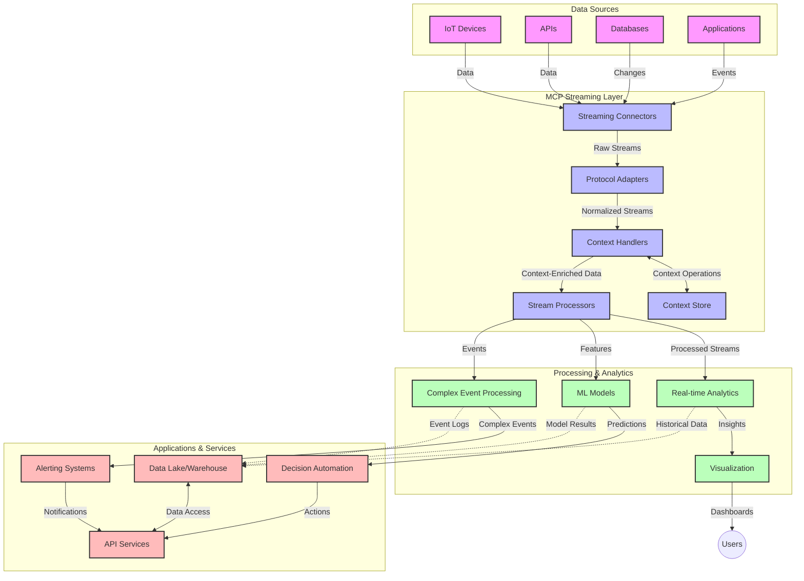

<!--
CO_OP_TRANSLATOR_METADATA:
{
  "original_hash": "b41174ac781ebf228b2043cbdfc09105",
  "translation_date": "2025-06-12T00:12:46+00:00",
  "source_file": "05-AdvancedTopics/mcp-realtimestreaming/README.md",
  "language_code": "fr"
}
-->
# Model Context Protocol pour le Streaming de Données en Temps Réel

## Aperçu

Le streaming de données en temps réel est devenu essentiel dans le monde axé sur les données d'aujourd'hui, où les entreprises et les applications ont besoin d'un accès immédiat à l'information pour prendre des décisions rapides. Le Model Context Protocol (MCP) représente une avancée majeure dans l’optimisation de ces processus de streaming en temps réel, améliorant l’efficacité du traitement des données, maintenant l’intégrité contextuelle et renforçant la performance globale des systèmes.

Ce module explore comment MCP transforme le streaming de données en temps réel en fournissant une approche standardisée pour la gestion du contexte entre les modèles d’IA, les plateformes de streaming et les applications.

## Introduction au Streaming de Données en Temps Réel

Le streaming de données en temps réel est un paradigme technologique qui permet le transfert, le traitement et l’analyse continus des données au fur et à mesure de leur génération, permettant aux systèmes de réagir immédiatement aux nouvelles informations. Contrairement au traitement par lots traditionnel qui opère sur des ensembles de données statiques, le streaming traite les données en mouvement, fournissant des insights et des actions avec une latence minimale.

### Concepts clés du Streaming de Données en Temps Réel :

- **Flux de données continu** : Les données sont traitées comme un flux continu et infini d’événements ou d’enregistrements.
- **Traitement à faible latence** : Les systèmes sont conçus pour minimiser le temps entre la génération et le traitement des données.
- **Scalabilité** : Les architectures de streaming doivent gérer des volumes et des vitesses de données variables.
- **Tolérance aux pannes** : Les systèmes doivent être résilients face aux défaillances pour garantir un flux de données ininterrompu.
- **Traitement avec état** : Maintenir le contexte entre les événements est crucial pour une analyse pertinente.

### Le Model Context Protocol et le Streaming en Temps Réel

Le Model Context Protocol (MCP) répond à plusieurs défis critiques dans les environnements de streaming en temps réel :

1. **Continuité contextuelle** : MCP standardise la manière dont le contexte est maintenu à travers les composants distribués du streaming, garantissant que les modèles d’IA et les nœuds de traitement ont accès au contexte historique et environnemental pertinent.

2. **Gestion efficace de l’état** : En fournissant des mécanismes structurés pour la transmission du contexte, MCP réduit la surcharge liée à la gestion de l’état dans les pipelines de streaming.

3. **Interopérabilité** : MCP crée un langage commun pour le partage de contexte entre diverses technologies de streaming et modèles d’IA, permettant des architectures plus flexibles et extensibles.

4. **Contexte optimisé pour le streaming** : Les implémentations MCP peuvent prioriser les éléments de contexte les plus pertinents pour la prise de décision en temps réel, optimisant à la fois la performance et la précision.

5. **Traitement adaptatif** : Grâce à une gestion adéquate du contexte via MCP, les systèmes de streaming peuvent ajuster dynamiquement leur traitement en fonction des conditions et des tendances évolutives des données.

Dans des applications modernes allant des réseaux de capteurs IoT aux plateformes de trading financier, l’intégration de MCP avec les technologies de streaming permet un traitement plus intelligent et conscient du contexte, capable de réagir de manière appropriée à des situations complexes et évolutives en temps réel.

## Objectifs d’Apprentissage

À la fin de cette leçon, vous serez capable de :

- Comprendre les fondamentaux du streaming de données en temps réel et ses défis
- Expliquer comment le Model Context Protocol (MCP) améliore le streaming de données en temps réel
- Implémenter des solutions de streaming basées sur MCP avec des frameworks populaires comme Kafka et Pulsar
- Concevoir et déployer des architectures de streaming tolérantes aux pannes et performantes avec MCP
- Appliquer les concepts MCP aux cas d’usage IoT, trading financier et analytique pilotée par l’IA
- Évaluer les tendances émergentes et les innovations futures dans les technologies de streaming basées sur MCP

### Définition et Importance

Le streaming de données en temps réel implique la génération, le traitement et la livraison continus des données avec une latence minimale. Contrairement au traitement par lots, où les données sont collectées et traitées en groupes, le streaming traite les données de façon incrémentale dès leur arrivée, permettant des insights et des actions immédiates.

Caractéristiques clés du streaming de données en temps réel :

- **Faible latence** : Traitement et analyse des données en millisecondes à secondes
- **Flux continu** : Flux ininterrompus de données provenant de diverses sources
- **Traitement immédiat** : Analyse des données à leur arrivée plutôt qu’en lots
- **Architecture événementielle** : Réaction aux événements dès leur occurrence

### Défis du Streaming de Données Traditionnel

Les approches traditionnelles de streaming de données rencontrent plusieurs limites :

1. **Perte de contexte** : Difficulté à maintenir le contexte à travers les systèmes distribués
2. **Problèmes de scalabilité** : Difficultés à gérer des volumes et vitesses de données élevés
3. **Complexité d’intégration** : Problèmes d’interopérabilité entre différents systèmes
4. **Gestion de la latence** : Trouver un équilibre entre débit et temps de traitement
5. **Cohérence des données** : Garantir l’exactitude et la complétude des données dans le flux

## Comprendre le Model Context Protocol (MCP)

### Qu’est-ce que le MCP ?

Le Model Context Protocol (MCP) est un protocole de communication standardisé conçu pour faciliter l’interaction efficace entre les modèles d’IA et les applications. Dans le contexte du streaming de données en temps réel, MCP fournit un cadre pour :

- Préserver le contexte tout au long du pipeline de données
- Standardiser les formats d’échange de données
- Optimiser la transmission de grands ensembles de données
- Améliorer la communication entre modèles et entre modèles et applications

### Composants clés et architecture

L’architecture MCP pour le streaming en temps réel comprend plusieurs composants essentiels :

1. **Gestionnaires de contexte** : Gèrent et maintiennent les informations contextuelles à travers le pipeline de streaming
2. **Processeurs de flux** : Traitent les flux de données entrants en utilisant des techniques conscientes du contexte
3. **Adaptateurs de protocole** : Convertissent entre différents protocoles de streaming tout en préservant le contexte
4. **Magasin de contexte** : Stocke et récupère efficacement les informations contextuelles
5. **Connecteurs de streaming** : Se connectent à diverses plateformes de streaming (Kafka, Pulsar, Kinesis, etc.)



### Comment MCP améliore la gestion des données en temps réel

MCP répond aux défis traditionnels du streaming grâce à :

- **Intégrité contextuelle** : Maintien des relations entre les points de données sur l’ensemble du pipeline
- **Transmission optimisée** : Réduction des redondances dans l’échange de données grâce à une gestion intelligente du contexte
- **Interfaces standardisées** : Fourniture d’API cohérentes pour les composants de streaming
- **Latence réduite** : Minimisation de la surcharge de traitement grâce à une gestion efficace du contexte
- **Scalabilité renforcée** : Support de la montée en charge horizontale tout en préservant le contexte

## Intégration et Mise en Œuvre

Les systèmes de streaming de données en temps réel nécessitent une conception et une mise en œuvre architecturale soignées pour maintenir à la fois performance et intégrité contextuelle. Le Model Context Protocol offre une approche standardisée pour intégrer les modèles d’IA et les technologies de streaming, permettant des pipelines de traitement plus sophistiqués et conscients du contexte.

### Vue d’ensemble de l’intégration MCP dans les architectures de streaming

La mise en œuvre de MCP dans les environnements de streaming en temps réel implique plusieurs considérations clés :

1. **Sérialisation et transport du contexte** : MCP fournit des mécanismes efficaces pour encoder les informations contextuelles dans les paquets de données de streaming, garantissant que le contexte essentiel accompagne les données tout au long du pipeline de traitement. Cela inclut des formats de sérialisation standardisés optimisés pour le transport en streaming.

2. **Traitement d’état avec contexte** : MCP permet un traitement d’état plus intelligent en maintenant une représentation cohérente du contexte entre les nœuds de traitement. Ceci est particulièrement précieux dans les architectures de streaming distribuées où la gestion de l’état est traditionnellement complexe.

3. **Temps d’événement vs temps de traitement** : Les implémentations MCP doivent gérer la distinction courante entre le moment où les événements se produisent et celui où ils sont traités. Le protocole peut intégrer un contexte temporel qui préserve la sémantique du temps d’événement.

4. **Gestion de la pression arrière (backpressure)** : En standardisant la gestion du contexte, MCP aide à gérer la pression arrière dans les systèmes de streaming, permettant aux composants de communiquer leurs capacités de traitement et d’ajuster le flux en conséquence.

5. **Fenêtrage et agrégation du contexte** : MCP facilite des opérations de fenêtrage plus sophistiquées en fournissant des représentations structurées des contextes temporels et relationnels, permettant des agrégations plus pertinentes sur les flux d’événements.

6. **Traitement exactement une fois** : Dans les systèmes de streaming nécessitant une sémantique d’exactement une fois, MCP peut intégrer des métadonnées de traitement pour aider à suivre et vérifier le statut du traitement à travers les composants distribués.

L’implémentation de MCP à travers diverses technologies de streaming crée une approche unifiée de la gestion du contexte, réduisant le besoin de code d’intégration personnalisé tout en améliorant la capacité du système à maintenir un contexte significatif au fur et à mesure que les données traversent le pipeline.

### MCP dans différents frameworks de streaming de données

Ces exemples suivent la spécification MCP actuelle qui se concentre sur un protocole basé sur JSON-RPC avec des mécanismes de transport distincts. Le code montre comment vous pouvez implémenter des transports personnalisés intégrant des plateformes de streaming comme Kafka et Pulsar tout en conservant une compatibilité complète avec le protocole MCP.

Les exemples ont pour but de montrer comment les plateformes de streaming peuvent être intégrées à MCP pour fournir un traitement de données en temps réel tout en préservant la conscience contextuelle centrale à MCP. Cette approche garantit que les exemples de code reflètent fidèlement l’état actuel de la spécification MCP à partir de juin 2025.

MCP peut être intégré aux frameworks de streaming populaires, notamment :

#### Intégration Apache Kafka

```python
import asyncio
import json
from typing import Dict, Any, Optional
from confluent_kafka import Consumer, Producer, KafkaError
from mcp.client import Client, ClientCapabilities
from mcp.core.message import JsonRpcMessage
from mcp.core.transports import Transport

# Custom transport class to bridge MCP with Kafka
class KafkaMCPTransport(Transport):
    def __init__(self, bootstrap_servers: str, input_topic: str, output_topic: str):
        self.bootstrap_servers = bootstrap_servers
        self.input_topic = input_topic
        self.output_topic = output_topic
        self.producer = Producer({'bootstrap.servers': bootstrap_servers})
        self.consumer = Consumer({
            'bootstrap.servers': bootstrap_servers,
            'group.id': 'mcp-client-group',
            'auto.offset.reset': 'earliest'
        })
        self.message_queue = asyncio.Queue()
        self.running = False
        self.consumer_task = None
        
    async def connect(self):
        """Connect to Kafka and start consuming messages"""
        self.consumer.subscribe([self.input_topic])
        self.running = True
        self.consumer_task = asyncio.create_task(self._consume_messages())
        return self
        
    async def _consume_messages(self):
        """Background task to consume messages from Kafka and queue them for processing"""
        while self.running:
            try:
                msg = self.consumer.poll(1.0)
                if msg is None:
                    await asyncio.sleep(0.1)
                    continue
                
                if msg.error():
                    if msg.error().code() == KafkaError._PARTITION_EOF:
                        continue
                    print(f"Consumer error: {msg.error()}")
                    continue
                
                # Parse the message value as JSON-RPC
                try:
                    message_str = msg.value().decode('utf-8')
                    message_data = json.loads(message_str)
                    mcp_message = JsonRpcMessage.from_dict(message_data)
                    await self.message_queue.put(mcp_message)
                except Exception as e:
                    print(f"Error parsing message: {e}")
            except Exception as e:
                print(f"Error in consumer loop: {e}")
                await asyncio.sleep(1)
    
    async def read(self) -> Optional[JsonRpcMessage]:
        """Read the next message from the queue"""
        try:
            message = await self.message_queue.get()
            return message
        except Exception as e:
            print(f"Error reading message: {e}")
            return None
    
    async def write(self, message: JsonRpcMessage) -> None:
        """Write a message to the Kafka output topic"""
        try:
            message_json = json.dumps(message.to_dict())
            self.producer.produce(
                self.output_topic,
                message_json.encode('utf-8'),
                callback=self._delivery_report
            )
            self.producer.poll(0)  # Trigger callbacks
        except Exception as e:
            print(f"Error writing message: {e}")
    
    def _delivery_report(self, err, msg):
        """Kafka producer delivery callback"""
        if err is not None:
            print(f'Message delivery failed: {err}')
        else:
            print(f'Message delivered to {msg.topic()} [{msg.partition()}]')
    
    async def close(self) -> None:
        """Close the transport"""
        self.running = False
        if self.consumer_task:
            self.consumer_task.cancel()
            try:
                await self.consumer_task
            except asyncio.CancelledError:
                pass
        self.consumer.close()
        self.producer.flush()

# Example usage of the Kafka MCP transport
async def kafka_mcp_example():
    # Create MCP client with Kafka transport
    client = Client(
        {"name": "kafka-mcp-client", "version": "1.0.0"},
        ClientCapabilities({})
    )
    
    # Create and connect the Kafka transport
    transport = KafkaMCPTransport(
        bootstrap_servers="localhost:9092",
        input_topic="mcp-responses",
        output_topic="mcp-requests"
    )
    
    await client.connect(transport)
    
    try:
        # Initialize the MCP session
        await client.initialize()
        
        # Example of executing a tool via MCP
        response = await client.execute_tool(
            "process_data",
            {
                "data": "sample data",
                "metadata": {
                    "source": "sensor-1",
                    "timestamp": "2025-06-12T10:30:00Z"
                }
            }
        )
        
        print(f"Tool execution response: {response}")
        
        # Clean shutdown
        await client.shutdown()
    finally:
        await transport.close()

# Run the example
if __name__ == "__main__":
    asyncio.run(kafka_mcp_example())
```

#### Implémentation Apache Pulsar

```python
import asyncio
import json
import pulsar
from typing import Dict, Any, Optional
from mcp.core.message import JsonRpcMessage
from mcp.core.transports import Transport
from mcp.server import Server, ServerOptions
from mcp.server.tools import Tool, ToolExecutionContext, ToolMetadata

# Create a custom MCP transport that uses Pulsar
class PulsarMCPTransport(Transport):
    def __init__(self, service_url: str, request_topic: str, response_topic: str):
        self.service_url = service_url
        self.request_topic = request_topic
        self.response_topic = response_topic
        self.client = pulsar.Client(service_url)
        self.producer = self.client.create_producer(response_topic)
        self.consumer = self.client.subscribe(
            request_topic,
            "mcp-server-subscription",
            consumer_type=pulsar.ConsumerType.Shared
        )
        self.message_queue = asyncio.Queue()
        self.running = False
        self.consumer_task = None
    
    async def connect(self):
        """Connect to Pulsar and start consuming messages"""
        self.running = True
        self.consumer_task = asyncio.create_task(self._consume_messages())
        return self
    
    async def _consume_messages(self):
        """Background task to consume messages from Pulsar and queue them for processing"""
        while self.running:
            try:
                # Non-blocking receive with timeout
                msg = self.consumer.receive(timeout_millis=500)
                
                # Process the message
                try:
                    message_str = msg.data().decode('utf-8')
                    message_data = json.loads(message_str)
                    mcp_message = JsonRpcMessage.from_dict(message_data)
                    await self.message_queue.put(mcp_message)
                    
                    # Acknowledge the message
                    self.consumer.acknowledge(msg)
                except Exception as e:
                    print(f"Error processing message: {e}")
                    # Negative acknowledge if there was an error
                    self.consumer.negative_acknowledge(msg)
            except Exception as e:
                # Handle timeout or other exceptions
                await asyncio.sleep(0.1)
    
    async def read(self) -> Optional[JsonRpcMessage]:
        """Read the next message from the queue"""
        try:
            message = await self.message_queue.get()
            return message
        except Exception as e:
            print(f"Error reading message: {e}")
            return None
    
    async def write(self, message: JsonRpcMessage) -> None:
        """Write a message to the Pulsar output topic"""
        try:
            message_json = json.dumps(message.to_dict())
            self.producer.send(message_json.encode('utf-8'))
        except Exception as e:
            print(f"Error writing message: {e}")
    
    async def close(self) -> None:
        """Close the transport"""
        self.running = False
        if self.consumer_task:
            self.consumer_task.cancel()
            try:
                await self.consumer_task
            except asyncio.CancelledError:
                pass
        self.consumer.close()
        self.producer.close()
        self.client.close()

# Define a sample MCP tool that processes streaming data
@Tool(
    name="process_streaming_data",
    description="Process streaming data with context preservation",
    metadata=ToolMetadata(
        required_capabilities=["streaming"]
    )
)
async def process_streaming_data(
    ctx: ToolExecutionContext,
    data: str,
    source: str,
    priority: str = "medium"
) -> Dict[str, Any]:
    """
    Process streaming data while preserving context
    
    Args:
        ctx: Tool execution context
        data: The data to process
        source: The source of the data
        priority: Priority level (low, medium, high)
        
    Returns:
        Dict containing processed results and context information
    """
    # Example processing that leverages MCP context
    print(f"Processing data from {source} with priority {priority}")
    
    # Access conversation context from MCP
    conversation_id = ctx.conversation_id if hasattr(ctx, 'conversation_id') else "unknown"
    
    # Return results with enhanced context
    return {
        "processed_data": f"Processed: {data}",
        "context": {
            "conversation_id": conversation_id,
            "source": source,
            "priority": priority,
            "processing_timestamp": ctx.get_current_time_iso()
        }
    }

# Example MCP server implementation using Pulsar transport
async def run_mcp_server_with_pulsar():
    # Create MCP server
    server = Server(
        {"name": "pulsar-mcp-server", "version": "1.0.0"},
        ServerOptions(
            capabilities={"streaming": True}
        )
    )
    
    # Register our tool
    server.register_tool(process_streaming_data)
    
    # Create and connect Pulsar transport
    transport = PulsarMCPTransport(
        service_url="pulsar://localhost:6650",
        request_topic="mcp-requests",
        response_topic="mcp-responses"
    )
    
    try:
        # Start the server with the Pulsar transport
        await server.run(transport)
    finally:
        await transport.close()

# Run the server
if __name__ == "__main__":
    asyncio.run(run_mcp_server_with_pulsar())
```

### Bonnes pratiques pour le déploiement

Lors de la mise en œuvre de MCP pour le streaming en temps réel :

1. **Concevoir pour la tolérance aux pannes** :
   - Mettre en place une gestion appropriée des erreurs
   - Utiliser des files d’attente de messages morts (dead-letter queues) pour les messages échoués
   - Concevoir des processeurs idempotents

2. **Optimiser la performance** :
   - Configurer des tailles de tampon adaptées
   - Utiliser le traitement par lots lorsque c’est pertinent
   - Mettre en œuvre des mécanismes de pression arrière

3. **Surveiller et observer** :
   - Suivre les métriques de traitement des flux
   - Surveiller la propagation du contexte
   - Configurer des alertes en cas d’anomalies

4. **Sécuriser vos flux** :
   - Chiffrer les données sensibles
   - Utiliser l’authentification et l’autorisation
   - Appliquer des contrôles d’accès appropriés

### MCP dans l’IoT et l’Edge Computing

MCP améliore le streaming IoT en :

- Préservant le contexte des dispositifs tout au long du pipeline de traitement
- Permettant un streaming efficace de l’edge vers le cloud
- Supportant l’analytique en temps réel sur les flux de données IoT
- Facilitant la communication entre dispositifs avec contexte

Exemple : Réseaux de capteurs pour villes intelligentes  
```
Sensors → Edge Gateways → MCP Stream Processors → Real-time Analytics → Automated Responses
```

### Rôle dans les transactions financières et le trading à haute fréquence

MCP offre des avantages majeurs pour le streaming de données financières :

- Traitement à ultra-faible latence pour les décisions de trading
- Maintien du contexte des transactions tout au long du traitement
- Support du traitement complexe d’événements avec conscience contextuelle
- Garantie de la cohérence des données dans les systèmes de trading distribués

### Amélioration de l’analytique pilotée par l’IA

MCP ouvre de nouvelles possibilités pour l’analyse en streaming :

- Entraînement et inférence de modèles en temps réel
- Apprentissage continu à partir des données en streaming
- Extraction de caractéristiques conscientes du contexte
- Pipelines d’inférence multi-modèles avec contexte préservé

## Tendances et Innovations Futures

### Évolution de MCP dans les environnements temps réel

À l’avenir, on prévoit que MCP évoluera pour répondre à :

- **Intégration du calcul quantique** : Préparation aux systèmes de streaming basés sur la technologie quantique
- **Traitement natif à l’edge** : Déplacement d’un traitement plus conscient du contexte vers les dispositifs en périphérie
- **Gestion autonome des flux** : Pipelines de streaming auto-optimisants
- **Streaming fédéré** : Traitement distribué tout en préservant la confidentialité

### Avancées technologiques potentielles

Les technologies émergentes qui façonneront l’avenir du streaming MCP :

1. **Protocoles de streaming optimisés pour l’IA** : Protocoles personnalisés spécifiquement conçus pour les charges de travail IA
2. **Intégration du calcul neuromorphique** : Calcul inspiré du cerveau pour le traitement des flux
3. **Streaming sans serveur (serverless)** : Streaming événementiel, évolutif, sans gestion d’infrastructure
4. **Magasins de contexte distribués** : Gestion du contexte globalement distribuée mais hautement cohérente

## Exercices Pratiques

### Exercice 1 : Mise en place d’un pipeline MCP de base

Dans cet exercice, vous apprendrez à :  
- Configurer un environnement de streaming MCP basique  
- Implémenter des gestionnaires de contexte pour le traitement des flux  
- Tester et valider la préservation du contexte

### Exercice 2 : Création d’un tableau de bord analytique en temps réel

Créez une application complète qui :  
- Ingest des données en streaming avec MCP  
- Traite le flux tout en maintenant le contexte  
- Visualise les résultats en temps réel

### Exercice 3 : Implémentation du traitement complexe d’événements avec MCP

Exercice avancé couvrant :  
- La détection de motifs dans les flux  
- La corrélation contextuelle entre plusieurs flux  
- La génération d’événements complexes avec contexte préservé

## Ressources supplémentaires

- [Model Context Protocol Specification](https://github.com/modelcontextprotocol) - Spécification officielle et documentation MCP  
- [Apache Kafka Documentation](https://kafka.apache.org/documentation/) - Apprenez Kafka pour le traitement des flux  
- [Apache Pulsar](https://pulsar.apache.org/) - Plateforme unifiée de messagerie et streaming  
- [Streaming Systems: The What, Where, When, and How of Large-Scale Data Processing](https://www.oreilly.com/library/view/streaming-systems/9781491983867/) - Livre complet sur les architectures de streaming  
- [Microsoft Azure Event Hubs](https://learn.microsoft.com/azure/event-hubs/event-hubs-about) - Service de streaming d’événements managé  
- [MLflow Documentation](https://mlflow.org/docs/latest/index.html) - Pour le suivi et le déploiement de modèles ML  
- [Real-Time Analytics with Apache Storm](https://storm.apache.org/releases/current/index.html) - Framework de traitement en temps réel  
- [Flink ML](https://nightlies.apache.org/flink/flink-ml-docs-master/) - Bibliothèque de machine learning pour Apache Flink  
- [LangChain Documentation](https://python.langchain.com/docs/get_started/introduction) - Construire des applications avec des LLM

## Résultats d’apprentissage

En complétant ce module, vous serez capable de :

- Comprendre les fondamentaux du streaming de données en temps réel et ses défis  
- Expliquer comment le Model Context Protocol (MCP) améliore le streaming de données en temps réel  
- Implémenter des solutions de streaming basées sur MCP avec des frameworks populaires comme Kafka et Pulsar  
- Concevoir et déployer des architectures de streaming tolérantes aux pannes et performantes avec MCP  
- Appliquer les concepts MCP aux cas d’usage IoT, trading financier et analytique pilotée par l’IA  
- Évaluer les tendances émergentes et les innovations futures dans les technologies de streaming basées sur MCP

## Et après ?

- [6. Community Contributions](../../06-CommunityContributions/README.md)

**Avertissement** :  
Ce document a été traduit à l'aide du service de traduction automatique [Co-op Translator](https://github.com/Azure/co-op-translator). Bien que nous nous efforcions d'assurer l'exactitude, veuillez noter que les traductions automatiques peuvent contenir des erreurs ou des inexactitudes. Le document original dans sa langue d'origine doit être considéré comme la source faisant foi. Pour les informations critiques, il est recommandé de faire appel à une traduction professionnelle réalisée par un humain. Nous déclinons toute responsabilité en cas de malentendus ou de mauvaises interprétations résultant de l'utilisation de cette traduction.