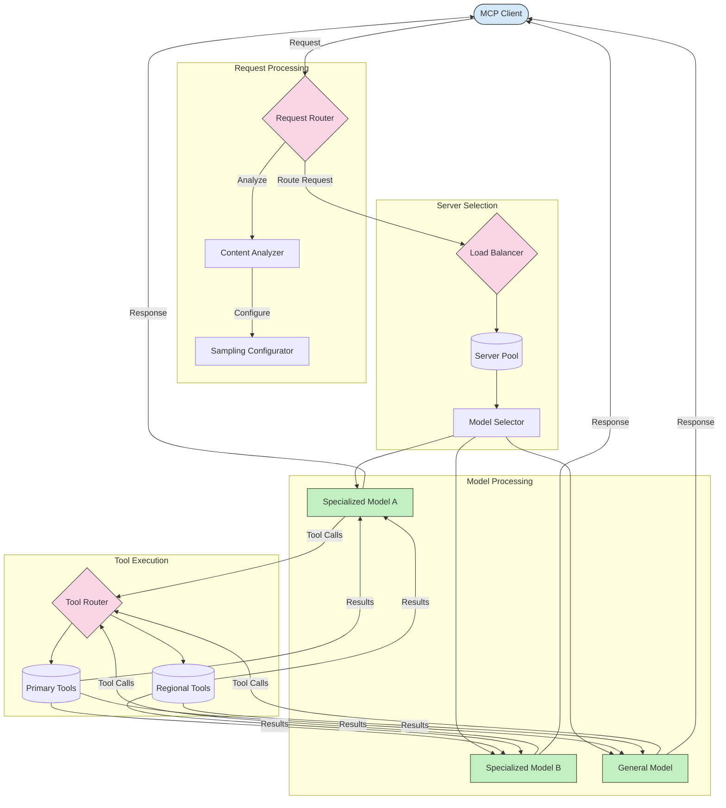

<!--
CO_OP_TRANSLATOR_METADATA:
{
  "original_hash": "2f1b473818b5a6cc9a9bbf777fffa6d4",
  "translation_date": "2025-07-14T21:43:44+00:00",
  "source_file": "05-AdvancedTopics/mcp-routing/README.md",
  "language_code": "fr"
}
-->
## Architecture d'Échantillonnage et de Routage dans MCP

L'échantillonnage est un élément clé du Model Context Protocol (MCP) qui permet un traitement et un routage efficaces des requêtes. Il consiste à analyser les requêtes entrantes afin de déterminer le modèle ou le service le plus approprié pour les traiter, en fonction de divers critères tels que le type de contenu, le contexte utilisateur et la charge du système.

L'échantillonnage et le routage peuvent être combinés pour créer une architecture robuste qui optimise l'utilisation des ressources et garantit une haute disponibilité. Le processus d'échantillonnage peut être utilisé pour classifier les requêtes, tandis que le routage les dirige vers les modèles ou services adéquats.

Le schéma ci-dessous illustre comment l'échantillonnage et le routage fonctionnent ensemble dans une architecture MCP complète :

## Et ensuite

- [5.6 Échantillonnage](../mcp-sampling/README.md)

**Avertissement** :  
Ce document a été traduit à l’aide du service de traduction automatique [Co-op Translator](https://github.com/Azure/co-op-translator). Bien que nous nous efforcions d’assurer l’exactitude, veuillez noter que les traductions automatiques peuvent contenir des erreurs ou des inexactitudes. Le document original dans sa langue d’origine doit être considéré comme la source faisant foi. Pour les informations critiques, une traduction professionnelle humaine est recommandée. Nous déclinons toute responsabilité en cas de malentendus ou de mauvaises interprétations résultant de l’utilisation de cette traduction.