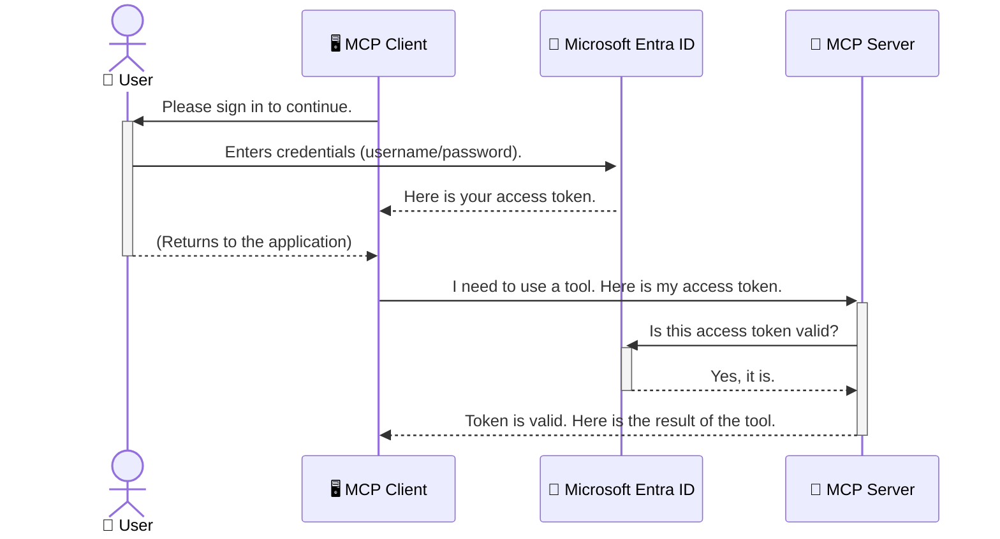

<!--
CO_OP_TRANSLATOR_METADATA:
{
  "original_hash": "9abe1d303ab126f9a8b87f03cebe5213",
  "translation_date": "2025-06-26T14:31:13+00:00",
  "source_file": "05-AdvancedTopics/mcp-security-entra/README.md",
  "language_code": "fr"
}
-->
# Sécurisation des flux de travail IA : Authentification Entra ID pour les serveurs Model Context Protocol

## Introduction  
Sécuriser votre serveur Model Context Protocol (MCP) est aussi important que de verrouiller la porte d’entrée de votre maison. Laisser votre serveur MCP ouvert expose vos outils et données à des accès non autorisés, ce qui peut entraîner des failles de sécurité. Microsoft Entra ID offre une solution robuste de gestion des identités et des accès basée sur le cloud, garantissant que seuls les utilisateurs et applications autorisés peuvent interagir avec votre serveur MCP. Dans cette section, vous apprendrez comment protéger vos flux de travail IA grâce à l’authentification Entra ID.

## Objectifs d’apprentissage  
À la fin de cette section, vous serez capable de :

- Comprendre l’importance de sécuriser les serveurs MCP.  
- Expliquer les bases de Microsoft Entra ID et de l’authentification OAuth 2.0.  
- Identifier la différence entre clients publics et clients confidentiels.  
- Mettre en œuvre l’authentification Entra ID dans des scénarios de serveurs MCP locaux (client public) et distants (client confidentiel).  
- Appliquer les bonnes pratiques de sécurité lors du développement de flux de travail IA.

# Sécurisation des flux de travail IA : Authentification Entra ID pour les serveurs Model Context Protocol

Tout comme vous ne laisseriez pas la porte d’entrée de votre maison ouverte, vous ne devriez pas laisser votre serveur MCP accessible à n’importe qui. Sécuriser vos flux de travail IA est essentiel pour construire des applications robustes, fiables et sûres. Ce chapitre vous présentera comment utiliser Microsoft Entra ID pour sécuriser vos serveurs MCP, en garantissant que seuls les utilisateurs et applications autorisés puissent accéder à vos outils et données.

## Pourquoi la sécurité est importante pour les serveurs MCP

Imaginez que votre serveur MCP dispose d’un outil capable d’envoyer des e-mails ou d’accéder à une base de données client. Un serveur non sécurisé signifie que n’importe qui pourrait potentiellement utiliser cet outil, ce qui pourrait entraîner un accès non autorisé aux données, du spam ou d’autres activités malveillantes.

En mettant en place une authentification, vous vous assurez que chaque requête adressée à votre serveur est vérifiée, confirmant l’identité de l’utilisateur ou de l’application qui fait la demande. C’est la première étape, et la plus cruciale, pour sécuriser vos flux de travail IA.

## Introduction à Microsoft Entra ID

**Microsoft Entra ID** est un service de gestion des identités et des accès basé sur le cloud. Pensez-y comme un agent de sécurité universel pour vos applications. Il gère le processus complexe de vérification des identités des utilisateurs (authentification) et de définition de leurs droits d’accès (autorisation).

En utilisant Entra ID, vous pouvez :

- Permettre une connexion sécurisée pour les utilisateurs.  
- Protéger les API et services.  
- Gérer les politiques d’accès depuis un point central.

Pour les serveurs MCP, Entra ID offre une solution robuste et largement reconnue pour contrôler qui peut accéder aux fonctionnalités de votre serveur.

---

## Comprendre le fonctionnement : Comment fonctionne l’authentification Entra ID

Entra ID utilise des standards ouverts comme **OAuth 2.0** pour gérer l’authentification. Bien que les détails puissent être complexes, le concept principal est simple et peut être compris via une analogie.

### Une introduction simple à OAuth 2.0 : La clé de voiturier

Pensez à OAuth 2.0 comme à un service de voiturier pour votre voiture. Lorsque vous arrivez au restaurant, vous ne donnez pas au voiturier votre clé principale. Vous lui donnez une **clé de voiturier** avec des permissions limitées : elle peut démarrer la voiture et verrouiller les portes, mais pas ouvrir le coffre ou la boîte à gants.

Dans cette analogie :

- **Vous** êtes l’**Utilisateur**.  
- **Votre voiture** est le **serveur MCP** avec ses outils et données précieux.  
- Le **voiturier** est **Microsoft Entra ID**.  
- L’**agent de parking** est le **client MCP** (l’application qui tente d’accéder au serveur).  
- La **clé de voiturier** est le **jeton d’accès**.

Le jeton d’accès est une chaîne sécurisée que le client MCP reçoit d’Entra ID après votre connexion. Le client présente ce jeton au serveur MCP à chaque requête. Le serveur peut vérifier le jeton pour s’assurer que la requête est légitime et que le client dispose des autorisations nécessaires, sans jamais avoir à manipuler vos véritables identifiants (comme votre mot de passe).

### Le flux d’authentification

Voici comment le processus fonctionne en pratique :



### Présentation de la Microsoft Authentication Library (MSAL)

Avant d’entrer dans le code, il est important de présenter un composant clé que vous verrez dans les exemples : la **Microsoft Authentication Library (MSAL)**.

MSAL est une bibliothèque développée par Microsoft qui facilite grandement la gestion de l’authentification pour les développeurs. Plutôt que d’écrire vous-même tout le code complexe pour gérer les jetons de sécurité, les connexions et le rafraîchissement des sessions, MSAL s’occupe de tout cela.

Utiliser une bibliothèque comme MSAL est fortement recommandé car :

- **C’est sécurisé :** Elle implémente les protocoles standards de l’industrie et les meilleures pratiques de sécurité, réduisant ainsi les risques de vulnérabilités dans votre code.  
- **Cela simplifie le développement :** Elle masque la complexité des protocoles OAuth 2.0 et OpenID Connect, vous permettant d’ajouter une authentification robuste à votre application en quelques lignes de code.  
- **Elle est maintenue :** Microsoft met régulièrement à jour MSAL pour faire face aux nouvelles menaces de sécurité et aux évolutions des plateformes.

MSAL prend en charge de nombreux langages et frameworks applicatifs, notamment .NET, JavaScript/TypeScript, Python, Java, Go, ainsi que les plateformes mobiles iOS et Android. Cela vous permet d’utiliser des schémas d’authentification cohérents sur l’ensemble de votre stack technologique.

Pour en savoir plus sur MSAL, vous pouvez consulter la documentation officielle [Vue d’ensemble de MSAL](https://learn.microsoft.com/entra/identity-platform/msal-overview).

---

## Sécuriser votre serveur MCP avec Entra ID : guide étape par étape

Voyons maintenant comment sécuriser un serveur MCP local (qui communique via `stdio`) using Entra ID. This example uses a **public client**, which is suitable for applications running on a user's machine, like a desktop app or a local development server.

### Scenario 1: Securing a Local MCP Server (with a Public Client)

In this scenario, we'll look at an MCP server that runs locally, communicates over `stdio`, and uses Entra ID to authenticate the user before allowing access to its tools. The server will have a single tool that fetches the user's profile information from the Microsoft Graph API.

#### 1. Setting Up the Application in Entra ID

Before writing any code, you need to register your application in Microsoft Entra ID. This tells Entra ID about your application and grants it permission to use the authentication service.

1. Navigate to the **[Microsoft Entra portal](https://entra.microsoft.com/)**.
2. Go to **App registrations** and click **New registration**.
3. Give your application a name (e.g., "My Local MCP Server").
4. For **Supported account types**, select **Accounts in this organizational directory only**.
5. You can leave the **Redirect URI** blank for this example.
6. Click **Register**.

Once registered, take note of the **Application (client) ID** and **Directory (tenant) ID**. You'll need these in your code.

#### 2. The Code: A Breakdown

Let's look at the key parts of the code that handle authentication. The full code for this example is available in the [Entra ID - Local - WAM](https://github.com/Azure-Samples/mcp-auth-servers/tree/main/src/entra-id-local-wam) folder of the [mcp-auth-servers GitHub repository](https://github.com/Azure-Samples/mcp-auth-servers).

**`AuthenticationService.cs`**

This class is responsible for handling the interaction with Entra ID.

- **`CreateAsync`**: This method initializes the `PublicClientApplication` from the MSAL (Microsoft Authentication Library). It's configured with your application's `clientId` and `tenantId`.
- **`WithBroker`**: This enables the use of a broker (like the Windows Web Account Manager), which provides a more secure and seamless single sign-on experience.
- **`AcquireTokenAsync`** : c’est la méthode centrale. Elle tente d’abord d’obtenir un jeton silencieusement (ce qui signifie que l’utilisateur n’aura pas à se reconnecter s’il a déjà une session valide). Si le jeton silencieux ne peut pas être obtenu, elle invite l’utilisateur à se connecter de manière interactive.

```csharp
// Simplified for clarity
public static async Task<AuthenticationService> CreateAsync(ILogger<AuthenticationService> logger)
{
    var msalClient = PublicClientApplicationBuilder
        .Create(_clientId) // Your Application (client) ID
        .WithAuthority(AadAuthorityAudience.AzureAdMyOrg)
        .WithTenantId(_tenantId) // Your Directory (tenant) ID
        .WithBroker(new BrokerOptions(BrokerOptions.OperatingSystems.Windows))
        .Build();

    // ... cache registration ...

    return new AuthenticationService(logger, msalClient);
}

public async Task<string> AcquireTokenAsync()
{
    try
    {
        // Try silent authentication first
        var accounts = await _msalClient.GetAccountsAsync();
        var account = accounts.FirstOrDefault();

        AuthenticationResult? result = null;

        if (account != null)
        {
            result = await _msalClient.AcquireTokenSilent(_scopes, account).ExecuteAsync();
        }
        else
        {
            // If no account, or silent fails, go interactive
            result = await _msalClient.AcquireTokenInteractive(_scopes).ExecuteAsync();
        }

        return result.AccessToken;
    }
    catch (Exception ex)
    {
        _logger.LogError(ex, "An error occurred while acquiring the token.");
        throw; // Optionally rethrow the exception for higher-level handling
    }
}
```

**`Program.cs`**

This is where the MCP server is set up and the authentication service is integrated.

- **`AddSingleton<AuthenticationService>`**: This registers the `AuthenticationService` with the dependency injection container, so it can be used by other parts of the application (like our tool).
- **`GetUserDetailsFromGraph` tool**: This tool requires an instance of `AuthenticationService`. Before it does anything, it calls `authService.AcquireTokenAsync()` récupère un jeton d’accès valide. Si l’authentification réussit, il utilise ce jeton pour appeler l’API Microsoft Graph et obtenir les détails de l’utilisateur.

```csharp
// Simplified for clarity
[McpServerTool(Name = "GetUserDetailsFromGraph")]
public static async Task<string> GetUserDetailsFromGraph(
    AuthenticationService authService)
{
    try
    {
        // This will trigger the authentication flow
        var accessToken = await authService.AcquireTokenAsync();

        // Use the token to create a GraphServiceClient
        var graphClient = new GraphServiceClient(
            new BaseBearerTokenAuthenticationProvider(new TokenProvider(authService)));

        var user = await graphClient.Me.GetAsync();

        return System.Text.Json.JsonSerializer.Serialize(user);
    }
    catch (Exception ex)
    {
        return $"Error: {ex.Message}";
    }
}
```

#### 3. Comment tout cela fonctionne ensemble

1. Lorsque le client MCP tente d’utiliser `GetUserDetailsFromGraph` tool, the tool first calls `AcquireTokenAsync`.
2. `AcquireTokenAsync` triggers the MSAL library to check for a valid token.
3. If no token is found, MSAL, through the broker, will prompt the user to sign in with their Entra ID account.
4. Once the user signs in, Entra ID issues an access token.
5. The tool receives the token and uses it to make a secure call to the Microsoft Graph API.
6. The user's details are returned to the MCP client.

This process ensures that only authenticated users can use the tool, effectively securing your local MCP server.

### Scenario 2: Securing a Remote MCP Server (with a Confidential Client)

When your MCP server is running on a remote machine (like a cloud server) and communicates over a protocol like HTTP Streaming, the security requirements are different. In this case, you should use a **confidential client** and the **Authorization Code Flow**. This is a more secure method because the application's secrets are never exposed to the browser.

This example uses a TypeScript-based MCP server that uses Express.js to handle HTTP requests.

#### 1. Setting Up the Application in Entra ID

The setup in Entra ID is similar to the public client, but with one key difference: you need to create a **client secret**.

1. Navigate to the **[Microsoft Entra portal](https://entra.microsoft.com/)**.
2. In your app registration, go to the **Certificates & secrets** tab.
3. Click **New client secret**, give it a description, and click **Add**.
4. **Important:** Copy the secret value immediately. You will not be able to see it again.
5. You also need to configure a **Redirect URI**. Go to the **Authentication** tab, click **Add a platform**, select **Web**, and enter the redirect URI for your application (e.g., `http://localhost:3001/auth/callback`).

> **⚠️ Important Security Note:** For production applications, Microsoft strongly recommends using **secretless authentication** methods such as **Managed Identity** or **Workload Identity Federation** instead of client secrets. Client secrets pose security risks as they can be exposed or compromised. Managed identities provide a more secure approach by eliminating the need to store credentials in your code or configuration.
>
> For more information about managed identities and how to implement them, see the [Managed identities for Azure resources overview](https://learn.microsoft.com/entra/identity/managed-identities-azure-resources/overview).

#### 2. The Code: A Breakdown

This example uses a session-based approach. When the user authenticates, the server stores the access token and refresh token in a session and gives the user a session token. This session token is then used for subsequent requests. The full code for this example is available in the [Entra ID - Confidential client](https://github.com/Azure-Samples/mcp-auth-servers/tree/main/src/entra-id-cca-session) folder of the [mcp-auth-servers GitHub repository](https://github.com/Azure-Samples/mcp-auth-servers).

**`Server.ts`**

This file sets up the Express server and the MCP transport layer.

- **`requireBearerAuth`**: This is middleware that protects the `/sse` and `/message` endpoints. It checks for a valid bearer token in the `Authorization` header of the request.
- **`EntraIdServerAuthProvider`**: This is a custom class that implements the `McpServerAuthorizationProvider` interface. It's responsible for handling the OAuth 2.0 flow.
- **`/auth/callback`** : ce point de terminaison gère la redirection depuis Entra ID après que l’utilisateur s’est authentifié. Il échange le code d’autorisation contre un jeton d’accès et un jeton de rafraîchissement.

```typescript
// Simplified for clarity
const app = express();
const { server } = createServer();
const provider = new EntraIdServerAuthProvider();

// Protect the SSE endpoint
app.get("/sse", requireBearerAuth({
  provider,
  requiredScopes: ["User.Read"]
}), async (req, res) => {
  // ... connect to the transport ...
});

// Protect the message endpoint
app.post("/message", requireBearerAuth({
  provider,
  requiredScopes: ["User.Read"]
}), async (req, res) => {
  // ... handle the message ...
});

// Handle the OAuth 2.0 callback
app.get("/auth/callback", (req, res) => {
  provider.handleCallback(req.query.code, req.query.state)
    .then(result => {
      // ... handle success or failure ...
    });
});
```

**`Tools.ts`**

This file defines the tools that the MCP server provides. The `getUserDetails` est un outil similaire à celui de l’exemple précédent, mais il récupère le jeton d’accès depuis la session.

```typescript
// Simplified for clarity
server.setRequestHandler(CallToolRequestSchema, async (request) => {
  const { name } = request.params;
  const context = request.params?.context as { token?: string } | undefined;
  const sessionToken = context?.token;

  if (name === ToolName.GET_USER_DETAILS) {
    if (!sessionToken) {
      throw new AuthenticationError("Authentication token is missing or invalid. Ensure the token is provided in the request context.");
    }

    // Get the Entra ID token from the session store
    const tokenData = tokenStore.getToken(sessionToken);
    const entraIdToken = tokenData.accessToken;

    const graphClient = Client.init({
      authProvider: (done) => {
        done(null, entraIdToken);
      }
    });

    const user = await graphClient.api('/me').get();

    // ... return user details ...
  }
});
```

**`auth/EntraIdServerAuthProvider.ts`**

This class handles the logic for:

- Redirecting the user to the Entra ID sign-in page.
- Exchanging the authorization code for an access token.
- Storing the tokens in the `tokenStore`.
- Refreshing the access token when it expires.

#### 3. How It All Works Together

1. When a user first tries to connect to the MCP server, the `requireBearerAuth` middleware will see that they don't have a valid session and will redirect them to the Entra ID sign-in page.
2. The user signs in with their Entra ID account.
3. Entra ID redirects the user back to the `/auth/callback` endpoint with an authorization code.
4. The server exchanges the code for an access token and a refresh token, stores them, and creates a session token which is sent to the client.
5. The client can now use this session token in the `Authorization` header for all future requests to the MCP server.
6. When the `getUserDetails` lorsque cet outil est appelé, il utilise le jeton de session pour retrouver le jeton d’accès Entra ID, puis l’utilise pour appeler l’API Microsoft Graph.

Ce flux est plus complexe que celui du client public, mais il est nécessaire pour les points d’accès exposés sur Internet. Puisque les serveurs MCP distants sont accessibles publiquement, ils requièrent des mesures de sécurité renforcées pour se protéger contre les accès non autorisés et les attaques potentielles.

## Bonnes pratiques de sécurité

- **Utilisez toujours HTTPS** : chiffrez la communication entre le client et le serveur pour protéger les jetons contre l’interception.  
- **Mettez en place un contrôle d’accès basé sur les rôles (RBAC)** : ne vérifiez pas seulement *si* un utilisateur est authentifié, mais *ce qu’il est autorisé à faire*. Vous pouvez définir des rôles dans Entra ID et les vérifier dans votre serveur MCP.  
- **Surveillez et auditez** : enregistrez tous les événements d’authentification pour détecter et réagir à toute activité suspecte.  
- **Gérez la limitation et le contrôle du débit** : Microsoft Graph et d’autres API appliquent des limites pour éviter les abus. Implémentez une stratégie de temporisation exponentielle et de nouvelle tentative dans votre serveur MCP pour gérer élégamment les réponses HTTP 429 (Trop de requêtes). Envisagez de mettre en cache les données fréquemment consultées pour réduire les appels API.  
- **Stockage sécurisé des jetons** : conservez les jetons d’accès et de rafraîchissement de manière sécurisée. Pour les applications locales, utilisez les mécanismes de stockage sécurisé du système. Pour les applications serveur, pensez à un stockage chiffré ou à des services de gestion des clés sécurisés comme Azure Key Vault.  
- **Gestion de l’expiration des jetons** : les jetons d’accès ont une durée de vie limitée. Implémentez un rafraîchissement automatique des jetons avec les jetons de rafraîchissement pour maintenir une expérience utilisateur fluide sans nécessiter une nouvelle authentification.  
- **Envisagez d’utiliser Azure API Management** : bien que sécuriser directement votre serveur MCP vous donne un contrôle précis, des passerelles API comme Azure API Management peuvent gérer automatiquement de nombreuses préoccupations de sécurité, notamment l’authentification, l’autorisation, la limitation de débit et la surveillance. Elles fournissent une couche de sécurité centralisée entre vos clients et vos serveurs MCP. Pour plus de détails sur l’utilisation des passerelles API avec MCP, consultez notre [Azure API Management Your Auth Gateway For MCP Servers](https://techcommunity.microsoft.com/blog/integrationsonazureblog/azure-api-management-your-auth-gateway-for-mcp-servers/4402690).

## Points clés à retenir

- Sécuriser votre serveur MCP est essentiel pour protéger vos données et outils.  
- Microsoft Entra ID offre une solution robuste et évolutive pour l’authentification et l’autorisation.  
- Utilisez un **client public** pour les applications locales et un **client confidentiel** pour les serveurs distants.  
- Le **flux d’autorisation par code** est l’option la plus sécurisée pour les applications web.

## Exercice

1. Réfléchissez à un serveur MCP que vous pourriez créer. Serait-il local ou distant ?  
2. En fonction de votre réponse, utiliseriez-vous un client public ou confidentiel ?  
3. Quelles permissions votre serveur MCP demanderait-il pour effectuer des actions sur Microsoft Graph ?

## Exercices pratiques

### Exercice 1 : Enregistrer une application dans Entra ID  
Accédez au portail Microsoft Entra.  
Enregistrez une nouvelle application pour votre serveur MCP.  
Notez l’ID de l’application (client) et l’ID de l’annuaire (locataire).

### Exercice 2 : Sécuriser un serveur MCP local (client public)  
Suivez l’exemple de code pour intégrer MSAL (Microsoft Authentication Library) pour l’authentification utilisateur.  
Testez le flux d’authentification en appelant l’outil MCP qui récupère les détails utilisateur depuis Microsoft Graph.

### Exercice 3 : Sécuriser un serveur MCP distant (client confidentiel)  
Enregistrez un client confidentiel dans Entra ID et créez un secret client.  
Configurez votre serveur MCP Express.js pour utiliser le flux d’autorisation par code.  
Testez les points d’accès protégés et confirmez l’accès basé sur les jetons.

### Exercice 4 : Appliquer les bonnes pratiques de sécurité  
Activez HTTPS pour votre serveur local ou distant.  
Mettez en œuvre le contrôle d’accès basé sur les rôles (RBAC) dans la logique de votre serveur.  
Ajoutez la gestion de l’expiration des jetons et le stockage sécurisé des jetons.

## Ressources

1. **Documentation de présentation de MSAL**  
   Découvrez comment la Microsoft Authentication Library (MSAL) permet une acquisition sécurisée des jetons sur plusieurs plateformes :  
   [Présentation de MSAL sur Microsoft Learn](https://learn.microsoft.com/en-gb/entra/msal/overview)

2. **Répertoire GitHub Azure-Samples/mcp-auth-servers**  
   Implémentations de référence des serveurs MCP démontrant les flux d’authentification :  
   [Azure-Samples/mcp-auth-servers sur GitHub](https://github.com/Azure-Samples/mcp-auth-servers)

3. **Présentation des identités managées pour les ressources Azure**  
   Comprenez comment éliminer les secrets en utilisant des identités managées assignées au système ou à l’utilisateur :  
   [Présentation des identités managées sur Microsoft Learn](https://learn.microsoft.com/en-us/entra/identity/managed-identities-azure-resources/)

4. **Azure API Management : Votre passerelle d’authentification pour les serveurs MCP**  
   Analyse approfondie de l’utilisation d’APIM comme passerelle OAuth2 sécurisée pour les serveurs MCP :  
   [Azure API Management Your Auth Gateway For MCP Servers](https://techcommunity.microsoft.com/blog/integrationsonazureblog/azure-api-management-your-auth-gateway-for-mcp-servers/4402690)

5. **Référence des permissions Microsoft Graph**  
   Liste complète des permissions déléguées et applicatives pour Microsoft Graph :  
   [Référence des permissions Microsoft Graph](https://learn.microsoft.com/zh-tw/graph/permissions-reference)

## Résultats d’apprentissage  
Après avoir terminé cette section, vous serez capable de :

- Expliquer pourquoi l’authentification est cruciale pour les serveurs MCP et les flux de travail IA.  
- Configurer l’authentification Entra ID pour les scénarios de serveurs MCP locaux et distants.  
- Choisir le type de client approprié (public ou confidentiel) selon le déploiement de votre serveur.  
- Mettre en œuvre des pratiques de codage sécurisées, y compris le stockage des jetons et l’autorisation basée sur les rôles.  
- Protéger efficacement votre serveur MCP et ses outils contre les accès non autorisés.

## Suite

- [6. Contributions de la communauté](../../06-CommunityContributions/README.md)

**Avertissement** :  
Ce document a été traduit à l’aide du service de traduction automatique [Co-op Translator](https://github.com/Azure/co-op-translator). Bien que nous nous efforcions d’assurer l’exactitude, veuillez noter que les traductions automatiques peuvent contenir des erreurs ou des inexactitudes. Le document original dans sa langue native doit être considéré comme la source faisant foi. Pour les informations critiques, il est recommandé de recourir à une traduction professionnelle humaine. Nous ne saurions être tenus responsables des malentendus ou interprétations erronées résultant de l’utilisation de cette traduction.