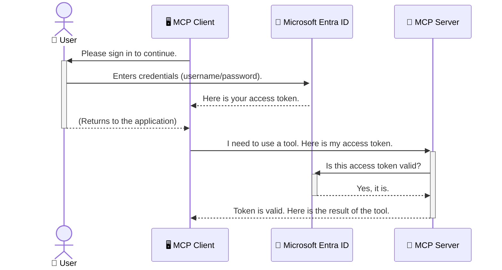

<!--
CO_OP_TRANSLATOR_METADATA:
{
  "original_hash": "6e562d7e5a77c8982da4aa8f762ad1d8",
  "translation_date": "2025-07-14T02:46:18+00:00",
  "source_file": "05-AdvancedTopics/mcp-security-entra/README.md",
  "language_code": "fr"
}
-->
# Sécuriser les flux de travail IA : Authentification Entra ID pour les serveurs Model Context Protocol

## Introduction  
Sécuriser votre serveur Model Context Protocol (MCP) est aussi important que de verrouiller la porte d’entrée de votre maison. Laisser votre serveur MCP ouvert expose vos outils et données à des accès non autorisés, ce qui peut entraîner des failles de sécurité. Microsoft Entra ID offre une solution robuste de gestion des identités et des accès basée sur le cloud, garantissant que seuls les utilisateurs et applications autorisés peuvent interagir avec votre serveur MCP. Dans cette section, vous apprendrez comment protéger vos flux de travail IA grâce à l’authentification Entra ID.

## Objectifs d’apprentissage  
À la fin de cette section, vous serez capable de :

- Comprendre l’importance de sécuriser les serveurs MCP.  
- Expliquer les bases de Microsoft Entra ID et de l’authentification OAuth 2.0.  
- Distinguer les clients publics des clients confidentiels.  
- Mettre en œuvre l’authentification Entra ID dans des scénarios de serveurs MCP locaux (client public) et distants (client confidentiel).  
- Appliquer les bonnes pratiques de sécurité lors du développement de flux de travail IA.

## Sécurité et MCP  

Tout comme vous ne laisseriez pas la porte d’entrée de votre maison déverrouillée, vous ne devriez pas laisser votre serveur MCP accessible à tout le monde. Sécuriser vos flux de travail IA est essentiel pour créer des applications robustes, fiables et sûres. Ce chapitre vous présentera l’utilisation de Microsoft Entra ID pour protéger vos serveurs MCP, en garantissant que seuls les utilisateurs et applications autorisés peuvent accéder à vos outils et données.

## Pourquoi la sécurité est-elle importante pour les serveurs MCP ?  

Imaginez que votre serveur MCP dispose d’un outil capable d’envoyer des emails ou d’accéder à une base de données clients. Un serveur non sécurisé signifie que n’importe qui pourrait potentiellement utiliser cet outil, entraînant un accès non autorisé aux données, du spam ou d’autres activités malveillantes.

En mettant en place une authentification, vous vous assurez que chaque requête adressée à votre serveur est vérifiée, confirmant l’identité de l’utilisateur ou de l’application qui fait la demande. C’est la première et la plus importante étape pour sécuriser vos flux de travail IA.

## Introduction à Microsoft Entra ID  

[**Microsoft Entra ID**](https://adoption.microsoft.com/microsoft-security/entra/) est un service cloud de gestion des identités et des accès. Pensez-y comme à un agent de sécurité universel pour vos applications. Il gère le processus complexe de vérification des identités des utilisateurs (authentification) et détermine ce qu’ils sont autorisés à faire (autorisation).

En utilisant Entra ID, vous pouvez :

- Permettre une connexion sécurisée pour les utilisateurs.  
- Protéger les API et services.  
- Gérer les politiques d’accès depuis un emplacement centralisé.

Pour les serveurs MCP, Entra ID offre une solution robuste et largement reconnue pour gérer qui peut accéder aux fonctionnalités de votre serveur.

---

## Comprendre le fonctionnement : comment marche l’authentification Entra ID  

Entra ID utilise des standards ouverts comme **OAuth 2.0** pour gérer l’authentification. Bien que les détails puissent être complexes, le concept principal est simple et peut être expliqué par une analogie.

### Une introduction simple à OAuth 2.0 : la clé de voiturier  

Imaginez OAuth 2.0 comme un service de voiturier pour votre voiture. Lorsque vous arrivez dans un restaurant, vous ne donnez pas au voiturier votre clé principale. Vous lui remettez une **clé de voiturier** avec des permissions limitées : elle peut démarrer la voiture et verrouiller les portes, mais ne peut pas ouvrir le coffre ou la boîte à gants.

Dans cette analogie :

- **Vous** êtes l’**Utilisateur**.  
- **Votre voiture** est le **serveur MCP** avec ses outils et données précieuses.  
- Le **voiturier** est **Microsoft Entra ID**.  
- L’**agent de stationnement** est le **client MCP** (l’application qui tente d’accéder au serveur).  
- La **clé de voiturier** est le **jeton d’accès**.

Le jeton d’accès est une chaîne sécurisée que le client MCP reçoit d’Entra ID après votre connexion. Le client présente ce jeton au serveur MCP à chaque requête. Le serveur peut vérifier ce jeton pour s’assurer que la requête est légitime et que le client dispose des autorisations nécessaires, sans jamais avoir à manipuler vos véritables identifiants (comme votre mot de passe).

### Le flux d’authentification  

Voici comment le processus fonctionne en pratique :



### Présentation de la Microsoft Authentication Library (MSAL)  

Avant d’entrer dans le code, il est important de présenter un composant clé que vous verrez dans les exemples : la **Microsoft Authentication Library (MSAL)**.

MSAL est une bibliothèque développée par Microsoft qui facilite grandement la gestion de l’authentification pour les développeurs. Plutôt que d’écrire tout le code complexe pour gérer les jetons de sécurité, les connexions et le rafraîchissement des sessions, MSAL s’occupe de tout cela.

Utiliser une bibliothèque comme MSAL est fortement recommandé car :

- **C’est sécurisé :** elle implémente des protocoles standards de l’industrie et les meilleures pratiques de sécurité, réduisant les risques de vulnérabilités dans votre code.  
- **Cela simplifie le développement :** elle masque la complexité des protocoles OAuth 2.0 et OpenID Connect, vous permettant d’ajouter une authentification robuste à votre application en quelques lignes de code.  
- **Elle est maintenue :** Microsoft assure la maintenance et les mises à jour de MSAL pour faire face aux nouvelles menaces de sécurité et aux évolutions des plateformes.

MSAL supporte de nombreux langages et frameworks, notamment .NET, JavaScript/TypeScript, Python, Java, Go, ainsi que les plateformes mobiles iOS et Android. Vous pouvez ainsi utiliser les mêmes modèles d’authentification sur l’ensemble de votre stack technologique.

Pour en savoir plus sur MSAL, consultez la [documentation officielle MSAL overview](https://learn.microsoft.com/entra/identity-platform/msal-overview).

---

## Sécuriser votre serveur MCP avec Entra ID : guide étape par étape  

Passons maintenant à la sécurisation d’un serveur MCP local (qui communique via `stdio`) avec Entra ID. Cet exemple utilise un **client public**, adapté aux applications qui s’exécutent sur la machine de l’utilisateur, comme une application de bureau ou un serveur de développement local.

### Scénario 1 : Sécuriser un serveur MCP local (avec un client public)  

Dans ce scénario, nous examinons un serveur MCP qui fonctionne localement, communique via `stdio` et utilise Entra ID pour authentifier l’utilisateur avant de lui permettre d’accéder à ses outils. Le serveur dispose d’un outil unique qui récupère les informations du profil utilisateur via l’API Microsoft Graph.

#### 1. Configuration de l’application dans Entra ID  

Avant d’écrire du code, vous devez enregistrer votre application dans Microsoft Entra ID. Cela informe Entra ID de votre application et lui donne la permission d’utiliser le service d’authentification.

1. Rendez-vous sur le **[portail Microsoft Entra](https://entra.microsoft.com/)**.  
2. Allez dans **App registrations** et cliquez sur **New registration**.  
3. Donnez un nom à votre application (par exemple, « My Local MCP Server »).  
4. Pour **Supported account types**, sélectionnez **Accounts in this organizational directory only**.  
5. Vous pouvez laisser le champ **Redirect URI** vide pour cet exemple.  
6. Cliquez sur **Register**.

Une fois enregistrée, notez l’**Application (client) ID** et l’**Directory (tenant) ID**. Vous en aurez besoin dans votre code.

#### 2. Le code : décryptage  

Examinons les parties clés du code qui gèrent l’authentification. Le code complet de cet exemple est disponible dans le dossier [Entra ID - Local - WAM](https://github.com/Azure-Samples/mcp-auth-servers/tree/main/src/entra-id-local-wam) du [dépôt GitHub mcp-auth-servers](https://github.com/Azure-Samples/mcp-auth-servers).

**`AuthenticationService.cs`**

Cette classe gère l’interaction avec Entra ID.

- **`CreateAsync`** : cette méthode initialise le `PublicClientApplication` de MSAL. Elle est configurée avec le `clientId` et le `tenantId` de votre application.  
- **`WithBroker`** : active l’utilisation d’un broker (comme le Windows Web Account Manager), offrant une expérience de connexion unique plus sécurisée et fluide.  
- **`AcquireTokenAsync`** : c’est la méthode principale. Elle tente d’abord d’obtenir un jeton silencieusement (l’utilisateur n’a pas besoin de se reconnecter s’il a déjà une session valide). Si aucun jeton silencieux n’est disponible, elle invite l’utilisateur à se connecter de manière interactive.

```csharp
// Simplified for clarity
public static async Task<AuthenticationService> CreateAsync(ILogger<AuthenticationService> logger)
{
    var msalClient = PublicClientApplicationBuilder
        .Create(_clientId) // Your Application (client) ID
        .WithAuthority(AadAuthorityAudience.AzureAdMyOrg)
        .WithTenantId(_tenantId) // Your Directory (tenant) ID
        .WithBroker(new BrokerOptions(BrokerOptions.OperatingSystems.Windows))
        .Build();

    // ... cache registration ...

    return new AuthenticationService(logger, msalClient);
}

public async Task<string> AcquireTokenAsync()
{
    try
    {
        // Try silent authentication first
        var accounts = await _msalClient.GetAccountsAsync();
        var account = accounts.FirstOrDefault();

        AuthenticationResult? result = null;

        if (account != null)
        {
            result = await _msalClient.AcquireTokenSilent(_scopes, account).ExecuteAsync();
        }
        else
        {
            // If no account, or silent fails, go interactive
            result = await _msalClient.AcquireTokenInteractive(_scopes).ExecuteAsync();
        }

        return result.AccessToken;
    }
    catch (Exception ex)
    {
        _logger.LogError(ex, "An error occurred while acquiring the token.");
        throw; // Optionally rethrow the exception for higher-level handling
    }
}
```

**`Program.cs`**

C’est ici que le serveur MCP est configuré et que le service d’authentification est intégré.

- **`AddSingleton<AuthenticationService>`** : enregistre le `AuthenticationService` dans le conteneur d’injection de dépendances, pour qu’il soit accessible aux autres parties de l’application (comme notre outil).  
- **Outil `GetUserDetailsFromGraph`** : cet outil nécessite une instance de `AuthenticationService`. Avant toute action, il appelle `authService.AcquireTokenAsync()` pour obtenir un jeton d’accès valide. Si l’authentification réussit, il utilise ce jeton pour interroger l’API Microsoft Graph et récupérer les détails de l’utilisateur.

```csharp
// Simplified for clarity
[McpServerTool(Name = "GetUserDetailsFromGraph")]
public static async Task<string> GetUserDetailsFromGraph(
    AuthenticationService authService)
{
    try
    {
        // This will trigger the authentication flow
        var accessToken = await authService.AcquireTokenAsync();

        // Use the token to create a GraphServiceClient
        var graphClient = new GraphServiceClient(
            new BaseBearerTokenAuthenticationProvider(new TokenProvider(authService)));

        var user = await graphClient.Me.GetAsync();

        return System.Text.Json.JsonSerializer.Serialize(user);
    }
    catch (Exception ex)
    {
        return $"Error: {ex.Message}";
    }
}
```

#### 3. Comment tout cela fonctionne ensemble  

1. Lorsque le client MCP tente d’utiliser l’outil `GetUserDetailsFromGraph`, celui-ci appelle d’abord `AcquireTokenAsync`.  
2. `AcquireTokenAsync` demande à la bibliothèque MSAL de vérifier s’il existe un jeton valide.  
3. Si aucun jeton n’est trouvé, MSAL, via le broker, invite l’utilisateur à se connecter avec son compte Entra ID.  
4. Une fois connecté, Entra ID délivre un jeton d’accès.  
5. L’outil reçoit ce jeton et l’utilise pour effectuer un appel sécurisé à l’API Microsoft Graph.  
6. Les informations de l’utilisateur sont renvoyées au client MCP.

Ce processus garantit que seuls les utilisateurs authentifiés peuvent utiliser l’outil, sécurisant ainsi efficacement votre serveur MCP local.

### Scénario 2 : Sécuriser un serveur MCP distant (avec un client confidentiel)  

Lorsque votre serveur MCP fonctionne sur une machine distante (comme un serveur cloud) et communique via un protocole comme HTTP Streaming, les exigences de sécurité sont différentes. Dans ce cas, vous devez utiliser un **client confidentiel** et le **flux d’autorisation par code** (Authorization Code Flow). Cette méthode est plus sécurisée car les secrets de l’application ne sont jamais exposés au navigateur.

Cet exemple utilise un serveur MCP en TypeScript qui s’appuie sur Express.js pour gérer les requêtes HTTP.

#### 1. Configuration de l’application dans Entra ID  

La configuration dans Entra ID est similaire à celle du client public, mais avec une différence clé : vous devez créer un **secret client**.

1. Rendez-vous sur le **[portail Microsoft Entra](https://entra.microsoft.com/)**.  
2. Dans l’enregistrement de votre application, allez dans l’onglet **Certificates & secrets**.  
3. Cliquez sur **New client secret**, donnez-lui une description, puis cliquez sur **Add**.  
4. **Important :** copiez immédiatement la valeur du secret. Vous ne pourrez plus la voir par la suite.  
5. Vous devez également configurer une **Redirect URI**. Allez dans l’onglet **Authentication**, cliquez sur **Add a platform**, sélectionnez **Web**, puis saisissez l’URI de redirection de votre application (par exemple, `http://localhost:3001/auth/callback`).

> **⚠️ Note de sécurité importante :** Pour les applications en production, Microsoft recommande vivement d’utiliser des méthodes d’authentification sans secret telles que **Managed Identity** ou **Workload Identity Federation** plutôt que des secrets clients. Les secrets clients présentent des risques de sécurité car ils peuvent être exposés ou compromis. Les identités managées offrent une approche plus sécurisée en éliminant la nécessité de stocker des identifiants dans votre code ou votre configuration.  
>  
> Pour plus d’informations sur les identités managées et leur mise en œuvre, consultez la [vue d’ensemble des identités managées pour les ressources Azure](https://learn.microsoft.com/entra/identity/managed-identities-azure-resources/overview).

#### 2. Le code : décryptage  

Cet exemple utilise une approche basée sur les sessions. Lorsque l’utilisateur s’authentifie, le serveur stocke le jeton d’accès et le jeton de rafraîchissement dans une session, et fournit à l’utilisateur un jeton de session. Ce jeton de session est ensuite utilisé pour les requêtes suivantes. Le code complet est disponible dans le dossier [Entra ID - Confidential client](https://github.com/Azure-Samples/mcp-auth-servers/tree/main/src/entra-id-cca-session) du [dépôt GitHub mcp-auth-servers](https://github.com/Azure-Samples/mcp-auth-servers).

**`Server.ts`**

Ce fichier configure le serveur Express et la couche de transport MCP.

- **`requireBearerAuth`** : middleware qui protège les points d’accès `/sse` et `/message`. Il vérifie la présence d’un jeton bearer valide dans l’en-tête `Authorization` de la requête.  
- **`EntraIdServerAuthProvider`** : classe personnalisée qui implémente l’interface `McpServerAuthorizationProvider`. Elle gère le flux OAuth 2.0.  
- **`/auth/callback`** : point d’entrée qui gère la redirection d’Entra ID après l’authentification de l’utilisateur. Il échange le code d’autorisation contre un jeton d’accès et un jeton de rafraîchissement.

```typescript
// Simplified for clarity
const app = express();
const { server } = createServer();
const provider = new EntraIdServerAuthProvider();

// Protect the SSE endpoint
app.get("/sse", requireBearerAuth({
  provider,
  requiredScopes: ["User.Read"]
}), async (req, res) => {
  // ... connect to the transport ...
});

// Protect the message endpoint
app.post("/message", requireBearerAuth({
  provider,
  requiredScopes: ["User.Read"]
}), async (req, res) => {
  // ... handle the message ...
});

// Handle the OAuth 2.0 callback
app.get("/auth/callback", (req, res) => {
  provider.handleCallback(req.query.code, req.query.state)
    .then(result => {
      // ... handle success or failure ...
    });
});
```

**`Tools.ts`**

Ce fichier définit les outils fournis par le serveur MCP. L’outil `getUserDetails` est similaire à celui de l’exemple précédent, mais il récupère le jeton d’accès depuis la session.

```typescript
// Simplified for clarity
server.setRequestHandler(CallToolRequestSchema, async (request) => {
  const { name } = request.params;
  const context = request.params?.context as { token?: string } | undefined;
  const sessionToken = context?.token;

  if (name === ToolName.GET_USER_DETAILS) {
    if (!sessionToken) {
      throw new AuthenticationError("Authentication token is missing or invalid. Ensure the token is provided in the request context.");
    }

    // Get the Entra ID token from the session store
    const tokenData = tokenStore.getToken(sessionToken);
    const entraIdToken = tokenData.accessToken;

    const graphClient = Client.init({
      authProvider: (done) => {
        done(null, entraIdToken);
      }
    });

    const user = await graphClient.api('/me').get();

    // ... return user details ...
  }
});
```

**`auth/EntraIdServerAuthProvider.ts`**

Cette classe gère la logique suivante :

- Rediriger l’utilisateur vers la page de connexion Entra ID.  
- Échanger le code d’autorisation contre un jeton d’accès.  
- Stocker les jetons dans le `tokenStore`.  
- Rafraîchir le jeton d’accès lorsqu’il expire.

#### 3. Comment tout cela fonctionne ensemble  

1. Lorsqu’un utilisateur tente de se connecter au serveur MCP, le middleware `requireBearerAuth` détecte qu’il n’a pas de session valide et le redirige vers la page de connexion Entra ID.  
2. L’utilisateur se connecte avec son compte Entra ID.  
3. Entra ID redirige l’utilisateur vers le point d’entrée `/auth/callback` avec un code d’autorisation.
4. Le serveur échange le code contre un jeton d’accès et un jeton de rafraîchissement, les stocke, puis crée un jeton de session qui est envoyé au client.  
5. Le client peut désormais utiliser ce jeton de session dans l’en-tête `Authorization` pour toutes les requêtes futures vers le serveur MCP.  
6. Lorsque l’outil `getUserDetails` est appelé, il utilise le jeton de session pour retrouver le jeton d’accès Entra ID, puis s’en sert pour appeler l’API Microsoft Graph.

Ce flux est plus complexe que celui du client public, mais il est nécessaire pour les points de terminaison accessibles depuis Internet. Puisque les serveurs MCP distants sont accessibles via Internet public, ils nécessitent des mesures de sécurité renforcées pour se protéger contre les accès non autorisés et les attaques potentielles.


## Bonnes pratiques de sécurité

- **Utilisez toujours HTTPS** : Chiffrez les communications entre le client et le serveur pour protéger les jetons contre toute interception.  
- **Mettez en place un contrôle d’accès basé sur les rôles (RBAC)** : Ne vous contentez pas de vérifier *si* un utilisateur est authentifié ; vérifiez *ce* qu’il est autorisé à faire. Vous pouvez définir des rôles dans Entra ID et les vérifier dans votre serveur MCP.  
- **Surveillez et auditez** : Enregistrez tous les événements d’authentification afin de détecter et de réagir à toute activité suspecte.  
- **Gérez la limitation de débit et le throttling** : Microsoft Graph et d’autres API appliquent des limites pour éviter les abus. Implémentez une stratégie de backoff exponentiel et de nouvelle tentative dans votre serveur MCP pour gérer élégamment les réponses HTTP 429 (Trop de requêtes). Envisagez de mettre en cache les données fréquemment consultées pour réduire les appels API.  
- **Stockage sécurisé des jetons** : Stockez les jetons d’accès et de rafraîchissement de manière sécurisée. Pour les applications locales, utilisez les mécanismes de stockage sécurisé du système. Pour les applications serveur, pensez à utiliser un stockage chiffré ou des services de gestion de clés sécurisés comme Azure Key Vault.  
- **Gestion de l’expiration des jetons** : Les jetons d’accès ont une durée de vie limitée. Implémentez le rafraîchissement automatique des jetons à l’aide des jetons de rafraîchissement pour garantir une expérience utilisateur fluide sans nécessiter une nouvelle authentification.  
- **Envisagez d’utiliser Azure API Management** : Bien que la mise en œuvre de la sécurité directement dans votre serveur MCP vous offre un contrôle précis, les passerelles API comme Azure API Management peuvent gérer automatiquement de nombreuses préoccupations de sécurité, notamment l’authentification, l’autorisation, la limitation de débit et la surveillance. Elles fournissent une couche de sécurité centralisée entre vos clients et vos serveurs MCP. Pour plus de détails sur l’utilisation des passerelles API avec MCP, consultez notre [Azure API Management Your Auth Gateway For MCP Servers](https://techcommunity.microsoft.com/blog/integrationsonazureblog/azure-api-management-your-auth-gateway-for-mcp-servers/4402690).


## Points clés à retenir

- Sécuriser votre serveur MCP est essentiel pour protéger vos données et vos outils.  
- Microsoft Entra ID offre une solution robuste et évolutive pour l’authentification et l’autorisation.  
- Utilisez un **client public** pour les applications locales et un **client confidentiel** pour les serveurs distants.  
- Le **flux du code d’autorisation** est l’option la plus sécurisée pour les applications web.


## Exercice

1. Réfléchissez à un serveur MCP que vous pourriez créer. S’agirait-il d’un serveur local ou distant ?  
2. En fonction de votre réponse, utiliseriez-vous un client public ou confidentiel ?  
3. Quelle permission votre serveur MCP demanderait-il pour effectuer des actions sur Microsoft Graph ?


## Exercices pratiques

### Exercice 1 : Enregistrer une application dans Entra ID  
Accédez au portail Microsoft Entra.  
Enregistrez une nouvelle application pour votre serveur MCP.  
Notez l’ID de l’application (client) et l’ID de l’annuaire (locataire).

### Exercice 2 : Sécuriser un serveur MCP local (client public)  
- Suivez l’exemple de code pour intégrer MSAL (Microsoft Authentication Library) pour l’authentification utilisateur.  
- Testez le flux d’authentification en appelant l’outil MCP qui récupère les détails utilisateur depuis Microsoft Graph.

### Exercice 3 : Sécuriser un serveur MCP distant (client confidentiel)  
- Enregistrez un client confidentiel dans Entra ID et créez un secret client.  
- Configurez votre serveur MCP Express.js pour utiliser le flux du code d’autorisation.  
- Testez les points de terminaison protégés et confirmez l’accès basé sur les jetons.

### Exercice 4 : Appliquer les bonnes pratiques de sécurité  
- Activez HTTPS pour votre serveur local ou distant.  
- Implémentez le contrôle d’accès basé sur les rôles (RBAC) dans la logique de votre serveur.  
- Ajoutez la gestion de l’expiration des jetons et un stockage sécurisé des jetons.

## Ressources

1. **Documentation d’ensemble MSAL**  
   Découvrez comment la Microsoft Authentication Library (MSAL) permet l’acquisition sécurisée de jetons sur différentes plateformes :  
   [MSAL Overview on Microsoft Learn](https://learn.microsoft.com/en-gb/entra/msal/overview)

2. **Dépôt GitHub Azure-Samples/mcp-auth-servers**  
   Implémentations de référence des serveurs MCP démontrant les flux d’authentification :  
   [Azure-Samples/mcp-auth-servers on GitHub](https://github.com/Azure-Samples/mcp-auth-servers)

3. **Présentation des identités gérées pour les ressources Azure**  
   Comprenez comment éliminer les secrets en utilisant des identités gérées système ou utilisateur :  
   [Managed Identities Overview on Microsoft Learn](https://learn.microsoft.com/en-us/entra/identity/managed-identities-azure-resources/)

4. **Azure API Management : votre passerelle d’authentification pour les serveurs MCP**  
   Une analyse approfondie de l’utilisation d’APIM comme passerelle OAuth2 sécurisée pour les serveurs MCP :  
   [Azure API Management Your Auth Gateway For MCP Servers](https://techcommunity.microsoft.com/blog/integrationsonazureblog/azure-api-management-your-auth-gateway-for-mcp-servers/4402690)

5. **Référence des permissions Microsoft Graph**  
   Liste complète des permissions déléguées et applicatives pour Microsoft Graph :  
   [Microsoft Graph Permissions Reference](https://learn.microsoft.com/zh-tw/graph/permissions-reference)


## Objectifs d’apprentissage  
Après avoir terminé cette section, vous serez capable de :

- Expliquer pourquoi l’authentification est cruciale pour les serveurs MCP et les workflows IA.  
- Configurer et paramétrer l’authentification Entra ID pour les scénarios de serveurs MCP locaux et distants.  
- Choisir le type de client approprié (public ou confidentiel) selon le déploiement de votre serveur.  
- Mettre en œuvre des pratiques de codage sécurisées, incluant le stockage des jetons et l’autorisation basée sur les rôles.  
- Protéger efficacement votre serveur MCP et ses outils contre les accès non autorisés.

## Et ensuite

- [5.13 Intégration du protocole Model Context (MCP) avec Azure AI Foundry](../mcp-foundry-agent-integration/README.md)

**Avertissement** :  
Ce document a été traduit à l’aide du service de traduction automatique [Co-op Translator](https://github.com/Azure/co-op-translator). Bien que nous nous efforcions d’assurer l’exactitude, veuillez noter que les traductions automatiques peuvent contenir des erreurs ou des inexactitudes. Le document original dans sa langue d’origine doit être considéré comme la source faisant foi. Pour les informations critiques, une traduction professionnelle réalisée par un humain est recommandée. Nous déclinons toute responsabilité en cas de malentendus ou de mauvaises interprétations résultant de l’utilisation de cette traduction.