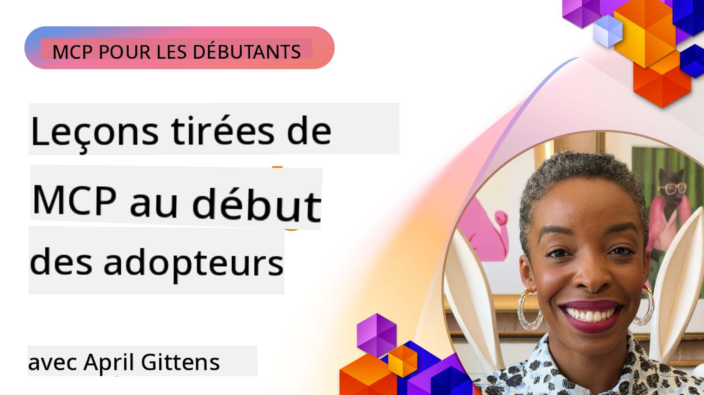

<!--
CO_OP_TRANSLATOR_METADATA:
{
  "original_hash": "41f16dac486d2086a53bc644a01cbe42",
  "translation_date": "2025-08-18T10:54:32+00:00",
  "source_file": "07-LessonsfromEarlyAdoption/README.md",
  "language_code": "fr"
}
-->
# 🌟 Leçons des premiers utilisateurs

[](https://youtu.be/jds7dSmNptE)

_(Cliquez sur l'image ci-dessus pour visionner la vidéo de cette leçon)_

## 🎯 Ce que couvre ce module

Ce module explore comment des organisations et des développeurs réels utilisent le Model Context Protocol (MCP) pour résoudre des défis concrets et stimuler l'innovation. À travers des études de cas détaillées et des projets pratiques, vous découvrirez comment MCP permet une intégration sécurisée et évolutive de l'IA, connectant des modèles de langage, des outils et des données d'entreprise.

### 📚 Voir MCP en action

Envie de voir ces principes appliqués à des outils prêts pour la production ? Consultez notre [**Guide des 10 serveurs MCP de Microsoft qui transforment la productivité des développeurs**](microsoft-mcp-servers.md), qui présente des serveurs MCP réels de Microsoft que vous pouvez utiliser dès aujourd'hui.

## Aperçu

Cette leçon explore comment les premiers utilisateurs ont exploité le Model Context Protocol (MCP) pour résoudre des défis concrets et stimuler l'innovation dans divers secteurs. À travers des études de cas détaillées et des projets pratiques, vous verrez comment MCP permet une intégration standardisée, sécurisée et évolutive de l'IA—connectant des modèles de langage, des outils et des données d'entreprise dans un cadre unifié. Vous acquerrez une expérience pratique dans la conception et la construction de solutions basées sur MCP, apprendrez des modèles d'implémentation éprouvés et découvrirez les meilleures pratiques pour déployer MCP dans des environnements de production. La leçon met également en lumière les tendances émergentes, les orientations futures et les ressources open source pour vous aider à rester à la pointe de la technologie MCP et de son écosystème en évolution.

## Objectifs d'apprentissage

- Analyser des implémentations réelles de MCP dans différents secteurs
- Concevoir et construire des applications complètes basées sur MCP
- Explorer les tendances émergentes et les orientations futures de la technologie MCP
- Appliquer les meilleures pratiques dans des scénarios de développement réels

## Implémentations réelles de MCP

### Étude de cas 1 : Automatisation du support client d'entreprise

Une multinationale a mis en œuvre une solution basée sur MCP pour standardiser les interactions IA dans ses systèmes de support client. Cela leur a permis de :

- Créer une interface unifiée pour plusieurs fournisseurs de modèles de langage (LLM)
- Maintenir une gestion cohérente des prompts entre les départements
- Mettre en œuvre des contrôles de sécurité et de conformité robustes
- Passer facilement d'un modèle d'IA à un autre en fonction des besoins spécifiques

**Implémentation technique :**

```python
# Python MCP server implementation for customer support
import logging
import asyncio
from modelcontextprotocol import create_server, ServerConfig
from modelcontextprotocol.server import MCPServer
from modelcontextprotocol.transports import create_http_transport
from modelcontextprotocol.resources import ResourceDefinition
from modelcontextprotocol.prompts import PromptDefinition
from modelcontextprotocol.tool import ToolDefinition

# Configure logging
logging.basicConfig(level=logging.INFO)

async def main():
    # Create server configuration
    config = ServerConfig(
        name="Enterprise Customer Support Server",
        version="1.0.0",
        description="MCP server for handling customer support inquiries"
    )
    
    # Initialize MCP server
    server = create_server(config)
    
    # Register knowledge base resources
    server.resources.register(
        ResourceDefinition(
            name="customer_kb",
            description="Customer knowledge base documentation"
        ),
        lambda params: get_customer_documentation(params)
    )
    
    # Register prompt templates
    server.prompts.register(
        PromptDefinition(
            name="support_template",
            description="Templates for customer support responses"
        ),
        lambda params: get_support_templates(params)
    )
    
    # Register support tools
    server.tools.register(
        ToolDefinition(
            name="ticketing",
            description="Create and update support tickets"
        ),
        handle_ticketing_operations
    )
    
    # Start server with HTTP transport
    transport = create_http_transport(port=8080)
    await server.run(transport)

if __name__ == "__main__":
    asyncio.run(main())
```

**Résultats :** Réduction de 30 % des coûts liés aux modèles, amélioration de 45 % de la cohérence des réponses et conformité renforcée à l'échelle mondiale.

### Étude de cas 2 : Assistant de diagnostic en santé

Un fournisseur de soins de santé a développé une infrastructure MCP pour intégrer plusieurs modèles d'IA spécialisés tout en garantissant la protection des données sensibles des patients :

- Commutation fluide entre modèles médicaux généralistes et spécialistes
- Contrôles stricts de confidentialité et pistes d'audit
- Intégration avec les systèmes existants de dossiers médicaux électroniques (EHR)
- Ingénierie cohérente des prompts pour la terminologie médicale

**Implémentation technique :**

```csharp
// C# MCP host application implementation in healthcare application
using Microsoft.Extensions.DependencyInjection;
using ModelContextProtocol.SDK.Client;
using ModelContextProtocol.SDK.Security;
using ModelContextProtocol.SDK.Resources;

public class DiagnosticAssistant
{
    private readonly MCPHostClient _mcpClient;
    private readonly PatientContext _patientContext;
    
    public DiagnosticAssistant(PatientContext patientContext)
    {
        _patientContext = patientContext;
        
        // Configure MCP client with healthcare-specific settings
        var clientOptions = new ClientOptions
        {
            Name = "Healthcare Diagnostic Assistant",
            Version = "1.0.0",
            Security = new SecurityOptions
            {
                Encryption = EncryptionLevel.Medical,
                AuditEnabled = true
            }
        };
        
        _mcpClient = new MCPHostClientBuilder()
            .WithOptions(clientOptions)
            .WithTransport(new HttpTransport("https://healthcare-mcp.example.org"))
            .WithAuthentication(new HIPAACompliantAuthProvider())
            .Build();
    }
    
    public async Task<DiagnosticSuggestion> GetDiagnosticAssistance(
        string symptoms, string patientHistory)
    {
        // Create request with appropriate resources and tool access
        var resourceRequest = new ResourceRequest
        {
            Name = "patient_records",
            Parameters = new Dictionary<string, object>
            {
                ["patientId"] = _patientContext.PatientId,
                ["requestingProvider"] = _patientContext.ProviderId
            }
        };
        
        // Request diagnostic assistance using appropriate prompt
        var response = await _mcpClient.SendPromptRequestAsync(
            promptName: "diagnostic_assistance",
            parameters: new Dictionary<string, object>
            {
                ["symptoms"] = symptoms,
                patientHistory = patientHistory,
                relevantGuidelines = _patientContext.GetRelevantGuidelines()
            });
            
        return DiagnosticSuggestion.FromMCPResponse(response);
    }
}
```

**Résultats :** Suggestions diagnostiques améliorées pour les médecins tout en maintenant une conformité totale avec la réglementation HIPAA et une réduction significative des interruptions entre systèmes.

### Étude de cas 3 : Analyse des risques dans les services financiers

Une institution financière a mis en œuvre MCP pour standardiser ses processus d'analyse des risques dans différents départements :

- Création d'une interface unifiée pour les modèles de risque de crédit, de détection de fraude et d'investissement
- Mise en œuvre de contrôles d'accès stricts et de versionnage des modèles
- Garantie de l'auditabilité de toutes les recommandations d'IA
- Maintien d'un formatage cohérent des données entre des systèmes divers

**Implémentation technique :**

```java
// Java MCP server for financial risk assessment
import org.mcp.server.*;
import org.mcp.security.*;

public class FinancialRiskMCPServer {
    public static void main(String[] args) {
        // Create MCP server with financial compliance features
        MCPServer server = new MCPServerBuilder()
            .withModelProviders(
                new ModelProvider("risk-assessment-primary", new AzureOpenAIProvider()),
                new ModelProvider("risk-assessment-audit", new LocalLlamaProvider())
            )
            .withPromptTemplateDirectory("./compliance/templates")
            .withAccessControls(new SOCCompliantAccessControl())
            .withDataEncryption(EncryptionStandard.FINANCIAL_GRADE)
            .withVersionControl(true)
            .withAuditLogging(new DatabaseAuditLogger())
            .build();
            
        server.addRequestValidator(new FinancialDataValidator());
        server.addResponseFilter(new PII_RedactionFilter());
        
        server.start(9000);
        
        System.out.println("Financial Risk MCP Server running on port 9000");
    }
}
```

**Résultats :** Conformité réglementaire renforcée, cycles de déploiement des modèles 40 % plus rapides et amélioration de la cohérence des évaluations des risques entre départements.

### Étude de cas 4 : Serveur MCP Microsoft Playwright pour l'automatisation des navigateurs

Microsoft a développé le [serveur MCP Playwright](https://github.com/microsoft/playwright-mcp) pour permettre une automatisation sécurisée et standardisée des navigateurs via le Model Context Protocol. Ce serveur prêt pour la production permet aux agents IA et aux modèles de langage d'interagir avec les navigateurs web de manière contrôlée, traçable et extensible—ouvrant des cas d'utilisation tels que les tests web automatisés, l'extraction de données et les flux de travail de bout en bout.

> **🎯 Outil prêt pour la production**
> 
> Cette étude de cas présente un serveur MCP réel que vous pouvez utiliser dès aujourd'hui ! Apprenez-en plus sur le serveur MCP Playwright et 9 autres serveurs MCP prêts pour la production dans notre [**Guide des serveurs MCP de Microsoft**](microsoft-mcp-servers.md#8--playwright-mcp-server).

**Caractéristiques principales :**
- Expose des capacités d'automatisation des navigateurs (navigation, remplissage de formulaires, capture d'écran, etc.) en tant qu'outils MCP
- Implémente des contrôles d'accès stricts et un sandboxing pour prévenir les actions non autorisées
- Fournit des journaux d'audit détaillés pour toutes les interactions avec le navigateur
- Prend en charge l'intégration avec Azure OpenAI et d'autres fournisseurs de modèles de langage pour l'automatisation pilotée par des agents
- Alimente les capacités de navigation web de l'agent de codage de GitHub Copilot

**Implémentation technique :**

```typescript
// TypeScript: Registering Playwright browser automation tools in an MCP server
import { createServer, ToolDefinition } from 'modelcontextprotocol';
import { launch } from 'playwright';

const server = createServer({
  name: 'Playwright MCP Server',
  version: '1.0.0',
  description: 'MCP server for browser automation using Playwright'
});

// Register a tool for navigating to a URL and capturing a screenshot
server.tools.register(
  new ToolDefinition({
    name: 'navigate_and_screenshot',
    description: 'Navigate to a URL and capture a screenshot',
    parameters: {
      url: { type: 'string', description: 'The URL to visit' }
    }
  }),
  async ({ url }) => {
    const browser = await launch();
    const page = await browser.newPage();
    await page.goto(url);
    const screenshot = await page.screenshot();
    await browser.close();
    return { screenshot };
  }
);

// Start the MCP server
server.listen(8080);
```

**Résultats :**

- Automatisation sécurisée et programmatique des navigateurs pour les agents IA et les modèles de langage
- Réduction des efforts de test manuel et amélioration de la couverture des tests pour les applications web
- Fourniture d'un cadre réutilisable et extensible pour l'intégration d'outils basés sur les navigateurs dans les environnements d'entreprise
- Alimente les capacités de navigation web de GitHub Copilot

**Références :**

- [Dépôt GitHub du serveur MCP Playwright](https://github.com/microsoft/playwright-mcp)
- [Solutions Microsoft AI et Automatisation](https://azure.microsoft.com/en-us/products/ai-services/)

### Étude de cas 5 : Azure MCP – Model Context Protocol de niveau entreprise en tant que service

Le serveur Azure MCP ([https://aka.ms/azmcp](https://aka.ms/azmcp)) est l'implémentation gérée et de niveau entreprise de Microsoft du Model Context Protocol, conçue pour fournir des capacités de serveur MCP évolutives, sécurisées et conformes en tant que service cloud. Azure MCP permet aux organisations de déployer, gérer et intégrer rapidement des serveurs MCP avec les services Azure AI, les données et la sécurité, réduisant ainsi les charges opérationnelles et accélérant l'adoption de l'IA.

> **🎯 Outil prêt pour la production**
> 
> Ceci est un serveur MCP réel que vous pouvez utiliser dès aujourd'hui ! Apprenez-en plus sur le serveur MCP Azure AI Foundry dans notre [**Guide des serveurs MCP de Microsoft**](microsoft-mcp-servers.md).

- Hébergement de serveur MCP entièrement géré avec mise à l'échelle, surveillance et sécurité intégrées
- Intégration native avec Azure OpenAI, Azure AI Search et d'autres services Azure
- Authentification et autorisation d'entreprise via Microsoft Entra ID
- Prise en charge des outils personnalisés, des modèles de prompts et des connecteurs de ressources
- Conformité aux exigences de sécurité et réglementaires des entreprises

**Implémentation technique :**

```yaml
# Example: Azure MCP server deployment configuration (YAML)
apiVersion: mcp.microsoft.com/v1
kind: McpServer
metadata:
  name: enterprise-mcp-server
spec:
  modelProviders:
    - name: azure-openai
      type: AzureOpenAI
      endpoint: https://<your-openai-resource>.openai.azure.com/
      apiKeySecret: <your-azure-keyvault-secret>
  tools:
    - name: document_search
      type: AzureAISearch
      endpoint: https://<your-search-resource>.search.windows.net/
      apiKeySecret: <your-azure-keyvault-secret>
  authentication:
    type: EntraID
    tenantId: <your-tenant-id>
  monitoring:
    enabled: true
    logAnalyticsWorkspace: <your-log-analytics-id>
```

**Résultats :**  
- Réduction du temps de mise en œuvre des projets d'IA d'entreprise grâce à une plateforme de serveur MCP prête à l'emploi et conforme
- Simplification de l'intégration des modèles de langage, des outils et des sources de données d'entreprise
- Sécurité, observabilité et efficacité opérationnelle améliorées pour les charges de travail MCP
- Amélioration de la qualité du code grâce aux meilleures pratiques du SDK Azure et aux modèles d'authentification actuels

**Références :**  
- [Documentation Azure MCP](https://aka.ms/azmcp)
- [Dépôt GitHub du serveur Azure MCP](https://github.com/Azure/azure-mcp)
- [Services Azure AI](https://azure.microsoft.com/en-us/products/ai-services/)
- [Centre MCP de Microsoft](https://mcp.azure.com)

### Étude de cas 6 : NLWeb

MCP (Model Context Protocol) est un protocole émergent permettant aux chatbots et assistants IA d'interagir avec des outils. Chaque instance NLWeb est également un serveur MCP, prenant en charge une méthode principale, ask, utilisée pour poser une question à un site web en langage naturel. La réponse renvoyée s'appuie sur schema.org, un vocabulaire largement utilisé pour décrire les données web. En termes simples, MCP est à NLWeb ce que HTTP est à HTML. NLWeb combine des protocoles, des formats Schema.org et des exemples de code pour aider les sites à créer rapidement ces points de terminaison, bénéficiant à la fois aux humains via des interfaces conversationnelles et aux machines via des interactions naturelles agent-à-agent.

Il existe deux composants distincts dans NLWeb :
- Un protocole, très simple au départ, pour interagir avec un site en langage naturel, et un format, utilisant JSON et schema.org pour la réponse renvoyée. Consultez la documentation sur l'API REST pour plus de détails.
- Une implémentation simple de (1) qui exploite le balisage existant, pour les sites pouvant être abstraits comme des listes d'éléments (produits, recettes, attractions, avis, etc.). Avec un ensemble de widgets d'interface utilisateur, les sites peuvent facilement fournir des interfaces conversationnelles à leur contenu. Consultez la documentation sur le cycle de vie d'une requête de chat pour plus de détails sur le fonctionnement.

**Références :**  
- [Documentation Azure MCP](https://aka.ms/azmcp)  
- [NLWeb](https://github.com/microsoft/NlWeb)

### Étude de cas 7 : Serveur MCP Azure AI Foundry – Intégration d'agents IA d'entreprise

Les serveurs MCP Azure AI Foundry démontrent comment MCP peut être utilisé pour orchestrer et gérer des agents IA et des flux de travail dans des environnements d'entreprise. En intégrant MCP avec Azure AI Foundry, les organisations peuvent standardiser les interactions des agents, tirer parti de la gestion des flux de travail de Foundry et garantir des déploiements sécurisés et évolutifs.

> **🎯 Outil prêt pour la production**
> 
> Ceci est un serveur MCP réel que vous pouvez utiliser dès aujourd'hui ! Apprenez-en plus sur le serveur MCP Azure AI Foundry dans notre [**Guide des serveurs MCP de Microsoft**](microsoft-mcp-servers.md#9--azure-ai-foundry-mcp-server).

**Caractéristiques principales :**
- Accès complet à l'écosystème IA d'Azure, y compris les catalogues de modèles et la gestion des déploiements
- Indexation des connaissances avec Azure AI Search pour les applications RAG
- Outils d'évaluation des performances et de la qualité des modèles IA
- Intégration avec le catalogue et les laboratoires Azure AI Foundry pour les modèles de recherche de pointe
- Capacités de gestion et d'évaluation des agents pour les scénarios de production

**Résultats :**
- Prototypage rapide et surveillance robuste des flux de travail des agents IA
- Intégration fluide avec les services Azure AI pour des scénarios avancés
- Interface unifiée pour la création, le déploiement et la surveillance des pipelines d'agents
- Sécurité, conformité et efficacité opérationnelle améliorées pour les entreprises
- Adoption accélérée de l'IA tout en maintenant le contrôle sur des processus complexes pilotés par des agents

**Références :**
- [Dépôt GitHub du serveur MCP Azure AI Foundry](https://github.com/azure-ai-foundry/mcp-foundry)
- [Intégration des agents Azure AI avec MCP (Blog Microsoft Foundry)](https://devblogs.microsoft.com/foundry/integrating-azure-ai-agents-mcp/)

### Étude de cas 8 : Foundry MCP Playground – Expérimentation et prototypage

Le Foundry MCP Playground offre un environnement prêt à l'emploi pour expérimenter avec les serveurs MCP et les intégrations Azure AI Foundry. Les développeurs peuvent rapidement prototyper, tester et évaluer des modèles IA et des flux de travail d'agents en utilisant les ressources du catalogue et des laboratoires Azure AI Foundry. Le playground simplifie la configuration, fournit des projets d'exemple et prend en charge le développement collaboratif, facilitant ainsi l'exploration des meilleures pratiques et de nouveaux scénarios avec un minimum de contraintes. Il est particulièrement utile pour les équipes cherchant à valider des idées, partager des expériences et accélérer l'apprentissage sans infrastructure complexe. En abaissant les barrières à l'entrée, le playground favorise l'innovation et les contributions communautaires dans l'écosystème MCP et Azure AI Foundry.

**Références :**

- [Dépôt GitHub du Foundry MCP Playground](https://github.com/azure-ai-foundry/foundry-mcp-playground)

### Étude de cas 9 : Serveur MCP Microsoft Learn Docs – Accès à la documentation via l'IA

Le serveur MCP Microsoft Learn Docs est un service cloud qui fournit aux assistants IA un accès en temps réel à la documentation officielle de Microsoft via le Model Context Protocol. Ce serveur prêt pour la production se connecte à l'écosystème complet de Microsoft Learn et permet une recherche sémantique dans toutes les sources officielles de Microsoft.
> **🎯 Outil prêt pour la production**
> 
> C'est un véritable serveur MCP que vous pouvez utiliser dès aujourd'hui ! Découvrez-en plus sur le serveur MCP des documents Microsoft Learn dans notre [**Guide des serveurs MCP Microsoft**](microsoft-mcp-servers.md#1--microsoft-learn-docs-mcp-server).
**Caractéristiques principales :**  
- Accès en temps réel à la documentation officielle de Microsoft, aux documents Azure et à la documentation Microsoft 365  
- Capacités de recherche sémantique avancées qui comprennent le contexte et l'intention  
- Informations toujours à jour grâce à la publication continue du contenu Microsoft Learn  
- Couverture complète des sources Microsoft Learn, documentation Azure et Microsoft 365  
- Retourne jusqu'à 10 extraits de contenu de haute qualité avec titres d'articles et URL  

**Pourquoi c'est essentiel :**  
- Résout le problème des "connaissances obsolètes de l'IA" pour les technologies Microsoft  
- Garantit que les assistants IA ont accès aux dernières fonctionnalités de .NET, C#, Azure et Microsoft 365  
- Fournit des informations fiables et officielles pour une génération de code précise  
- Indispensable pour les développeurs travaillant avec des technologies Microsoft en constante évolution  

**Résultats :**  
- Amélioration significative de la précision du code généré par l'IA pour les technologies Microsoft  
- Réduction du temps passé à rechercher de la documentation et des bonnes pratiques à jour  
- Augmentation de la productivité des développeurs grâce à une récupération de documentation contextuelle  
- Intégration fluide dans les flux de travail de développement sans quitter l'IDE  

**Références :**  
- [Microsoft Learn Docs MCP Server GitHub Repository](https://github.com/MicrosoftDocs/mcp)  
- [Microsoft Learn Documentation](https://learn.microsoft.com/)  

## Projets pratiques  

### Projet 1 : Construire un serveur MCP multi-fournisseurs  

**Objectif :** Créer un serveur MCP capable de router les requêtes vers plusieurs fournisseurs de modèles IA en fonction de critères spécifiques.  

**Exigences :**  
- Prendre en charge au moins trois fournisseurs de modèles différents (par exemple, OpenAI, Anthropic, modèles locaux)  
- Implémenter un mécanisme de routage basé sur les métadonnées des requêtes  
- Créer un système de configuration pour gérer les identifiants des fournisseurs  
- Ajouter un système de mise en cache pour optimiser les performances et les coûts  
- Construire un tableau de bord simple pour surveiller l'utilisation  

**Étapes de mise en œuvre :**  
1. Configurer l'infrastructure de base du serveur MCP  
2. Implémenter des adaptateurs pour chaque service de modèle IA  
3. Créer la logique de routage basée sur les attributs des requêtes  
4. Ajouter des mécanismes de mise en cache pour les requêtes fréquentes  
5. Développer le tableau de bord de surveillance  
6. Tester avec différents modèles de requêtes  

**Technologies :** Choisissez entre Python (.NET/Java/Python selon vos préférences), Redis pour la mise en cache, et un framework web simple pour le tableau de bord.  

### Projet 2 : Système de gestion des prompts en entreprise  

**Objectif :** Développer un système basé sur MCP pour gérer, versionner et déployer des modèles de prompts dans toute une organisation.  

**Exigences :**  
- Créer un dépôt centralisé pour les modèles de prompts  
- Implémenter des workflows de versionnement et d'approbation  
- Construire des capacités de test de modèles avec des entrées d'exemple  
- Développer des contrôles d'accès basés sur les rôles  
- Créer une API pour la récupération et le déploiement des modèles  

**Étapes de mise en œuvre :**  
1. Concevoir le schéma de base de données pour le stockage des modèles  
2. Créer l'API principale pour les opérations CRUD sur les modèles  
3. Implémenter le système de versionnement  
4. Construire le workflow d'approbation  
5. Développer le cadre de test  
6. Créer une interface web simple pour la gestion  
7. Intégrer avec un serveur MCP  

**Technologies :** Votre choix de framework backend, base de données SQL ou NoSQL, et framework frontend pour l'interface de gestion.  

### Projet 3 : Plateforme de génération de contenu basée sur MCP  

**Objectif :** Construire une plateforme de génération de contenu exploitant MCP pour fournir des résultats cohérents sur différents types de contenu.  

**Exigences :**  
- Prendre en charge plusieurs formats de contenu (articles de blog, réseaux sociaux, textes marketing)  
- Implémenter une génération basée sur des modèles avec des options de personnalisation  
- Créer un système de révision et de feedback pour le contenu  
- Suivre les métriques de performance du contenu  
- Prendre en charge le versionnement et l'itération du contenu  

**Étapes de mise en œuvre :**  
1. Configurer l'infrastructure client MCP  
2. Créer des modèles pour différents types de contenu  
3. Construire le pipeline de génération de contenu  
4. Implémenter le système de révision  
5. Développer le système de suivi des métriques  
6. Créer une interface utilisateur pour la gestion des modèles et la génération de contenu  

**Technologies :** Langage de programmation, framework web et système de base de données de votre choix.  

## Directions futures pour la technologie MCP  

### Tendances émergentes  

1. **MCP multi-modal**  
   - Extension de MCP pour standardiser les interactions avec les modèles d'images, d'audio et de vidéo  
   - Développement de capacités de raisonnement inter-modal  
   - Formats de prompts standardisés pour différentes modalités  

2. **Infrastructure MCP fédérée**  
   - Réseaux MCP distribués partageant des ressources entre organisations  
   - Protocoles standardisés pour le partage sécurisé de modèles  
   - Techniques de calcul préservant la confidentialité  

3. **Places de marché MCP**  
   - Écosystèmes pour partager et monétiser des modèles et plugins MCP  
   - Processus d'assurance qualité et de certification  
   - Intégration avec les places de marché de modèles  

4. **MCP pour l'informatique en périphérie**  
   - Adaptation des standards MCP pour les appareils en périphérie avec ressources limitées  
   - Protocoles optimisés pour les environnements à faible bande passante  
   - Implémentations MCP spécialisées pour les écosystèmes IoT  

5. **Cadres réglementaires**  
   - Développement d'extensions MCP pour la conformité réglementaire  
   - Traçabilité standardisée et interfaces explicatives  
   - Intégration avec les cadres émergents de gouvernance de l'IA  

### Solutions MCP de Microsoft  

Microsoft et Azure ont développé plusieurs dépôts open source pour aider les développeurs à implémenter MCP dans divers scénarios :  

#### Organisation Microsoft  

1. [playwright-mcp](https://github.com/microsoft/playwright-mcp) - Un serveur MCP Playwright pour l'automatisation et les tests de navigateurs  
2. [files-mcp-server](https://github.com/microsoft/files-mcp-server) - Une implémentation de serveur MCP OneDrive pour les tests locaux et les contributions communautaires  
3. [NLWeb](https://github.com/microsoft/NlWeb) - Collection de protocoles ouverts et outils associés pour établir une couche fondamentale pour le Web IA  

#### Organisation Azure-Samples  

1. [mcp](https://github.com/Azure-Samples/mcp) - Liens vers des exemples, outils et ressources pour construire et intégrer des serveurs MCP sur Azure  
2. [mcp-auth-servers](https://github.com/Azure-Samples/mcp-auth-servers) - Serveurs MCP de référence démontrant l'authentification avec la spécification actuelle du protocole MCP  
3. [remote-mcp-functions](https://github.com/Azure-Samples/remote-mcp-functions) - Page d'accueil pour les implémentations de serveurs MCP distants dans Azure Functions  
4. [remote-mcp-functions-python](https://github.com/Azure-Samples/remote-mcp-functions-python) - Modèle de démarrage rapide pour construire et déployer des serveurs MCP distants personnalisés avec Azure Functions en Python  
5. [remote-mcp-functions-dotnet](https://github.com/Azure-Samples/remote-mcp-functions-dotnet) - Modèle de démarrage rapide pour construire et déployer des serveurs MCP distants personnalisés avec Azure Functions en .NET/C#  
6. [remote-mcp-functions-typescript](https://github.com/Azure-Samples/remote-mcp-functions-typescript) - Modèle de démarrage rapide pour construire et déployer des serveurs MCP distants personnalisés avec Azure Functions en TypeScript  
7. [remote-mcp-apim-functions-python](https://github.com/Azure-Samples/remote-mcp-apim-functions-python) - Azure API Management comme passerelle IA pour les serveurs MCP distants utilisant Python  
8. [AI-Gateway](https://github.com/Azure-Samples/AI-Gateway) - Expériences APIM ❤️ IA incluant des capacités MCP, intégration avec Azure OpenAI et AI Foundry  

Ces dépôts fournissent diverses implémentations, modèles et ressources pour travailler avec le Model Context Protocol dans différents langages de programmation et services Azure. Ils couvrent une gamme de cas d'utilisation allant des implémentations de serveurs de base à l'authentification, au déploiement cloud et aux scénarios d'intégration en entreprise.  

#### Répertoire des ressources MCP  

Le [répertoire des ressources MCP](https://github.com/microsoft/mcp/tree/main/Resources) dans le dépôt officiel Microsoft MCP propose une collection de ressources, modèles de prompts et définitions d'outils pour les serveurs MCP. Ce répertoire est conçu pour aider les développeurs à démarrer rapidement avec MCP en offrant des blocs de construction réutilisables et des exemples de bonnes pratiques.  

- **Modèles de prompts :** Modèles prêts à l'emploi pour des tâches et scénarios IA courants, adaptables à vos propres implémentations de serveurs MCP.  
- **Définitions d'outils :** Exemples de schémas et métadonnées d'outils pour standardiser l'intégration et l'invocation d'outils dans différents serveurs MCP.  
- **Exemples de ressources :** Définitions de ressources pour se connecter à des sources de données, API et services externes dans le cadre MCP.  
- **Implémentations de référence :** Exemples pratiques montrant comment structurer et organiser des ressources, prompts et outils dans des projets MCP réels.  

Ces ressources accélèrent le développement, favorisent la standardisation et garantissent les meilleures pratiques lors de la création et du déploiement de solutions basées sur MCP.  

#### Répertoire des ressources MCP  

- [MCP Resources (Sample Prompts, Tools, and Resource Definitions)](https://github.com/microsoft/mcp/tree/main/Resources)  

### Opportunités de recherche  

- Techniques d'optimisation des prompts dans les cadres MCP  
- Modèles de sécurité pour les déploiements MCP multi-locataires  
- Benchmarking des performances entre différentes implémentations MCP  
- Méthodes de vérification formelle pour les serveurs MCP  

## Conclusion  

Le Model Context Protocol (MCP) façonne rapidement l'avenir de l'intégration IA standardisée, sécurisée et interopérable dans divers secteurs. À travers les études de cas et projets pratiques de cette leçon, vous avez vu comment les premiers utilisateurs, y compris Microsoft et Azure, exploitent MCP pour résoudre des défis réels, accélérer l'adoption de l'IA et garantir conformité, sécurité et évolutivité. L'approche modulaire de MCP permet aux organisations de connecter des modèles de langage, outils et données d'entreprise dans un cadre unifié et auditable. À mesure que MCP continue d'évoluer, rester engagé avec la communauté, explorer les ressources open source et appliquer les meilleures pratiques sera essentiel pour construire des solutions IA robustes et prêtes pour l'avenir.  

## Ressources supplémentaires  

- [MCP Foundry GitHub Repository](https://github.com/azure-ai-foundry/mcp-foundry)  
- [Foundry MCP Playground](https://github.com/azure-ai-foundry/foundry-mcp-playground)  
- [Integrating Azure AI Agents with MCP (Microsoft Foundry Blog)](https://devblogs.microsoft.com/foundry/integrating-azure-ai-agents-mcp/)  
- [MCP GitHub Repository (Microsoft)](https://github.com/microsoft/mcp)  
- [MCP Resources Directory (Sample Prompts, Tools, and Resource Definitions)](https://github.com/microsoft/mcp/tree/main/Resources)  
- [MCP Community & Documentation](https://modelcontextprotocol.io/introduction)  
- [Azure MCP Documentation](https://aka.ms/azmcp)  
- [Playwright MCP Server GitHub Repository](https://github.com/microsoft/playwright-mcp)  
- [Files MCP Server (OneDrive)](https://github.com/microsoft/files-mcp-server)  
- [Azure-Samples MCP](https://github.com/Azure-Samples/mcp)  
- [MCP Auth Servers (Azure-Samples)](https://github.com/Azure-Samples/mcp-auth-servers)  
- [Remote MCP Functions (Azure-Samples)](https://github.com/Azure-Samples/remote-mcp-functions)  
- [Remote MCP Functions Python (Azure-Samples)](https://github.com/Azure-Samples/remote-mcp-functions-python)  
- [Remote MCP Functions .NET (Azure-Samples)](https://github.com/Azure-Samples/remote-mcp-functions-dotnet)  
- [Remote MCP Functions TypeScript (Azure-Samples)](https://github.com/Azure-Samples/remote-mcp-functions-typescript)  
- [Remote MCP APIM Functions Python (Azure-Samples)](https://github.com/Azure-Samples/remote-mcp-apim-functions-python)  
- [AI-Gateway (Azure-Samples)](https://github.com/Azure-Samples/AI-Gateway)  
- [Microsoft AI and Automation Solutions](https://azure.microsoft.com/en-us/products/ai-services/)  

## Exercices  

1. Analysez une des études de cas et proposez une approche alternative d'implémentation.  
2. Choisissez une des idées de projet et créez une spécification technique détaillée.  
3. Recherchez un secteur non couvert dans les études de cas et décrivez comment MCP pourrait répondre à ses défis spécifiques.  
4. Explorez une des directions futures et concevez un concept pour une nouvelle extension MCP qui la soutiendrait.  

Suivant : [Microsoft MCP Server](../07-LessonsfromEarlyAdoption/microsoft-mcp-servers.md)  

**Avertissement** :  
Ce document a été traduit à l'aide du service de traduction automatique [Co-op Translator](https://github.com/Azure/co-op-translator). Bien que nous nous efforcions d'assurer l'exactitude, veuillez noter que les traductions automatisées peuvent contenir des erreurs ou des inexactitudes. Le document original dans sa langue d'origine doit être considéré comme la source faisant autorité. Pour des informations critiques, il est recommandé de faire appel à une traduction humaine professionnelle. Nous déclinons toute responsabilité en cas de malentendus ou d'interprétations erronées résultant de l'utilisation de cette traduction.