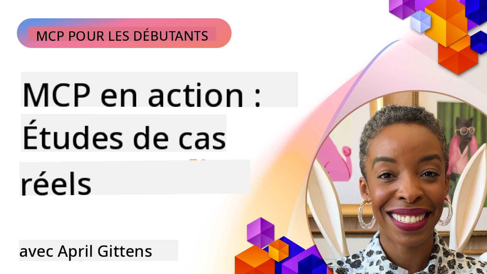

<!--
CO_OP_TRANSLATOR_METADATA:
{
  "original_hash": "1611dc5f6a2a35a789fc4c95fc5bfbe8",
  "translation_date": "2025-09-26T17:34:13+00:00",
  "source_file": "09-CaseStudy/README.md",
  "language_code": "fr"
}
-->
# MCP en action : Études de cas réelles

_(Cliquez sur l'image ci-dessus pour visionner la vidéo de cette leçon)_

Le protocole Model Context Protocol (MCP) transforme la manière dont les applications d'IA interagissent avec les données, les outils et les services. Cette section présente des études de cas réelles qui illustrent les applications pratiques du MCP dans divers scénarios d'entreprise.

## Aperçu

Cette section met en avant des exemples concrets d'implémentations du MCP, montrant comment les organisations utilisent ce protocole pour résoudre des défis complexes. En examinant ces études de cas, vous découvrirez la polyvalence, l'évolutivité et les avantages pratiques du MCP dans des situations réelles.

## Objectifs d'apprentissage clés

En explorant ces études de cas, vous allez :

- Comprendre comment le MCP peut être appliqué pour résoudre des problèmes spécifiques en entreprise
- Découvrir différents modèles d'intégration et approches architecturales
- Identifier les meilleures pratiques pour implémenter le MCP dans des environnements d'entreprise
- Obtenir des informations sur les défis et solutions rencontrés lors des implémentations réelles
- Repérer des opportunités pour appliquer des modèles similaires dans vos propres projets

## Études de cas présentées

### 1. [Agents de voyage Azure AI – Implémentation de référence](./travelagentsample.md)

Cette étude de cas examine la solution de référence complète de Microsoft qui montre comment créer une application de planification de voyage alimentée par l'IA et multi-agents en utilisant MCP, Azure OpenAI et Azure AI Search. Le projet met en avant :

- L'orchestration multi-agents via MCP
- L'intégration des données d'entreprise avec Azure AI Search
- Une architecture sécurisée et évolutive utilisant les services Azure
- Des outils extensibles avec des composants MCP réutilisables
- Une expérience utilisateur conversationnelle alimentée par Azure OpenAI

Les détails de l'architecture et de l'implémentation offrent des informations précieuses sur la création de systèmes complexes multi-agents avec MCP comme couche de coordination.

### 2. [Mise à jour des éléments Azure DevOps à partir des données YouTube](./UpdateADOItemsFromYT.md)

Cette étude de cas montre une application pratique du MCP pour automatiser les processus de workflow. Elle démontre comment les outils MCP peuvent être utilisés pour :

- Extraire des données de plateformes en ligne (YouTube)
- Mettre à jour des éléments de travail dans les systèmes Azure DevOps
- Créer des workflows d'automatisation reproductibles
- Intégrer des données entre des systèmes disparates

Cet exemple illustre comment même des implémentations MCP relativement simples peuvent offrir des gains d'efficacité significatifs en automatisant des tâches routinières et en améliorant la cohérence des données entre les systèmes.

### 3. [Récupération de documentation en temps réel avec MCP](./docs-mcp/README.md)

Cette étude de cas vous guide dans la connexion d'un client console Python à un serveur MCP pour récupérer et enregistrer en temps réel des documentations Microsoft contextuelles. Vous apprendrez à :

- Connecter un client Python à un serveur MCP en utilisant le SDK officiel MCP
- Utiliser des clients HTTP en streaming pour une récupération de données efficace en temps réel
- Appeler des outils de documentation sur le serveur et enregistrer les réponses directement dans la console
- Intégrer des documentations Microsoft à jour dans votre workflow sans quitter le terminal

Le chapitre inclut un exercice pratique, un exemple de code minimal fonctionnel et des liens vers des ressources supplémentaires pour approfondir vos connaissances. Consultez le chapitre complet pour comprendre comment le MCP peut transformer l'accès à la documentation et la productivité des développeurs dans des environnements basés sur la console.

### 4. [Application web génératrice de plans d'étude interactifs avec MCP](./docs-mcp/README.md)

Cette étude de cas montre comment créer une application web interactive en utilisant Chainlit et le protocole MCP pour générer des plans d'étude personnalisés sur n'importe quel sujet. Les utilisateurs peuvent spécifier un sujet (comme "certification AI-900") et une durée d'étude (par exemple, 8 semaines), et l'application fournira une répartition hebdomadaire des contenus recommandés. Chainlit permet une interface de chat conversationnelle, rendant l'expérience engageante et adaptative.

- Application web conversationnelle alimentée par Chainlit
- Prompts utilisateur pour le sujet et la durée
- Recommandations de contenu hebdomadaires via MCP
- Réponses adaptatives en temps réel dans une interface de chat

Le projet illustre comment l'IA conversationnelle et le MCP peuvent être combinés pour créer des outils éducatifs dynamiques et centrés sur l'utilisateur dans un environnement web moderne.

### 5. [Documentation intégrée dans l'éditeur avec le serveur MCP dans VS Code](./docs-mcp/README.md)

Cette étude de cas montre comment intégrer directement les documentations Microsoft Learn dans votre environnement VS Code en utilisant le serveur MCP—plus besoin de changer d'onglet de navigateur ! Vous découvrirez comment :

- Rechercher et lire instantanément des documentations dans VS Code via le panneau MCP ou la palette de commandes
- Référencer des documentations et insérer des liens directement dans vos fichiers README ou markdown de cours
- Utiliser GitHub Copilot et MCP ensemble pour des workflows de documentation et de code alimentés par l'IA
- Valider et améliorer vos documentations avec des retours en temps réel et une précision basée sur les sources Microsoft
- Intégrer MCP avec les workflows GitHub pour une validation continue des documentations

L'implémentation inclut :

- Un exemple de configuration `.vscode/mcp.json` pour une installation facile
- Des tutoriels basés sur des captures d'écran de l'expérience dans l'éditeur
- Des conseils pour combiner Copilot et MCP pour une productivité maximale

Ce scénario est idéal pour les auteurs de cours, les rédacteurs de documentation et les développeurs souhaitant rester concentrés dans leur éditeur tout en travaillant avec des documentations, Copilot et des outils de validation—tout cela grâce au MCP.

### 6. [Création d'un serveur MCP avec APIM](./apimsample.md)

Cette étude de cas fournit un guide étape par étape sur la création d'un serveur MCP en utilisant Azure API Management (APIM). Elle couvre :

- La configuration d'un serveur MCP dans Azure API Management
- L'exposition des opérations API en tant qu'outils MCP
- La configuration de politiques pour la limitation de débit et la sécurité
- Les tests du serveur MCP en utilisant Visual Studio Code et GitHub Copilot

Cet exemple illustre comment exploiter les capacités d'Azure pour créer un serveur MCP robuste pouvant être utilisé dans diverses applications, améliorant l'intégration des systèmes d'IA avec les API d'entreprise.

### 7. [Registre MCP GitHub — Accélérer l'intégration agentique](https://github.com/mcp)

Cette étude de cas examine comment le registre MCP de GitHub, lancé en septembre 2025, répond à un défi critique dans l'écosystème de l'IA : la découverte et le déploiement fragmentés des serveurs MCP.

#### Aperçu
Le **registre MCP** résout le problème croissant des serveurs MCP dispersés dans des dépôts et registres, ce qui rendait l'intégration lente et sujette aux erreurs. Ces serveurs permettent aux agents d'IA d'interagir avec des systèmes externes tels que des API, des bases de données et des sources de documentation.

#### Énoncé du problème
Les développeurs construisant des workflows agentiques faisaient face à plusieurs défis :
- **Faible découvrabilité** des serveurs MCP sur différentes plateformes
- **Questions de configuration redondantes** dispersées dans les forums et documentations
- **Risques de sécurité** liés à des sources non vérifiées et non fiables
- **Manque de standardisation** dans la qualité et la compatibilité des serveurs

#### Architecture de la solution
Le registre MCP de GitHub centralise les serveurs MCP de confiance avec des fonctionnalités clés :
- **Installation en un clic** via VS Code pour une configuration simplifiée
- **Tri signal-sur-bruit** par étoiles, activité et validation communautaire
- **Intégration directe** avec GitHub Copilot et autres outils compatibles MCP
- **Modèle de contribution ouvert** permettant aux partenaires communautaires et d'entreprise de contribuer

#### Impact commercial
Le registre a apporté des améliorations mesurables :
- **Onboarding plus rapide** pour les développeurs utilisant des outils comme le serveur MCP Microsoft Learn, qui diffuse directement la documentation officielle dans les agents
- **Productivité améliorée** grâce à des serveurs spécialisés comme `github-mcp-server`, permettant une automatisation GitHub en langage naturel (création de PR, relance de CI, analyse de code)
- **Confiance renforcée dans l'écosystème** grâce à des listes organisées et des standards de configuration transparents

#### Valeur stratégique
Pour les praticiens spécialisés dans la gestion du cycle de vie des agents et les workflows reproductibles, le registre MCP offre :
- **Déploiement modulaire des agents** avec des composants standardisés
- **Pipelines d'évaluation soutenus par le registre** pour des tests et validations cohérents
- **Interopérabilité inter-outils** permettant une intégration fluide entre différentes plateformes d'IA

Cette étude de cas montre que le registre MCP est bien plus qu'un simple annuaire—c'est une plateforme fondamentale pour l'intégration des modèles à grande échelle et le déploiement des systèmes agentiques.

## Conclusion

Ces sept études de cas complètes démontrent la remarquable polyvalence et les applications pratiques du protocole Model Context Protocol dans divers scénarios réels. Des systèmes complexes de planification de voyage multi-agents et de gestion des API d'entreprise aux workflows de documentation rationalisés et au registre MCP révolutionnaire de GitHub, ces exemples montrent comment le MCP offre une manière standardisée et évolutive de connecter les systèmes d'IA aux outils, données et services nécessaires pour fournir une valeur exceptionnelle.

Les études de cas couvrent plusieurs dimensions de l'implémentation du MCP :
- **Intégration en entreprise** : Gestion des API Azure et automatisation Azure DevOps
- **Orchestration multi-agents** : Planification de voyage avec des agents IA coordonnés
- **Productivité des développeurs** : Intégration VS Code et accès à la documentation en temps réel
- **Développement de l'écosystème** : Registre MCP de GitHub comme plateforme fondamentale
- **Applications éducatives** : Générateurs de plans d'étude interactifs et interfaces conversationnelles

En étudiant ces implémentations, vous obtenez des informations essentielles sur :
- **Les modèles architecturaux** adaptés à différentes échelles et cas d'utilisation
- **Les stratégies d'implémentation** équilibrant fonctionnalité et maintenabilité
- **Les considérations de sécurité et d'évolutivité** pour les déploiements en production
- **Les meilleures pratiques** pour le développement de serveurs MCP et l'intégration des clients
- **La pensée écosystémique** pour construire des solutions interconnectées alimentées par l'IA

Ces exemples montrent collectivement que le MCP n'est pas simplement un cadre théorique, mais un protocole mature et prêt pour la production permettant des solutions pratiques à des défis complexes en entreprise. Que vous construisiez des outils d'automatisation simples ou des systèmes multi-agents sophistiqués, les modèles et approches illustrés ici offrent une base solide pour vos propres projets MCP.

## Ressources supplémentaires

- [Azure AI Travel Agents GitHub Repository](https://github.com/Azure-Samples/azure-ai-travel-agents)
- [Azure DevOps MCP Tool](https://github.com/microsoft/azure-devops-mcp)
- [Playwright MCP Tool](https://github.com/microsoft/playwright-mcp)
- [Microsoft Docs MCP Server](https://github.com/MicrosoftDocs/mcp)
- [GitHub MCP Registry — Accélérer l'intégration agentique](https://github.com/mcp)
- [Exemples communautaires MCP](https://github.com/microsoft/mcp)

Suivant : Atelier pratique [Rationaliser les workflows IA : Construire un serveur MCP avec AI Toolkit](../10-StreamliningAIWorkflowsBuildingAnMCPServerWithAIToolkit/README.md)

---

