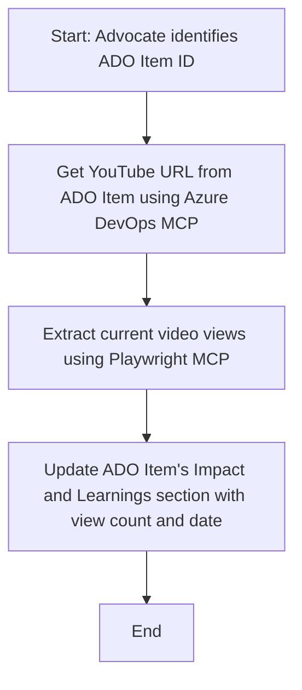

<!--
CO_OP_TRANSLATOR_METADATA:
{
  "original_hash": "14a2dfbea55ef735660a06bd6bdfe5f3",
  "translation_date": "2025-06-13T21:30:22+00:00",
  "source_file": "09-CaseStudy/UpdateADOItemsFromYT.md",
  "language_code": "fr"
}
-->
# Étude de cas : Mise à jour des éléments Azure DevOps à partir des données YouTube avec MCP

> **Disclaimer :** Il existe des outils et rapports en ligne qui peuvent automatiser la mise à jour des éléments Azure DevOps avec des données provenant de plateformes comme YouTube. Le scénario suivant est fourni uniquement comme exemple pour illustrer comment les outils MCP peuvent être utilisés pour des tâches d'automatisation et d'intégration.

## Aperçu

Cette étude de cas montre un exemple d’utilisation du Model Context Protocol (MCP) et de ses outils pour automatiser la mise à jour des éléments de travail Azure DevOps (ADO) avec des informations issues de plateformes en ligne, telles que YouTube. Le scénario décrit n’est qu’une illustration des capacités plus larges de ces outils, qui peuvent être adaptés à de nombreux besoins similaires d’automatisation.

Dans cet exemple, un Advocate suit des sessions en ligne à l’aide d’éléments ADO, chaque élément contenant une URL de vidéo YouTube. En exploitant les outils MCP, l’Advocate peut maintenir les éléments ADO à jour avec les dernières métriques vidéo, comme le nombre de vues, de manière répétable et automatisée. Cette approche peut être généralisée à d’autres cas où des informations provenant de sources en ligne doivent être intégrées dans ADO ou d’autres systèmes.

## Scénario

Un Advocate est chargé de suivre l’impact des sessions en ligne et des engagements communautaires. Chaque session est enregistrée comme un élément de travail ADO dans le projet 'DevRel', et l’élément de travail contient un champ pour l’URL de la vidéo YouTube. Pour rendre compte précisément de la portée de la session, l’Advocate doit mettre à jour l’élément ADO avec le nombre actuel de vues de la vidéo et la date de récupération de cette information.

## Outils utilisés

- [Azure DevOps MCP](https://github.com/microsoft/azure-devops-mcp) : Permet un accès programmatique et la mise à jour des éléments ADO via MCP.
- [Playwright MCP](https://github.com/microsoft/playwright-mcp) : Automatise les actions du navigateur pour extraire des données en temps réel depuis des pages web, comme les statistiques des vidéos YouTube.

## Flux de travail étape par étape

1. **Identifier l’élément ADO** : Commencer avec l’ID de l’élément de travail ADO (par exemple, 1234) dans le projet 'DevRel'.
2. **Récupérer l’URL YouTube** : Utiliser l’outil Azure DevOps MCP pour obtenir l’URL YouTube depuis l’élément de travail.
3. **Extraire le nombre de vues** : Utiliser l’outil Playwright MCP pour naviguer vers l’URL YouTube et extraire le nombre actuel de vues.
4. **Mettre à jour l’élément ADO** : Écrire le nombre de vues le plus récent ainsi que la date de récupération dans la section 'Impact and Learnings' de l’élément de travail ADO en utilisant l’outil Azure DevOps MCP.

## Exemple de prompt

```bash
- Work with the ADO Item ID: 1234
- The project is '2025-Awesome'
- Get the YouTube URL for the ADO item
- Use Playwright to get the current views from the YouTube video
- Update the ADO item with the current video views and the updated date of the information
```

## Diagramme Mermaid



## Implémentation technique

- **Orchestration MCP** : Le flux de travail est orchestré par un serveur MCP, qui coordonne l’utilisation des outils Azure DevOps MCP et Playwright MCP.
- **Automatisation** : Le processus peut être déclenché manuellement ou programmé pour s’exécuter à intervalles réguliers afin de maintenir les éléments ADO à jour.
- **Extensibilité** : Le même schéma peut être étendu pour mettre à jour les éléments ADO avec d’autres métriques en ligne (par exemple, likes, commentaires) ou provenant d’autres plateformes.

## Résultats et impact

- **Efficacité** : Réduit le travail manuel des Advocates en automatisant la récupération et la mise à jour des métriques vidéo.
- **Précision** : Garantit que les éléments ADO reflètent les données les plus récentes disponibles depuis les sources en ligne.
- **Reproductibilité** : Offre un flux de travail réutilisable pour des scénarios similaires impliquant d’autres sources de données ou métriques.

## Références

- [Azure DevOps MCP](https://github.com/microsoft/azure-devops-mcp)
- [Playwright MCP](https://github.com/microsoft/playwright-mcp)
- [Model Context Protocol (MCP)](https://modelcontextprotocol.io/)

**Avertissement** :  
Ce document a été traduit à l’aide du service de traduction automatique [Co-op Translator](https://github.com/Azure/co-op-translator). Bien que nous nous efforcions d’assurer l’exactitude, veuillez noter que les traductions automatiques peuvent contenir des erreurs ou des inexactitudes. Le document original dans sa langue d’origine doit être considéré comme la source faisant foi. Pour les informations critiques, une traduction professionnelle humaine est recommandée. Nous déclinons toute responsabilité en cas de malentendus ou d’interprétations erronées résultant de l’utilisation de cette traduction.