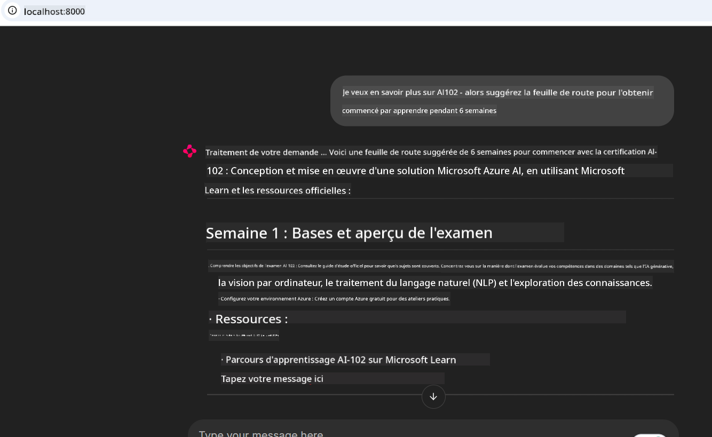
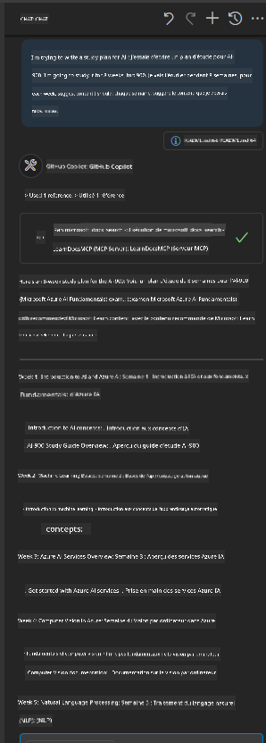

<!--
CO_OP_TRANSLATOR_METADATA:
{
  "original_hash": "4319d291c9d124ecafea52b3d04bfa0e",
  "translation_date": "2025-07-14T06:17:08+00:00",
  "source_file": "09-CaseStudy/docs-mcp/README.md",
  "language_code": "fr"
}
-->
# Étude de cas : Connexion au serveur Microsoft Learn Docs MCP depuis un client

Vous êtes-vous déjà retrouvé à jongler entre des sites de documentation, Stack Overflow et une multitude d’onglets de moteur de recherche, tout en essayant de résoudre un problème dans votre code ? Peut-être que vous gardez un second écran dédié à la documentation, ou que vous passez sans cesse d’un alt-tab entre votre IDE et un navigateur. Ne serait-il pas plus simple d’intégrer la documentation directement dans votre flux de travail — intégrée à vos applications, votre IDE, ou même vos propres outils personnalisés ? Dans cette étude de cas, nous allons explorer comment faire exactement cela en se connectant directement au serveur Microsoft Learn Docs MCP depuis votre propre application cliente.

## Vue d’ensemble

Le développement moderne ne se limite pas à écrire du code — il s’agit de trouver la bonne information au bon moment. La documentation est partout, mais rarement là où vous en avez le plus besoin : à l’intérieur de vos outils et de vos flux de travail. En intégrant la récupération de documentation directement dans vos applications, vous pouvez gagner du temps, réduire les changements de contexte et augmenter votre productivité. Dans cette section, nous vous montrerons comment connecter un client au serveur Microsoft Learn Docs MCP, afin que vous puissiez accéder à une documentation en temps réel et contextuelle sans jamais quitter votre application.

Nous vous guiderons à travers le processus d’établissement de la connexion, l’envoi d’une requête, et la gestion efficace des réponses en streaming. Cette approche simplifie non seulement votre flux de travail, mais ouvre aussi la voie à la création d’outils développeurs plus intelligents et utiles.

## Objectifs d’apprentissage

Pourquoi faisons-nous cela ? Parce que les meilleures expériences développeurs sont celles qui suppriment les frictions. Imaginez un monde où votre éditeur de code, chatbot ou application web peut répondre instantanément à vos questions de documentation, en utilisant le contenu le plus récent de Microsoft Learn. À la fin de ce chapitre, vous saurez comment :

- Comprendre les bases de la communication serveur-client MCP pour la documentation
- Implémenter une application console ou web pour se connecter au serveur Microsoft Learn Docs MCP
- Utiliser des clients HTTP en streaming pour récupérer la documentation en temps réel
- Journaliser et interpréter les réponses de documentation dans votre application

Vous verrez comment ces compétences peuvent vous aider à créer des outils qui ne sont pas seulement réactifs, mais véritablement interactifs et contextuels.

## Scénario 1 - Récupération de documentation en temps réel avec MCP

Dans ce scénario, nous vous montrerons comment connecter un client au serveur Microsoft Learn Docs MCP, afin que vous puissiez accéder à une documentation en temps réel et contextuelle sans jamais quitter votre application.

Passons à la pratique. Votre tâche est d’écrire une application qui se connecte au serveur Microsoft Learn Docs MCP, invoque l’outil `microsoft_docs_search`, et affiche la réponse en streaming dans la console.

### Pourquoi cette approche ?  
Parce que c’est la base pour construire des intégrations plus avancées — que vous souhaitiez alimenter un chatbot, une extension IDE, ou un tableau de bord web.

Vous trouverez le code et les instructions pour ce scénario dans le dossier [`solution`](./solution/README.md) de cette étude de cas. Les étapes vous guideront pour configurer la connexion :  
- Utiliser le SDK MCP officiel et un client HTTP capable de streaming pour la connexion  
- Appeler l’outil `microsoft_docs_search` avec un paramètre de requête pour récupérer la documentation  
- Implémenter une journalisation et une gestion des erreurs appropriées  
- Créer une interface console interactive permettant aux utilisateurs d’entrer plusieurs requêtes de recherche  

Ce scénario montre comment :  
- Se connecter au serveur Docs MCP  
- Envoyer une requête  
- Analyser et afficher les résultats  

Voici à quoi pourrait ressembler l’exécution de la solution :

```
Prompt> What is Azure Key Vault?
Answer> Azure Key Vault is a cloud service for securely storing and accessing secrets. ...
```

Ci-dessous un exemple minimal. Le code complet et les détails sont disponibles dans le dossier solution.

<details>
<summary>Python</summary>

```python
import asyncio
from mcp.client.streamable_http import streamablehttp_client
from mcp import ClientSession

async def main():
    async with streamablehttp_client("https://learn.microsoft.com/api/mcp") as (read_stream, write_stream, _):
        async with ClientSession(read_stream, write_stream) as session:
            await session.initialize()
            result = await session.call_tool("microsoft_docs_search", {"query": "Azure Functions best practices"})
            print(result.content)

if __name__ == "__main__":
    asyncio.run(main())
```

- Pour l’implémentation complète et la journalisation, consultez [`scenario1.py`](../../../../09-CaseStudy/docs-mcp/solution/python/scenario1.py).  
- Pour les instructions d’installation et d’utilisation, consultez le fichier [`README.md`](./solution/python/README.md) dans le même dossier.  
</details>

## Scénario 2 - Générateur de plan d’étude interactif en web app avec MCP

Dans ce scénario, vous apprendrez à intégrer Docs MCP dans un projet de développement web. L’objectif est de permettre aux utilisateurs de rechercher la documentation Microsoft Learn directement depuis une interface web, rendant la documentation instantanément accessible dans votre application ou site.

Vous verrez comment :  
- Configurer une application web  
- Se connecter au serveur Docs MCP  
- Gérer les entrées utilisateur et afficher les résultats  

Voici à quoi pourrait ressembler l’exécution de la solution :

```
User> I want to learn about AI102 - so suggest the roadmap to get it started from learn for 6 weeks

Assistant> Here’s a detailed 6-week roadmap to start your preparation for the AI-102: Designing and Implementing a Microsoft Azure AI Solution certification, using official Microsoft resources and focusing on exam skills areas:

---
## Week 1: Introduction & Fundamentals
- **Understand the Exam**: Review the [AI-102 exam skills outline](https://learn.microsoft.com/en-us/credentials/certifications/exams/ai-102/).
- **Set up Azure**: Sign up for a free Azure account if you don't have one.
- **Learning Path**: [Introduction to Azure AI services](https://learn.microsoft.com/en-us/training/modules/intro-to-azure-ai/)
- **Focus**: Get familiar with Azure portal, AI capabilities, and necessary tools.

....more weeks of the roadmap...

Let me know if you want module-specific recommendations or need more customized weekly tasks!
```

Ci-dessous un exemple minimal. Le code complet et les détails sont disponibles dans le dossier solution.



<details>
<summary>Python (Chainlit)</summary>

Chainlit est un framework pour créer des applications web d’IA conversationnelle. Il facilite la création de chatbots interactifs et d’assistants capables d’appeler les outils MCP et d’afficher les résultats en temps réel. Idéal pour le prototypage rapide et les interfaces conviviales.

```python
import chainlit as cl
import requests

MCP_URL = "https://learn.microsoft.com/api/mcp"

@cl.on_message
def handle_message(message):
    query = {"question": message}
    response = requests.post(MCP_URL, json=query)
    if response.ok:
        result = response.json()
        cl.Message(content=result.get("answer", "No answer found.")).send()
    else:
        cl.Message(content="Error: " + response.text).send()
```

- Pour l’implémentation complète, consultez [`scenario2.py`](../../../../09-CaseStudy/docs-mcp/solution/python/scenario2.py).  
- Pour les instructions d’installation et d’exécution, consultez le [`README.md`](./solution/python/README.md).  
</details>

## Scénario 3 : Documentation intégrée dans l’éditeur avec le serveur MCP dans VS Code

Si vous souhaitez avoir Microsoft Learn Docs directement dans VS Code (au lieu de changer d’onglet dans le navigateur), vous pouvez utiliser le serveur MCP dans votre éditeur. Cela vous permet de :  
- Rechercher et lire la documentation dans VS Code sans quitter votre environnement de développement.  
- Référencer la documentation et insérer des liens directement dans vos fichiers README ou de cours.  
- Combiner GitHub Copilot et MCP pour un flux de travail documentaire fluide et assisté par IA.

**Vous apprendrez à :**  
- Ajouter un fichier `.vscode/mcp.json` valide à la racine de votre espace de travail (voir exemple ci-dessous).  
- Ouvrir le panneau MCP ou utiliser la palette de commandes dans VS Code pour rechercher et insérer la documentation.  
- Référencer la documentation directement dans vos fichiers markdown pendant que vous travaillez.  
- Combiner ce flux avec GitHub Copilot pour une productivité encore accrue.

Voici un exemple de configuration du serveur MCP dans VS Code :

```json
{
  "servers": {
    "LearnDocsMCP": {
      "url": "https://learn.microsoft.com/api/mcp"
    }
  }
}
```

</details>

> Pour un guide détaillé avec captures d’écran et étapes, consultez [`README.md`](./solution/scenario3/README.md).



Cette approche est idéale pour tous ceux qui créent des cours techniques, rédigent de la documentation ou développent du code avec des besoins fréquents de référence.

## Points clés à retenir

Intégrer la documentation directement dans vos outils n’est pas qu’une simple commodité — c’est un véritable atout pour la productivité. En vous connectant au serveur Microsoft Learn Docs MCP depuis votre client, vous pouvez :

- Éliminer les changements de contexte entre votre code et la documentation  
- Récupérer une documentation à jour et contextuelle en temps réel  
- Construire des outils développeurs plus intelligents et interactifs  

Ces compétences vous aideront à créer des solutions non seulement efficaces, mais aussi agréables à utiliser.

## Ressources supplémentaires

Pour approfondir vos connaissances, explorez ces ressources officielles :

- [Microsoft Learn Docs MCP Server (GitHub)](https://github.com/MicrosoftDocs/mcp)  
- [Démarrer avec Azure MCP Server (mcp-python)](https://learn.microsoft.com/en-us/azure/developer/azure-mcp-server/get-started#create-the-python-app)  
- [Qu’est-ce que Azure MCP Server ?](https://learn.microsoft.com/en-us/azure/developer/azure-mcp-server/)  
- [Introduction au Model Context Protocol (MCP)](https://modelcontextprotocol.io/introduction)  
- [Ajouter des plugins depuis un serveur MCP (Python)](https://learn.microsoft.com/en-us/semantic-kernel/concepts/plugins/adding-mcp-plugins)

**Avertissement** :  
Ce document a été traduit à l’aide du service de traduction automatique [Co-op Translator](https://github.com/Azure/co-op-translator). Bien que nous nous efforcions d’assurer l’exactitude, veuillez noter que les traductions automatiques peuvent contenir des erreurs ou des inexactitudes. Le document original dans sa langue d’origine doit être considéré comme la source faisant foi. Pour les informations critiques, une traduction professionnelle réalisée par un humain est recommandée. Nous déclinons toute responsabilité en cas de malentendus ou de mauvaises interprétations résultant de l’utilisation de cette traduction.