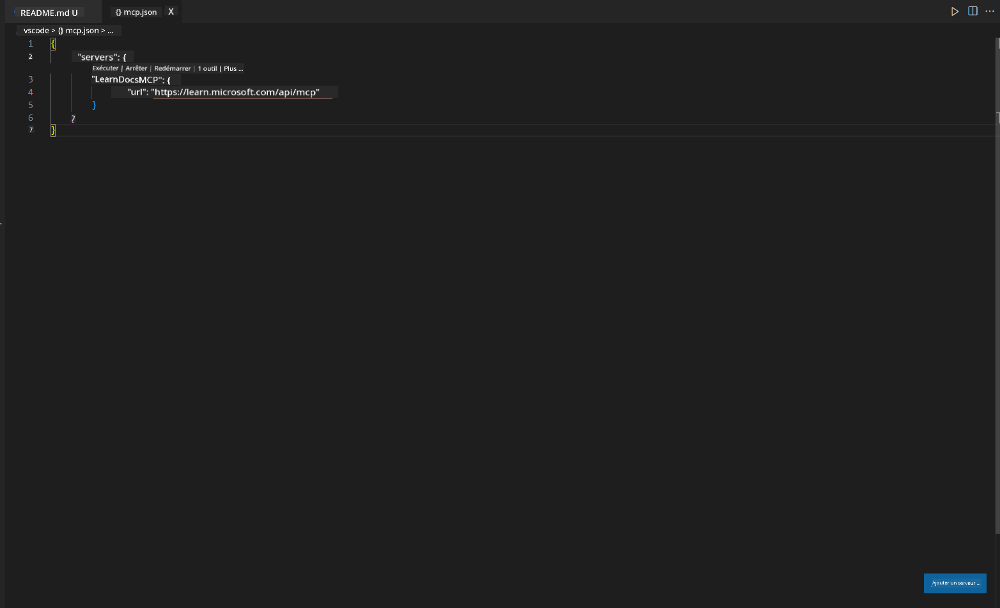
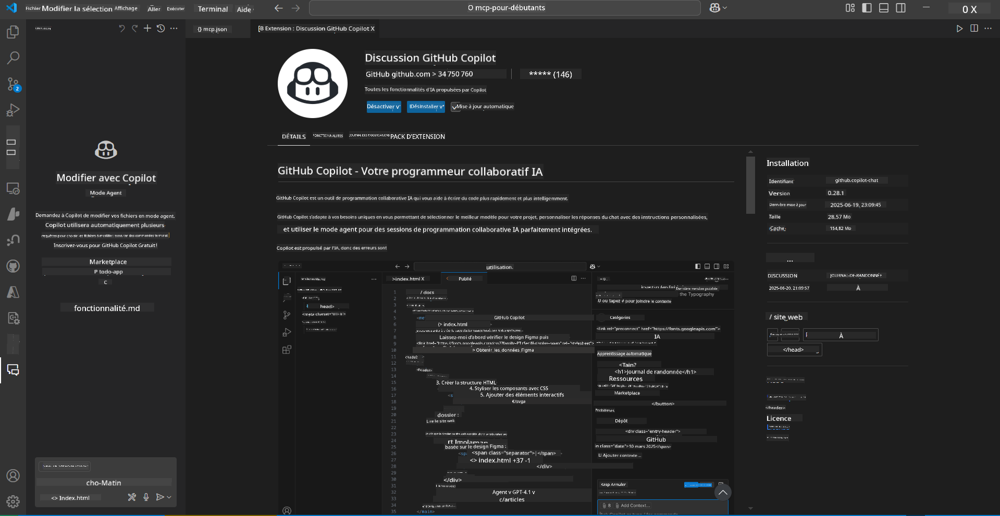
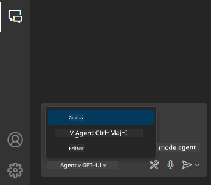
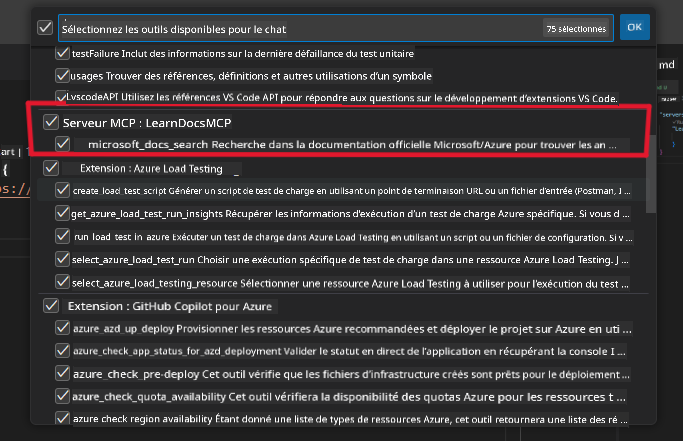
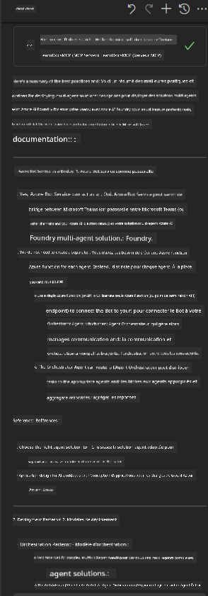

<!--
CO_OP_TRANSLATOR_METADATA:
{
  "original_hash": "db532b1ec386c9ce38c791653dc3c881",
  "translation_date": "2025-07-14T06:45:52+00:00",
  "source_file": "09-CaseStudy/docs-mcp/solution/scenario3/README.md",
  "language_code": "fr"
}
-->
# Scénario 3 : Documentation intégrée avec le serveur MCP dans VS Code

## Vue d'ensemble

Dans ce scénario, vous apprendrez comment intégrer directement les Microsoft Learn Docs dans votre environnement Visual Studio Code grâce au serveur MCP. Plutôt que de passer sans cesse d’un onglet de navigateur à un autre pour chercher de la documentation, vous pourrez accéder, rechercher et consulter les docs officielles directement dans votre éditeur. Cette méthode simplifie votre flux de travail, vous aide à rester concentré et permet une intégration fluide avec des outils comme GitHub Copilot.

- Recherchez et lisez la documentation dans VS Code sans quitter votre environnement de développement.
- Référencez la documentation et insérez des liens directement dans vos fichiers README ou de cours.
- Utilisez GitHub Copilot et MCP ensemble pour un flux de travail documentaire fluide et assisté par IA.

## Objectifs d’apprentissage

À la fin de ce chapitre, vous saurez comment configurer et utiliser le serveur MCP dans VS Code pour améliorer votre documentation et votre flux de développement. Vous serez capable de :

- Configurer votre espace de travail pour utiliser le serveur MCP lors de recherches documentaires.
- Rechercher et insérer de la documentation directement depuis VS Code.
- Combiner la puissance de GitHub Copilot et MCP pour un flux de travail plus productif et enrichi par l’IA.

Ces compétences vous aideront à rester concentré, à améliorer la qualité de votre documentation et à augmenter votre productivité en tant que développeur ou rédacteur technique.

## Solution

Pour accéder à la documentation directement dans l’éditeur, vous suivrez une série d’étapes qui intègrent le serveur MCP avec VS Code et GitHub Copilot. Cette solution est idéale pour les auteurs de cours, les rédacteurs techniques et les développeurs souhaitant rester concentrés dans l’éditeur tout en travaillant avec la documentation et Copilot.

- Ajoutez rapidement des liens de référence dans un README lors de la rédaction d’un cours ou d’une documentation de projet.
- Utilisez Copilot pour générer du code et MCP pour trouver et citer instantanément la documentation pertinente.
- Restez concentré dans votre éditeur et gagnez en productivité.

### Guide étape par étape

Pour commencer, suivez ces étapes. Pour chacune, vous pouvez ajouter une capture d’écran depuis le dossier assets pour illustrer visuellement le processus.

1. **Ajoutez la configuration MCP :**  
   À la racine de votre projet, créez un fichier `.vscode/mcp.json` et ajoutez la configuration suivante :  
   ```json
   {
     "servers": {
       "LearnDocsMCP": {
         "url": "https://learn.microsoft.com/api/mcp"
       }
     }
   }
   ```  
   Cette configuration indique à VS Code comment se connecter au [`Microsoft Learn Docs MCP server`](https://github.com/MicrosoftDocs/mcp).
   
   
    
2. **Ouvrez le panneau GitHub Copilot Chat :**  
   Si vous n’avez pas encore installé l’extension GitHub Copilot, rendez-vous dans la vue Extensions de VS Code et installez-la. Vous pouvez la télécharger directement depuis le [Visual Studio Code Marketplace](https://marketplace.visualstudio.com/items?itemName=GitHub.copilot-chat). Ensuite, ouvrez le panneau Copilot Chat depuis la barre latérale.

   

3. **Activez le mode agent et vérifiez les outils :**  
   Dans le panneau Copilot Chat, activez le mode agent.

   

   Après activation, vérifiez que le serveur MCP figure parmi les outils disponibles. Cela garantit que l’agent Copilot peut accéder au serveur de documentation pour récupérer les informations pertinentes.
   
   

4. **Démarrez une nouvelle conversation et interrogez l’agent :**  
   Ouvrez une nouvelle discussion dans le panneau Copilot Chat. Vous pouvez maintenant poser vos questions de documentation à l’agent. Celui-ci utilisera le serveur MCP pour récupérer et afficher directement dans votre éditeur la documentation Microsoft Learn pertinente.

   - *« J’essaie de rédiger un plan d’étude pour le sujet X. Je vais l’étudier pendant 8 semaines, pour chaque semaine, suggère-moi le contenu à suivre. »*

   

5. **Requête en direct :**

   > Prenons une requête en direct depuis la section [#get-help](https://discord.gg/D6cRhjHWSC) du Discord Azure AI Foundry ([voir le message original](https://discord.com/channels/1113626258182504448/1385498306720829572)) :  
   
   *« Je cherche des réponses sur la manière de déployer une solution multi-agent avec des agents IA développés sur Azure AI Foundry. Je constate qu’il n’existe pas de méthode de déploiement directe, comme les canaux Copilot Studio. Quelles sont donc les différentes façons de réaliser ce déploiement pour que les utilisateurs en entreprise puissent interagir et accomplir leur tâche ?  
   Il y a de nombreux articles/blogs qui suggèrent d’utiliser Azure Bot Service comme pont entre MS Teams et les agents Azure AI Foundry. Est-ce que cela fonctionnerait si je configure un bot Azure qui se connecte à l’agent Orchestrator sur Azure AI Foundry via une fonction Azure pour gérer l’orchestration, ou dois-je créer une fonction Azure pour chaque agent IA de la solution multi-agent afin d’orchestrer via le Bot Framework ? Toute autre suggestion est la bienvenue. »*

   

   L’agent répondra avec des liens et des résumés de documentation pertinents, que vous pourrez insérer directement dans vos fichiers markdown ou utiliser comme références dans votre code.

### Exemples de requêtes

Voici quelques exemples de requêtes à tester. Elles montrent comment le serveur MCP et Copilot peuvent collaborer pour fournir instantanément une documentation contextuelle et des références sans quitter VS Code :

- « Montre-moi comment utiliser les triggers Azure Functions. »
- « Insère un lien vers la documentation officielle d’Azure Key Vault. »
- « Quelles sont les bonnes pratiques pour sécuriser les ressources Azure ? »
- « Trouve un guide de démarrage rapide pour les services Azure AI. »

Ces requêtes démontrent comment le serveur MCP et Copilot peuvent travailler ensemble pour offrir une documentation instantanée et adaptée au contexte, sans quitter VS Code.

---

**Avertissement** :  
Ce document a été traduit à l’aide du service de traduction automatique [Co-op Translator](https://github.com/Azure/co-op-translator). Bien que nous nous efforçons d’assurer l’exactitude, veuillez noter que les traductions automatiques peuvent contenir des erreurs ou des inexactitudes. Le document original dans sa langue d’origine doit être considéré comme la source faisant foi. Pour les informations critiques, une traduction professionnelle réalisée par un humain est recommandée. Nous déclinons toute responsabilité en cas de malentendus ou de mauvaises interprétations résultant de l’utilisation de cette traduction.