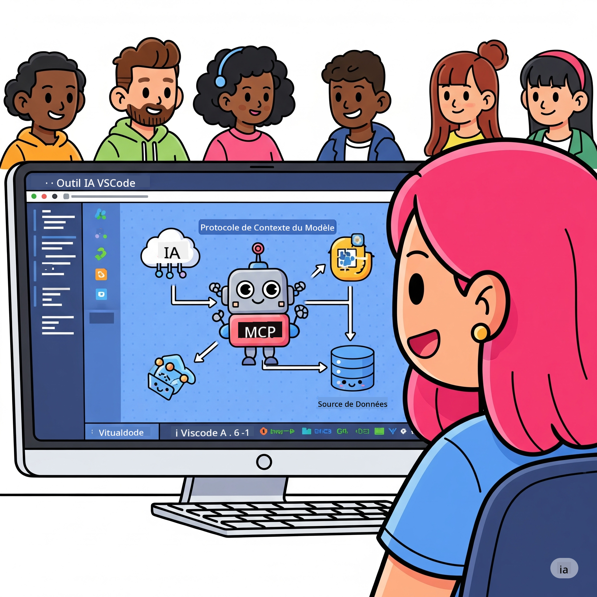
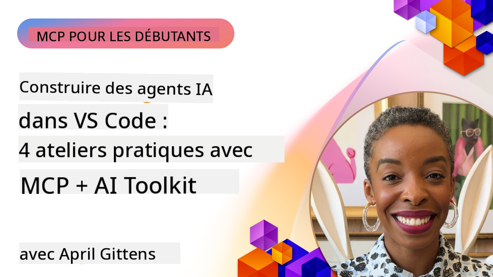

<!--
CO_OP_TRANSLATOR_METADATA:
{
  "original_hash": "1b000fd6e1b04c047578bfc5d07d54eb",
  "translation_date": "2025-07-29T00:03:28+00:00",
  "source_file": "10-StreamliningAIWorkflowsBuildingAnMCPServerWithAIToolkit/README.md",
  "language_code": "fr"
}
-->
# Rationalisation des flux de travail IA : Construire un serveur MCP avec AI Toolkit

  
  

## 🎯 Vue d'ensemble

_(Cliquez sur l'image ci-dessus pour visionner la vidéo de cette leçon)_

Bienvenue à l'atelier **Model Context Protocol (MCP)** ! Cet atelier pratique complet combine deux technologies de pointe pour révolutionner le développement d'applications IA :

- **🔗 Model Context Protocol (MCP)** : Une norme ouverte pour une intégration fluide des outils IA  
- **🛠️ AI Toolkit pour Visual Studio Code (AITK)** : L'extension puissante de Microsoft pour le développement IA  

### 🎓 Ce que vous apprendrez

À la fin de cet atelier, vous maîtriserez l'art de créer des applications intelligentes qui relient les modèles IA à des outils et services du monde réel. Des tests automatisés aux intégrations API personnalisées, vous acquerrez des compétences pratiques pour résoudre des défis complexes en entreprise.

## 🏗️ Pile technologique

### 🔌 Model Context Protocol (MCP)

MCP est le **"USB-C pour l'IA"** - une norme universelle qui connecte les modèles IA à des outils et sources de données externes.

**✨ Principales caractéristiques :**

- 🔄 **Intégration standardisée** : Interface universelle pour les connexions IA-outils  
- 🏛️ **Architecture flexible** : Serveurs locaux et distants via transport stdio/SSE  
- 🧰 **Écosystème riche** : Outils, invites et ressources dans un seul protocole  
- 🔒 **Prêt pour l'entreprise** : Sécurité et fiabilité intégrées  

**🎯 Pourquoi MCP est important :**  
Tout comme l'USB-C a éliminé le chaos des câbles, MCP élimine la complexité des intégrations IA. Un protocole, des possibilités infinies.

### 🤖 AI Toolkit pour Visual Studio Code (AITK)

L'extension phare de Microsoft pour le développement IA qui transforme VS Code en une plateforme puissante pour l'IA.

**🚀 Capacités principales :**

- 📦 **Catalogue de modèles** : Accès aux modèles d'Azure AI, GitHub, Hugging Face, Ollama  
- ⚡ **Inférence locale** : Exécution optimisée ONNX sur CPU/GPU/NPU  
- 🏗️ **Agent Builder** : Développement visuel d'agents IA avec intégration MCP  
- 🎭 **Multi-modal** : Prise en charge des textes, images et sorties structurées  

**💡 Avantages pour les développeurs :**

- Déploiement de modèles sans configuration  
- Ingénierie d'invites visuelle  
- Terrain de test en temps réel  
- Intégration fluide des serveurs MCP  

## 📚 Parcours d'apprentissage

### [🚀 Module 1 : Fondamentaux d'AI Toolkit](./lab1/README.md)

**Durée** : 15 minutes  

- 🛠️ Installer et configurer AI Toolkit pour VS Code  
- 🗂️ Explorer le catalogue de modèles (100+ modèles de GitHub, ONNX, OpenAI, Anthropic, Google)  
- 🎮 Maîtriser le terrain de test interactif pour tester les modèles en temps réel  
- 🤖 Construire votre premier agent IA avec Agent Builder  
- 📊 Évaluer les performances des modèles avec des métriques intégrées (F1, pertinence, similarité, cohérence)  
- ⚡ Apprendre les capacités de traitement par lots et de prise en charge multi-modale  

**🎯 Résultat d'apprentissage** : Créer un agent IA fonctionnel avec une compréhension complète des capacités d'AITK  

### [🌐 Module 2 : MCP avec les fondamentaux d'AI Toolkit](./lab2/README.md)

**Durée** : 20 minutes  

- 🧠 Maîtriser l'architecture et les concepts du Model Context Protocol (MCP)  
- 🌐 Explorer l'écosystème des serveurs MCP de Microsoft  
- 🤖 Construire un agent d'automatisation de navigateur avec le serveur MCP Playwright  
- 🔧 Intégrer les serveurs MCP avec l'Agent Builder d'AI Toolkit  
- 📊 Configurer et tester les outils MCP dans vos agents  
- 🚀 Exporter et déployer des agents alimentés par MCP pour une utilisation en production  

**🎯 Résultat d'apprentissage** : Déployer un agent IA enrichi par des outils externes via MCP  

### [🔧 Module 3 : Développement avancé MCP avec AI Toolkit](./lab3/README.md)

**Durée** : 20 minutes  

- 💻 Créer des serveurs MCP personnalisés avec AI Toolkit  
- 🐍 Configurer et utiliser le dernier SDK Python MCP (v1.9.3)  
- 🔍 Configurer et utiliser MCP Inspector pour le débogage  
- 🛠️ Construire un serveur MCP météo avec des flux de travail de débogage professionnels  
- 🧪 Déboguer des serveurs MCP dans les environnements Agent Builder et Inspector  

**🎯 Résultat d'apprentissage** : Développer et déboguer des serveurs MCP personnalisés avec des outils modernes  

### [🐙 Module 4 : Développement MCP pratique - Serveur GitHub Clone personnalisé](./lab4/README.md)

**Durée** : 30 minutes  

- 🏗️ Construire un serveur MCP GitHub Clone pour les flux de travail de développement  
- 🔄 Implémenter un clonage de dépôt intelligent avec validation et gestion des erreurs  
- 📁 Créer une gestion intelligente des répertoires et une intégration VS Code  
- 🤖 Utiliser le mode Agent GitHub Copilot avec des outils MCP personnalisés  
- 🛡️ Appliquer une fiabilité prête pour la production et une compatibilité multiplateforme  

**🎯 Résultat d'apprentissage** : Déployer un serveur MCP prêt pour la production qui rationalise les flux de travail de développement réels  

## 💡 Applications réelles et impact

### 🏢 Cas d'utilisation en entreprise

#### 🔄 Automatisation DevOps

Transformez votre flux de travail de développement avec une automatisation intelligente :

- **Gestion intelligente des dépôts** : Revue de code et décisions de fusion pilotées par IA  
- **CI/CD intelligent** : Optimisation automatique des pipelines en fonction des modifications de code  
- **Tri des problèmes** : Classification et attribution automatiques des bugs  

#### 🧪 Révolution de l'assurance qualité

Améliorez les tests avec une automatisation pilotée par l'IA :

- **Génération intelligente de tests** : Créez automatiquement des suites de tests complètes  
- **Tests de régression visuelle** : Détection des changements d'interface utilisateur par IA  
- **Surveillance des performances** : Identification proactive des problèmes  

#### 📊 Intelligence des pipelines de données

Construisez des flux de traitement de données plus intelligents :

- **Processus ETL adaptatifs** : Transformations de données auto-optimisées  
- **Détection d'anomalies** : Surveillance en temps réel de la qualité des données  
- **Routage intelligent** : Gestion intelligente des flux de données  

#### 🎧 Amélioration de l'expérience client

Créez des interactions client exceptionnelles :

- **Support contextuel** : Agents IA avec accès à l'historique client  
- **Résolution proactive des problèmes** : Service client prédictif  
- **Intégration multi-canal** : Expérience IA unifiée sur toutes les plateformes  

## 🛠️ Prérequis et configuration

### 💻 Configuration système

| Composant | Exigence | Notes |
|-----------|----------|-------|
| **Système d'exploitation** | Windows 10+, macOS 10.15+, Linux | Tout OS moderne |
| **Visual Studio Code** | Dernière version stable | Requis pour AITK |
| **Node.js** | v18.0+ et npm | Pour le développement de serveurs MCP |
| **Python** | 3.10+ | Optionnel pour les serveurs MCP Python |
| **Mémoire** | Minimum 8 Go de RAM | 16 Go recommandés pour les modèles locaux |

### 🔧 Environnement de développement

#### Extensions VS Code recommandées

- **AI Toolkit** (ms-windows-ai-studio.windows-ai-studio)  
- **Python** (ms-python.python)  
- **Débogueur Python** (ms-python.debugpy)  
- **GitHub Copilot** (GitHub.copilot) - Optionnel mais utile  

#### Outils optionnels

- **uv** : Gestionnaire de paquets Python moderne  
- **MCP Inspector** : Outil de débogage visuel pour les serveurs MCP  
- **Playwright** : Pour les exemples d'automatisation web  

## 🎖️ Résultats d'apprentissage et parcours de certification

### 🏆 Liste de vérification des compétences maîtrisées

En complétant cet atelier, vous maîtriserez :

#### 🎯 Compétences de base

- [ ] **Maîtrise du protocole MCP** : Compréhension approfondie de l'architecture et des modèles d'implémentation  
- [ ] **Proficience AITK** : Utilisation experte d'AI Toolkit pour un développement rapide  
- [ ] **Développement de serveurs personnalisés** : Construire, déployer et maintenir des serveurs MCP en production  
- [ ] **Excellence en intégration d'outils** : Connecter l'IA aux flux de travail existants  
- [ ] **Application à la résolution de problèmes** : Appliquer les compétences acquises à des défis réels  

#### 🔧 Compétences techniques

- [ ] Configurer et utiliser AI Toolkit dans VS Code  
- [ ] Concevoir et implémenter des serveurs MCP personnalisés  
- [ ] Intégrer des modèles GitHub avec l'architecture MCP  
- [ ] Construire des flux de tests automatisés avec Playwright  
- [ ] Déployer des agents IA pour une utilisation en production  
- [ ] Déboguer et optimiser les performances des serveurs MCP  

#### 🚀 Capacités avancées

- [ ] Architecturer des intégrations IA à l'échelle de l'entreprise  
- [ ] Implémenter les meilleures pratiques de sécurité pour les applications IA  
- [ ] Concevoir des architectures de serveurs MCP évolutives  
- [ ] Créer des chaînes d'outils personnalisées pour des domaines spécifiques  
- [ ] Encadrer d'autres développeurs dans le développement natif IA  

## 📖 Ressources supplémentaires

- [Spécification MCP](https://modelcontextprotocol.io/docs)  
- [Dépôt GitHub AI Toolkit](https://github.com/microsoft/vscode-ai-toolkit)  
- [Collection de serveurs MCP d'exemple](https://github.com/modelcontextprotocol/servers)  
- [Guide des meilleures pratiques](https://modelcontextprotocol.io/docs/best-practices)  

---

**🚀 Prêt à révolutionner votre flux de travail de développement IA ?**

Construisons ensemble l'avenir des applications intelligentes avec MCP et AI Toolkit !

**Avertissement** :  
Ce document a été traduit à l'aide du service de traduction automatique [Co-op Translator](https://github.com/Azure/co-op-translator). Bien que nous nous efforcions d'assurer l'exactitude, veuillez noter que les traductions automatisées peuvent contenir des erreurs ou des inexactitudes. Le document original dans sa langue d'origine doit être considéré comme la source faisant autorité. Pour des informations critiques, il est recommandé de recourir à une traduction professionnelle réalisée par un humain. Nous déclinons toute responsabilité en cas de malentendus ou d'interprétations erronées résultant de l'utilisation de cette traduction.