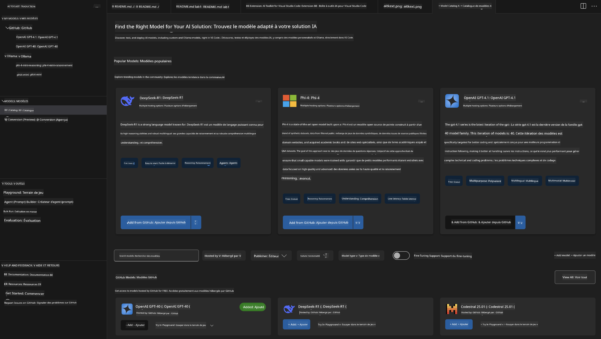
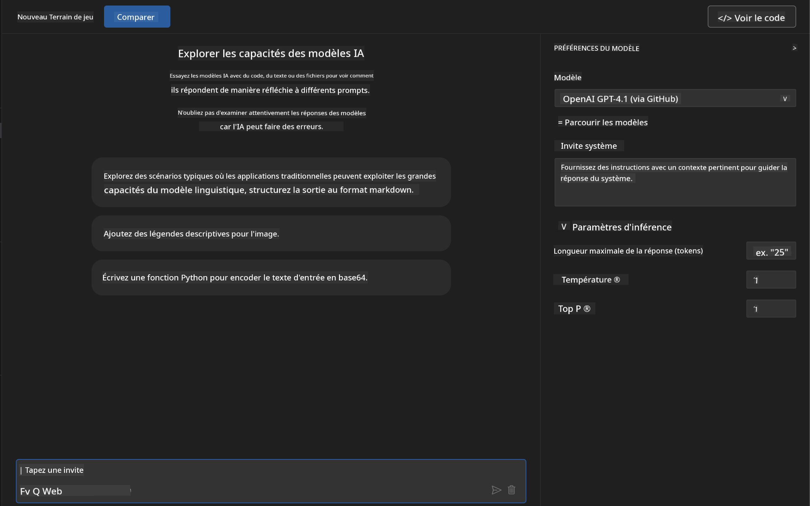
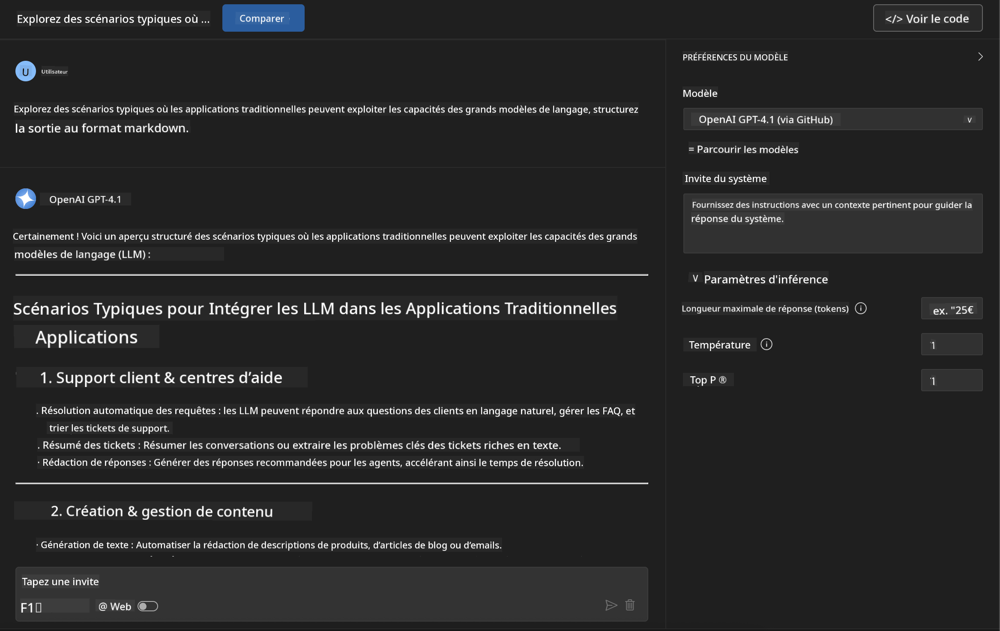
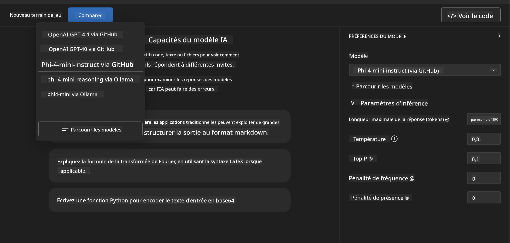
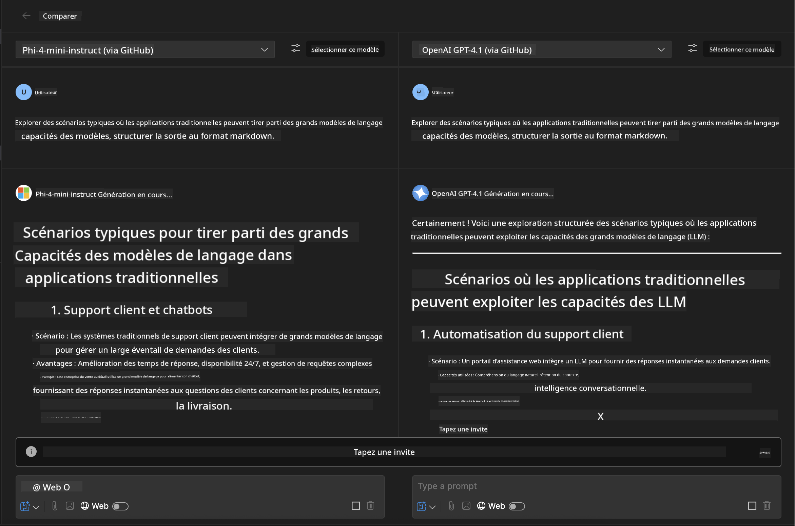
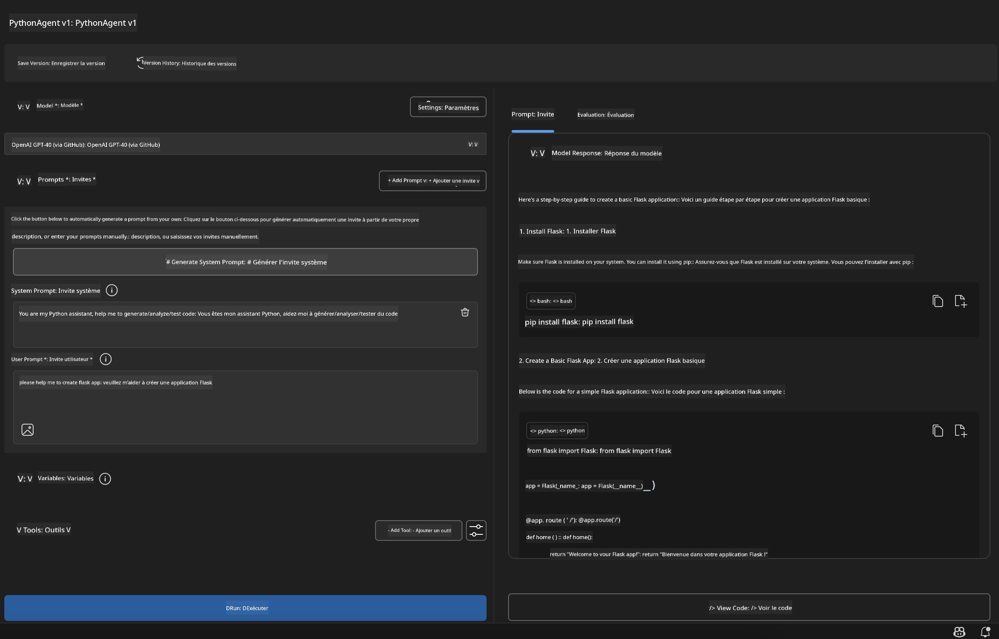

<!--
CO_OP_TRANSLATOR_METADATA:
{
  "original_hash": "2aa9dbc165e104764fa57e8a0d3f1c73",
  "translation_date": "2025-07-14T07:17:28+00:00",
  "source_file": "10-StreamliningAIWorkflowsBuildingAnMCPServerWithAIToolkit/lab1/README.md",
  "language_code": "fr"
}
-->
# 🚀 Module 1 : Fondamentaux de AI Toolkit

[]()
[]()
[]()

## 📋 Objectifs d’apprentissage

À la fin de ce module, vous serez capable de :
- ✅ Installer et configurer AI Toolkit pour Visual Studio Code
- ✅ Naviguer dans le Catalogue de modèles et comprendre les différentes sources de modèles
- ✅ Utiliser le Playground pour tester et expérimenter avec les modèles
- ✅ Créer des agents IA personnalisés avec Agent Builder
- ✅ Comparer les performances des modèles entre différents fournisseurs
- ✅ Appliquer les bonnes pratiques en ingénierie de prompt

## 🧠 Introduction à AI Toolkit (AITK)

**AI Toolkit pour Visual Studio Code** est l’extension phare de Microsoft qui transforme VS Code en un environnement complet de développement IA. Elle fait le lien entre la recherche en IA et le développement d’applications pratiques, rendant l’IA générative accessible aux développeurs de tous niveaux.

### 🌟 Fonctionnalités clés

| Fonctionnalité | Description | Cas d’usage |
|----------------|-------------|-------------|
| **🗂️ Catalogue de modèles** | Accès à plus de 100 modèles depuis GitHub, ONNX, OpenAI, Anthropic, Google | Découverte et sélection de modèles |
| **🔌 Support BYOM** | Intégrez vos propres modèles (locaux/distants) | Déploiement de modèles personnalisés |
| **🎮 Playground interactif** | Test en temps réel des modèles avec interface de chat | Prototypage rapide et tests |
| **📎 Support multimodal** | Gestion de texte, images et pièces jointes | Applications IA complexes |
| **⚡ Traitement par lots** | Exécution simultanée de plusieurs prompts | Flux de travail de test efficaces |
| **📊 Évaluation des modèles** | Métriques intégrées (F1, pertinence, similarité, cohérence) | Évaluation des performances |

### 🎯 Pourquoi AI Toolkit est important

- **🚀 Développement accéléré** : De l’idée au prototype en quelques minutes
- **🔄 Flux de travail unifié** : Une interface pour plusieurs fournisseurs IA
- **🧪 Expérimentation facile** : Comparez les modèles sans configuration complexe
- **📈 Prêt pour la production** : Transition fluide du prototype au déploiement

## 🛠️ Prérequis & Installation

### 📦 Installer l’extension AI Toolkit

**Étape 1 : Accéder au Marketplace des extensions**
1. Ouvrez Visual Studio Code
2. Allez dans la vue Extensions (`Ctrl+Shift+X` ou `Cmd+Shift+X`)
3. Recherchez "AI Toolkit"

**Étape 2 : Choisissez votre version**
- **🟢 Release** : Recommandée pour un usage en production
- **🔶 Pré-version** : Accès anticipé aux fonctionnalités innovantes

**Étape 3 : Installer et activer**


### ✅ Liste de vérification

- [ ] L’icône AI Toolkit apparaît dans la barre latérale de VS Code
- [ ] L’extension est activée et fonctionnelle
- [ ] Aucun message d’erreur lors de l’installation dans le panneau de sortie

## 🧪 Exercice pratique 1 : Explorer les modèles GitHub

**🎯 Objectif** : Maîtriser le Catalogue de modèles et tester votre premier modèle IA

### 📊 Étape 1 : Naviguer dans le Catalogue de modèles

Le Catalogue de modèles est votre porte d’entrée vers l’écosystème IA. Il regroupe des modèles de plusieurs fournisseurs, facilitant la découverte et la comparaison.

**🔍 Guide de navigation :**

Cliquez sur **MODELS - Catalog** dans la barre latérale AI Toolkit



**💡 Astuce** : Cherchez des modèles avec des capacités spécifiques adaptées à votre cas d’usage (ex. génération de code, écriture créative, analyse).

**⚠️ Note** : Les modèles hébergés sur GitHub (modèles GitHub) sont gratuits mais soumis à des limites de requêtes et de tokens. Pour accéder à des modèles externes (hébergés via Azure AI ou autres points d’accès), vous devrez fournir la clé API ou l’authentification appropriée.

### 🚀 Étape 2 : Ajouter et configurer votre premier modèle

**Stratégie de sélection de modèle :**
- **GPT-4.1** : Idéal pour le raisonnement complexe et l’analyse
- **Phi-4-mini** : Léger, réponses rapides pour tâches simples

**🔧 Processus de configuration :**
1. Sélectionnez **OpenAI GPT-4.1** dans le catalogue
2. Cliquez sur **Add to My Models** pour enregistrer le modèle
3. Choisissez **Try in Playground** pour lancer l’environnement de test
4. Patientez pendant l’initialisation du modèle (la première fois peut prendre un moment)



**⚙️ Comprendre les paramètres du modèle :**
- **Temperature** : Contrôle la créativité (0 = déterministe, 1 = créatif)
- **Max Tokens** : Longueur maximale de la réponse
- **Top-p** : Échantillonnage nucleus pour la diversité des réponses

### 🎯 Étape 3 : Maîtriser l’interface du Playground

Le Playground est votre laboratoire d’expérimentation IA. Voici comment en tirer le meilleur parti :

**🎨 Bonnes pratiques en ingénierie de prompt :**
1. **Soyez précis** : Des instructions claires et détaillées donnent de meilleurs résultats
2. **Fournissez du contexte** : Incluez les informations de fond pertinentes
3. **Utilisez des exemples** : Montrez au modèle ce que vous attendez avec des exemples
4. **Itérez** : Affinez les prompts en fonction des résultats initiaux

**🧪 Scénarios de test :**
```markdown
# Example 1: Code Generation
"Write a Python function that calculates the factorial of a number using recursion. Include error handling and docstrings."

# Example 2: Creative Writing
"Write a professional email to a client explaining a project delay, maintaining a positive tone while being transparent about challenges."

# Example 3: Data Analysis
"Analyze this sales data and provide insights: [paste your data]. Focus on trends, anomalies, and actionable recommendations."
```



### 🏆 Exercice défi : Comparaison des performances des modèles

**🎯 Objectif** : Comparer différents modèles avec les mêmes prompts pour comprendre leurs points forts

**📋 Instructions :**
1. Ajoutez **Phi-4-mini** à votre espace de travail
2. Utilisez le même prompt pour GPT-4.1 et Phi-4-mini



3. Comparez la qualité, la rapidité et la précision des réponses
4. Documentez vos observations dans la section résultats



**💡 Points clés à découvrir :**
- Quand utiliser LLM vs SLM
- Compromis coût vs performance
- Capacités spécialisées des différents modèles

## 🤖 Exercice pratique 2 : Créer des agents personnalisés avec Agent Builder

**🎯 Objectif** : Concevoir des agents IA spécialisés adaptés à des tâches et flux de travail spécifiques

### 🏗️ Étape 1 : Comprendre Agent Builder

Agent Builder est la véritable force d’AI Toolkit. Il vous permet de créer des assistants IA sur mesure qui combinent la puissance des grands modèles de langage avec des instructions personnalisées, des paramètres spécifiques et des connaissances spécialisées.

**🧠 Composants de l’architecture d’un agent :**
- **Modèle principal** : Le LLM de base (GPT-4, Groks, Phi, etc.)
- **System Prompt** : Définit la personnalité et le comportement de l’agent
- **Paramètres** : Réglages fins pour des performances optimales
- **Intégration d’outils** : Connexion aux API externes et services MCP
- **Mémoire** : Contexte de conversation et persistance de session


### ⚙️ Étape 2 : Approfondissement de la configuration de l’agent

**🎨 Créer des System Prompts efficaces :**
```markdown
# Template Structure:
## Role Definition
You are a [specific role] with expertise in [domain].

## Capabilities
- List specific abilities
- Define scope of knowledge
- Clarify limitations

## Behavior Guidelines
- Response style (formal, casual, technical)
- Output format preferences
- Error handling approach

## Examples
Provide 2-3 examples of ideal interactions
```

*Bien sûr, vous pouvez aussi utiliser Generate System Prompt pour que l’IA vous aide à générer et optimiser vos prompts*

**🔧 Optimisation des paramètres :**
| Paramètre | Plage recommandée | Cas d’usage |
|-----------|-------------------|-------------|
| **Temperature** | 0.1-0.3 | Réponses techniques/factuelles |
| **Temperature** | 0.7-0.9 | Tâches créatives/de brainstorming |
| **Max Tokens** | 500-1000 | Réponses concises |
| **Max Tokens** | 2000-4000 | Explications détaillées |

### 🐍 Étape 3 : Exercice pratique - Agent de programmation Python

**🎯 Mission** : Créer un assistant spécialisé en codage Python

**📋 Étapes de configuration :**

1. **Sélection du modèle** : Choisissez **Claude 3.5 Sonnet** (excellent pour le code)

2. **Conception du System Prompt** :
```markdown
# Python Programming Expert Agent

## Role
You are a senior Python developer with 10+ years of experience. You excel at writing clean, efficient, and well-documented Python code.

## Capabilities
- Write production-ready Python code
- Debug complex issues
- Explain code concepts clearly
- Suggest best practices and optimizations
- Provide complete working examples

## Response Format
- Always include docstrings
- Add inline comments for complex logic
- Suggest testing approaches
- Mention relevant libraries when applicable

## Code Quality Standards
- Follow PEP 8 style guidelines
- Use type hints where appropriate
- Handle exceptions gracefully
- Write readable, maintainable code
```

3. **Configuration des paramètres** :
   - Temperature : 0.2 (pour un code cohérent et fiable)
   - Max Tokens : 2000 (explications détaillées)
   - Top-p : 0.9 (créativité équilibrée)



### 🧪 Étape 4 : Tester votre agent Python

**Scénarios de test :**
1. **Fonction basique** : "Créer une fonction pour trouver les nombres premiers"
2. **Algorithme complexe** : "Implémenter un arbre binaire de recherche avec insert, delete et search"
3. **Problème réel** : "Construire un web scraper qui gère la limitation de débit et les tentatives de nouvelle requête"
4. **Débogage** : "Corriger ce code [coller le code buggy]"

**🏆 Critères de réussite :**
- ✅ Le code s’exécute sans erreurs
- ✅ Documentation appropriée incluse
- ✅ Respect des bonnes pratiques Python
- ✅ Explications claires fournies
- ✅ Suggestions d’amélioration proposées

## 🎓 Conclusion du Module 1 & prochaines étapes

### 📊 Vérification des connaissances

Testez vos acquis :
- [ ] Pouvez-vous expliquer la différence entre les modèles du catalogue ?
- [ ] Avez-vous créé et testé un agent personnalisé avec succès ?
- [ ] Comprenez-vous comment optimiser les paramètres selon les cas d’usage ?
- [ ] Savez-vous concevoir des System Prompts efficaces ?

### 📚 Ressources supplémentaires

- **Documentation AI Toolkit** : [Official Microsoft Docs](https://github.com/microsoft/vscode-ai-toolkit)
- **Guide d’ingénierie de prompt** : [Best Practices](https://platform.openai.com/docs/guides/prompt-engineering)
- **Modèles dans AI Toolkit** : [Models in Develpment](https://github.com/microsoft/vscode-ai-toolkit/blob/main/doc/models.md)

**🎉 Félicitations !** Vous avez maîtrisé les fondamentaux d’AI Toolkit et êtes prêt à créer des applications IA plus avancées !

### 🔜 Poursuivez avec le module suivant

Prêt pour des fonctionnalités plus avancées ? Continuez avec **[Module 2 : MCP avec AI Toolkit Fundamentals](../lab2/README.md)** où vous apprendrez à :
- Connecter vos agents à des outils externes via Model Context Protocol (MCP)
- Construire des agents d’automatisation de navigateur avec Playwright
- Intégrer des serveurs MCP à vos agents AI Toolkit
- Booster vos agents avec des données et capacités externes

**Avertissement** :  
Ce document a été traduit à l’aide du service de traduction automatique [Co-op Translator](https://github.com/Azure/co-op-translator). Bien que nous nous efforcions d’assurer l’exactitude, veuillez noter que les traductions automatiques peuvent contenir des erreurs ou des inexactitudes. Le document original dans sa langue d’origine doit être considéré comme la source faisant foi. Pour les informations critiques, une traduction professionnelle réalisée par un humain est recommandée. Nous déclinons toute responsabilité en cas de malentendus ou de mauvaises interprétations résultant de l’utilisation de cette traduction.