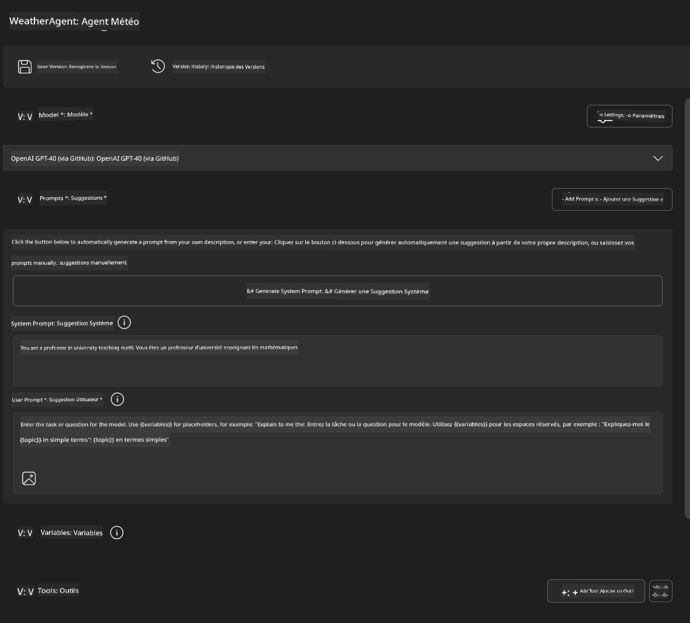
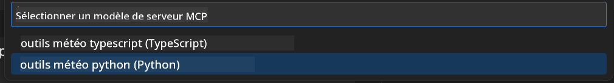
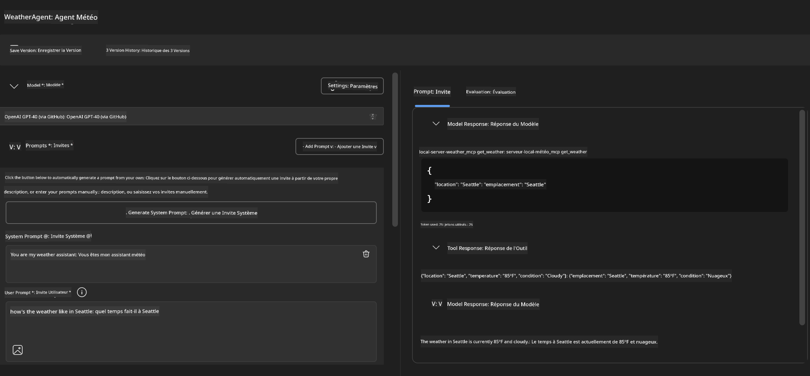
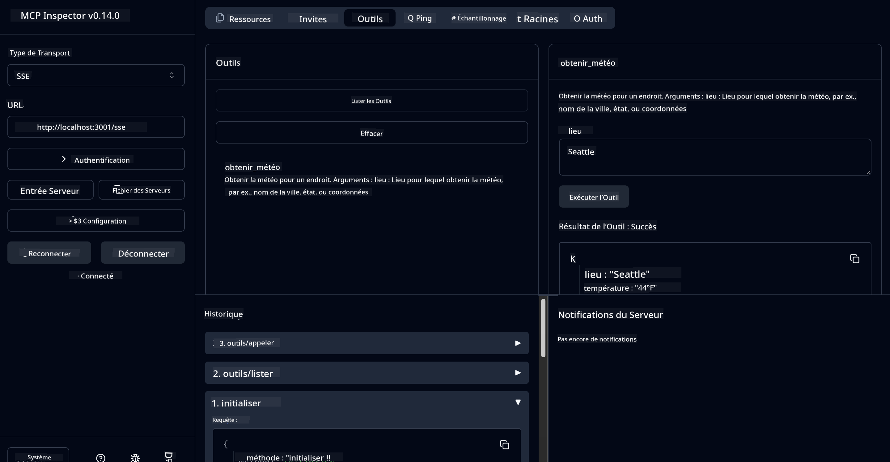

<!--
CO_OP_TRANSLATOR_METADATA:
{
  "original_hash": "dd8da3f75addcef453fe11f02a270217",
  "translation_date": "2025-06-10T06:01:43+00:00",
  "source_file": "10-StreamliningAIWorkflowsBuildingAnMCPServerWithAIToolkit/lab3/README.md",
  "language_code": "fr"
}
-->
# 🔧 Module 3 : Développement avancé MCP avec AI Toolkit


## 🎯 Objectifs d’apprentissage

À la fin de ce laboratoire, vous serez capable de :

- ✅ Créer des serveurs MCP personnalisés avec AI Toolkit
- ✅ Configurer et utiliser le dernier SDK Python MCP (v1.9.3)
- ✅ Installer et exploiter MCP Inspector pour le débogage
- ✅ Déboguer des serveurs MCP dans Agent Builder et Inspector
- ✅ Comprendre les workflows avancés de développement de serveurs MCP

## 📋 Prérequis

- Avoir terminé le Lab 2 (Fondamentaux MCP)
- VS Code avec l’extension AI Toolkit installée
- Environnement Python 3.10+
- Node.js et npm pour la configuration de l’Inspector

## 🏗️ Ce que vous allez construire

Dans ce laboratoire, vous créerez un **serveur MCP Météo** qui illustre :
- L’implémentation d’un serveur MCP personnalisé
- L’intégration avec AI Toolkit Agent Builder
- Des workflows de débogage professionnels
- Les bonnes pratiques modernes d’utilisation du SDK MCP

---

## 🔧 Présentation des composants principaux

### 🐍 MCP Python SDK  
Le SDK Python Model Context Protocol fournit la base pour construire des serveurs MCP personnalisés. Vous utiliserez la version 1.9.3 avec des fonctionnalités de débogage améliorées.

### 🔍 MCP Inspector  
Un outil de débogage puissant qui offre :  
- Une surveillance en temps réel du serveur  
- La visualisation de l’exécution des outils  
- L’inspection des requêtes/réponses réseau  
- Un environnement de test interactif  

---

## 📖 Implémentation étape par étape

### Étape 1 : Créer un WeatherAgent dans Agent Builder

1. **Lancez Agent Builder** dans VS Code via l’extension AI Toolkit  
2. **Créez un nouvel agent** avec la configuration suivante :  
   - Nom de l’agent : `WeatherAgent`



### Étape 2 : Initialiser le projet MCP Server

1. **Allez dans Outils** → **Ajouter un outil** dans Agent Builder  
2. **Sélectionnez "MCP Server"** parmi les options disponibles  
3. **Choisissez "Créer un nouveau MCP Server"**  
4. **Sélectionnez le template `python-weather`**  
5. **Nommez votre serveur :** `weather_mcp`



### Étape 3 : Ouvrir et examiner le projet

1. **Ouvrez le projet généré** dans VS Code  
2. **Passez en revue la structure du projet :**  
   ```
   weather_mcp/
   ├── src/
   │   ├── __init__.py
   │   └── server.py
   ├── inspector/
   │   ├── package.json
   │   └── package-lock.json
   ├── .vscode/
   │   ├── launch.json
   │   └── tasks.json
   ├── pyproject.toml
   └── README.md
   ```

### Étape 4 : Mettre à jour vers la dernière version du SDK MCP

> **🔍 Pourquoi mettre à jour ?** Nous voulons utiliser la dernière version du SDK MCP (v1.9.3) et du service Inspector (0.14.0) pour bénéficier de fonctionnalités avancées et d’un meilleur débogage.

#### 4a. Mettre à jour les dépendances Python

**Modifiez `pyproject.toml`:** update [./code/weather_mcp/pyproject.toml](../../../../10-StreamliningAIWorkflowsBuildingAnMCPServerWithAIToolkit/lab3/code/weather_mcp/pyproject.toml)


#### 4b. Update Inspector Configuration

**Edit `inspector/package.json`:** update [./code/weather_mcp/inspector/package.json](../../../../10-StreamliningAIWorkflowsBuildingAnMCPServerWithAIToolkit/lab3/code/weather_mcp/inspector/package.json)

#### 4c. Update Inspector Dependencies

**Edit `inspector/package-lock.json`:** update [./code/weather_mcp/inspector/package-lock.json](../../../../10-StreamliningAIWorkflowsBuildingAnMCPServerWithAIToolkit/lab3/code/weather_mcp/inspector/package-lock.json)

> **📝 Note:** This file contains extensive dependency definitions. Below is the essential structure - the full content ensures proper dependency resolution.


> **⚡ Full Package Lock:** The complete package-lock.json contains ~3000 lines of dependency definitions. The above shows the key structure - use the provided file for complete dependency resolution.

### Step 5: Configure VS Code Debugging

*Note: Please copy the file in the specified path to replace the corresponding local file*

#### 5a. Update Launch Configuration

**Edit `.vscode/launch.json` :**

```json
{
  "version": "0.2.0",
  "configurations": [
    {
      "name": "Attach to Local MCP",
      "type": "debugpy",
      "request": "attach",
      "connect": {
        "host": "localhost",
        "port": 5678
      },
      "presentation": {
        "hidden": true
      },
      "internalConsoleOptions": "neverOpen",
      "postDebugTask": "Terminate All Tasks"
    },
    {
      "name": "Launch Inspector (Edge)",
      "type": "msedge",
      "request": "launch",
      "url": "http://localhost:6274?timeout=60000&serverUrl=http://localhost:3001/sse#tools",
      "cascadeTerminateToConfigurations": [
        "Attach to Local MCP"
      ],
      "presentation": {
        "hidden": true
      },
      "internalConsoleOptions": "neverOpen"
    },
    {
      "name": "Launch Inspector (Chrome)",
      "type": "chrome",
      "request": "launch",
      "url": "http://localhost:6274?timeout=60000&serverUrl=http://localhost:3001/sse#tools",
      "cascadeTerminateToConfigurations": [
        "Attach to Local MCP"
      ],
      "presentation": {
        "hidden": true
      },
      "internalConsoleOptions": "neverOpen"
    }
  ],
  "compounds": [
    {
      "name": "Debug in Agent Builder",
      "configurations": [
        "Attach to Local MCP"
      ],
      "preLaunchTask": "Open Agent Builder",
    },
    {
      "name": "Debug in Inspector (Edge)",
      "configurations": [
        "Launch Inspector (Edge)",
        "Attach to Local MCP"
      ],
      "preLaunchTask": "Start MCP Inspector",
      "stopAll": true
    },
    {
      "name": "Debug in Inspector (Chrome)",
      "configurations": [
        "Launch Inspector (Chrome)",
        "Attach to Local MCP"
      ],
      "preLaunchTask": "Start MCP Inspector",
      "stopAll": true
    }
  ]
}
```

**Modifiez `.vscode/tasks.json` :**

```
{
  "version": "2.0.0",
  "tasks": [
    {
      "label": "Start MCP Server",
      "type": "shell",
      "command": "python -m debugpy --listen 127.0.0.1:5678 src/__init__.py sse",
      "isBackground": true,
      "options": {
        "cwd": "${workspaceFolder}",
        "env": {
          "PORT": "3001"
        }
      },
      "problemMatcher": {
        "pattern": [
          {
            "regexp": "^.*$",
            "file": 0,
            "location": 1,
            "message": 2
          }
        ],
        "background": {
          "activeOnStart": true,
          "beginsPattern": ".*",
          "endsPattern": "Application startup complete|running"
        }
      }
    },
    {
      "label": "Start MCP Inspector",
      "type": "shell",
      "command": "npm run dev:inspector",
      "isBackground": true,
      "options": {
        "cwd": "${workspaceFolder}/inspector",
        "env": {
          "CLIENT_PORT": "6274",
          "SERVER_PORT": "6277",
        }
      },
      "problemMatcher": {
        "pattern": [
          {
            "regexp": "^.*$",
            "file": 0,
            "location": 1,
            "message": 2
          }
        ],
        "background": {
          "activeOnStart": true,
          "beginsPattern": "Starting MCP inspector",
          "endsPattern": "Proxy server listening on port"
        }
      },
      "dependsOn": [
        "Start MCP Server"
      ]
    },
    {
      "label": "Open Agent Builder",
      "type": "shell",
      "command": "echo ${input:openAgentBuilder}",
      "presentation": {
        "reveal": "never"
      },
      "dependsOn": [
        "Start MCP Server"
      ],
    },
    {
      "label": "Terminate All Tasks",
      "command": "echo ${input:terminate}",
      "type": "shell",
      "problemMatcher": []
    }
  ],
  "inputs": [
    {
      "id": "openAgentBuilder",
      "type": "command",
      "command": "ai-mlstudio.agentBuilder",
      "args": {
        "initialMCPs": [ "local-server-weather_mcp" ],
        "triggeredFrom": "vsc-tasks"
      }
    },
    {
      "id": "terminate",
      "type": "command",
      "command": "workbench.action.tasks.terminate",
      "args": "terminateAll"
    }
  ]
}
```


---

## 🚀 Lancer et tester votre serveur MCP

### Étape 6 : Installer les dépendances

Après avoir effectué les modifications, lancez les commandes suivantes :

**Installer les dépendances Python :**  
```bash
uv sync
```

**Installer les dépendances Inspector :**  
```bash
cd inspector
npm install
```

### Étape 7 : Déboguer avec Agent Builder

1. **Appuyez sur F5** ou utilisez la configuration **"Debug in Agent Builder"**  
2. **Sélectionnez la configuration compound** dans le panneau de débogage  
3. **Attendez que le serveur démarre** et qu’Agent Builder s’ouvre  
4. **Testez votre serveur MCP météo** avec des requêtes en langage naturel

Entrez une invite comme celle-ci

SYSTEM_PROMPT

```
You are my weather assistant
```

USER_PROMPT

```
How's the weather like in Seattle
```



### Étape 8 : Déboguer avec MCP Inspector

1. **Utilisez la configuration "Debug in Inspector"** (Edge ou Chrome)  
2. **Ouvrez l’interface Inspector** à l’adresse `http://localhost:6274`  
3. **Explorez l’environnement de test interactif :**  
   - Consultez les outils disponibles  
   - Testez l’exécution des outils  
   - Surveillez les requêtes réseau  
   - Déboguez les réponses du serveur  



---

## 🎯 Résultats clés de l’apprentissage

En terminant ce laboratoire, vous avez :

- [x] **Créé un serveur MCP personnalisé** avec les templates AI Toolkit  
- [x] **Mis à jour vers le dernier SDK MCP** (v1.9.3) pour plus de fonctionnalités  
- [x] **Configuré des workflows de débogage professionnels** pour Agent Builder et Inspector  
- [x] **Installé MCP Inspector** pour des tests interactifs du serveur  
- [x] **Maîtrisé les configurations de débogage VS Code** pour le développement MCP  

## 🔧 Fonctionnalités avancées explorées

| Fonctionnalité | Description | Cas d’usage |
|----------------|-------------|-------------|
| **MCP Python SDK v1.9.3** | Dernière implémentation du protocole | Développement serveur moderne |
| **MCP Inspector 0.14.0** | Outil de débogage interactif | Tests serveur en temps réel |
| **Débogage VS Code** | Environnement de développement intégré | Workflow de débogage professionnel |
| **Intégration Agent Builder** | Connexion directe AI Toolkit | Tests complets d’agents |

## 📚 Ressources complémentaires

- [Documentation MCP Python SDK](https://modelcontextprotocol.io/docs/sdk/python)  
- [Guide de l’extension AI Toolkit](https://code.visualstudio.com/docs/ai/ai-toolkit)  
- [Documentation débogage VS Code](https://code.visualstudio.com/docs/editor/debugging)  
- [Spécification Model Context Protocol](https://modelcontextprotocol.io/docs/concepts/architecture)  

---

**🎉 Félicitations !** Vous avez terminé avec succès le Lab 3 et pouvez désormais créer, déboguer et déployer des serveurs MCP personnalisés en suivant des workflows professionnels.

### 🔜 Poursuivez avec le module suivant

Prêt à appliquer vos compétences MCP dans un workflow de développement réel ? Continuez vers **[Module 4 : Développement pratique MCP - Serveur personnalisé de clonage GitHub](../lab4/README.md)** où vous allez :  
- Construire un serveur MCP prêt pour la production qui automatise les opérations sur les dépôts GitHub  
- Implémenter la fonctionnalité de clonage de dépôt GitHub via MCP  
- Intégrer des serveurs MCP personnalisés avec VS Code et GitHub Copilot Agent Mode  
- Tester et déployer des serveurs MCP personnalisés en environnement de production  
- Apprendre l’automatisation pratique des workflows pour les développeurs

**Avertissement** :  
Ce document a été traduit à l’aide du service de traduction automatique [Co-op Translator](https://github.com/Azure/co-op-translator). Bien que nous nous efforçons d’assurer l’exactitude, veuillez noter que les traductions automatiques peuvent contenir des erreurs ou des inexactitudes. Le document original dans sa langue d’origine doit être considéré comme la source faisant foi. Pour les informations critiques, une traduction professionnelle réalisée par un humain est recommandée. Nous déclinons toute responsabilité en cas de malentendus ou de mauvaises interprétations résultant de l’utilisation de cette traduction.