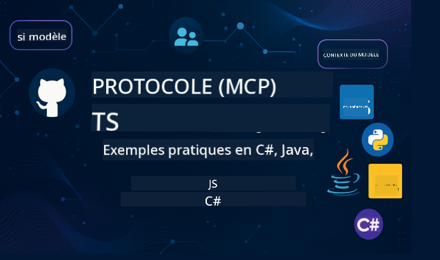

<!--
CO_OP_TRANSLATOR_METADATA:
{
  "original_hash": "b7cce20db5b5b3e9daa5db2e162aa3cf",
  "translation_date": "2025-08-12T20:17:46+00:00",
  "source_file": "README.md",
  "language_code": "fr"
}
-->
 

Suivez ces étapes pour commencer à utiliser ces ressources :
1. **Forkez le dépôt** : Cliquez sur 
2. **Clonez le dépôt** :   `git clone https://github.com/microsoft/mcp-for-beginners.git`
3. [**Rejoignez le Discord Azure AI Foundry et rencontrez des experts et développeurs**](https://discord.com/invite/ByRwuEEgH4)

### 🌐 Support multilingue

#### Pris en charge via GitHub Action (Automatisé et toujours à jour)

 [Arabe](../ar/README.md) | [Bengali](../bn/README.md) | [Bulgare](../bg/README.md) | [Birman (Myanmar)](../my/README.md) | [Chinois (Simplifié)](../zh/README.md) | [Chinois (Traditionnel, Hong Kong)](../hk/README.md) | [Chinois (Traditionnel, Macao)](../mo/README.md) | [Chinois (Traditionnel, Taïwan)](../tw/README.md) | [Croate](../hr/README.md) | [Tchèque](../cs/README.md) | [Danois](../da/README.md) | [Néerlandais](../nl/README.md) | [Finnois](../fi/README.md) | [Français](./README.md) | [Allemand](../de/README.md) | [Grec](../el/README.md) | [Hébreu](../he/README.md) | [Hindi](../hi/README.md) | [Hongrois](../hu/README.md) | [Indonésien](../id/README.md) | [Italien](../it/README.md) | [Japonais](../ja/README.md) | [Coréen](../ko/README.md) | [Malais](../ms/README.md) | [Marathi](../mr/README.md) | [Népalais](../ne/README.md) | [Norvégien](../no/README.md) | [Persan (Farsi)](../fa/README.md) | [Polonais](../pl/README.md) | [Portugais (Brésil)](../br/README.md) | [Portugais (Portugal)](../pt/README.md) | [Punjabi (Gurmukhi)](../pa/README.md) | [Roumain](../ro/README.md) | [Russe](../ru/README.md) | [Serbe (Cyrillique)](../sr/README.md) | [Slovaque](../sk/README.md) | [Slovène](../sl/README.md) | [Espagnol](../es/README.md) | [Swahili](../sw/README.md) | [Suédois](../sv/README.md) | [Tagalog (Filipino)](../tl/README.md) | [Thaï](../th/README.md) | [Turc](../tr/README.md) | [Ukrainien](../uk/README.md) | [Urdu](../ur/README.md) | [Vietnamien](../vi/README.md)

# 🚀 Programme d'apprentissage du protocole de contexte de modèle (MCP) pour débutants

## **Apprenez MCP avec des exemples de code pratiques en C#, Java, JavaScript, Rust, Python et TypeScript**

## 🧠 Aperçu du programme d'apprentissage du protocole de contexte de modèle

Le **protocole de contexte de modèle (MCP)** est un cadre de pointe conçu pour standardiser les interactions entre les modèles d'IA et les applications clientes. Ce programme open-source offre un parcours d'apprentissage structuré, avec des exemples de code pratiques et des cas d'utilisation réels, dans des langages de programmation populaires tels que C#, Java, JavaScript, TypeScript et Python.

Que vous soyez développeur IA, architecte système ou ingénieur logiciel, ce guide est votre ressource complète pour maîtriser les fondamentaux et les stratégies d'implémentation de MCP.

## 🔗 Ressources officielles MCP

- 📘 [Documentation MCP](https://modelcontextprotocol.io/) – Tutoriels détaillés et guides d'utilisation  
- 📜 [Spécification MCP](https://modelcontextprotocol.io/docs/) – Architecture du protocole et références techniques  
- 📜 [Spécification originale MCP](https://spec.modelcontextprotocol.io/) – Références techniques héritées (peut contenir des détails supplémentaires)  
- 🧑‍💻 [Dépôt GitHub MCP](https://github.com/modelcontextprotocol) – SDKs open-source, outils et exemples de code
- 🌐 [Communauté MCP](https://github.com/orgs/modelcontextprotocol/discussions) – Rejoignez les discussions et contribuez à la communauté

 ### ➡️Regardez à la demande - MCP Dev Days
Préparez-vous à deux jours d'informations techniques approfondies, de connexion communautaire et d'apprentissage pratique lors des MCP Dev Days, un événement virtuel dédié au protocole de contexte de modèle (MCP) — la norme émergente qui relie les modèles d'IA et les outils sur lesquels ils reposent.
Vous pouvez regarder les MCP Dev Days en vous inscrivant sur notre page événement : https://aka.ms/mcpdevdays. 

#### Jour 1 : Productivité MCP, outils de développement et communauté : 

Ce jour est consacré à donner aux développeurs les moyens d'utiliser MCP dans leur flux de travail et à célébrer la communauté MCP. Nous serons rejoints par des membres de la communauté et des partenaires tels qu'Arcade, Block, Okta et Neon pour voir comment ils collaborent avec Microsoft pour façonner un écosystème MCP ouvert et extensible. Démonstrations réelles avec VS Code, Visual Studio, GitHub Copilot et outils communautaires populaires
Flux de travail pratiques et axés sur le contexte
Sessions et perspectives dirigées par la communauté
Que vous débutiez avec MCP ou que vous construisiez déjà avec, le Jour 1 vous inspirera et vous fournira des conseils pratiques.

#### Jour 2 : Construisez des serveurs MCP en toute confiance

Ce jour est destiné aux créateurs MCP. Nous approfondirons les stratégies d'implémentation et les meilleures pratiques pour créer des serveurs MCP et intégrer MCP dans vos flux de travail IA.

### Sujets abordés :

- Construire des serveurs MCP et les intégrer dans des expériences d'agents
- Développement basé sur les prompts
- Meilleures pratiques en matière de sécurité
- Utilisation de blocs de construction comme Functions, ACA et API Management
- Alignement des registres et outils (1P + 3P)

Si vous êtes développeur, créateur d'outils ou stratège produit IA, ce jour est rempli des informations dont vous avez besoin pour construire des solutions MCP évolutives, sécurisées et prêtes pour l'avenir.

## 🧭 Aperçu du programme MCP

### 📚 Structure complète du programme

| Module | Sujet | Description | Lien |
|--------|-------|-------------|------|
| **Module 1-3 : Fondamentaux** | | | |
| 00 | Introduction à MCP | Aperçu du protocole de contexte de modèle et de son importance dans les pipelines IA | [En savoir plus](./00-Introduction/README.md) |
| 01 | Concepts de base expliqués | Exploration approfondie des concepts fondamentaux de MCP | [En savoir plus](./01-CoreConcepts/README.md) |
| 02 | Sécurité dans MCP | Menaces de sécurité et meilleures pratiques | [En savoir plus](./02-Security/README.md) |
| 03 | Premiers pas avec MCP | Configuration de l'environnement, serveurs/clients de base, intégration | [En savoir plus](./03-GettingStarted/README.md) |
| **Module 3 : Construire votre premier serveur et client** | | | |
| 3.1 | Premier serveur | Créez votre premier serveur MCP | [Guide](./03-GettingStarted/01-first-server/README.md) |
| 3.2 | Premier client | Développez un client MCP de base | [Guide](./03-GettingStarted/02-client/README.md) |
| 3.3 | Client avec LLM | Intégrez des modèles de langage étendus | [Guide](./03-GettingStarted/03-llm-client/README.md) |
| 3.4 | Intégration VS Code | Consommez des serveurs MCP dans VS Code | [Guide](./03-GettingStarted/04-vscode/README.md) |
| 3.5 | Serveur SSE | Créez des serveurs utilisant les événements envoyés par le serveur | [Guide](./03-GettingStarted/05-sse-server/README.md) |
| 3.6 | Streaming HTTP | Implémentez le streaming HTTP dans MCP | [Guide](./03-GettingStarted/06-http-streaming/README.md) |
| 3.7 | Toolkit IA | Utilisez le Toolkit IA avec MCP | [Guide](./03-GettingStarted/07-aitk/README.md) |
| 3.8 | Tests | Testez votre implémentation de serveur MCP | [Guide](./03-GettingStarted/08-testing/README.md) |
| 3.9 | Déploiement | Déployez des serveurs MCP en production | [Guide](./03-GettingStarted/09-deployment/README.md) |
| **Module 4-5 : Pratique et avancé** | | | |
| 04 | Implémentation pratique | SDKs, débogage, tests, modèles de prompts réutilisables | [En savoir plus](./04-PracticalImplementation/README.md) |
| 05 | Sujets avancés dans MCP | IA multimodale, mise à l'échelle, utilisation en entreprise | [En savoir plus](./05-AdvancedTopics/README.md) |
| 5.1 | Intégration Azure | Intégration MCP avec Azure | [Guide](./05-AdvancedTopics/mcp-integration/README.md) |
| 5.2 | Multimodalité | Travailler avec plusieurs modalités | [Guide](./05-AdvancedTopics/mcp-multi-modality/README.md) |
| 5.3 | Démo OAuth2 | Implémentez l'authentification OAuth2 | [Guide](./05-AdvancedTopics/mcp-oauth2-demo/README.md) |
| 5.4 | Contextes racine | Comprendre et implémenter des contextes racine | [Guide](./05-AdvancedTopics/mcp-root-contexts/README.md) |
| 5.5 | Routage | Stratégies de routage MCP | [Guide](./05-AdvancedTopics/mcp-routing/README.md) |
| 5.6 | Échantillonnage | Techniques d'échantillonnage dans MCP | [Guide](./05-AdvancedTopics/mcp-sampling/README.md) |
| 5.7 | Mise à l'échelle | Mettre à l'échelle les implémentations MCP | [Guide](./05-AdvancedTopics/mcp-scaling/README.md) |
| 5.8 | Sécurité | Considérations avancées en matière de sécurité | [Guide](./05-AdvancedTopics/mcp-security/README.md) |
| 5.9 | Recherche web | Implémentez des capacités de recherche web | [Guide](./05-AdvancedTopics/web-search-mcp/README.md) |
| 5.10 | Streaming en temps réel | Construisez des fonctionnalités de streaming en temps réel | [Guide](./05-AdvancedTopics/mcp-realtimestreaming/README.md) |
| 5.11 | Recherche en temps réel | Implémentez la recherche en temps réel | [Guide](./05-AdvancedTopics/mcp-realtimesearch/README.md) |
| 5.12 | Authentification Entra ID | Authentification avec Microsoft Entra ID | [Guide](./05-AdvancedTopics/mcp-security-entra/README.md) |
| 5.13 | Intégration Foundry | Intégrez avec Azure AI Foundry | [Guide](./05-AdvancedTopics/mcp-foundry-agent-integration/README.md) |
| 5.14 | Ingénierie de contexte | Techniques pour une ingénierie de contexte efficace | [Guide](./05-AdvancedTopics/mcp-contextengineering/README.md) |
| **Module 6-10 : Communauté et meilleures pratiques** | | | |
| 06 | Contributions de la communauté | Comment contribuer à l'écosystème MCP | [Guide](./06-CommunityContributions/README.md) |
| 07 | Enseignements de l'adoption précoce | Histoires d'implémentation réelle | [Guide](./07-LessonsFromEarlyAdoption/README.md) |
| 08 | Meilleures pratiques pour MCP | Performance, tolérance aux pannes, résilience | [Guide](./08-BestPractices/README.md) |
| 09 | Études de cas MCP | Exemples d'implémentation pratique | [Guide](./09-CaseStudy/README.md) |
| 10 | Atelier pratique | Construire un serveur MCP avec AI Toolkit | [Lab](./10-StreamliningAIWorkflowsBuildingAnMCPServerWithAIToolkit/README.md) |

### 💻 Projets de code d'exemple

#### Exemples de calculateur MCP basique

| Langage | Description | Lien |
|---------|-------------|------|
| C# | Exemple de serveur MCP | [Voir le code](./03-GettingStarted/samples/csharp/README.md) |
| Java | Calculateur MCP | [Voir le code](./03-GettingStarted/samples/java/calculator/README.md) |
| JavaScript | Démo MCP | [Voir le code](./03-GettingStarted/samples/javascript/README.md) |
| Python | Serveur MCP | [Voir le code](../../03-GettingStarted/samples/python/mcp_calculator_server.py) |
| TypeScript | Exemple MCP | [Voir le code](./03-GettingStarted/samples/typescript/README.md) |

#### Implémentations avancées de MCP

| Langage | Description | Lien |
|---------|-------------|------|
| C# | Exemple avancé | [Voir le code](./04-PracticalImplementation/samples/csharp/README.md) |
| Java avec Spring | Exemple d'application conteneurisée | [Voir le code](./04-PracticalImplementation/samples/java/containerapp/README.md) |
| JavaScript | Exemple avancé | [Voir le code](./04-PracticalImplementation/samples/javascript/README.md) |
| Python | Implémentation complexe | [Voir le code](../../04-PracticalImplementation/samples/python/mcp_sample.py) |
| TypeScript | Exemple conteneurisé | [Voir le code](./04-PracticalImplementation/samples/typescript/README.md) |

## 🎯 Prérequis pour apprendre MCP

Pour tirer le meilleur parti de ce programme, vous devriez avoir :

- Des connaissances de base en programmation dans au moins un des langages suivants : C#, Java, JavaScript, Python ou TypeScript
- Une compréhension du modèle client-serveur et des API
- Une familiarité avec les concepts REST et HTTP
- (Optionnel) Des notions de base en concepts d'IA/ML

- Rejoindre nos discussions communautaires pour obtenir du soutien

## 📚 Guide d'étude et ressources

Ce dépôt inclut plusieurs ressources pour vous aider à naviguer et apprendre efficacement :

### Guide d'étude

Un [Guide d'étude](./study_guide.md) complet est disponible pour vous aider à naviguer dans ce dépôt. Le guide inclut :

- Une carte visuelle du programme montrant tous les sujets abordés
- Une analyse détaillée de chaque section du dépôt
- Des conseils sur l'utilisation des projets d'exemple
- Des parcours d'apprentissage recommandés pour différents niveaux de compétence
- Des ressources supplémentaires pour compléter votre apprentissage

### Journal des modifications

Nous maintenons un [Journal des modifications](./changelog.md) détaillé qui suit toutes les mises à jour importantes des matériaux du programme, y compris :

- Ajouts de nouveaux contenus
- Changements structurels
- Améliorations des fonctionnalités
- Mises à jour de la documentation

## 🛠️ Comment utiliser ce programme efficacement

Chaque leçon de ce guide inclut :

1. Des explications claires des concepts MCP  
2. Des exemples de code en direct dans plusieurs langages  
3. Des exercices pour construire de vraies applications MCP  
4. Des ressources supplémentaires pour les apprenants avancés  

## 🌟 Remerciements à la communauté

Merci à Microsoft Valued Professional [Shivam Goyal](https://www.linkedin.com/in/shivam2003/) pour avoir contribué d'importants exemples de code. 

## 📜 Informations sur la licence

Ce contenu est sous licence **MIT License**. Pour les termes et conditions, consultez le [LICENSE](../../LICENSE).

## 🤝 Directives de contribution

Ce projet accueille les contributions et suggestions. La plupart des contributions nécessitent que vous acceptiez un
Accord de Licence de Contributeur (CLA) déclarant que vous avez le droit de, et que vous accordez effectivement, les droits nécessaires pour utiliser votre contribution. Pour plus de détails, visitez 
<https://cla.opensource.microsoft.com>.

Lorsque vous soumettez une pull request, un bot CLA déterminera automatiquement si vous devez fournir
un CLA et annotera la PR en conséquence (par exemple, vérification de statut, commentaire). Suivez simplement les instructions
fournies par le bot. Vous n'aurez à le faire qu'une seule fois pour tous les dépôts utilisant notre CLA.

Ce projet a adopté le [Code de conduite Open Source de Microsoft](https://opensource.microsoft.com/codeofconduct/).
Pour plus d'informations, consultez la [FAQ sur le Code de conduite](https://opensource.microsoft.com/codeofconduct/faq/) ou
contactez [opencode@microsoft.com](mailto:opencode@microsoft.com) pour toute question ou commentaire supplémentaire.

## 📂 Structure du dépôt

Le dépôt est organisé comme suit :

- **Programme principal (00-10)** : Le contenu principal organisé en dix modules séquentiels
- **images/** : Diagrammes et illustrations utilisés dans tout le programme
- **translations/** : Support multilingue avec traductions automatisées
- **translated_images/** : Versions localisées des diagrammes et illustrations
- **study_guide.md** : Guide complet pour naviguer dans le dépôt
- **changelog.md** : Enregistrement de tous les changements significatifs des matériaux du programme
- **mcp.json** : Fichier de configuration pour la spécification MCP
- **CODE_OF_CONDUCT.md, LICENSE, SECURITY.md, SUPPORT.md** : Documents de gouvernance du projet

## 🎒 Autres cours
Notre équipe produit d'autres cours ! Découvrez :

- [Agents IA pour débutants](https://github.com/microsoft/ai-agents-for-beginners?WT.mc_id=academic-105485-koreyst)
- [IA générative pour débutants avec .NET](https://github.com/microsoft/Generative-AI-for-beginners-dotnet?WT.mc_id=academic-105485-koreyst)
- [IA générative pour débutants avec JavaScript](https://github.com/microsoft/generative-ai-with-javascript?WT.mc_id=academic-105485-koreyst)
- [IA générative pour débutants](https://github.com/microsoft/generative-ai-for-beginners?WT.mc_id=academic-105485-koreyst)
- [IA générative pour débutants avec Java](https://github.com/microsoft/generative-ai-for-beginners-java?WT.mc_id=academic-105485-koreyst)
- [ML pour débutants](https://aka.ms/ml-beginners?WT.mc_id=academic-105485-koreyst)
- [Science des données pour débutants](https://aka.ms/datascience-beginners?WT.mc_id=academic-105485-koreyst)
- [IA pour débutants](https://aka.ms/ai-beginners?WT.mc_id=academic-105485-koreyst)
- [Cybersécurité pour débutants](https://github.com/microsoft/Security-101?WT.mc_id=academic-96948-sayoung)
- [Développement web pour débutants](https://aka.ms/webdev-beginners?WT.mc_id=academic-105485-koreyst)
- [IoT pour débutants](https://aka.ms/iot-beginners?WT.mc_id=academic-105485-koreyst)
- [Développement XR pour débutants](https://github.com/microsoft/xr-development-for-beginners?WT.mc_id=academic-105485-koreyst)
- [Maîtriser GitHub Copilot pour la programmation assistée par IA](https://aka.ms/GitHubCopilotAI?WT.mc_id=academic-105485-koreyst)
- [Maîtriser GitHub Copilot pour les développeurs C#/.NET](https://github.com/microsoft/mastering-github-copilot-for-dotnet-csharp-developers?WT.mc_id=academic-105485-koreyst)
- [Choisissez votre propre aventure Copilot](https://github.com/microsoft/CopilotAdventures?WT.mc_id=academic-105485-koreyst)

## ™️ Avis sur les marques déposées

Ce projet peut contenir des marques ou logos pour des projets, produits ou services. L'utilisation autorisée des marques ou logos Microsoft est soumise et doit respecter les [Directives sur les marques et la marque de Microsoft](https://www.microsoft.com/legal/intellectualproperty/trademarks/usage/general).
L'utilisation des marques ou logos Microsoft dans des versions modifiées de ce projet ne doit pas causer de confusion ou impliquer un parrainage de Microsoft.
Toute utilisation de marques ou logos tiers est soumise aux politiques de ces tiers.

**Avertissement** :  
Ce document a été traduit à l'aide du service de traduction automatique [Co-op Translator](https://github.com/Azure/co-op-translator). Bien que nous nous efforcions d'assurer l'exactitude, veuillez noter que les traductions automatisées peuvent contenir des erreurs ou des inexactitudes. Le document original dans sa langue d'origine doit être considéré comme la source faisant autorité. Pour des informations critiques, il est recommandé de recourir à une traduction professionnelle réalisée par un humain. Nous déclinons toute responsabilité en cas de malentendus ou d'interprétations erronées résultant de l'utilisation de cette traduction.