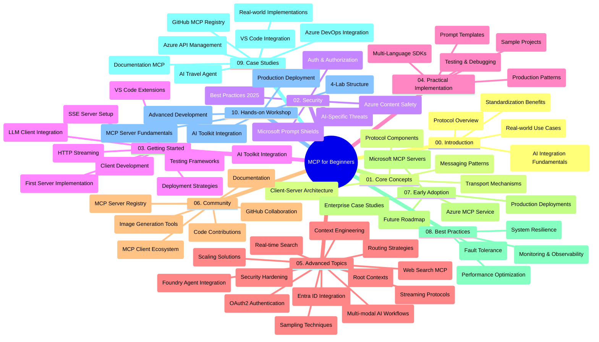

<!--
CO_OP_TRANSLATOR_METADATA:
{
  "original_hash": "719117a0a5f34ade7b5dfb61ee06fb13",
  "translation_date": "2025-09-26T17:33:45+00:00",
  "source_file": "study_guide.md",
  "language_code": "fr"
}
-->
# Protocole de Contexte Modèle (MCP) pour Débutants - Guide d'Étude

Ce guide d'étude offre une vue d'ensemble de la structure et du contenu du dépôt pour le programme "Protocole de Contexte Modèle (MCP) pour Débutants". Utilisez ce guide pour naviguer efficacement dans le dépôt et tirer le meilleur parti des ressources disponibles.

## Vue d'ensemble du dépôt

Le Protocole de Contexte Modèle (MCP) est un cadre standardisé pour les interactions entre les modèles d'IA et les applications clientes. Initialement créé par Anthropic, MCP est désormais maintenu par la communauté MCP via l'organisation officielle GitHub. Ce dépôt propose un programme complet avec des exemples de code pratiques en C#, Java, JavaScript, Python et TypeScript, conçu pour les développeurs d'IA, les architectes systèmes et les ingénieurs logiciels.

## Carte Visuelle du Programme

## Structure du dépôt

Le dépôt est organisé en dix sections principales, chacune abordant différents aspects du MCP :

1. **Introduction (00-Introduction/)**
   - Vue d'ensemble du Protocole de Contexte Modèle
   - Importance de la standardisation dans les pipelines d'IA
   - Cas d'utilisation pratiques et avantages

2. **Concepts de base (01-CoreConcepts/)**
   - Architecture client-serveur
   - Composants clés du protocole
   - Modèles de messagerie dans MCP

3. **Sécurité (02-Security/)**
   - Menaces de sécurité dans les systèmes basés sur MCP
   - Meilleures pratiques pour sécuriser les implémentations
   - Stratégies d'authentification et d'autorisation
   - **Documentation complète sur la sécurité** :
     - Meilleures pratiques de sécurité MCP 2025
     - Guide d'implémentation de la sécurité Azure Content Safety
     - Contrôles et techniques de sécurité MCP
     - Référence rapide des meilleures pratiques MCP
   - **Sujets clés en matière de sécurité** :
     - Attaques par injection de prompts et empoisonnement d'outils
     - Détournement de session et problèmes de proxy confus
     - Vulnérabilités de transmission de jetons
     - Permissions excessives et contrôle d'accès
     - Sécurité de la chaîne d'approvisionnement pour les composants d'IA
     - Intégration des boucliers de prompts Microsoft

4. **Premiers pas (03-GettingStarted/)**
   - Configuration de l'environnement
   - Création de serveurs et clients MCP de base
   - Intégration avec des applications existantes
   - Inclut des sections pour :
     - Première implémentation de serveur
     - Développement de clients
     - Intégration de clients LLM
     - Intégration avec VS Code
     - Serveur SSE (Server-Sent Events)
     - Streaming HTTP
     - Intégration de l'AI Toolkit
     - Stratégies de test
     - Directives de déploiement

5. **Implémentation pratique (04-PracticalImplementation/)**
   - Utilisation des SDK dans différents langages de programmation
   - Techniques de débogage, test et validation
   - Création de modèles de prompts et workflows réutilisables
   - Projets exemples avec des implémentations pratiques

6. **Sujets avancés (05-AdvancedTopics/)**
   - Techniques d'ingénierie de contexte
   - Intégration d'agents Foundry
   - Workflows IA multi-modaux
   - Démos d'authentification OAuth2
   - Capacités de recherche en temps réel
   - Streaming en temps réel
   - Implémentation de contextes racine
   - Stratégies de routage
   - Techniques d'échantillonnage
   - Approches de mise à l'échelle
   - Considérations de sécurité
   - Intégration de sécurité Entra ID
   - Intégration de recherche web

7. **Contributions de la communauté (06-CommunityContributions/)**
   - Comment contribuer au code et à la documentation
   - Collaboration via GitHub
   - Améliorations et retours pilotés par la communauté
   - Utilisation de divers clients MCP (Claude Desktop, Cline, VSCode)
   - Travail avec des serveurs MCP populaires, y compris la génération d'images

8. **Leçons tirées de l'adoption précoce (07-LessonsfromEarlyAdoption/)**
   - Implémentations réelles et histoires de réussite
   - Construction et déploiement de solutions basées sur MCP
   - Tendances et feuille de route future
   - **Guide des serveurs MCP Microsoft** : Guide complet de 10 serveurs MCP Microsoft prêts pour la production, y compris :
     - Serveur MCP Microsoft Learn Docs
     - Serveur MCP Azure (15+ connecteurs spécialisés)
     - Serveur MCP GitHub
     - Serveur MCP Azure DevOps
     - Serveur MCP MarkItDown
     - Serveur MCP SQL Server
     - Serveur MCP Playwright
     - Serveur MCP Dev Box
     - Serveur MCP Azure AI Foundry
     - Serveur MCP Microsoft 365 Agents Toolkit

9. **Meilleures pratiques (08-BestPractices/)**
   - Optimisation des performances
   - Conception de systèmes MCP tolérants aux pannes
   - Stratégies de test et de résilience

10. **Études de cas (09-CaseStudy/)**
    - **Sept études de cas complètes** démontrant la polyvalence du MCP dans divers scénarios :
    - **Agents de voyage Azure AI** : Orchestration multi-agents avec Azure OpenAI et AI Search
    - **Intégration Azure DevOps** : Automatisation des processus de workflow avec mises à jour de données YouTube
    - **Récupération de documentation en temps réel** : Client console Python avec streaming HTTP
    - **Générateur de plan d'étude interactif** : Application web Chainlit avec IA conversationnelle
    - **Documentation dans l'éditeur** : Intégration VS Code avec workflows GitHub Copilot
    - **Gestion des API Azure** : Intégration d'API d'entreprise avec création de serveurs MCP
    - **Registre MCP GitHub** : Développement d'écosystème et plateforme d'intégration agentique
    - Exemples d'implémentation couvrant l'intégration d'entreprise, la productivité des développeurs et le développement d'écosystèmes

11. **Atelier pratique (10-StreamliningAIWorkflowsBuildingAnMCPServerWithAIToolkit/)**
    - Atelier pratique complet combinant MCP avec AI Toolkit
    - Création d'applications intelligentes reliant les modèles d'IA à des outils réels
    - Modules pratiques couvrant les fondamentaux, le développement de serveurs personnalisés et les stratégies de déploiement en production
    - **Structure des laboratoires** :
      - Lab 1 : Fondamentaux du serveur MCP
      - Lab 2 : Développement avancé de serveurs MCP
      - Lab 3 : Intégration de l'AI Toolkit
      - Lab 4 : Déploiement et mise à l'échelle en production
    - Approche d'apprentissage basée sur des laboratoires avec des instructions étape par étape

## Ressources supplémentaires

Le dépôt inclut des ressources de soutien :

- **Dossier Images** : Contient des diagrammes et illustrations utilisés dans tout le programme
- **Traductions** : Support multilingue avec traductions automatisées de la documentation
- **Ressources officielles MCP** :
  - [Documentation MCP](https://modelcontextprotocol.io/)
  - [Spécification MCP](https://spec.modelcontextprotocol.io/)
  - [Dépôt GitHub MCP](https://github.com/modelcontextprotocol)

## Comment utiliser ce dépôt

1. **Apprentissage séquentiel** : Suivez les chapitres dans l'ordre (00 à 10) pour une expérience d'apprentissage structurée.
2. **Focus sur un langage spécifique** : Si vous êtes intéressé par un langage de programmation particulier, explorez les répertoires d'exemples pour des implémentations dans votre langage préféré.
3. **Implémentation pratique** : Commencez par la section "Premiers pas" pour configurer votre environnement et créer votre premier serveur et client MCP.
4. **Exploration avancée** : Une fois à l'aise avec les bases, plongez dans les sujets avancés pour approfondir vos connaissances.
5. **Engagement communautaire** : Rejoignez la communauté MCP via les discussions GitHub et les canaux Discord pour échanger avec des experts et d'autres développeurs.

## Clients et outils MCP

Le programme couvre divers clients et outils MCP :

1. **Clients officiels** :
   - Visual Studio Code 
   - MCP dans Visual Studio Code
   - Claude Desktop
   - Claude dans VSCode 
   - API Claude

2. **Clients communautaires** :
   - Cline (basé sur terminal)
   - Cursor (éditeur de code)
   - ChatMCP
   - Windsurf

3. **Outils de gestion MCP** :
   - MCP CLI
   - MCP Manager
   - MCP Linker
   - MCP Router

## Serveurs MCP populaires

Le dépôt présente divers serveurs MCP, notamment :

1. **Serveurs MCP Microsoft officiels** :
   - Serveur MCP Microsoft Learn Docs
   - Serveur MCP Azure (15+ connecteurs spécialisés)
   - Serveur MCP GitHub
   - Serveur MCP Azure DevOps
   - Serveur MCP MarkItDown
   - Serveur MCP SQL Server
   - Serveur MCP Playwright
   - Serveur MCP Dev Box
   - Serveur MCP Azure AI Foundry
   - Serveur MCP Microsoft 365 Agents Toolkit

2. **Serveurs de référence officiels** :
   - Filesystem
   - Fetch
   - Memory
   - Sequential Thinking

3. **Génération d'images** :
   - Azure OpenAI DALL-E 3
   - Stable Diffusion WebUI
   - Replicate

4. **Outils de développement** :
   - Git MCP
   - Terminal Control
   - Code Assistant

5. **Serveurs spécialisés** :
   - Salesforce
   - Microsoft Teams
   - Jira & Confluence

## Contribution

Ce dépôt accueille les contributions de la communauté. Consultez la section Contributions de la communauté pour des conseils sur la manière de contribuer efficacement à l'écosystème MCP.

## Journal des modifications

| Date | Modifications |
|------|---------------|
| 26 septembre 2025 | - Ajout de l'étude de cas Registre MCP GitHub à la section 09-CaseStudy - Mise à jour des études de cas pour refléter sept études de cas complètes - Amélioration des descriptions des études de cas avec des détails spécifiques d'implémentation - Mise à jour de la Carte Visuelle du Programme pour inclure le Registre MCP GitHub - Révision de la structure du guide d'étude pour refléter l'accent sur le développement de l'écosystème |
| 18 juillet 2025 | - Mise à jour de la structure du dépôt pour inclure le Guide des serveurs MCP Microsoft - Ajout de la liste complète des 10 serveurs MCP Microsoft prêts pour la production - Amélioration de la section Serveurs MCP populaires avec les serveurs MCP Microsoft officiels - Mise à jour de la section Études de cas avec des exemples de fichiers réels - Ajout de détails sur la structure des laboratoires pour l'atelier pratique |
| 16 juillet 2025 | - Mise à jour de la structure du dépôt pour refléter le contenu actuel - Ajout de la section Clients et outils MCP - Ajout de la section Serveurs MCP populaires - Mise à jour de la Carte Visuelle du Programme avec tous les sujets actuels - Amélioration de la section Sujets avancés avec toutes les zones spécialisées - Mise à jour des études de cas pour refléter des exemples réels - Clarification de l'origine du MCP comme créé par Anthropic |
| 11 juin 2025 | - Création initiale du guide d'étude - Ajout de la Carte Visuelle du Programme - Structure du dépôt décrite - Inclusion de projets exemples et ressources supplémentaires |

---

*Ce guide d'étude a été mis à jour le 26 septembre 2025 et offre une vue d'ensemble du dépôt à cette date. Le contenu du dépôt peut être mis à jour après cette date.*

---

