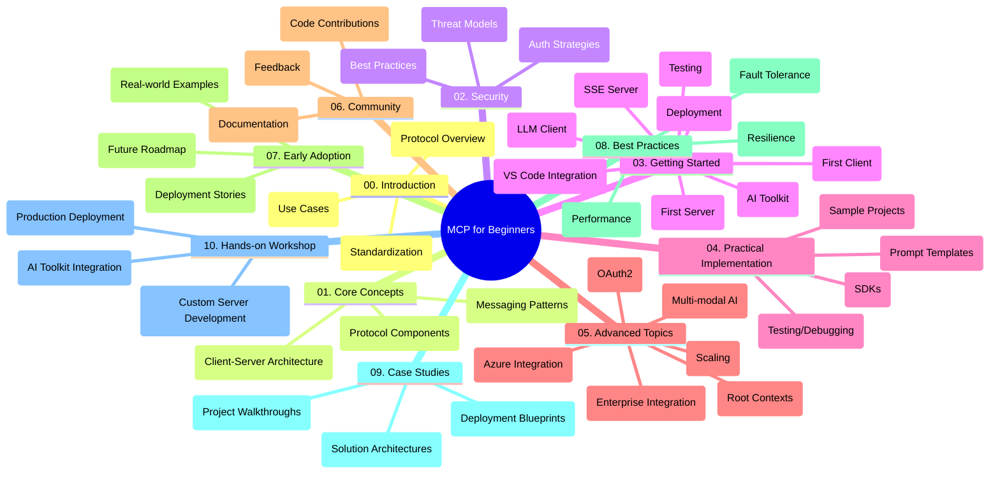

<!--
CO_OP_TRANSLATOR_METADATA:
{
  "original_hash": "a607d4febc94caee9a12b77795f7fc9a",
  "translation_date": "2025-07-13T15:09:13+00:00",
  "source_file": "study_guide.md",
  "language_code": "fr"
}
-->
# Model Context Protocol (MCP) pour débutants - Guide d'étude

Ce guide d'étude offre un aperçu de la structure et du contenu du dépôt pour le programme "Model Context Protocol (MCP) pour débutants". Utilisez ce guide pour naviguer efficacement dans le dépôt et tirer le meilleur parti des ressources disponibles.

## Aperçu du dépôt

Le Model Context Protocol (MCP) est un cadre standardisé pour les interactions entre les modèles d'IA et les applications clientes. Ce dépôt propose un programme complet avec des exemples de code pratiques en C#, Java, JavaScript, Python et TypeScript, destiné aux développeurs IA, architectes systèmes et ingénieurs logiciels.

## Carte visuelle du programme

## Structure du dépôt

Le dépôt est organisé en dix sections principales, chacune abordant différents aspects du MCP :

1. **Introduction (00-Introduction/)**
   - Présentation du Model Context Protocol
   - Pourquoi la standardisation est importante dans les pipelines IA
   - Cas d’usage pratiques et avantages

2. **Concepts fondamentaux (01-CoreConcepts/)**
   - Architecture client-serveur
   - Composants clés du protocole
   - Modèles de messagerie dans MCP

3. **Sécurité (02-Security/)**
   - Menaces de sécurité dans les systèmes basés sur MCP
   - Bonnes pratiques pour sécuriser les implémentations
   - Stratégies d’authentification et d’autorisation

4. **Premiers pas (03-GettingStarted/)**
   - Configuration et mise en place de l’environnement
   - Création de serveurs et clients MCP basiques
   - Intégration avec des applications existantes
   - Sous-sections pour premier serveur, premier client, client LLM, intégration VS Code, serveur SSE, AI Toolkit, tests et déploiement

5. **Implémentation pratique (04-PracticalImplementation/)**
   - Utilisation des SDK dans différents langages de programmation
   - Techniques de débogage, test et validation
   - Création de modèles de prompt et workflows réutilisables
   - Projets exemples avec cas d’implémentation

6. **Sujets avancés (05-AdvancedTopics/)**
   - Workflows IA multimodaux et extensibilité
   - Stratégies de montée en charge sécurisée
   - MCP dans les écosystèmes d’entreprise
   - Sujets spécialisés incluant intégration Azure, multimodalité, OAuth2, contextes racines, routage, échantillonnage, montée en charge, sécurité, intégration recherche web et streaming.

7. **Contributions de la communauté (06-CommunityContributions/)**
   - Comment contribuer au code et à la documentation
   - Collaboration via GitHub
   - Améliorations et retours pilotés par la communauté

8. **Leçons des premiers utilisateurs (07-LessonsfromEarlyAdoption/)**
   - Implémentations réelles et retours d’expérience
   - Construction et déploiement de solutions basées sur MCP
   - Tendances et feuille de route future

9. **Bonnes pratiques (08-BestPractices/)**
   - Optimisation des performances
   - Conception de systèmes MCP tolérants aux pannes
   - Stratégies de test et de résilience

10. **Études de cas (09-CaseStudy/)**
    - Analyses approfondies d’architectures de solutions MCP
    - Plans de déploiement et conseils d’intégration
    - Schémas annotés et présentations de projets

11. **Atelier pratique (10-StreamliningAIWorkflowsBuildingAnMCPServerWithAIToolkit/)**
    - Atelier complet combinant MCP avec l’AI Toolkit de Microsoft pour VS Code
    - Création d’applications intelligentes reliant modèles IA et outils du monde réel
    - Modules pratiques couvrant les fondamentaux, le développement de serveurs personnalisés et les stratégies de déploiement en production

## Projets exemples

Le dépôt comprend plusieurs projets exemples illustrant l’implémentation du MCP dans différents langages de programmation :

### Exemples basiques de calculatrice MCP
- Exemple de serveur MCP en C#
- Calculatrice MCP en Java
- Démo MCP en JavaScript
- Serveur MCP en Python
- Exemple MCP en TypeScript

### Projets avancés de calculatrice MCP
- Exemple avancé en C#
- Application conteneur Java
- Exemple avancé en JavaScript
- Implémentation complexe en Python
- Exemple conteneur en TypeScript

## Ressources supplémentaires

Le dépôt inclut des ressources complémentaires :

- **Dossier Images** : Contient les diagrammes et illustrations utilisés dans le programme
- **Traductions** : Support multilingue avec traductions automatiques de la documentation
- **Ressources officielles MCP** :
  - [Documentation MCP](https://modelcontextprotocol.io/)
  - [Spécification MCP](https://spec.modelcontextprotocol.io/)
  - [Dépôt GitHub MCP](https://github.com/modelcontextprotocol)

## Comment utiliser ce dépôt

1. **Apprentissage séquentiel** : Suivez les chapitres dans l’ordre (de 00 à 10) pour une progression structurée.
2. **Focus sur un langage** : Si vous êtes intéressé par un langage spécifique, explorez les dossiers d’exemples correspondants.
3. **Mise en pratique** : Commencez par la section "Premiers pas" pour configurer votre environnement et créer votre premier serveur et client MCP.
4. **Exploration avancée** : Une fois les bases acquises, plongez dans les sujets avancés pour approfondir vos connaissances.
5. **Engagement communautaire** : Rejoignez le [Discord Azure AI Foundry](https://discord.com/invite/ByRwuEEgH4) pour échanger avec des experts et d’autres développeurs.

## Contributions

Ce dépôt accueille les contributions de la communauté. Consultez la section Contributions de la communauté pour savoir comment participer.

---

*Ce guide d’étude a été créé le 11 juin 2025 et présente un aperçu du dépôt à cette date. Le contenu du dépôt peut avoir été mis à jour depuis.*

**Avertissement** :  
Ce document a été traduit à l’aide du service de traduction automatique [Co-op Translator](https://github.com/Azure/co-op-translator). Bien que nous nous efforcions d’assurer l’exactitude, veuillez noter que les traductions automatiques peuvent contenir des erreurs ou des inexactitudes. Le document original dans sa langue d’origine doit être considéré comme la source faisant foi. Pour les informations critiques, une traduction professionnelle réalisée par un humain est recommandée. Nous déclinons toute responsabilité en cas de malentendus ou de mauvaises interprétations résultant de l’utilisation de cette traduction.