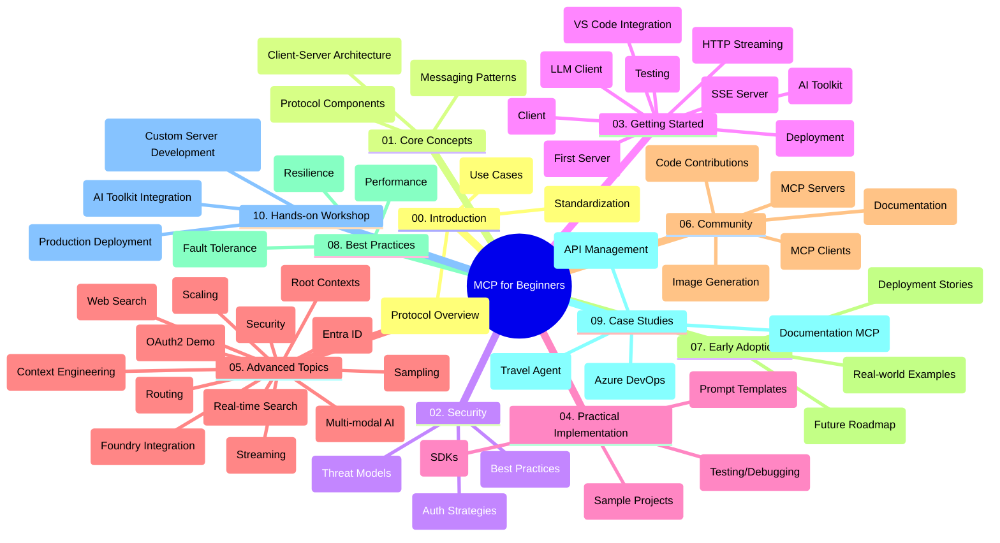

<!--
CO_OP_TRANSLATOR_METADATA:
{
  "original_hash": "77bfab7090f987a5b9fe078f50dbda13",
  "translation_date": "2025-07-16T21:19:58+00:00",
  "source_file": "study_guide.md",
  "language_code": "fr"
}
-->
# Model Context Protocol (MCP) pour débutants - Guide d'étude

Ce guide d'étude offre un aperçu de la structure et du contenu du dépôt pour le programme "Model Context Protocol (MCP) pour débutants". Utilisez ce guide pour naviguer efficacement dans le dépôt et tirer le meilleur parti des ressources disponibles.

## Aperçu du dépôt

Le Model Context Protocol (MCP) est un cadre standardisé pour les interactions entre les modèles d'IA et les applications clientes. Initialement créé par Anthropic, MCP est désormais maintenu par la communauté MCP via l’organisation officielle GitHub. Ce dépôt propose un programme complet avec des exemples de code pratiques en C#, Java, JavaScript, Python et TypeScript, destiné aux développeurs IA, architectes systèmes et ingénieurs logiciels.

## Carte visuelle du programme

## Structure du dépôt

Le dépôt est organisé en dix sections principales, chacune abordant différents aspects du MCP :

1. **Introduction (00-Introduction/)**
   - Présentation du Model Context Protocol
   - Pourquoi la standardisation est importante dans les pipelines IA
   - Cas d’usage pratiques et avantages

2. **Concepts fondamentaux (01-CoreConcepts/)**
   - Architecture client-serveur
   - Composants clés du protocole
   - Schémas de messagerie dans MCP

3. **Sécurité (02-Security/)**
   - Menaces de sécurité dans les systèmes basés sur MCP
   - Bonnes pratiques pour sécuriser les implémentations
   - Stratégies d’authentification et d’autorisation

4. **Premiers pas (03-GettingStarted/)**
   - Configuration et préparation de l’environnement
   - Création de serveurs et clients MCP basiques
   - Intégration avec des applications existantes
   - Comprend des sections sur :
     - Première implémentation de serveur
     - Développement client
     - Intégration client LLM
     - Intégration VS Code
     - Serveur Server-Sent Events (SSE)
     - Streaming HTTP
     - Intégration AI Toolkit
     - Stratégies de test
     - Directives de déploiement

5. **Implémentation pratique (04-PracticalImplementation/)**
   - Utilisation des SDK dans différents langages
   - Techniques de débogage, test et validation
   - Création de modèles de prompt et workflows réutilisables
   - Projets exemples avec cas d’implémentation

6. **Sujets avancés (05-AdvancedTopics/)**
   - Techniques d’ingénierie du contexte
   - Intégration de l’agent Foundry
   - Workflows IA multimodaux
   - Démos d’authentification OAuth2
   - Capacités de recherche en temps réel
   - Streaming en temps réel
   - Implémentation des contextes racines
   - Stratégies de routage
   - Techniques d’échantillonnage
   - Approches de montée en charge
   - Considérations de sécurité
   - Intégration sécurité Entra ID
   - Intégration recherche web

7. **Contributions de la communauté (06-CommunityContributions/)**
   - Comment contribuer au code et à la documentation
   - Collaboration via GitHub
   - Améliorations et retours communautaires
   - Utilisation de différents clients MCP (Claude Desktop, Cline, VSCode)
   - Travail avec des serveurs MCP populaires incluant la génération d’images

8. **Leçons des premiers utilisateurs (07-LessonsfromEarlyAdoption/)**
   - Implémentations réelles et retours d’expérience
   - Construction et déploiement de solutions basées sur MCP
   - Tendances et feuille de route future

9. **Bonnes pratiques (08-BestPractices/)**
   - Optimisation des performances
   - Conception de systèmes MCP tolérants aux pannes
   - Stratégies de test et résilience

10. **Études de cas (09-CaseStudy/)**
    - Étude de cas : intégration Azure API Management
    - Étude de cas : implémentation d’un agent de voyage
    - Étude de cas : intégration Azure DevOps avec YouTube
    - Exemples d’implémentation avec documentation détaillée

11. **Atelier pratique (10-StreamliningAIWorkflowsBuildingAnMCPServerWithAIToolkit/)**
    - Atelier complet combinant MCP et AI Toolkit
    - Création d’applications intelligentes reliant modèles IA et outils réels
    - Modules pratiques couvrant les fondamentaux, développement serveur personnalisé et stratégies de déploiement en production
    - Approche d’apprentissage par laboratoire avec instructions pas à pas

## Ressources supplémentaires

Le dépôt inclut des ressources complémentaires :

- **Dossier Images** : contient diagrammes et illustrations utilisés dans le programme
- **Traductions** : support multilingue avec traductions automatiques de la documentation
- **Ressources officielles MCP** :
  - [MCP Documentation](https://modelcontextprotocol.io/)
  - [MCP Specification](https://spec.modelcontextprotocol.io/)
  - [MCP GitHub Repository](https://github.com/modelcontextprotocol)

## Comment utiliser ce dépôt

1. **Apprentissage séquentiel** : Suivez les chapitres dans l’ordre (de 00 à 10) pour une progression structurée.
2. **Focus sur un langage** : Si vous préférez un langage spécifique, explorez les dossiers d’exemples pour trouver les implémentations correspondantes.
3. **Mise en pratique** : Commencez par la section "Premiers pas" pour configurer votre environnement et créer votre premier serveur et client MCP.
4. **Exploration avancée** : Une fois les bases acquises, approfondissez les sujets avancés pour élargir vos connaissances.
5. **Engagement communautaire** : Rejoignez la communauté MCP via les discussions GitHub et les canaux Discord pour échanger avec des experts et d’autres développeurs.

## Clients et outils MCP

Le programme couvre divers clients et outils MCP :

1. **Clients officiels** :
   - Claude Desktop
   - Claude dans VSCode
   - Claude API

2. **Clients communautaires** :
   - Cline (terminal)
   - Cursor (éditeur de code)
   - ChatMCP
   - Windsurf

3. **Outils de gestion MCP** :
   - MCP CLI
   - MCP Manager
   - MCP Linker
   - MCP Router

## Serveurs MCP populaires

Le dépôt présente plusieurs serveurs MCP, notamment :

1. **Serveurs de référence officiels** :
   - Filesystem
   - Fetch
   - Memory
   - Sequential Thinking

2. **Génération d’images** :
   - Azure OpenAI DALL-E 3
   - Stable Diffusion WebUI
   - Replicate

3. **Outils de développement** :
   - Git MCP
   - Terminal Control
   - Code Assistant

4. **Serveurs spécialisés** :
   - Salesforce
   - Microsoft Teams
   - Jira & Confluence

## Contributions

Ce dépôt accueille les contributions de la communauté. Consultez la section Contributions de la communauté pour savoir comment participer efficacement à l’écosystème MCP.

## Journal des modifications

| Date | Modifications |
|------|---------------|
| 16 juillet 2025 | - Mise à jour de la structure du dépôt pour refléter le contenu actuel - Ajout de la section Clients et outils MCP - Ajout de la section Serveurs MCP populaires - Mise à jour de la carte visuelle du programme avec tous les sujets actuels - Renforcement de la section Sujets avancés avec toutes les thématiques spécialisées - Mise à jour des études de cas avec des exemples concrets - Clarification de l’origine de MCP créé par Anthropic |
| 11 juin 2025 | - Création initiale du guide d’étude - Ajout de la carte visuelle du programme - Présentation de la structure du dépôt - Inclusion de projets exemples et ressources supplémentaires |

---

*Ce guide d’étude a été mis à jour le 16 juillet 2025 et présente un aperçu du dépôt à cette date. Le contenu du dépôt peut être modifié après cette date.*

**Avertissement** :  
Ce document a été traduit à l’aide du service de traduction automatique [Co-op Translator](https://github.com/Azure/co-op-translator). Bien que nous nous efforcions d’assurer l’exactitude, veuillez noter que les traductions automatiques peuvent contenir des erreurs ou des inexactitudes. Le document original dans sa langue d’origine doit être considéré comme la source faisant foi. Pour les informations critiques, une traduction professionnelle réalisée par un humain est recommandée. Nous déclinons toute responsabilité en cas de malentendus ou de mauvaises interprétations résultant de l’utilisation de cette traduction.